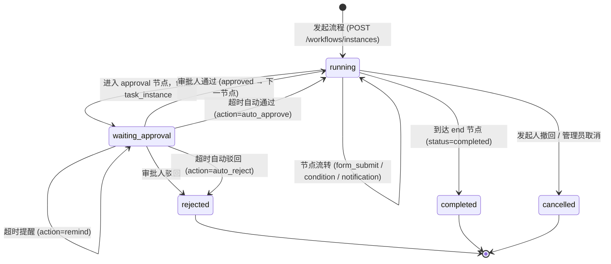
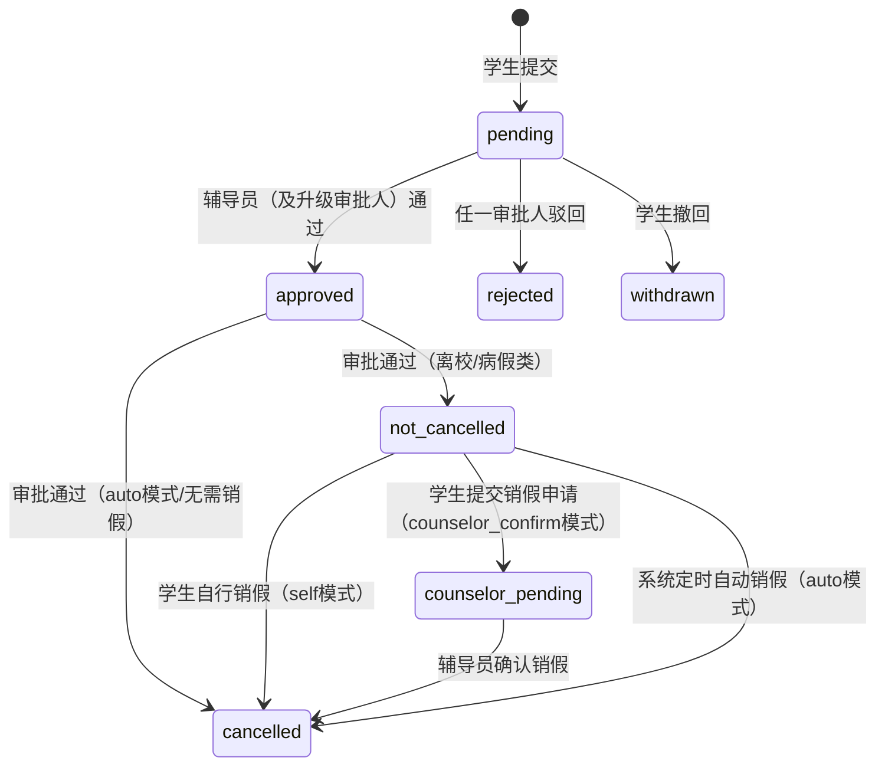
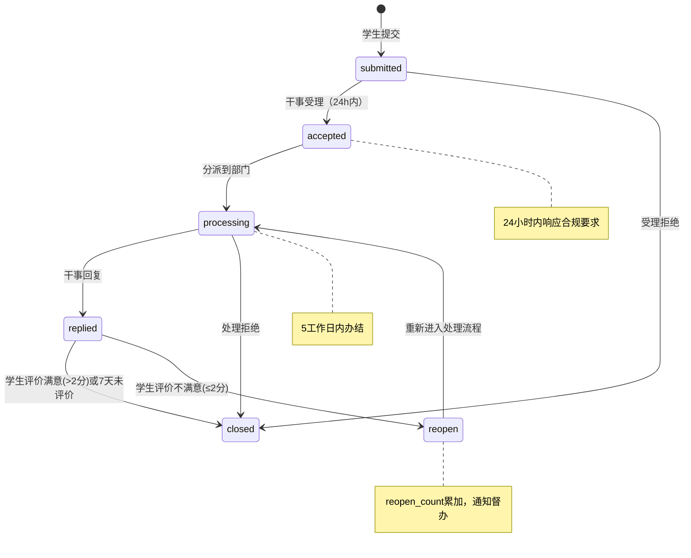
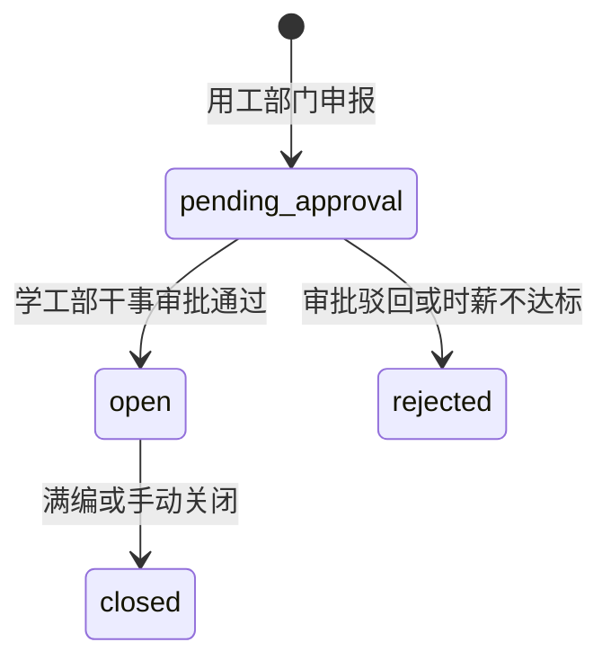
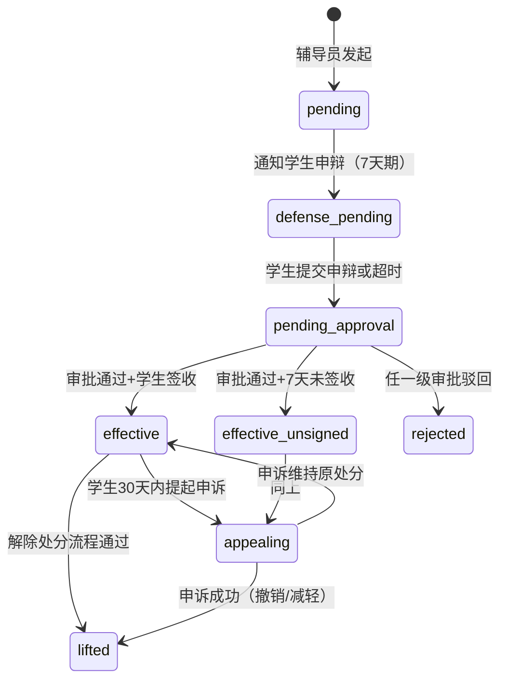

# P0 功能设计文档 v2

> 基于《总体设计 v2》与 v1 功能设计，结合三方需求评审报告（资深AI产品经理 + 学工业务专家 + 项目经理）全量修订。
> `[v2 新增]` 标注评审后新增内容，`[v2 变更]` 标注评审后修改内容。
> 本文档覆盖：产品设计（一）、通用约定（二）、平台底座（三）、业务模块（四）、AI Agent 架构（五）、前端页面（六）、验收标准（七）。

---

# 一、产品设计

## 1.1 核心用户旅程

以下为三类核心用户的完整日常使用旅程，覆盖从打开系统到完成主要任务的全过程。

---

### 学生日常旅程（以请假为典型场景）

```
[打开微信小程序]
    │
    ▼
[登录/自动恢复 Session]
    │  CAS/OAuth2 对接学校统一认证；
    │  首次登录须同意隐私协议 [v2 新增]
    ▼
[首页工作台]
    │  Web 端：三栏布局，左侧 AI 侧边栏 + 导航栏 + 右侧功能区
    │  小程序：待办数角标、AI 输入框、快捷入口（请假 / 签到 / 通知 / 更多）
    │  如有未确认的重要/紧急通知 → 置顶浮窗强制确认
    ▼
[方式 A：AI 对话填写]          [方式 B：手动填写]
    │                            │
    │ Web：在左侧侧边栏输入      │ Web：导航栏切换到请假 →
    │ 小程序：在 AI 对话输入      │      右侧功能区操作
    │ "明天肚子疼想请一天病假"    │ 小程序：点击"请假"快捷入口
    ▼                            ▼
[Agent 意图识别]           [请假申请页]
    │  解析假别=病假在校           │  选择假别 → 动态表单渲染
    │  开始日期=明日               │  填写时间/原因/差异字段
    │  结束日期=明日               │  按假别上传附件
    ▼                            │
[Agent 返回结构化确认卡片]        │
    │  Web：侧边栏展示预填卡片     │
    │  确认后填入右侧表单           │
    │  小程序：全屏展示确认卡片     │
    │  点击"确认提交"              │
    └──────────┬──────────────────┘
               ▼
    [后端触发请假工作流]
               │
               ▼
    [跳转"我的请假"列表]
               │  状态显示：审批中
               ▼
    [收到小程序通知：审批通过]
               │  通知级别 normal → 消息列表展示
               ▼
    [我的请假 → 点击"销假"]
               │  返校后主动销假
               ▼
    [销假完成，流程结束]
```

**其他高频旅程（学生）：**

```
扫码签到旅程：
  收到"班会签到"通知 → 打开小程序 → 扫码页（摄像头自动启动）
  → 扫描辅导员展示的二维码 → 签到成功提示（1秒反馈）→ 返回首页

信息收集填报旅程：
  收到催填通知 → 点击通知 → 跳转收集单页面
  → 填写各字段 → 手写签名组件签名 → 提交 → 返回"我的记录"

知识问答旅程：
  首页 AI 输入框 → 输入"国家奖学金评选条件"
  → AI 返回答案卡片（含政策原文来源链接）
  → 对答案满意 → 点赞；不满意 → 转人工
```

---

### 辅导员日常旅程（以审批+统计为典型场景）

```
[打开 Web 或微信小程序]
    │  Web：三栏布局（左侧 AI 侧边栏 + 中间导航栏 + 右侧功能区）
    │  小程序：移动审批与统计
    ▼
[Web 端进入三栏工作台]
    │  左侧：AI 侧边栏自动问候，展示今日待办摘要
    │  中间：导航栏显示审批待办角标
    │  右侧：仪表盘（待办概览 + "需关注学生"卡片 [v2 新增 P0.5]）
    │  企微侧：日报摘要消息已推送
    ▼
[处理审批待办]
    │  方式 A：在 AI 侧边栏说"帮我看看待审批" → AI 返回待审列表卡片
    │  方式 B：点击导航栏"审批中心" → 右侧加载审批列表
    │
    ├─ [批量场景] 侧边栏说"批量通过低风险" → 确认卡片 → 右侧刷新 [v2 新增]
    │
    └─ [单条场景] 点击查看详情（右侧功能区）
           │  学生信息 + 请假原因 + 附件预览
           │  也可在侧边栏说"帮我看看@王芳的请假" → 异常分析卡片
           ▼
       [通过 / 驳回（填写意见）]
           │
           ▼
       [自动流转，返回待办列表]
    ▼
[查看班级看板]
    │  侧边栏说"切到数据报表" → 导航栏自动切换 → 右侧加载看板
    │  当前在请假学生 / 未签到名单 / 本周收集单进度
    │  ECharts 可视化，支持按班级/时间维度切换
    ▼
[创建信息收集单]
    │  导航栏切换到信息收集 → 右侧功能区操作
    │  选择模板 / 自定义字段 → 预览 → 选择接收范围（班级）
    │  → 设置截止时间 → 定时发送（可设定 scheduled_at）[v2 新增]
    ▼
[发布收集单，系统推送通知至学生]
    ▼
[实时查看填报进度]
    │  已填 / 未填名单 → 对未填学生一键催填
    │  也可在侧边栏查询"XX收集单填了多少"
    ▼
[创建工作日志]
    │  导航栏切换到工作日志 → 右侧选择模板
    │  或侧边栏口述日志内容 → AI 预填模板字段 → 右侧表单确认
    │  AI 辅助：根据今日审批记录自动提示待记录事项 [v2 新增]
    ▼
[工作日志保存，关联相关学生记录]
```

---

### 院系领导日常旅程（以数据概览+审批为典型场景）

```
[打开 Web 或微信小程序]
    │  企微侧：已收到日报摘要（本院在读人数/本周请假情况/待审批）
    ▼
[首页：院级看板]
    │  本院学生总数 / 本周请假人次 / 未销假人数
    │  异常预警学生数（点击展开） [v2 新增 P0.5]
    │  勤工助学岗位申请待审批数
    ▼
[数据看板详情]
    │  各班级请假率对比图
    │  本月违纪统计
    │  信息收集完成率（校级任务）
    ▼
[处理审批待办]
    │  主要场景：事假≥3天审批、病假离校备案确认
    │  企微消息卡片 → 回链小程序完成审批
    ▼
[查看学生详情]
    │  点击具体学生 → 信息库详情（基本信息 + 请假历史 + 违纪记录）
    ▼
[导出报表]
    │  按时间段导出请假统计 / 学生信息（含水印）[v2 新增]
    ▼
[退出]
```

---

## 1.2 AI 交互设计

### Web 管理端三栏布局

Web 管理端采用**左侧 AI 对话 + 中间导航栏 + 右侧功能区**的三栏布局，AI 始终以侧边栏形式常驻，可控制右侧功能页面。

```
┌─────────────────┬──────┬───────────────────────────────────┐
│                 │      │  Topbar（面包屑 / 搜索 / 通知 / 头像）│
│   AI 对话侧边栏  │  导  │───────────────────────────────────│
│  （~408px 宽）   │  航  │                                   │
│                 │  栏  │         业务功能区                  │
│  · 上下文感知     │      │     （右侧主内容，随导航切换）       │
│  · 结构化卡片     │ 56px │                                   │
│  · 操作按钮      │  图  │    · 数据看板 / 审批列表 / 表单等     │
│  · 快捷建议      │  标  │    · AI 侧边栏可联动控制此区域       │
│                 │      │                                   │
│  ┌─输入框──────┐ │      │                                   │
│  │ 向学小工提问… │ │      │                                   │
│  └────────────┘ │      │                                   │
└─────────────────┴──────┴───────────────────────────────────┘
```

#### AI 对话侧边栏（左栏）

| 属性 | 规格 |
|------|------|
| 位置与尺寸 | 页面最左侧，固定宽度 408px，高度撑满视口 |
| 折叠/展开 | 支持折叠（宽度归零），导航栏底部显示 AI 展开按钮；键盘快捷键切换 |
| Agent 类型 | 路由 Agent（Python sidecar），根据当前页面上下文自动切换场景 Agent |
| 上下文感知 | 顶部状态条展示当前页面路径（如 `工作区 / 审批 / 待处理`）及关键计数 |
| 核心能力 | 意图识别 → 导航切换右侧页面 / 返回结构化卡片 / 在侧边栏内完成表单预填 |
| 结果形态 | 结构化操作卡片（含数据行 + 操作按钮）、导航芯片（可点击跳转）、纯文本回答 |
| 会话持久化 | 同一用户当日会话保留上下文（Redis，TTL 24h） |
| 数据限制 | Agent 只能访问当前用户权限范围内的数据，不暴露跨租户数据 |
| 降级行为 | AI 不可用时，侧边栏输入框置灰，提示"智能助手暂时不可用，请使用菜单操作"；右侧功能区和导航栏完全不受影响 |
| 快捷建议 | 输入框上方展示 3-5 个上下文相关的建议芯片（如"本周请假统计""异常学生名单"），随页面切换动态更新 |
| @ 引用 | 输入框支持 `@` 引用学生姓名，触发学生搜索下拉，快速指定操作对象 |

**侧边栏与右侧功能区联动机制：**

| 联动方向 | 行为 |
|---------|------|
| 侧边栏 → 右侧 | 用户在对话中说"切到数据报表"，AI 自动切换导航栏选中项并加载对应页面 |
| 侧边栏 → 右侧 | AI 返回操作卡片（如审批卡片），点击"查看详情"在右侧打开对应记录 |
| 右侧 → 侧边栏 | 用户通过导航栏手动切换页面，侧边栏上下文条自动更新，快捷建议随之变化 |
| 右侧 → 侧边栏 | 用户在右侧表单页点击"AI 辅助填写"按钮，侧边栏自动聚焦并进入该表单的填写对话 |

**AI 典型意图映射：**

| 用户输入示例 | 识别意图 | Agent 响应 |
|-------------|---------|------------|
| "帮我请明天一天事假" | start_leave_request | 右侧切换到请假页 + 侧边栏预填确认卡片 |
| "我的请假审批到哪步了" | query_approval_status | 侧边栏返回最近一条请假状态卡片 |
| "帮我看看王芳的请假有什么异常" | analyze_student_leave | 侧边栏返回异常分析操作卡片（含数据指标 + 操作按钮） |
| "切到数据报表，看本月出勤趋势" | navigate_and_query | 右侧切换到报表页 + 侧边栏提示"正在生成趋势图" |
| "今天班级谁没签到" | query_checkin_status | 侧边栏返回未签到名单卡片（仅辅导员可用） |
| "帮我发个通知" | send_notification | 右侧切换到发通知页 + 侧边栏引导填写 |
| "批量通过低风险审批" | batch_approve | 侧边栏展示低风险列表确认卡片，确认后右侧审批列表刷新 |

#### 导航栏（中栏）

| 属性 | 规格 |
|------|------|
| 位置与尺寸 | AI 侧边栏右侧，固定宽度 56px，纵向排列图标 |
| 导航项 | 仪表盘、审批中心（含待办角标）、请假管理、信息收集、签到管理、通知任务、接诉即办、工作日志、学生信息库、勤工助学、学生违纪、知识问答管理、数据报表 |
| 底部固定 | 系统设置 |
| 交互 | 悬停显示 tooltip（名称 + 快捷键）；点击切换右侧页面；当前页高亮 + 左侧指示条 |
| 角标 | 审批等模块显示待处理数量红色角标 |
| AI 按钮 | 侧边栏折叠时，导航栏底部出现 AI 展开按钮（Indigo 渐变色） |

#### 右侧功能区

| 属性 | 规格 |
|------|------|
| 位置 | 导航栏右侧，flex: 1 自适应宽度 |
| Topbar | 固定顶栏：面包屑导航 + 全局搜索（⌘K）+ 通知铃铛 + 用户头像 |
| 内容区 | 随导航栏选中项加载对应业务页面（审批列表、数据看板、表单等） |
| 与 AI 联动 | 页面内表单支持"AI 辅助填写"按钮，点击后侧边栏进入对应填写对话；AI 操作卡片中的"查看详情"等按钮可在此区域打开详情页 |

#### 小程序端 AI 入口（保持独立设计）

小程序端不采用三栏布局，AI 入口为首页工作台顶部固定输入框，点击展开全屏对话界面：

| 属性 | 规格 |
|------|------|
| 触发方式 | 首页工作台顶部固定输入框，点击展开全屏对话 |
| Agent 类型 | 路由 Agent（Python sidecar） |
| 核心能力 | 意图识别 → 导航到对应业务页面 / 直接返回结果卡片 |
| 上下文 | 自动注入当前用户角色、所属组织、今日日期 |
| 结果形态 | 结构化卡片（带操作按钮）或纯文本回答 |
| 降级行为 | AI 不可用时，输入框显示"智能助手暂时不可用，请使用菜单操作"，输入框置灰不可交互 |

#### 场景内 AI 填写（侧边栏对话模式）

Web 端不再使用独立的"AI 填写"Tab，而是统一通过左侧 AI 侧边栏完成：

| 属性 | 规格 |
|------|------|
| 触发方式 | 用户在侧边栏直接描述需求，或在右侧表单页点击"AI 辅助填写"按钮 |
| Agent 类型 | 场景 Agent（与路由 Agent 共用 Python sidecar，上下文为当前业务模块） |
| 数据互通 | AI 在侧边栏返回结构化确认卡片，确认后数据填入右侧表单；用户可在右侧表单直接编辑 |
| 确认机制 | Agent 返回结构化确认卡片，用户可逐字段修改后点击"确认提交" |
| 附件处理 | AI 对话中不支持直接上传附件；遇到必填附件字段时，卡片中提示"需上传附件，请在右侧表单完成上传"（详见 1.2 AI Tool 附件策略） |
| ai_draft 记录 | 用户提交时，若来源为 AI 填写，保存 `form_data.ai_draft`（AI 原始预填值）+ `form_data.data`（最终提交值）对比 |

---

### 每个 P0 模块的 AI 侧边栏支持形态

| 模块 | AI 填写（侧边栏对话） | AI 查询 | AI 建议 | 备注 |
|------|---------|---------|---------|------|
| B. 请销假 | ✅ 侧边栏对话填写 → 确认卡片 → 右侧表单 | ✅ 查询审批状态/历史记录 | ✅ 超期未销假主动提醒 | 附件需在右侧表单上传 |
| H. 信息收集（学生填写） | ✅ 侧边栏对话填写简单文字字段 | ✅ 查询自己是否已填 | — | 手写签名字段不支持 AI 填写，必须在右侧手动 |
| H. 信息收集（辅导员创建） | — | ✅ 查询填报进度/未填名单 | ✅ 建议催填时机 | 创建收集单本身为结构化配置，在右侧功能区操作 |
| I. 签到（辅导员创建） | — | ✅ 查询签到/缺勤名单 | — | 创建签到由辅导员在右侧操作，AI 仅辅助查询 |
| I. 签到（学生扫码） | 不支持 | — | — | 扫码签到为纯原子操作 |
| J. 通知任务（发布） | ✅ 侧边栏描述 → 预填标题/正文/接收范围 → 右侧表单 | ✅ 查询确认情况 | ✅ 建议通知级别 | 附件需在右侧添加 |
| J. 通知任务（接收） | 不支持 | ✅ 查询未读通知 | — | 学生接收通知为消费侧 |
| K. 接诉即办 | ✅ 侧边栏描述投诉 → 预填分类/描述 → 右侧表单 | ✅ 查询投诉处理进度 | — | 匿名投诉时 AI 填写仍在用户会话下，服务端脱敏处理 |
| L. 辅导员工作日志 | ✅ 侧边栏口述日志 → 预填模板字段 → 右侧表单 | ✅ 查询本周工作日志 | ✅ 提示今日有哪些审批/事件可记录 | |
| M. 学生信息库 | 不支持 | ✅ 按条件查询学生列表/个人信息（侧边栏返回卡片） | — | 信息库为管理类模块，不走 AI 填写 |
| N. 勤工助学（学生申请） | ✅ 侧边栏对话填写申请 → 右侧表单 | ✅ 查询可申请岗位 | ✅ 推荐适合的岗位（优先贫困认定学生）[v2 新增] | |
| O. 学生违纪（辅导员记录） | ✅ 侧边栏描述事件 → 预填违纪分类/事实描述 | ✅ 查询学生违纪历史 | — | 处分流程须手动发起，AI 仅辅助填写记录 |
| P. 知识问答 | 不支持（本身即 AI 对话） | ✅ 全部为 AI 查询 | ✅ 热门问题推荐 | 主交互即侧边栏 AI 对话 |

---

### Agent 意图澄清机制 [v2 新增]

**触发条件：** 路由 Agent 对识别出的意图置信度 < 0.75 时，不自动执行，而是主动向用户确认。

**澄清策略：**

| 置信度区间 | 处理方式 |
|-----------|---------|
| ≥ 0.85 | 直接执行，返回结果卡片 |
| 0.75 – 0.84 | 执行并在卡片上方提示"我理解你想要…，如有偏差请调整" |
| 0.60 – 0.74 | 展示最可能的 2-3 个意图供用户选择 |
| < 0.60 | 主动反问，引导用户提供更多信息 |

**示例对话（置信度 0.68）：**

```
用户：帮我处理一下张三的事情

Agent：请问你想对张三做什么？
       [A] 查看张三的请假记录
       [B] 审批张三的待审申请
       [C] 查看张三的基本信息
       [D] 其他，我来描述一下

用户：[点击 B]

Agent：找到 1 条待审批申请：
       ┌─────────────────────────────┐
       │ 张三 申请事假                │
       │ 2026-04-17 ~ 2026-04-19     │
       │ 原因：家庭事务               │
       │ [通过]   [驳回]   [查看详情] │
       └─────────────────────────────┘
```

**示例对话（置信度 < 0.60）：**

```
用户：我想搞个签到

Agent：好的，请告诉我更多信息：
       你是想要
       · 创建一个新的签到活动（辅导员）
       · 扫码完成今天的签到（学生）
       · 查询某次活动的签到记录
       请描述一下，或者直接点击上面其中一项。

用户：创建一个新的签到

Agent：好的，我帮你导航到创建签到页面，
       请填写活动名称、时间和参与范围。
       [前往创建签到]
```

**多轮信息补全示例（置信度 0.80，关键参数缺失）：**

```
用户：帮我请假

Agent：好的，我来帮你填请假申请。
       请问是哪种假别？
       [病假] [事假] [周末离校] [公假] [丧假]

用户：事假

Agent：事假需要几天，从什么时候开始？

用户：明天起三天

Agent：好的，我整理了：
       ┌──────────────────────────────┐
       │ 假别：事假                    │
       │ 开始：2026-04-17             │
       │ 结束：2026-04-19（共3天）     │
       │ 事由：[请补充]               │
       │ 证明材料：[需上传，手动完成]   │
       │           [确认提交] [修改]   │
       └──────────────────────────────┘
```

---

### AI 降级前端感知策略 [v2 新增]

| 场景 | 降级触发条件 | 前端展示 | 用户操作路径 |
|------|------------|---------|-------------|
| AI 侧边栏不可用 | Python sidecar 健康检查失败 | 侧边栏输入框置灰，提示"智能助手暂时不可用，请使用菜单操作"；导航栏和右侧功能区完全正常 | 用户通过导航栏切换页面，在右侧功能区直接操作 |
| 场景 Agent 调用失败 | 场景 Agent 调用超时（>5s）或错误 | 侧边栏提示"AI 辅助暂时不可用，请在右侧页面手动操作"；右侧表单的"AI 辅助填写"按钮置灰 | 在右侧功能区手动填写，无感知 |
| AI 预填失败（单次调用） | Agent 返回空或结构化解析失败 | 侧边栏卡片提示"AI 解析未成功，请在右侧表单手动填写" | 用户在右侧表单直接编辑 |
| 企微会话式问答不可用 | 企微消息回调超时 | 自动回复"系统繁忙，请打开小程序操作" + 附小程序跳转链接 | 跳转小程序完成操作 |
| AI 增强（风险标记/审批建议）不可用 | 静默失败 | 不展示任何异常，走默认逻辑（无风险标记、无建议） | 用户正常操作，无感知 |
| 知识问答 AI 无法回答 | 相似度 < 阈值或检索结果为空 | 侧边栏显示"暂时无法回答这个问题，是否转人工咨询？" + [转给辅导员] 按钮 | 生成转人工工单 |

---

### AI Tool 附件上传处理策略 [v2 新增]

AI Tool 不直接处理文件上传（无法在对话流中传递二进制数据），具体策略如下：

| 场景 | 处理方式 |
|------|---------|
| 病假证明（必填附件） | 侧边栏确认卡片中，附件字段标注"[需上传附件]"，提交时校验未上传则提示"此假别需要上传附件，请在右侧表单完成上传后提交" |
| 事假证明（必填附件） | 同上 |
| 投诉附件（选填） | 侧边栏卡片提示"如需上传证据材料，请在右侧表单添加"，不强制阻断提交 |
| 信息收集手写签名 | AI 不支持手写签名字段，提示"此收集单含手写签名，请在右侧表单手动完成" |
| 通知任务附件（选填） | 侧边栏卡片提示"如需添加附件，请在右侧表单添加" |

**统一原则：** 侧边栏 AI 确认卡片中，如存在未上传的必填附件，提交按钮保持禁用状态，提示信息指引用户在右侧表单上传。选填附件不阻断 AI 提交流程。

---

### AI 预填 vs 最终提交的数据对比记录（ai_draft）[v2 新增]

`form_data` 表新增 `ai_draft` JSONB 字段，仅在来源为 AI 填写时写入：

```json
{
  "ai_draft": {
    "source": "ai_fill",
    "model": "qwen-plus",
    "raw_input": "明天肚子疼想请一天病假",
    "predicted_fields": {
      "leave_type": "sick_on_campus",
      "start_time": "2026-04-17T08:00:00+08:00",
      "end_time": "2026-04-17T18:00:00+08:00",
      "reason": "身体不适"
    },
    "confidence": 0.91,
    "generated_at": "2026-04-16T10:23:45+08:00"
  },
  "data": {
    "leave_type": "sick_on_campus",
    "start_time": "2026-04-17T08:00:00+08:00",
    "end_time": "2026-04-17T18:00:00+08:00",
    "reason": "肚子疼需要休息"
  }
}
```

对比维度（后台分析用）：
- 字段级准确率：`predicted_fields` vs `data` 各字段对比
- 修改率：用户在确认卡片中修改了几个字段
- 拒绝率：AI 预填后用户切换手动完全重填的比例

---

## 1.3 多端体验策略

### Web / 小程序 / 企微的功能分配矩阵

说明：✅ 全功能支持，🟡 部分支持（轻量版），❌ 不支持，— 该角色无此场景

#### 学生端功能矩阵

| 功能 | Web | 微信小程序 | 企微（需学校为学生开通） |
|------|-----|----------|----------------------|
| 发起请假（AI 对话填写） | ✅ 侧边栏对话 | ✅ AI 对话 | 🟡 仅跳转小程序链接 |
| 发起请假（手动填写） | ✅ | ✅ | ❌ |
| 销假 | ✅ | ✅ | 🟡 仅跳转小程序 |
| 查看请假状态 | ✅ | ✅ | 🟡 消息卡片展示状态 |
| 扫码签到 | ❌ | ✅（摄像头） | ❌ |
| 填写信息收集单 | ✅ | ✅ | 🟡 仅跳转小程序 |
| 手写签名 | 🟡 鼠标签名 | ✅ 触屏签名 | ❌ |
| 查看/确认通知（普通/重要） | ✅ | ✅ | 🟡 摘要+跳小程序 |
| 确认紧急通知（全屏遮罩） | ✅ | ✅ | 🟡 跳小程序完成确认 |
| 提交投诉 | ✅ | ✅ | ❌ |
| 查询投诉进度 | ✅ | ✅ | 🟡 卡片展示 |
| 知识问答 | ✅ | ✅ | ✅ 会话式对话 |
| 查看勤工助学岗位 | ✅ | ✅ | 🟡 卡片列表 |
| 申请勤工助学 | ✅ | ✅ | 🟡 跳小程序 |
| 我的记录（聚合） | ✅ | ✅ | ❌ |
| AI 对话（Web 侧边栏 / 小程序对话） | ✅ 侧边栏常驻 | ✅ 首页对话入口 | ✅ 会话式 |

#### 辅导员端功能矩阵

| 功能 | Web | 微信小程序 | 企微 |
|------|-----|----------|------|
| 查看待办列表 | ✅ | ✅ | 🟡 摘要+跳小程序 |
| 审批请假（单条） | ✅ | ✅ | 🟡 卡片快审（通过/驳回） |
| 批量审批 [v2 新增] | ✅ | 🟡 最多10条 | ❌ |
| 创建签到 + 生成二维码 | ✅ | ✅ | ❌ |
| 展示签到二维码（大屏） | ✅ | ✅ 全屏展示 | ❌ |
| 查看签到/缺勤名单 | ✅ | ✅ | 🟡 数据摘要 |
| 创建信息收集单 | ✅ | 🟡 简化配置 | ❌ |
| 查看填报进度 + 催填 | ✅ | ✅ | 🟡 进度卡片 |
| 发布通知任务 | ✅ | 🟡 简化填写 | ❌ |
| 查看通知确认情况 | ✅ | ✅ | 🟡 数据摘要 |
| 创建工作日志 | ✅ | ✅ | ❌ |
| 班级看板（数据可视化） | ✅ | 🟡 关键指标卡片 | 🟡 日报文字摘要 |
| 查看学生详情 | ✅ | ✅ | ❌ |
| 记录学生违纪 | ✅ | 🟡 | ❌ |
| AI 对话（Web 侧边栏 / 小程序对话） | ✅ 侧边栏常驻 | ✅ 首页对话入口 | ✅ 会话式 |

#### 院系领导端功能矩阵

| 功能 | Web | 微信小程序 | 企微 |
|------|-----|----------|------|
| 院级数据看板 | ✅ | 🟡 关键指标 | 🟡 日报摘要 |
| 审批（事假≥3天等） | ✅ | ✅ | 🟡 卡片快审 |
| 查看异常预警学生 | ✅ | ✅ | 🟡 预警摘要 |
| 导出报表 | ✅ | ❌ | ❌ |
| 查看学生详情 | ✅ | ✅ | ❌ |

---

### 签到二维码在小程序端的展示优化

辅导员在小程序展示签到二维码供学生扫码，需满足以下体验要求：

**展示规格：**
- 进入签到活动详情页后，默认标签页即为"二维码展示"
- 点击"全屏展示"按钮 → 二维码占满整个屏幕，屏幕亮度自动调至最高
- 二维码下方显示：活动名称 + 剩余有效时间倒计时（若开启定时刷新）
- 全屏模式下顶部状态栏隐藏，背景纯白，防截图水印（半透明文字叠加辅导员姓名+时间）

**防截图转发策略：**
- 二维码有效期由辅导员配置（默认 5 分钟，可选：不限时 / 1 分钟 / 5 分钟 / 10 分钟）
- 定时刷新时，二维码更新前 10 秒展示倒计时提醒条
- 截图水印内容：`{辅导员姓名} 生成于 {时间}` 半透明覆盖，防止截图直接传播

**签到免打扰：** [v2 新增]
- 辅导员展示二维码的全屏模式期间，所有非紧急通知的浮窗弹出均被抑制
- 仅「紧急」级别通知可打断全屏模式（以横幅提示，不覆盖二维码）
- 学生扫码过程中（摄像头激活期间），所有通知弹窗延迟至扫码完成后展示

---

### "我的记录"聚合页面设计 [v2 新增]

学生小程序和 Web 均提供"我的记录"聚合页面，集中展示个人所有业务记录。

**页面结构（Tab 分组）：**

```
我的记录
├── 全部（时间倒序混排）
├── 请假记录
│     每条：假别标签 + 时间段 + 状态（审批中/已通过/已驳回）+ 是否已销假
├── 收集单
│     每条：收集单标题 + 提交时间 + 状态（已提交/待填写）
├── 签到记录
│     每条：活动名称 + 签到时间 + 状态（已签/缺勤/迟到）
├── 通知
│     每条：标题 + 来源 + 时间 + 确认状态
├── 投诉
│     每条：投诉分类 + 提交时间 + 处理状态（含满意度已评价/待评价）
└── 勤工助学
      每条：岗位名称 + 申请时间 + 状态
```

**全部 Tab 聚合查询接口：** `GET /api/v1/my/records?page=1&size=20&type=all`

响应体：
```json
{
  "data": [
    {
      "record_type": "leave",
      "record_id": 12345,
      "title": "事假 2026-04-17 ~ 2026-04-19",
      "status": "approved",
      "status_label": "已通过",
      "created_at": "2026-04-16T10:00:00+08:00",
      "extra": { "cancel_status": "not_cancelled" }
    },
    {
      "record_type": "checkin",
      "record_id": 678,
      "title": "班会签到 2026-04-15",
      "status": "absent",
      "status_label": "缺勤",
      "created_at": "2026-04-15T19:00:00+08:00",
      "extra": {}
    }
  ],
  "total": 42,
  "page": 1,
  "size": 20
}
```

---

## 1.4 通知交互设计

### 通知分级推送策略表

| 级别 | 站内信 | 微信小程序（须确认对象） | 微信小程序（其他角色） | 企微（全员可达） | 外部通知 |
|------|--------|----------------------|-------------------|----------------|---------|
| 普通 | ✅ 消息列表 | 角标计数，消息列表可见 | 同左 | 可选：应用消息摘要 | 不触发 |
| 重要 | ✅ | 置顶浮窗，须点击「确认收到」后关闭 | 强提示横幅，支持已读回执 | ✅ 应用消息 + 摘要卡片 | 可配置触发订阅消息 |
| 紧急 | ✅ | 全屏遮罩，必须点击「确认收到」才能继续使用小程序 | 强提示横幅 + 角标 | ✅ 应用消息重复推送（间隔 15 分钟，最多 3 次）直到确认 | ✅ 触发订阅消息 |

**企微卡片回链策略：**
- 企微侧展示摘要卡片（标题 + 前 50 字内容预览 + 来源标签）
- 卡片底部固定按钮：[查看详情] → 跳转到微信小程序对应页面
- 须确认类通知：企微卡片仅展示"有一条需确认通知"，不在企微内完成确认，强制引导至小程序完成合规确认操作

---

### 并发多条紧急通知排队机制 [v2 新增]

当用户同时收到多条紧急通知（full-screen 级别）时：

**排队规则：**
1. 按 `notification_recipient.created_at` 升序，优先处理最早的一条
2. 当前遮罩关闭（确认完成）后，系统自动展示下一条
3. 遮罩内顶部显示队列进度："第 1 条，共 3 条紧急通知"
4. 每条通知最短展示 3 秒（防止用户无意识快速点过），3 秒内确认按钮不可点击，倒计时可见

**前端状态管理：**
- 使用 Redux/Zustand 维护 `urgentNotificationQueue: NotificationItem[]`
- 每次确认完成后 dispatch `CONFIRM_URGENT_NOTIFICATION`，弹出队列头部，展示下一条
- 全部确认完成后，队列清空，恢复正常使用

---

### 关键操作免打扰窗口 [v2 新增]

以下场景期间，系统主动抑制非紧急通知弹出：

| 触发场景 | 免打扰范围 | 持续时间 |
|---------|-----------|---------|
| 辅导员展示签到二维码（全屏模式） | 普通 + 重要通知的浮窗弹出 | 全屏模式持续期间 |
| 学生扫码签到（摄像头激活） | 所有通知弹窗延迟展示 | 扫码结果返回前 |
| AI 对话进行中（用户正在输入） | 普通通知角标更新静默 | 对话窗口激活期间 |
| 表单提交处理中（Loading 状态） | 所有通知弹窗延迟 | 请求完成前 |

抑制期间通知正常写入数据库，仅延迟前端弹出时机。紧急通知不受免打扰约束，始终立即展示。

---

### 企微通知卡片回链小程序

**企微应用消息卡片格式（textcard 类型）：**

```json
{
  "touser": "wecom_user_id",
  "msgtype": "textcard",
  "agentid": 100001,
  "textcard": {
    "title": "【重要】国庆假期去向统计截止提醒",
    "description": "请在 2026-04-18 23:59 前完成填报，已填 23/45 人。",
    "url": "https://miniprogram.link/pages/collection/detail?id=456",
    "btntxt": "立即填报"
  }
}
```

`url` 字段使用微信小程序 URL Scheme（`weixin://dl/business/?appid=xxx&path=...`）或微信官方 URL Link，点击后跳转至对应小程序页面。

对于须确认类通知，卡片 `btntxt` 文案改为"立即确认"，`url` 指向通知确认页。

---

### 定时发送能力 [v2 新增]

`notification_task` 表新增 `scheduled_at TIMESTAMPTZ` 字段，支持设定未来时间发送。

**交互设计：**
- 发布通知任务页面，"发送时间"选项：立即发送 / 定时发送
- 选择"定时发送"后展示日期时间选择器
- 已设定定时的通知在列表中显示"定时：2026-04-18 09:00"状态标签

**执行机制：**
- Spring `@Scheduled` 每分钟扫描 `notification_task` 表中 `scheduled_at <= NOW() AND status = 'scheduled'`
- 触发后调用 `NotificationService.send()` 并将状态置为 `sent`
- 定时发送的通知支持在发送前撤销（状态改为 `cancelled`）

---

## 1.5 数据看板设计

### 辅导员看板（班级维度）

**访问路径：** Web > 工作台统计卡片 + 请假管理「假别统计」Tab / 小程序 > 看板 Tab

**内容清单：**

| 指标卡片 | 数据来源 | 刷新策略 |
|---------|---------|---------|
| 班级总人数 / 在校人数 / 请假中人数 | `leave_request` + `student_profile` | 实时 |
| 本周请假人次（按假别分类） | `leave_request` 聚合 | 每小时刷新 |
| 未销假名单（含超时提醒） | `leave_request.cancel_status` | 实时 |
| 近7天签到出勤率趋势图 | `checkin_record` 聚合 | 每日刷新 |
| 本月违纪人次（按分类） | `violation_record` 聚合 | 每日刷新 |
| 信息收集待填进度（当前进行中的收集单） | `collection_response` 聚合 | 实时 |
| 通知确认待办（未确认人数） | `notification_recipient` 聚合 | 实时 |
| 需关注学生列表（规则引擎标记） [v2 新增 P0.5] | `student_event_log` 规则引擎 | 每日运行 |

**图表类型：**
- 出勤率趋势：折线图（ECharts）
- 请假分布：饼图（按假别）
- 各班级对比（若辅导员管多班）：条形图

---

### 院系领导看板（学院维度）

**内容清单：**

| 指标 | 说明 |
|------|------|
| 全院学生总数 / 在读 / 请假中 | 按班级向上聚合 |
| 本月人均请假次数 | 按年级/专业/班级下钻 |
| 各班级出勤率对比 | 条形图，支持排序 |
| 校级信息收集任务完成率 | 按院级汇总 |
| 本月投诉处理情况（已处理/超时未处理） | 接诉即办模块 |
| 违纪统计（按处分等级分类） | 月度汇总 |
| 勤工助学岗位申请/录用情况 | 本院岗位统计 |
| 异常预警汇总（学院维度） [v2 新增 P0.5] | 需关注学生数、预警原因分类 |

---

### 校级管理员看板（全校维度）

**内容清单：**

| 指标 | 说明 |
|------|------|
| 全校在读学生总数 / 今日在校人数 | 实时 |
| 各学院请假率对比 | 热力图/条形图 |
| 全校本月通知触达率 | 已确认/已读/推送总数 |
| 校级信息收集任务整体进度 | 已下发/已完成/完成率 |
| 接诉即办全校处理情况 | 超时率/满意度均分 |
| 系统使用情况（DAU/MAU/各模块使用次数） | 运营数据 |
| AI 使用量（本月 AI 调用次数/成功率/降级率） | AI 监控 |

---

### 聚合接口 `GET /api/v1/dashboard` 设计 [v2 新增]

**说明：** 工作台首页使用此接口一次拉取所有必需数据，避免多次串行请求。

**请求：**
```
GET /api/v1/dashboard
Authorization: Bearer <token>
```

无额外参数，服务端根据当前用户角色返回对应维度数据。

**响应体结构（辅导员示例）：**

```json
{
  "code": "SUCCESS",
  "data": {
    "user_context": {
      "user_id": 10001,
      "real_name": "李辅导",
      "role": "counselor",
      "org_name": "计算机学院2023级1班",
      "pending_count": 5
    },
    "pending_tasks": {
      "total": 5,
      "items": [
        {
          "task_id": 1001,
          "task_type": "leave_approve",
          "title": "张三的事假申请待审批",
          "created_at": "2026-04-16T09:00:00+08:00",
          "due_at": "2026-04-18T09:00:00+08:00"
        }
      ]
    },
    "unread_notifications": {
      "total": 3,
      "urgent_unconfirmed": 1
    },
    "class_overview": {
      "total_students": 45,
      "on_leave_count": 3,
      "absent_count": 1,
      "collection_pending_count": 8
    },
    "attention_students": {
      "count": 2,
      "items": [
        {
          "student_id": 20001,
          "student_name": "王五",
          "alert_reasons": ["连续3次签到缺勤", "本月请假4次"],
          "risk_level": "medium"
        }
      ]
    },
    "ai_status": {
      "available": true,
      "degraded": false
    }
  }
}
```

**响应体结构（学生示例）：**

```json
{
  "code": "SUCCESS",
  "data": {
    "user_context": {
      "user_id": 20001,
      "real_name": "张三",
      "role": "student",
      "class_name": "计算机学院2023级1班"
    },
    "pending_tasks": {
      "total": 0,
      "items": []
    },
    "unread_notifications": {
      "total": 2,
      "urgent_unconfirmed": 0
    },
    "recent_leaves": {
      "active_leave": null,
      "last_leave": {
        "id": 555,
        "leave_type": "sick_on_campus",
        "status": "approved",
        "cancel_status": "not_cancelled",
        "end_time": "2026-04-15T18:00:00+08:00"
      }
    },
    "collection_pending": {
      "count": 1,
      "items": [
        {
          "collection_id": 88,
          "title": "五四活动去向统计",
          "deadline": "2026-04-20T23:59:59+08:00"
        }
      ]
    },
    "ai_status": {
      "available": true,
      "degraded": false
    }
  }
}
```

**性能要求：** P99 < 300ms（后端并发查询各子项，使用 `CompletableFuture` 并行组装，禁止串行查询）

---

# 二、通用约定

## 2.1 数据模型公共字段

所有业务表默认包含以下字段，后续各模块数据模型中省略不再重复：

| 字段 | 类型 | 说明 |
|------|------|------|
| `id` | `BIGINT` PK | 雪花算法生成（Snowflake ID） |
| `tenant_id` | `VARCHAR(32)` | 租户标识（Schema 隔离下冗余存储，用于异步/定时任务恢复 TenantContext） |
| `created_by` | `BIGINT` | 创建人 user_id（系统操作时为 0） |
| `updated_by` | `BIGINT` | 最后修改人 user_id |
| `created_at` | `TIMESTAMPTZ` | 创建时间（UTC 存储，接口返回带时区） |
| `updated_at` | `TIMESTAMPTZ` | 更新时间 |
| `deleted_at` | `TIMESTAMPTZ` | 软删除标记，NULL 表示未删除；查询时 MyBatis-Plus 自动追加 `WHERE deleted_at IS NULL` |

**说明：** 审计日志表 `audit_log` 不包含 `deleted_at`（审计记录不可删除）。

---

## 2.2 接口公共约定

**基础约定（同 v1）：**
- 基础路径：`/api/v1`
- 认证：`Authorization: Bearer <token>`（JWT，有效期 2 小时）
- 租户识别：JWT Payload 中携带 `tenant_id`，Spring Security Filter 解析后设置 `TenantContext`
- 分页：`GET` 列表接口统一使用 `?page=1&size=20`（page 从 1 起），返回：
  ```json
  { "data": [], "total": 100, "page": 1, "size": 20 }
  ```
- 错误响应：`{ "code": "ERROR_CODE", "message": "可读描述", "details": {} }`
- 时间字段：统一使用 ISO 8601 格式带时区，如 `2026-04-16T10:00:00+08:00`

**[v2 新增] 内部接口鉴权：**

系统内部接口（如消息通知发送 `POST /notifications/send`、AI sidecar 调用等）不对外暴露，通过以下机制防止外部调用：

1. **Spring Security InternalRole 标注：** 内部接口方法标注 `@PreAuthorize("hasRole('INTERNAL')")` 
2. **请求头 `X-Internal-Token` 校验：** 内部调用方在请求头中附加 `X-Internal-Token: {shared_secret}`，该 secret 在 `application.yml` 中配置，不对外公开
3. **IP 白名单（可选增强）：** 内部接口限制只接受来自 localhost / Docker 内网段的请求
4. **外部请求拦截：** API 网关层（Nginx/Spring Security）拒绝外部流量访问 `/internal/**` 路径

**内部接口路径规范：** 内部接口统一放在 `/internal/v1/` 路径下，与外部 API 路径区分。

---

## 2.3 状态枚举约定

### 审批类通用状态（同 v1）

| 状态 | 值 | 说明 |
|------|----|------|
| 草稿 | `draft` | 已保存未提交 |
| 待审批 | `pending` | 已提交，等待审批人处理 |
| 已通过 | `approved` | 审批通过 |
| 已驳回 | `rejected` | 审批驳回 |
| 已撤回 | `withdrawn` | 申请人主动撤回 |
| 已取消 | `cancelled` | 系统自动取消（如超时） |

### [v2 新增] 投诉类状态（接诉即办专用）

| 状态 | 值 | 说明 |
|------|----|------|
| 已提交 | `submitted` | 学生提交，等待受理 |
| 已受理 | `accepted` | 24 小时内完成受理（合规要求） |
| 处理中 | `processing` | 已分派责任部门，5 工作日内办结 |
| 已回复 | `replied` | 责任部门已回复处理结果 |
| 已关闭 | `closed` | 学生满意度 ≥ 3 分，流程结束；或超时自动关闭 |

**与审批类状态的差异说明：**

| 维度 | 审批类状态 | 投诉类状态 |
|------|----------|----------|
| 发起者 | 学生或员工 | 学生 |
| 处理者 | 单一审批人（辅导员/院长） | 责任部门（多人） |
| 重开机制 | 无（驳回后重新发起） | 满意度 ≤ 2 分时，`closed → processing` 自动重开 |
| 超时影响 | 提醒审批人 | 超时未受理自动通报校级领导 |
| 最终态 | `approved` / `rejected` / `withdrawn` | `closed`（唯一最终态） |
| 匿名支持 | 不支持 | 支持（需全链路脱敏） |

---

## 2.4 错误码体系 [v2 新增]

**格式规范：** `{MODULE}_{SCENARIO}`，全大写，下划线分隔，如 `LEAVE_TIME_OVERLAP`。

HTTP 状态码映射：
- 业务校验失败 → `400 Bad Request`
- 权限不足 → `403 Forbidden`
- 资源不存在 → `404 Not Found`
- 并发冲突 → `409 Conflict`
- 系统错误 → `500 Internal Server Error`

---

### 平台底座错误码

| 错误码 | HTTP | 说明 |
|--------|------|------|
| `AUTH_TOKEN_EXPIRED` | 401 | Token 已过期，需重新登录 |
| `AUTH_TOKEN_INVALID` | 401 | Token 格式错误或签名验证失败 |
| `AUTH_LOGIN_FAILED` | 400 | 账号或密码错误 |
| `AUTH_ACCOUNT_DISABLED` | 403 | 账号已被禁用 |
| `AUTH_TENANT_SUSPENDED` | 403 | 租户已停用 |
| `AUTH_PERMISSION_DENIED` | 403 | 无权限执行此操作 |
| `AUTH_DATA_SCOPE_DENIED` | 403 | 无权访问此数据（数据权限不足） |
| `FILE_SIZE_EXCEEDED` | 400 | 文件大小超过 50MB 限制 |
| `FILE_TYPE_NOT_ALLOWED` | 400 | 文件类型不在白名单内 |
| `FILE_NOT_FOUND` | 404 | 文件不存在或已被删除 |
| `ORG_HAS_CHILDREN` | 400 | 组织节点存在子节点，无法删除 |
| `ORG_HAS_MEMBERS` | 400 | 组织节点存在成员用户，无法删除 |

---

### 请销假模块错误码（B）

| 错误码 | HTTP | 说明 |
|--------|------|------|
| `LEAVE_TIME_OVERLAP` | 409 | 请假时段与已有请假记录重叠 |
| `LEAVE_TIME_INVALID` | 400 | 开始时间不能晚于或等于结束时间 |
| `LEAVE_ATTACHMENT_REQUIRED` | 400 | 当前假别必须上传附件（病假/事假） |
| `LEAVE_TYPE_NOT_SUPPORTED` | 400 | 不支持的假别类型（非字典表内值） |
| `LEAVE_WITHDRAW_NOT_ALLOWED` | 400 | 当前状态不允许撤回（已通过或已开始审批到后续节点） |
| `LEAVE_CANCEL_NOT_APPROVED` | 400 | 请假未通过，无法销假 |
| `LEAVE_ALREADY_CANCELLED` | 409 | 该请假记录已经销假 |
| `LEAVE_PROXY_PERMISSION_DENIED` | 403 | 非本班辅导员无权代提交请假 |
| `LEAVE_DURATION_EXCEEDS_LIMIT` | 400 | 请假天数超过该假别最大限制 |

---

### 信息收集模块错误码（H）

| 错误码 | HTTP | 说明 |
|--------|------|------|
| `COLLECTION_DEADLINE_PASSED` | 400 | 收集单已截止，无法填写或修改 |
| `COLLECTION_ALREADY_SUBMITTED` | 409 | 已提交过此收集单，不允许重复提交 |
| `COLLECTION_NOT_ASSIGNED` | 403 | 当前用户不在此收集单的目标范围内 |
| `COLLECTION_FIELD_REQUIRED` | 400 | 必填字段未填写（字段名在 details 中返回） |
| `COLLECTION_SIGNATURE_REQUIRED` | 400 | 此收集单要求手写签名，签名不能为空 |
| `COLLECTION_TASK_SCOPE_INVALID` | 400 | 校级任务下发范围配置无效（如指定了不存在的学院） |

---

### 签到模块错误码（I）

| 错误码 | HTTP | 说明 |
|--------|------|------|
| `CHECKIN_QR_EXPIRED` | 400 | 二维码已过期，请重新扫码 |
| `CHECKIN_QR_INVALID` | 400 | 二维码无效或已被使用 |
| `CHECKIN_ALREADY_SIGNED` | 409 | 当前用户已签到此活动 |
| `CHECKIN_NOT_IN_SCOPE` | 403 | 当前用户不在此签到活动的目标范围内 |
| `CHECKIN_GEO_FENCE_VIOLATION` | 400 | 签到位置不在允许范围内（地理围栏校验失败） |
| `CHECKIN_ACTIVITY_NOT_STARTED` | 400 | 签到活动未开始 |
| `CHECKIN_ACTIVITY_ENDED` | 400 | 签到活动已结束 |
| `CHECKIN_MANUAL_SIGN_PERMISSION` | 403 | 无权进行手动补签（非本班辅导员） |

---

### 通知任务模块错误码（J）

| 错误码 | HTTP | 说明 |
|--------|------|------|
| `NOTIFICATION_RECEIVER_EMPTY` | 400 | 通知接收范围为空（未选择任何目标用户） |
| `NOTIFICATION_CONTENT_EMPTY` | 400 | 通知内容不能为空 |
| `NOTIFICATION_SCHEDULED_TIME_PAST` | 400 | 定时发送时间不能为过去时间 |
| `NOTIFICATION_CONFIRM_NOT_REQUIRED` | 400 | 此通知不需要确认，无法调用确认接口 |
| `NOTIFICATION_ALREADY_CONFIRMED` | 409 | 当前用户已确认此通知 |
| `NOTIFICATION_TASK_NOT_FOUND` | 404 | 通知任务不存在 |
| `NOTIFICATION_REMIND_COOLDOWN` | 429 | 催促操作过于频繁（同一通知 1 小时内最多催促 1 次） |

---

### 接诉即办模块错误码（K）

| 错误码 | HTTP | 说明 |
|--------|------|------|
| `COMPLAINT_CATEGORY_INVALID` | 400 | 投诉分类不存在 |
| `COMPLAINT_CONTENT_TOO_SHORT` | 400 | 投诉内容不能少于 10 个字 |
| `COMPLAINT_NOT_FOUND` | 404 | 投诉记录不存在或无权查看 |
| `COMPLAINT_ACCEPT_OVERDUE` | 400 | 受理操作超过 24 小时时限（需记录超时原因） |
| `COMPLAINT_REOPEN_NOT_ALLOWED` | 400 | 投诉评分 > 2 分，不符合重开条件 |
| `COMPLAINT_STATUS_INVALID_TRANSITION` | 400 | 状态流转不合法（如直接从 submitted 跳到 closed） |
| `COMPLAINT_SATISFACTION_ALREADY_RATED` | 409 | 满意度已评价，不允许重复评价 |

---

### 辅导员工作日志错误码（L）

| 错误码 | HTTP | 说明 |
|--------|------|------|
| `WORKLOG_TEMPLATE_NOT_FOUND` | 404 | 日志模板不存在 |
| `WORKLOG_REQUIRED_FIELD_MISSING` | 400 | 模板必填字段未填写 |
| `WORKLOG_STUDENT_NOT_IN_SCOPE` | 403 | 关联学生不在辅导员管辖范围内 |
| `WORKLOG_DELETE_NOT_ALLOWED` | 403 | 工作日志不允许删除（仅支持归档） |

---

### 学生信息库错误码（M）

| 错误码 | HTTP | 说明 |
|--------|------|------|
| `STUDENT_NOT_FOUND` | 404 | 学生不存在或无权查看 |
| `STUDENT_IMPORT_DUPLICATE_NO` | 409 | 导入数据中存在重复学号 |
| `STUDENT_IMPORT_FORMAT_ERROR` | 400 | Excel 导入格式错误（列名不匹配或必填列为空） |
| `STUDENT_INFO_CHANGE_PENDING` | 409 | 当前已有待审批的信息变更申请，不允许再次提交 |
| `STUDENT_SENSITIVE_FIELD_MASKED` | 200 | 敏感字段（手机号等）已脱敏展示（信息类，非错误） |
| `STUDENT_EXPORT_SCOPE_EXCEEDED` | 403 | 导出范围超出当前用户管辖范围 |

---

### 勤工助学模块错误码（N）

| 错误码 | HTTP | 说明 |
|--------|------|------|
| `WORK_STUDY_POSITION_FULL` | 409 | 岗位申请人数已满 |
| `WORK_STUDY_ALREADY_APPLIED` | 409 | 已申请过此岗位，不允许重复申请 |
| `WORK_STUDY_NOT_ELIGIBLE` | 403 | 不符合申请条件（如非经济困难学生但岗位限制） |
| `WORK_STUDY_HOURS_EXCEED_LIMIT` | 400 | 本月累计工时超过上限（每周不超过 8 小时，参考管理办法） |
| `WORK_STUDY_SALARY_BELOW_MINIMUM` | 400 | 时薪低于学校设定的最低保障标准 [v2 新增] |
| `WORK_STUDY_SETTLEMENT_LOCKED` | 400 | 当月结算单已锁定，不允许修改工时记录 |
| `WORK_STUDY_POSITION_NOT_PUBLISHED` | 400 | 岗位未发布，不允许申请 |

---

### 学生违纪模块错误码（O）

| 错误码 | HTTP | 说明 |
|--------|------|------|
| `VIOLATION_CATEGORY_INVALID` | 400 | 违纪分类不存在 |
| `VIOLATION_STUDENT_NOT_IN_SCOPE` | 403 | 被记录学生不在辅导员管辖范围内 |
| `VIOLATION_HEARING_REQUIRED` | 400 | 处分等级要求学生陈述申辩，申辩记录不能为空 [v2 新增] |
| `VIOLATION_APPEAL_PERIOD_EXPIRED` | 400 | 申诉期已过（7 天内），无法再次申诉 |
| `VIOLATION_PUNISHMENT_INVALID_LEVEL` | 400 | 违纪类别与处分等级不匹配 |
| `VIOLATION_RECORD_LOCKED` | 400 | 违纪记录已进入处分流程，不允许修改事实描述 |
| `VIOLATION_RELEASE_NOT_ELIGIBLE` | 400 | 不满足解除处分条件（如持续时间未到） |

---

### 知识问答模块错误码（P）

| 错误码 | HTTP | 说明 |
|--------|------|------|
| `QA_KNOWLEDGE_BASE_EMPTY` | 400 | 知识库为空，无法进行问答 |
| `QA_QUESTION_TOO_LONG` | 400 | 问题长度超过限制（最多 500 字） |
| `QA_AI_SERVICE_UNAVAILABLE` | 503 | AI 问答服务暂时不可用（返回后引导转人工） |
| `QA_DOCUMENT_NOT_FOUND` | 404 | 引用的原始文档不存在（来源链接失效） |
| `QA_FEEDBACK_ALREADY_SUBMITTED` | 409 | 已对此回答提交过反馈 |

---

### AI 与工作流引擎错误码

| 错误码 | HTTP | 说明 |
|--------|------|------|
| `AI_INTENT_CONFIDENCE_LOW` | 200 | 意图置信度不足，返回澄清选项（信息类） |
| `AI_TOOL_PERMISSION_DENIED` | 403 | Agent 调用的 Tool 当前用户无权执行 |
| `AI_CONTEXT_EXPIRED` | 400 | 会话上下文已过期（超过 24 小时） |
| `WORKFLOW_INSTANCE_NOT_RUNNING` | 400 | 流程实例不在运行状态，无法执行审批操作 |
| `WORKFLOW_APPROVER_NOT_FOUND` | 400 | 未找到匹配的审批人（辅导员未配置） |
| `WORKFLOW_WITHDRAW_NOT_ALLOWED` | 400 | 不满足撤回条件（已过第一个审批节点） |
| `WORKFLOW_TASK_ALREADY_PROCESSED` | 409 | 审批任务已处理，不允许重复提交 |

---

## 2.5 非功能需求 [v2 新增]

### 性能指标

| 接口类型 | P50 目标 | P99 目标 | 并发用户 |
|---------|---------|---------|---------|
| 普通业务接口（请假提交、表单填写） | < 100ms | < 500ms | 200 并发 |
| 列表查询接口（带分页） | < 200ms | < 800ms | 200 并发 |
| Dashboard 聚合接口 | < 200ms | < 1000ms | 100 并发 |
| 文件上传（50MB） | < 5s | < 15s | 20 并发 |
| AI 问答（首 Token 响应） | < 1s | < 3s | 50 并发 |
| 签到二维码生成 | < 100ms | < 300ms | 100 并发 |

**压测基线：** 使用 JMeter 在 200 并发用户持续 5 分钟场景下，核心业务接口 P99 < 500ms，错误率 < 0.1%。

### 可用性（SLA）

| 指标 | 目标 |
|------|------|
| 系统可用性 | SLA 99.9%（全年不可用时间 < 8.76 小时） |
| 计划维护窗口 | 每月第一个周日 02:00-04:00（提前通知） |
| AI sidecar 可用性 | 99.5%（允许降级运行） |
| 数据备份恢复 RTO | < 4 小时 |
| 数据备份恢复 RPO | < 1 小时（基于 WAL 增量备份） |

### 安全防护

| 类别 | 措施 |
|------|------|
| XSS 防护 | 所有用户输入字段服务端白名单过滤（HTML 实体转义），前端 `Content-Security-Policy` 响应头 |
| CSRF 防护 | Spring Security CSRF Token（API 场景使用 `SameSite=Strict` Cookie + JWT 双保险） |
| SQL 注入防护 | MyBatis-Plus 参数化查询，禁止拼接 SQL 字符串，CI 阶段 SAST 扫描 |
| API 限流 | 每用户每分钟 60 次请求（Spring 拦截器 + Redis 滑动窗口计数器）；超限返回 `429 Too Many Requests` |
| 密码策略 | 内建账号：最少 8 位，含大小写字母 + 数字；存储使用 BCrypt（cost factor ≥ 12） |
| 敏感信息脱敏 | 手机号、身份证号、银行卡号等字段接口返回时自动脱敏（中间 * 替换）；导出 Excel 加水印 |
| 匿名投诉脱敏 | 匿名投诉全链路不记录 user_id 到 complaint 表；audit_log 中仅记录操作动作，不记录投诉人身份 |
| HTTPS 强制 | Nginx 强制 HTTPS，HSTS 头 `max-age=31536000` |
| 首次登录 | 强制阅读隐私协议并勾选同意，记录 `privacy_agreed_at` |

### 数据备份

| 类别 | 策略 |
|------|------|
| PostgreSQL 全量备份 | 每日凌晨 02:00 pg_dump，保留最近 30 天 |
| PostgreSQL 增量备份 | WAL 日志归档至 MinIO，支持任意时间点恢复（PITR） |
| MinIO 对象存储 | 跨可用区/跨节点复制（私有化部署建议双副本）；生产环境建议独立备份盘 |
| 备份验证 | 每月第一个工作日自动触发备份恢复演练，验证数据完整性 |
| 备份加密 | 备份文件使用 AES-256 加密存储，密钥托管在独立 KMS 或环境变量 |

### 监控告警

**技术栈：** Spring Boot Actuator + Prometheus + Grafana

| 监控项 | 告警阈值 | 告警渠道 |
|--------|---------|---------|
| JVM 堆内存使用率 | > 85% 持续 5 分钟 | 钉钉/企微通知 |
| HTTP 请求 P99 延迟 | > 1000ms 持续 2 分钟 | 钉钉/企微通知 |
| HTTP 5xx 错误率 | > 1% 持续 1 分钟 | 钉钉/企微通知 + 电话告警 |
| PostgreSQL 连接数 | > 80% 最大连接数 | 钉钉通知 |
| Redis 内存使用率 | > 80% | 钉钉通知 |
| AI sidecar 健康检查 | 连续 3 次失败 | 钉钉通知（非阻断，降级运行） |
| 磁盘使用率 | > 85% | 钉钉通知 |
| 定时任务执行失败 | 任意一次失败 | 企微应用消息 + 日志告警 |

**Actuator 端点配置：**
- 对外暴露：`/actuator/health`（含 DB/Redis/MinIO 存活检查）
- Prometheus 抓取：`/actuator/prometheus`（仅内网可达，Nginx 屏蔽外部访问）
- Grafana 看板：预置 JVM、Spring Web、DB 连接池、业务指标四个 Dashboard

---

# 三、平台底座

## 3.1 租户管理

### 3.1.1 数据模型

**tenant（公共 Schema `public`，不含公共字段中的 deleted_at，归档改为 status=archived）**

| 字段 | 类型 | 必填 | 说明 |
|------|------|------|------|
| `id` | `VARCHAR(32)` PK | 是 | 租户唯一标识，如 `school_pku`，一旦创建不可修改 |
| `name` | `VARCHAR(100)` | 是 | 学校全称 |
| `schema_name` | `VARCHAR(64)` | 是 | 对应的 PG Schema 名，与 `id` 保持一致 |
| `status` | `VARCHAR(16)` | 是 | `active` / `suspended` / `archived` |
| `admin_user_id` | `BIGINT` | 否 | 初始校级管理员账号 ID（Schema 内） |
| `config` | `JSONB` | 是 | 租户配置（模块开关、第三方集成、配额等，见下方结构说明） |
| `license_expires_at` | `TIMESTAMPTZ` | 是 | 授权到期时间 |
| `created_at` | `TIMESTAMPTZ` | 是 | 创建时间 |
| `updated_at` | `TIMESTAMPTZ` | 是 | 更新时间 |

**tenant.config 结构：**

```json
{
  "modules": {
    "leave": true,
    "collection": true,
    "checkin": true,
    "notification_task": true,
    "complaint": true,
    "work_log": true,
    "student_info": true,
    "work_study": false,
    "violation": false,
    "knowledge_qa": false
  },
  "ai_enabled": true,
  "wecom": {
    "corp_id": "wx...",
    "agent_id": "100001",
    "secret": "***"
  },
  "miniprogram": {
    "app_id": "wx..."
  },
  "quota": {
    "max_students": 5000,
    "ai_calls_monthly": 10000
  }
}
```

### 3.1.2 接口设计

| 方法 | 路径 | 说明 | 权限 |
|------|------|------|------|
| `POST` | `/tenants` | 创建租户（自动建 Schema 并初始化 DDL） | `super_admin` |
| `GET` | `/tenants` | 租户列表（分页、按 status 筛选） | `super_admin` |
| `GET` | `/tenants/{id}` | 租户详情 | `super_admin` |
| `PUT` | `/tenants/{id}` | 更新租户基本信息与配置 | `super_admin` |
| `PUT` | `/tenants/{id}/status` | 启用 / 停用 / 归档租户 | `super_admin` |

### 3.1.3 业务规则

1. 创建租户时，系统自动执行 `CREATE SCHEMA {schema_name}`，并在该 Schema 下运行完整 DDL 初始化脚本（幂等设计，支持重跑）。
2. 停用（`suspended`）后，该租户所有用户无法登录，Token 立即失效（写入 Redis 黑名单），数据保留不删除。
3. `config.modules` 控制该校已开通的业务模块；前端据此渲染菜单，后端接口层对未开通模块返回 `MODULE_NOT_ENABLED` 错误。
4. 所有异步线程、定时任务恢复时，从对应表的 `tenant_id` 字段恢复 `TenantContext`，不依赖 ThreadLocal 传递。
5. `super_admin` 账号存储在 `public` Schema 的 `platform_admin` 表，与租户 Schema 内的用户体系完全隔离。

---

## 3.2 统一认证与用户体系

### 3.2.1 数据模型

**sys_user（租户 Schema 内）**

| 字段 | 类型 | 必填 | 说明 |
|------|------|------|------|
| `id` | `BIGINT` PK | 是 | 雪花算法生成 |
| `username` | `VARCHAR(64)` | 是 | 登录账号（学号/工号），租户内唯一 |
| `password_hash` | `VARCHAR(128)` | 否 | BCrypt 哈希；外部认证账号为空 |
| `real_name` | `VARCHAR(32)` | 是 | 真实姓名 |
| `phone` | `VARCHAR(20)` | 否 | 手机号（敏感字段，查看需审计） |
| `email` | `VARCHAR(100)` | 否 | 邮箱 |
| `avatar_url` | `VARCHAR(255)` | 否 | 头像地址 |
| `user_type` | `VARCHAR(16)` | 是 | `student` / `staff` |
| `status` | `VARCHAR(16)` | 是 | `active` / `disabled` |
| `auth_source` | `VARCHAR(16)` | 是 | `local` / `cas` / `oauth2` |
| `external_id` | `VARCHAR(128)` | 否 | 外部认证系统中的用户 ID |
| `wecom_user_id` | `VARCHAR(64)` | 否 | 企业微信 UserID（绑定后写入） |
| `miniprogram_openid` | `VARCHAR(64)` | 否 | 微信小程序 OpenID（绑定后写入） |
| `org_id` | `BIGINT` FK | 是 | 所属组织节点（学生→班级；教职工→学院/部门） |
| `last_login_at` | `TIMESTAMPTZ` | 否 | 最近登录时间 |
| `privacy_accepted_at` | `TIMESTAMPTZ` | 否 | **[v2 新增]** 隐私协议确认时间；NULL 表示未确认 |

### 3.2.2 接口设计

| 方法 | 路径 | 说明 | 权限 |
|------|------|------|------|
| `POST` | `/auth/login` | 内建账号登录（账号+密码） | 公开 |
| `GET` | `/auth/cas/callback` | CAS 回调处理 | 公开 |
| `GET` | `/auth/oauth2/callback` | OAuth2 回调处理 | 公开 |
| `POST` | `/auth/miniprogram/login` | 小程序登录（微信 code → session → 绑定/注册） | 公开 |
| `POST` | `/auth/wecom/login` | 企微 OAuth 登录 | 公开 |
| `POST` | `/auth/refresh` | 刷新 Token | 已登录 |
| `GET` | `/auth/me` | 当前用户信息（含角色、组织、权限列表） | 已登录 |
| `POST` | `/auth/accept-privacy` | **[v2 新增]** 确认隐私协议 | 已登录（未确认状态） |
| `POST` | `/users` | 创建用户 | `school_admin` |
| `POST` | `/users/import` | Excel 批量导入用户 | `school_admin` |
| `GET` | `/users` | 用户列表（分页、筛选） | `school_admin` |
| `PUT` | `/users/{id}` | 更新用户信息 | `school_admin` / 本人 |
| `PUT` | `/users/{id}/status` | 启用 / 禁用用户 | `school_admin` |
| `POST` | `/users/{id}/bind-wecom` | 绑定企微 UserID | 本人 |
| `POST` | `/users/{id}/bind-miniprogram` | 绑定小程序 OpenID | 本人 |

### 3.2.3 [v2 新增] 首次登录隐私协议确认流程

**触发时机：** 用户任意方式登录成功后，若 `sys_user.privacy_accepted_at IS NULL`，服务端在 `/auth/me` 响应中附加 `"privacy_required": true`，前端强制展示隐私协议弹窗，阻断后续操作。

**`POST /auth/accept-privacy` 说明：**
- 请求体：`{ "version": "v1.0" }`（协议版本号）
- 响应：`{ "accepted_at": "2026-04-16T10:00:00+08:00" }`
- 服务端将 `privacy_accepted_at` 更新为当前时间，并记录协议版本到审计日志

**业务规则：**

1. JWT Token 正常颁发，但在过滤器中检测 `privacy_accepted_at`；未确认用户只允许访问 `/auth/*` 和 `/auth/accept-privacy`，其余接口返回 `PRIVACY_NOT_ACCEPTED`（HTTP 403）。
2. 隐私协议内容由 `school_admin` 在系统配置中维护；若未配置，使用平台默认模板。
3. 协议版本升级时，`privacy_accepted_at` 置为 NULL，触发重新确认（通过配置控制是否强制）。

### 3.2.4 业务规则

1. 登录优先走学校统一认证（CAS/OAuth2），认证通过后在系统中自动匹配（按 `external_id`）或创建用户。
2. JWT Token 有效期 2 小时，Refresh Token 有效期 7 天，均存 Redis；`token:{user_id}:{jti}` 格式管理黑名单。
3. 同一用户可同时绑定小程序 OpenID 和企微 UserID，实现多端身份统一。
4. 批量导入用户时，以 `username`（学号/工号）为唯一键：已存在则更新，不存在则创建，`auth_source` 置为 `local`。
5. 用户禁用（`status=disabled`）后，所有已颁发 Token 立即失效（写入 Redis 黑名单）。

---

## 3.3 组织架构

### 3.3.1 数据模型

**org_unit（组织节点）**

| 字段 | 类型 | 必填 | 说明 |
|------|------|------|------|
| `id` | `BIGINT` PK | 是 | 节点 ID |
| `name` | `VARCHAR(100)` | 是 | 名称（如"计算机学院"、"2024级软件工程1班"） |
| `type` | `VARCHAR(16)` | 是 | `school` / `college` / `major` / `class` |
| `parent_id` | `BIGINT` FK | 否 | 直接父节点 ID；学校根节点为 NULL |
| `sort_order` | `INT` | 是 | 同级排序权重，默认 0 |
| `code` | `VARCHAR(32)` | 否 | 组织编码（对接外部系统时使用） |

**org_closure（闭包表）**

| 字段 | 类型 | 必填 | 说明 |
|------|------|------|------|
| `ancestor_id` | `BIGINT` | 是 | 祖先节点 ID |
| `descendant_id` | `BIGINT` | 是 | 后代节点 ID（包含自身，depth=0） |
| `depth` | `INT` | 是 | 层级深度（自身为 0，直接子节点为 1，依此类推） |

> 联合主键：`(ancestor_id, descendant_id)`

### 3.3.2 接口设计

| 方法 | 路径 | 说明 | 权限 |
|------|------|------|------|
| `GET` | `/orgs/tree` | 获取完整组织树（按 sort_order 排序） | 已登录 |
| `POST` | `/orgs` | 创建组织节点（同时维护 org_closure） | `school_admin` |
| `PUT` | `/orgs/{id}` | 更新节点名称/排序（不允许变更 parent） | `school_admin` |
| `DELETE` | `/orgs/{id}` | 删除节点（前置校验） | `school_admin` |
| `GET` | `/orgs/{id}/members` | 该节点及所有后代节点的成员列表 | `counselor` 及以上 |
| `GET` | `/orgs/{id}/children` | 直接子节点列表 | 已登录 |

### 3.3.3 业务规则

1. 创建节点时，向 `org_closure` 写入该节点与自身的关系（depth=0），并将其所有祖先链上的节点与该新节点的关系也写入。
2. 删除节点前校验：无子节点（`org_closure` 中不存在 `ancestor_id={id} AND depth>0` 的记录）且无关联用户（`sys_user.org_id={id}`）。
3. 查询"某学院下所有学生"时，通过 `org_closure` 一次 JOIN 完成，不递归：`SELECT u.* FROM sys_user u JOIN org_closure c ON u.org_id=c.descendant_id WHERE c.ancestor_id={college_id}`。
4. 辅导员的数据权限范围：v1 逻辑已由 3.4 节中的 `counselor_org_mapping` 替代，详见 3.4 节。

---

## 3.4 RBAC 权限 [v2 重大变更]

### 3.4.1 数据模型

**sys_role**

| 字段 | 类型 | 必填 | 说明 |
|------|------|------|------|
| `id` | `BIGINT` PK | 是 | |
| `code` | `VARCHAR(32)` | 是 | 角色编码（见内置角色清单），租户内唯一 |
| `name` | `VARCHAR(64)` | 是 | 角色显示名称 |
| `description` | `VARCHAR(255)` | 否 | 描述 |
| `is_system` | `BOOLEAN` | 是 | `true`=系统内置不可删除 |

**sys_permission**

| 字段 | 类型 | 必填 | 说明 |
|------|------|------|------|
| `id` | `BIGINT` PK | 是 | |
| `code` | `VARCHAR(64)` | 是 | 权限编码，如 `leave:approve`、`student_info:export` |
| `name` | `VARCHAR(64)` | 是 | 权限名称 |
| `module` | `VARCHAR(32)` | 是 | 所属模块，如 `leave`、`collection` |
| `type` | `VARCHAR(16)` | 是 | `menu`（菜单可见）/ `button`（按钮操作）/ `api`（接口权限） |

**sys_role_permission（角色-权限关联）**

| 字段 | 类型 | 必填 | 说明 |
|------|------|------|------|
| `role_id` | `BIGINT` FK | 是 | |
| `permission_id` | `BIGINT` FK | 是 | |

**sys_user_role（用户-角色关联）**

| 字段 | 类型 | 必填 | 说明 |
|------|------|------|------|
| `user_id` | `BIGINT` FK | 是 | |
| `role_id` | `BIGINT` FK | 是 | |

**[v2 新增] counselor_org_mapping（辅导员-组织多对多映射）**

| 字段 | 类型 | 必填 | 说明 |
|------|------|------|------|
| `id` | `BIGINT` PK | 是 | |
| `counselor_id` | `BIGINT` FK | 是 | 辅导员的 `sys_user.id` |
| `org_id` | `BIGINT` FK | 是 | 被管辖的组织节点 ID（通常为班级或专业级别） |

> 联合唯一索引：`(counselor_id, org_id)`

### 3.4.2 [v2 新增] 内置角色清单（7个）

| 角色编码 | 角色名称 | 说明 |
|---------|---------|------|
| `student` | 学生 | P0 核心角色 |
| `counselor` | 辅导员 | P0 核心角色 |
| `college_admin` | **[v2 新增]** 学院副书记/学工办主任 | 院级管理与统计 |
| `dean` | 院系领导 | 院级审批与看板 |
| `student_affairs_officer` | **[v2 新增]** 学工部干事 | 接诉即办、勤工助学等校级业务操作者 |
| `school_admin` | 校级管理员 | 全校配置与运维 |
| `super_admin` | 超级管理员 | 平台方，仅访问 public Schema |

### 3.4.3 权限矩阵

以下矩阵列出各角色对各模块的操作权限。符号说明：✅=有权限，❌=无权限，部分=限定范围内有权限。

#### 平台底座权限

| 功能 | student | counselor | college_admin | dean | student_affairs_officer | school_admin | super_admin |
|------|---------|-----------|---------------|------|------------------------|--------------|-------------|
| 租户管理 | ❌ | ❌ | ❌ | ❌ | ❌ | ❌ | ✅ |
| 用户管理（创建/禁用） | ❌ | ❌ | ❌ | ❌ | ❌ | ✅ | ❌ |
| 组织架构管理 | ❌ | ❌ | ❌ | ❌ | ❌ | ✅ | ❌ |
| 角色权限配置 | ❌ | ❌ | ❌ | ❌ | ❌ | ✅ | ❌ |
| 辅导员-组织映射管理 | ❌ | ❌ | ❌ | ❌ | ❌ | ✅ | ❌ |
| 审计日志查看 | ❌ | ❌ | 部分（本院） | ❌ | ❌ | ✅ | ❌ |
| 工作流定义管理 | ❌ | ❌ | ❌ | ❌ | ❌ | ✅ | ❌ |

#### 请销假模块权限

| 功能 | student | counselor | college_admin | dean | student_affairs_officer | school_admin |
|------|---------|-----------|---------------|------|------------------------|--------------|
| 提交请假申请 | ✅ | ❌ | ❌ | ❌ | ❌ | ❌ |
| 代提交（为学生发起） | ❌ | ✅ | ❌ | ❌ | ❌ | ❌ |
| 撤回申请 | ✅（本人） | ❌ | ❌ | ❌ | ❌ | ❌ |
| 销假 | ✅（本人） | ✅（手动标记） | ❌ | ❌ | ❌ | ❌ |
| 辅导员审批 | ❌ | ✅ | ❌ | ❌ | ❌ | ❌ |
| 院系领导审批 | ❌ | ❌ | ❌ | ✅ | ❌ | ❌ |
| 查看班级请假列表 | ❌ | ✅（管辖班级） | ✅（本院） | ✅（本院） | ❌ | ✅（全校） |
| 查看未销假名单 | ❌ | ✅（管辖班级） | ✅（本院） | ✅（本院） | ❌ | ✅（全校） |
| 请假统计导出 | ❌ | ✅（管辖范围） | ✅（本院） | ✅（本院） | ❌ | ✅（全校） |

#### 信息收集模块权限

| 功能 | student | counselor | college_admin | dean | student_affairs_officer | school_admin |
|------|---------|-----------|---------------|------|------------------------|--------------|
| 填写收集单 | ✅ | ❌ | ❌ | ❌ | ❌ | ❌ |
| 创建收集单（辅导员发起） | ❌ | ✅ | ❌ | ❌ | ❌ | ❌ |
| 查看填报进度 | ❌ | ✅（管辖范围） | ✅（本院） | ✅（本院） | ❌ | ✅（全校） |
| 校级任务发布 | ❌ | ❌ | ❌ | ❌ | ✅ | ✅ |
| 导出数据 | ❌ | ✅（管辖范围） | ✅（本院） | ✅（本院） | ✅（负责任务） | ✅（全校） |
| 催填提醒 | ❌ | ✅（管辖范围） | ❌ | ❌ | ✅（校级任务） | ✅ |

#### 接诉即办模块权限

| 功能 | student | counselor | college_admin | dean | student_affairs_officer | school_admin |
|------|---------|-----------|---------------|------|------------------------|--------------|
| 提交投诉 | ✅ | ❌ | ❌ | ❌ | ❌ | ❌ |
| 查看投诉进度（本人） | ✅ | ❌ | ❌ | ❌ | ❌ | ❌ |
| 受理/处理投诉 | ❌ | ✅（分派给自己的） | ✅（本院相关） | ❌ | ✅（全校分派） | ✅ |
| 投诉分派 | ❌ | ❌ | ❌ | ❌ | ✅ | ✅ |
| 投诉统计 | ❌ | ❌ | ✅（本院） | ✅（本院） | ✅ | ✅ |

#### 学生信息库模块权限

| 功能 | student | counselor | college_admin | dean | student_affairs_officer | school_admin |
|------|---------|-----------|---------------|------|------------------------|--------------|
| 查看本人信息 | ✅ | ❌ | ❌ | ❌ | ❌ | ❌ |
| 查看学生基本信息 | ❌ | ✅（管辖范围） | ✅（本院） | ✅（本院） | ✅ | ✅ |
| 查看敏感信息（手机/身份证/住址） | ❌ | ✅（管辖范围，审计） | ✅（本院，审计） | ❌ | ✅（审计） | ✅（审计） |
| 修改学生信息 | ✅（申请） | ✅（审批通过后） | ❌ | ❌ | ❌ | ✅ |
| 批量导入/导出 | ❌ | ❌ | ❌ | ❌ | ❌ | ✅ |

#### 通知任务模块权限

| 功能 | student | counselor | college_admin | dean | student_affairs_officer | school_admin |
|------|---------|-----------|---------------|------|------------------------|--------------|
| 接收并确认通知 | ✅ | ✅ | ✅ | ✅ | ✅ | ✅ |
| 创建通知（向管辖范围发送） | ❌ | ✅ | ✅（本院） | ❌ | ✅ | ✅ |
| 查看确认情况 | ❌ | ✅（本人发送的） | ✅（本院发送的） | ❌ | ✅（本人发送的） | ✅ |
| 催促未确认人员 | ❌ | ✅（本人发送的） | ✅（本院发送的） | ❌ | ✅（本人发送的） | ✅ |

#### 签到模块权限

| 功能 | student | counselor | college_admin | dean | student_affairs_officer | school_admin |
|------|---------|-----------|---------------|------|------------------------|--------------|
| 扫码签到 | ✅ | ❌ | ❌ | ❌ | ❌ | ❌ |
| 创建签到活动 | ❌ | ✅ | ❌ | ❌ | ❌ | ❌ |
| 查看签到记录 | ❌ | ✅（管辖范围） | ✅（本院） | ✅（本院） | ❌ | ✅ |
| 手动补签 | ❌ | ✅ | ❌ | ❌ | ❌ | ❌ |

#### 辅导员工作日志模块权限

| 功能 | student | counselor | college_admin | dean | student_affairs_officer | school_admin |
|------|---------|-----------|---------------|------|------------------------|--------------|
| 创建/查看本人工作日志 | ❌ | ✅ | ❌ | ❌ | ❌ | ❌ |
| 查看院内辅导员工作日志 | ❌ | ❌ | ✅ | ✅ | ❌ | ✅ |
| 导出汇总 | ❌ | ✅（本人） | ✅（本院） | ✅（本院） | ❌ | ✅ |

### 3.4.4 数据权限规则 [v2 更新]

**辅导员数据范围（v2 重大变更）：**

v1 中辅导员的数据范围 = `sys_user.org_id` 对应节点的所有后代。v2 改为多对多映射：

```
辅导员数据范围 =
  SELECT DISTINCT u.*
  FROM sys_user u
  JOIN org_closure c ON u.org_id = c.descendant_id
  WHERE c.ancestor_id IN (
    SELECT org_id FROM counselor_org_mapping WHERE counselor_id = :counselorId
  )
```

**其他角色数据范围：**

| 角色 | 数据范围 |
|------|---------|
| `student` | 仅本人数据 |
| `counselor` | `counselor_org_mapping` 中所有 `org_id` 的后代节点内的用户数据 |
| `college_admin` | `sys_user.org_id` 所属学院（type=college）及其所有后代节点 |
| `dean` | 同 `college_admin`，但无直接管理学生数据的权限（仅统计） |
| `student_affairs_officer` | 全租户范围（无组织限制） |
| `school_admin` | 全租户范围 |
| `super_admin` | 仅 public Schema，不访问租户业务数据 |

### 3.4.5 接口设计

| 方法 | 路径 | 说明 | 权限 |
|------|------|------|------|
| `GET` | `/roles` | 角色列表 | `school_admin` |
| `POST` | `/roles` | 创建自定义角色 | `school_admin` |
| `GET` | `/roles/{id}/permissions` | 查看角色已有权限 | `school_admin` |
| `PUT` | `/roles/{id}/permissions` | 配置角色权限（全量替换） | `school_admin` |
| `POST` | `/users/{id}/roles` | 为用户分配角色 | `school_admin` |
| `DELETE` | `/users/{userId}/roles/{roleId}` | 移除用户角色 | `school_admin` |
| `GET` | `/counselors/{id}/orgs` | 查看辅导员管辖组织列表 | `school_admin` / `college_admin` / 本人 |
| `PUT` | `/counselors/{id}/orgs` | 更新辅导员管辖组织（全量替换） | `school_admin` |

### 3.4.6 业务规则

1. 系统内置角色（`is_system=true`）不可删除，权限可由 `school_admin` 调整。
2. 一个用户可拥有多个角色，权限取并集。
3. `counselor_org_mapping` 由 `school_admin` 维护，支持一个辅导员管辖多个班级或专业，也支持多个辅导员共同管辖同一个班级。
4. 权限校验在 Spring Security Filter 中拦截：菜单/按钮权限在前端控制，API 级权限在后端接口层用 `@PreAuthorize` 校验，数据范围在 Service 层用 `counselor_org_mapping` 动态注入查询条件。

---

## 3.5 工作流引擎

### 3.5.1 数据模型

**workflow_definition（流程定义）**

| 字段 | 类型 | 必填 | 说明 |
|------|------|------|------|
| `id` | `BIGINT` PK | 是 | |
| `code` | `VARCHAR(64)` | 是 | 流程编码，如 `student_leave`、`complaint`，租户内唯一 |
| `name` | `VARCHAR(100)` | 是 | 流程名称 |
| `version` | `INT` | 是 | 版本号，从 1 递增 |
| `config_yaml` | `TEXT` | 是 | YAML 配置原文（人工维护的可读源） |
| `config_json` | `JSONB` | 是 | 从 YAML 解析后的 JSON（运行时使用，创建/更新时自动生成） |
| `status` | `VARCHAR(16)` | 是 | `draft` / `published` / `disabled` |
| `module` | `VARCHAR(32)` | 是 | 所属业务模块标识 |

**workflow_instance（流程实例）**

| 字段 | 类型 | 必填 | 说明 |
|------|------|------|------|
| `id` | `BIGINT` PK | 是 | |
| `definition_id` | `BIGINT` FK | 是 | 流程定义 ID |
| `definition_snapshot` | `JSONB` | 是 | 发起时冻结的完整流程定义（`config_json` 副本） |
| `initiator_id` | `BIGINT` FK | 是 | 发起人 `sys_user.id` |
| `current_node_id` | `VARCHAR(64)` | 是 | 当前所在节点 ID |
| `status` | `VARCHAR(16)` | 是 | `running` / `completed` / `rejected` / `cancelled` |
| `context` | `JSONB` | 是 | 流程上下文变量（流转过程中的中间数据） |
| `biz_type` | `VARCHAR(32)` | 是 | 业务类型标识，如 `leave`、`complaint`、`violation` |
| `biz_id` | `BIGINT` | 否 | 关联的业务记录 ID（由业务模块在提交时写入） |
| `started_at` | `TIMESTAMPTZ` | 是 | 发起时间 |
| `finished_at` | `TIMESTAMPTZ` | 否 | 完成/拒绝/取消时间 |

**task_instance（任务实例 — 每个 approval 节点产生一条或多条）**

| 字段 | 类型 | 必填 | 说明 |
|------|------|------|------|
| `id` | `BIGINT` PK | 是 | |
| `workflow_instance_id` | `BIGINT` FK | 是 | 所属流程实例 |
| `node_id` | `VARCHAR(64)` | 是 | 节点 ID（来自流程定义） |
| `node_name` | `VARCHAR(100)` | 是 | 节点名称（冗余，避免展示时再关联定义） |
| `assignee_id` | `BIGINT` FK | 是 | 审批人 `sys_user.id` |
| `status` | `VARCHAR(16)` | 是 | `pending` / `approved` / `rejected` / `skipped` |
| `comment` | `TEXT` | 否 | 审批意见 |
| `due_at` | `TIMESTAMPTZ` | 否 | 超时时间（由节点 timeout.duration 计算） |
| `assigned_at` | `TIMESTAMPTZ` | 是 | 分配时间 |
| `completed_at` | `TIMESTAMPTZ` | 否 | 完成时间 |
| `decision_duration_ms` | `BIGINT` | 否 | **[v2 新增]** 决策耗时（`completed_at - assigned_at`，毫秒），用于 AI 壁垒：训练审批建议模型 |

**form_data（动态表单数据）**

| 字段 | 类型 | 必填 | 说明 |
|------|------|------|------|
| `id` | `BIGINT` PK | 是 | |
| `workflow_instance_id` | `BIGINT` FK | 是 | 所属流程实例 |
| `data` | `JSONB` | 是 | 最终提交的表单数据（用户实际填写内容） |
| `ai_draft` | `JSONB` | 否 | **[v2 新增]** AI 预填的草稿内容（用于 AI 壁垒：衡量预填准确率，持续优化 Prompt） |

> 高频查询字段使用 Generated Column + 索引：
> ```sql
> ALTER TABLE form_data
>   ADD COLUMN student_id VARCHAR(20) GENERATED ALWAYS AS (data->>'student_id') STORED;
> CREATE INDEX idx_form_data_student_id ON form_data(student_id);
> ```

### 3.5.2 接口设计

| 方法 | 路径 | 说明 | 权限 |
|------|------|------|------|
| `POST` | `/workflows/definitions` | 创建流程定义（上传 YAML，自动解析为 JSON） | `school_admin` |
| `PUT` | `/workflows/definitions/{id}` | 更新流程定义（创建新版本，旧版本置 disabled） | `school_admin` |
| `GET` | `/workflows/definitions` | 流程定义列表 | `school_admin` |
| `GET` | `/workflows/definitions/{id}` | 流程定义详情（含 YAML 原文） | `school_admin` |
| `POST` | `/workflows/instances` | 发起流程实例 | 已登录（由业务模块调用） |
| `GET` | `/workflows/instances/{id}` | 流程详情（含当前节点、表单数据、审批历史） | 发起人 / 相关审批人 |
| `POST` | `/workflows/tasks/{taskId}/approve` | 审批通过（含审批意见） | 对应审批人 |
| `POST` | `/workflows/tasks/{taskId}/reject` | 审批驳回（含驳回原因） | 对应审批人 |
| `POST` | `/workflows/tasks/batch-approve` | 批量审批通过 | 已登录审批人 |
| `GET` | `/workflows/tasks/pending` | 我的待办任务（分页） | 已登录 |
| `GET` | `/workflows/tasks/history` | 我的已办任务（分页） | 已登录 |
| `POST` | `/workflows/instances/{id}/withdraw` | 撤回申请 | 发起人 |

### 3.5.3 状态机核心逻辑

```
发起流程:
  1. 验证对应 module 的 published 流程定义存在
  2. 冻结 config_json 到 workflow_instance.definition_snapshot
  3. 创建 workflow_instance (status=running, current_node_id=第一个节点)
  4. 执行第一个节点

节点执行（根据 current_node_id 的类型分发）:
  form_submit → 保存 form_data（data + ai_draft）→ 自动流转到 next
  approval   → 按分配规则查询审批人列表 → 创建 task_instance(s) → 挂起
  condition  → 按顺序评估 when 表达式 → 选择第一个匹配的 next → 流转
  notification → 调用 NotificationService.send() → 自动流转到 next
  end        → 更新 workflow_instance.status / finished_at → 结束

审批完成（approve/reject）:
  1. 更新 task_instance.status、completed_at、comment
  2. 计算并写入 task_instance.decision_duration_ms = completed_at - assigned_at
  3. 读取 definition_snapshot 中当前节点的 next 配置
  4. 根据 approved/rejected 选择下一个节点
  5. 更新 workflow_instance.current_node_id
  6. 执行下一个节点
```

### 3.5.4 Mermaid 状态图（工作流引擎通用流转）



### 3.5.5 审批人分配规则（v2 更新）

| assignee 配置 | 分配逻辑 |
|--------------|---------|
| `role: counselor, scope: same_class` | 查询 `counselor_org_mapping` 中包含发起人所在班级（`org_id`）的辅导员列表 |
| `role: dean, scope: same_department` | 查找发起人所在学院（type=college）下拥有 `dean` 角色的用户 |
| `role: college_admin, scope: same_department` | 查找发起人所在学院下拥有 `college_admin` 角色的用户 |
| `role: school_admin` | 该租户所有 `school_admin` 用户 |
| `user_id: {指定ID}` | 直接指定审批人 |

> v2 变更：`counselor` 分配不再使用 `sys_user.org_id`，改用 `counselor_org_mapping` 查询，支持跨班管辖场景。

### 3.5.6 超时处理

- Spring `@Scheduled` 定时任务每分钟扫描：`SELECT * FROM task_instance WHERE status='pending' AND due_at < NOW()`
- 超时动作由节点 `timeout.action` 决定：
  - `remind`：调用 NotificationService 发提醒通知给审批人，不改变流程状态
  - `auto_approve`：写入 comment="系统自动通过（超时）"，触发审批通过逻辑
  - `auto_reject`：写入 comment="系统自动驳回（超时）"，触发审批驳回逻辑

### 3.5.7 [v2 变更] computed 表达式统一为内置函数

v1 YAML 中出现的自由算术表达式（如 `ceil((end_time - start_time) / 86400000)`）不符合总体设计约束。**v2 统一改为内置函数调用**，引擎 Java 侧实现对应函数。

**P0 内置函数清单：**

| 函数 | 签名 | 说明 | 示例 |
|------|------|------|------|
| `duration_days` | `duration_days(start: datetime, end: datetime): decimal` | 计算两个时间点之间的天数（向上取整到0.5天） | `computed: "duration_days(start_time, end_time)"` |
| `date_diff` | `date_diff(d1: datetime, d2: datetime, unit: string): number` | 按指定单位（`days`/`hours`/`minutes`）计算时间差 | `computed: "date_diff(start_time, end_time, 'hours')"` |
| `if_then` | `if_then(cond: boolean, val1: any, val2: any): any` | 三元表达式 | `computed: "if_then(leave_type == 'weekend_leave', '无需附件', '需上传附件')"` |

**修正后的请假天数字段配置：**
```yaml
- key: duration_days
  label: 请假天数
  type: number
  computed: "duration_days(start_time, end_time)"
  readonly: true
```

### 3.5.8 业务规则

1. 流程实例始终按 `definition_snapshot` 执行，即使流程定义被修改，挂起中的实例不受影响。
2. 更新流程定义时，系统创建新版本（version+1），旧版本置 `disabled`；已发起的实例仍按旧快照运行，新发起的实例使用最新 `published` 版本。
3. 撤回仅允许：流程 `status=running` 且第一个 approval 节点 `status=pending`（即审批人尚未操作）。
4. 会签（and）：所有审批人通过才算通过；或签（or）：任一审批人通过即通过；P0 默认或签（`approval_type: or`）。
5. 审批人分配结果为空（如找不到对应辅导员）时，流程挂起，向 `school_admin` 发通知请求干预，不自动取消。
6. `batch-approve` 接口一次最多处理 50 条 task_instance，逐条调用单条审批逻辑（事务各自独立）。

---

## 3.6 消息通知中心

### 3.6.1 数据模型

**notification（通知记录）**

| 字段 | 类型 | 必填 | 说明 |
|------|------|------|------|
| `id` | `BIGINT` PK | 是 | |
| `title` | `VARCHAR(200)` | 是 | 通知标题 |
| `content` | `TEXT` | 是 | 通知正文 |
| `level` | `VARCHAR(16)` | 是 | `normal` / `important` / `urgent` |
| `source_type` | `VARCHAR(32)` | 是 | 来源类型：`workflow` / `system` / `notification_task` |
| `source_id` | `BIGINT` | 否 | 来源 ID（如 notification_task.id） |
| `channels` | `VARCHAR[]` | 是 | 发送渠道数组：`in_app` / `miniprogram` / `wecom` |
| `require_confirm` | `BOOLEAN` | 是 | 是否需要接收方强制确认（默认 false） |
| `sender_id` | `BIGINT` FK | 否 | 发送人 `sys_user.id`；系统自动发送时为 NULL |

**notification_recipient（通知接收人 — 每人每渠道一条）**

| 字段 | 类型 | 必填 | 说明 |
|------|------|------|------|
| `id` | `BIGINT` PK | 是 | |
| `notification_id` | `BIGINT` FK | 是 | 所属通知 |
| `user_id` | `BIGINT` FK | 是 | 接收人 |
| `channel` | `VARCHAR(16)` | 是 | 发送渠道（`in_app` / `miniprogram` / `wecom`） |
| `status` | `VARCHAR(16)` | 是 | `pending` / `sent` / `failed` |
| `confirmed` | `BOOLEAN` | 是 | 是否已确认（默认 false） |
| `confirmed_at` | `TIMESTAMPTZ` | 否 | 确认时间 |
| `read_at` | `TIMESTAMPTZ` | 否 | 已读时间 |
| `retry_count` | `INT` | 是 | 重试次数（默认 0） |
| `last_error` | `TEXT` | 否 | 最后一次失败原因 |

### 3.6.2 [v2 新增] notification 与 notification_task 数据流关系

**两套表的职责分工：**

- `notification_task` / `notification_task_recipient`：业务模块层的"通知任务"（辅导员创建的通知单，含发布范围、定时发送、强制确认等业务逻辑）。
- `notification` / `notification_recipient`：底层通知中心的发送记录（任何触发源产生的站内信/外部消息）。

**数据流向（notification_task → notification）：**

```
1. 辅导员/管理员创建并发布 notification_task
   → 系统创建一条 notification 记录 (source_type='notification_task', source_id=task.id)
   
2. 按 notification_task 的发布范围（按学院/年级/班级筛出用户列表）
   → 批量创建 notification_recipient 记录（每人×每渠道一条）
   
3. 通知中心异步线程池执行发送：
   - in_app:       直接置 status=sent（记录已写入即视为送达站内信）
   - miniprogram:  调用微信订阅消息 API
   - wecom:        调用企业微信应用消息 API
   
4. 学生侧统一读 notification + notification_recipient 表：
   - 消息列表   → SELECT * FROM notification n JOIN notification_recipient nr ON n.id=nr.notification_id WHERE nr.user_id=? AND nr.channel='in_app'
   - 未读数     → GET /notifications/unread-count（见接口）
   
5. 学生在小程序确认通知：
   → POST /notifications/{id}/confirm
   → 更新 notification_recipient.confirmed=true, confirmed_at=NOW()
   → 若 source_type='notification_task'，同步更新 notification_task_recipient.confirmed（同一事务内）
```

**关键原则：** `notification_task` 是业务侧的"任务"视角，`notification` 是通知中心的"消息"视角。辅导员查确认率走 `notification_task` 接口；学生查消息走 `notification` 接口。两者通过 `source_id` 关联，不冗余存储消息内容。

### 3.6.3 接口设计

| 方法 | 路径 | 说明 | 权限 |
|------|------|------|------|
| `POST` | `/notifications/send` | 发送通知（内部接口） | `X-Internal-Token` 头校验（见下） |
| `GET` | `/notifications/my` | 我的通知列表（in_app 渠道，分页） | 已登录 |
| `GET` | `/notifications/{id}` | 通知详情 | 接收人 |
| `POST` | `/notifications/{id}/confirm` | 确认通知（同步更新关联 notification_task_recipient） | 接收人 |
| `POST` | `/notifications/{id}/read` | 标记已读 | 接收人 |
| `GET` | `/notifications/{id}/recipients` | 查看接收人确认情况（含已确认/未确认名单） | 发送人 / `school_admin` |
| `POST` | `/notifications/{id}/remind` | 一键催促所有未确认接收人 | 发送人 |
| `GET` | `/notifications/unread-count` | **[v2 新增]** 当前用户未读通知数（轮询接口） | 已登录 |

### 3.6.4 [v2 新增] 内部接口鉴权

`POST /notifications/send` 是供业务模块内部调用的接口，**不允许外部直接调用**。

鉴权方式：请求头 `X-Internal-Token: {token}`，token 在服务启动时由配置文件注入（`application.yml` 中 `internal.token`），在 Spring Security Filter 中拦截 `/notifications/send` 路径，校验 header 值匹配。

```yaml
# application.yml 示例
internal:
  token: ${INTERNAL_TOKEN:changeme-please-override}
```

### 3.6.5 [v2 变更] 实时通知降级为轮询

v1 设计中提及 WebSocket 推送未详细设计（评审意见 S-21）。**v2 P0 阶段降级为轮询方案**：

- 前端（Web + 小程序）每 30 秒调用一次 `GET /notifications/unread-count`
- 返回体：`{ "unread": 5, "urgent_unread": 1 }`
- 前端仅刷新未读数角标，不主动拉取消息列表（避免频繁大量请求）
- WebSocket 实现推迟到 P1，届时前端无缝升级（后端保持轮询接口兼容）

### 3.6.6 [v2 新增] 线程池与微信 API 限频配置

**线程池配置：**

```yaml
notification:
  thread-pool:
    core-size: 4
    max-size: 8
    queue-capacity: 1000
    keep-alive-seconds: 60
    thread-name-prefix: "notification-"
```

**微信 API 限频策略（令牌桶）：**

| 渠道 | 限频规则 | 实现方式 |
|------|---------|---------|
| 微信小程序订阅消息 | 100 次 / 秒 | Redis 令牌桶：`INCR notif:mp:bucket:{second}` + TTL=1s；超限后入本地等待队列（最大1000条），下一秒继续发送 |
| 企业微信应用消息 | 200 次 / 分钟 | Redis 令牌桶：`INCR notif:wecom:bucket:{minute}` + TTL=60s；超限后入等待队列 |

**发送失败重试策略：** 最多 3 次，间隔分别为 5分钟 / 15分钟 / 60分钟（指数退避）。3次均失败后标记 `status=failed`，不再重试，写入告警日志。

### 3.6.7 业务规则

1. 微信小程序消息需用户已订阅对应消息模板；未授权时降级到站内信（`in_app`），不中断发送流程。
2. 企业微信发送前检查 `sys_user.wecom_user_id` 是否已绑定；未绑定则跳过该渠道，仅发站内信。
3. `require_confirm=true` 时，前端根据通知 `level` 展示强制确认交互：`important` 显示置顶浮窗；`urgent` 显示全屏遮罩。
4. 站内信 (`in_app`) 记录写入即视为送达，`status` 直接置 `sent`，无需外部 API 调用。
5. 通知内容中不得明文包含密码、完整身份证号等敏感信息（在 `NotificationService` 入口处校验）。

---

## 3.7 文件服务

### 3.7.1 数据模型

**file_metadata**

| 字段 | 类型 | 必填 | 说明 |
|------|------|------|------|
| `id` | `BIGINT` PK | 是 | |
| `original_name` | `VARCHAR(255)` | 是 | 原始文件名 |
| `storage_key` | `VARCHAR(255)` | 是 | MinIO 中的 object key |
| `bucket` | `VARCHAR(64)` | 是 | MinIO bucket（= `tenant_id`） |
| `content_type` | `VARCHAR(100)` | 是 | MIME 类型 |
| `size` | `BIGINT` | 是 | 文件大小（字节） |
| `biz_type` | `VARCHAR(32)` | 否 | 业务类型标签，如 `leave_cert` / `collection_sign` / `complaint_attach` |
| `biz_id` | `BIGINT` | 否 | 关联的业务记录 ID |
| `uploader_id` | `BIGINT` FK | 是 | 上传人 `sys_user.id` |

### 3.7.2 接口设计

| 方法 | 路径 | 说明 | 权限 |
|------|------|------|------|
| `POST` | `/files/upload` | 上传文件（multipart/form-data） | 已登录 |
| `GET` | `/files/{id}/download` | 下载文件（权限校验后 redirect 或 proxy） | 已登录（需有访问权限） |
| `GET` | `/files/{id}/preview` | 预览（返回 MinIO 预签名 URL，有效期 30 分钟） | 已登录（需有访问权限） |
| `DELETE` | `/files/{id}` | 删除文件（软删除） | 上传人 / `school_admin` |

### 3.7.3 [v2 新增] Excel 导出水印

所有通过系统导出的 Excel 文件，在生成时自动附加**文字水印**：

- 水印内容：`{导出人姓名} {导出时间戳}`，例如：`张三 2026-04-16 14:30:22`
- 技术实现：使用 Apache POI 在每个 Sheet 中插入水印 Drawing（文字旋转45°，浅灰色），不影响单元格数据
- 适用范围：学生信息导出、请假统计导出、信息收集导出、签到记录导出等所有 Excel 导出接口
- 水印操作记录到审计日志（`event_type=data_export`）

### 3.7.4 业务规则

1. 单文件上传限制：50MB；格式白名单：图片（jpg/png/gif）、PDF、Office 文档（doc/docx/xls/xlsx）、压缩包（zip/rar）。
2. 预签名 URL 有效期 30 分钟，过期后前端需重新调用 `/preview` 获取。
3. 文件权限：上传人可访问；关联业务记录的相关角色（如审批人）可通过业务层授权访问；校管理员可访问全部文件。
4. MinIO bucket 按 `tenant_id` 划分，禁止跨 bucket 访问。

---

## 3.8 审计日志

### 3.8.1 数据模型

**audit_log（不可删除，无 deleted_at）**

| 字段 | 类型 | 必填 | 说明 |
|------|------|------|------|
| `id` | `BIGINT` PK | 是 | |
| `tenant_id` | `VARCHAR(32)` | 是 | 租户标识 |
| `user_id` | `BIGINT` | 否 | 操作人（匿名投诉时为系统账号 ID，见下方规则） |
| `user_name` | `VARCHAR(64)` | 否 | 操作人姓名（冗余，匿名投诉时为"系统"） |
| `action` | `VARCHAR(32)` | 是 | 操作类型：`create` / `update` / `delete` / `approve` / `reject` / `login` / `export` / `view_sensitive` |
| `event_type` | `VARCHAR(64)` | 是 | 细化事件类型，如 `leave_submit` / `complaint_anonymous` / `student_phone_view` |
| `module` | `VARCHAR(32)` | 是 | 模块名，如 `leave` / `complaint` / `student_info` |
| `target_type` | `VARCHAR(64)` | 是 | 操作对象类型，如 `leave_request` / `student_profile` |
| `target_id` | `BIGINT` | 否 | 操作对象 ID |
| `detail` | `JSONB` | 否 | 操作详情（变更前后的 diff，敏感字段脱敏后存储） |
| `ip` | `VARCHAR(45)` | 否 | 客户端 IP |
| `user_agent` | `VARCHAR(255)` | 否 | 客户端 UA |
| `created_at` | `TIMESTAMPTZ` | 是 | 日志写入时间 |

### 3.8.2 接口设计

| 方法 | 路径 | 说明 | 权限 |
|------|------|------|------|
| `GET` | `/audit-logs` | 查询审计日志（按 user_id / 时间范围 / module / action / event_type 筛选，分页） | `school_admin` |
| `GET` | `/audit-logs/export` | 导出审计日志（CSV，含水印） | `school_admin` |

### 3.8.3 [v2 新增] 匿名投诉审计处理

当 `event_type='complaint'` 且投诉为匿名提交时：
- `user_id` 记录为系统保留账号 ID（固定值 `0`，代表"匿名用户"）
- `user_name` 记录为 `"匿名用户"`
- `detail` 中不记录任何可能暴露真实投诉人身份的字段（如 IP、UA 等也脱敏处理）
- 真实投诉人 ID 存储在独立的加密字段（`complaint.submitter_id` 字段 AES 加密），仅校级管理员在特定合规场景下可解密，解密操作本身记录一条新的审计日志

### 3.8.4 [v2 新增] 敏感信息查看审计

当辅导员/管理员查看以下学生敏感字段时，系统**自动**记录审计日志（通过 AOP 切面，业务代码无需手动触发）：

| 敏感字段 | 触发时机 | event_type |
|---------|---------|------------|
| 手机号（phone） | 调用学生信息详情接口且返回明文手机号时 | `student_phone_view` |
| 身份证号（id_card_no） | 同上 | `student_idcard_view` |
| 家庭住址（home_address） | 同上 | `student_address_view` |
| 银行卡号（bank_card_no） | 同上 | `student_bankcard_view` |

审计日志的 `detail` 记录：`{ "student_id": 123456, "student_name": "张**", "fields_accessed": ["phone"] }`

### 3.8.5 业务规则

1. 通过 `@AuditLog` 注解 + AOP 切面自动采集，业务代码无需手动调用。
2. 审计日志不可修改、不可删除（表结构无 `deleted_at`，Service 层禁止 DELETE 操作）。
3. `detail` 字段存储变更前后的 diff，其中敏感字段（手机号、身份证号等）存储脱敏后的值（`138****0001`）。
4. 审计日志写入失败时，记录到应用日志（warn 级别），不阻断主业务流程。

---

## 3.9 数据源服务（保持 v1）

### 3.9.1 功能概述

为工作流引擎的 `ref` 字段配置提供受控查询接口。前端根据表单中的 ref 声明，调用数据源服务获取关联数据并自动回填字段。

### 3.9.2 接口设计

| 方法 | 路径 | 说明 | 权限 |
|------|------|------|------|
| `GET` | `/data-source/{source}` | 查询数据源（参数为查询键值对，如 `?student_id=2024001`） | 已登录（数据权限校验） |

### 3.9.3 P0 支持的数据源

| source | 查询键 | 返回字段 | 数据来源 |
|--------|--------|---------|---------|
| `student_info` | `student_id` | `student_name`, `grade`, `class_name`, `org_id`, `phone`（脱敏） | `sys_user` + `org_unit` |
| `counselor_info` | `org_id` | `counselor_name`, `counselor_id`, `phone`（脱敏） | `sys_user` + `counselor_org_mapping` |

### 3.9.4 业务规则

1. 数据源查询自动限定在当前租户 Schema 内，TenantContext 自动路由。
2. 辅导员只能查询其 `counselor_org_mapping` 中的组织后代学生数据。
3. 返回字段严格按 ref 配置中的 `auto_fill` 声明过滤，不暴露配置之外的字段。

---

## 3.10 学生行为事件流 [v2 新增]

### 3.10.1 功能概述

统一采集学生在各业务模块中的关键行为，写入 `student_event_log` 表。是 AI 壁垒战略（学生画像、异常预警、班级健康度）的核心数据基础。各模块通过 AOP 或 Spring EventListener 写入，**业务代码无感知**。

### 3.10.2 数据模型

**student_event_log**

| 字段 | 类型 | 必填 | 说明 |
|------|------|------|------|
| `id` | `BIGINT` PK | 是 | 雪花算法生成 |
| `tenant_id` | `VARCHAR(32)` | 是 | 租户标识 |
| `student_id` | `BIGINT` | 是 | 学生 `sys_user.id`（索引字段） |
| `event_type` | `VARCHAR(32)` | 是 | 事件类型（见事件类型清单） |
| `event_source` | `VARCHAR(32)` | 是 | 来源模块标识，如 `leave` / `checkin` / `complaint` |
| `event_data` | `JSONB` | 否 | 事件详情（各事件类型自定义结构，见下方说明） |
| `occurred_at` | `TIMESTAMPTZ` | 是 | 事件发生时间（业务时间，非写入时间） |
| `created_at` | `TIMESTAMPTZ` | 是 | 记录写入时间 |

**索引：**
```sql
CREATE INDEX idx_sel_student_time  ON student_event_log(student_id, occurred_at DESC);
CREATE INDEX idx_sel_event_type    ON student_event_log(event_type, occurred_at DESC);
CREATE INDEX idx_sel_tenant_student ON student_event_log(tenant_id, student_id);
```

> `student_event_log` 无软删除（不含 `deleted_at`），为只写日志表。

### 3.10.3 各模块事件写入规范

| 模块 | 触发操作 | event_type | event_data 关键字段 |
|------|---------|-----------|-------------------|
| 请销假 | 学生提交请假申请 | `leave_submit` | `{ "leave_type": "sick_off_campus", "duration_days": 3, "leave_request_id": 123 }` |
| 请销假 | 请假被辅导员驳回 | `leave_rejected` | `{ "leave_type": "personal", "reject_reason": "材料不全" }` |
| 请销假 | 学生完成销假 | `leave_cancelled` | `{ "leave_type": "sick_off_campus", "actual_return_at": "..." }` |
| 签到 | 学生签到成功 | `checkin_success` | `{ "activity_id": 456, "activity_name": "班会", "late_minutes": 0 }` |
| 签到 | 学生签到缺勤（活动结束后无签到记录） | `checkin_absent` | `{ "activity_id": 456, "activity_name": "班会" }` |
| 签到 | 迟到（签到时间超过允许范围） | `checkin_late` | `{ "activity_id": 456, "late_minutes": 15 }` |
| 违纪 | 辅导员记录违纪 | `violation_recorded` | `{ "violation_type": "exam_cheating", "violation_id": 789 }` |
| 接诉即办 | 学生提交投诉 | `complaint_submitted` | `{ "complaint_category": "facility", "is_anonymous": false }` |
| 通知任务 | 学生确认通知 | `notification_confirmed` | `{ "notification_id": 101, "level": "urgent", "delay_minutes": 30 }` |
| 通知任务 | 学生超时未确认（定时任务扫描写入） | `notification_unconfirmed` | `{ "notification_id": 101, "level": "important", "overdue_minutes": 120 }` |
| 信息收集 | 学生完成填报 | `collection_filled` | `{ "collection_id": 202, "filled_at": "..." }` |
| 信息收集 | 学生超时未填报 | `collection_overdue` | `{ "collection_id": 202 }` |
| 辅导员工作日志 | 辅导员记录谈心谈话（关联学生） | `counselor_talk_recorded` | `{ "log_id": 303, "talk_type": "ideological" }` |

### 3.10.4 事件类型清单

| event_type | 中文说明 | 严重程度参考 |
|-----------|---------|------------|
| `leave_submit` | 提交请假申请 | 低 |
| `leave_rejected` | 请假被驳回 | 低 |
| `leave_cancelled` | 完成销假 | 低 |
| `checkin_success` | 签到成功 | 低 |
| `checkin_absent` | 签到缺勤 | 中 |
| `checkin_late` | 签到迟到 | 低 |
| `violation_recorded` | 违纪记录 | 高 |
| `complaint_submitted` | 提交投诉 | 中 |
| `notification_confirmed` | 确认通知 | 低 |
| `notification_unconfirmed` | 超时未确认通知 | 中 |
| `collection_filled` | 完成信息收集填报 | 低 |
| `collection_overdue` | 超时未填报 | 低 |
| `counselor_talk_recorded` | 被辅导员记录谈心谈话 | 中 |

---

## 3.11 学生异常预警引擎 [v2 新增]

### 3.11.1 功能概述

基于 `student_event_log` 的规则引擎，定时扫描学生行为数据，自动生成预警记录，推送至辅导员工作台和企微日报。P0 使用规则引擎实现（约 80% 覆盖率），P1 叠加 LLM 增强。

### 3.11.2 数据模型

**alert_rule（预警规则定义）**

| 字段 | 类型 | 必填 | 说明 |
|------|------|------|------|
| `id` | `BIGINT` PK | 是 | |
| `tenant_id` | `VARCHAR(32)` | 是 | 租户标识（系统内置规则 tenant_id='system'） |
| `code` | `VARCHAR(64)` | 是 | 规则编码，全局唯一，如 `leave_freq_high` |
| `name` | `VARCHAR(100)` | 是 | 规则名称 |
| `description` | `TEXT` | 否 | 规则说明（面向管理员） |
| `event_type` | `VARCHAR(32)` | 是 | 关注的事件类型（对应 `student_event_log.event_type`） |
| `condition_json` | `JSONB` | 是 | 触发条件（见下方结构说明） |
| `level` | `VARCHAR(16)` | 是 | 预警级别：`low` / `medium` / `high` |
| `enabled` | `BOOLEAN` | 是 | 是否启用（默认 true） |
| `is_system` | `BOOLEAN` | 是 | 系统内置规则不可删除 |

**condition_json 结构示例：**
```json
{
  "window_days": 30,
  "event_count_threshold": 5,
  "operator": ">="
}
```

**student_alert（预警记录）**

| 字段 | 类型 | 必填 | 说明 |
|------|------|------|------|
| `id` | `BIGINT` PK | 是 | |
| `tenant_id` | `VARCHAR(32)` | 是 | |
| `student_id` | `BIGINT` | 是 | 被预警的学生 |
| `rule_id` | `BIGINT` FK | 是 | 触发的规则 |
| `rule_code` | `VARCHAR(64)` | 是 | 规则编码（冗余） |
| `level` | `VARCHAR(16)` | 是 | 预警级别（从规则复制，可因多规则聚合升级） |
| `status` | `VARCHAR(16)` | 是 | `open`（待处理）/ `acknowledged`（已知晓）/ `resolved`（已处理） |
| `triggered_at` | `TIMESTAMPTZ` | 是 | 预警触发时间 |
| `evidence` | `JSONB` | 是 | 触发证据（相关 event_log 列表摘要） |
| `acknowledged_by` | `BIGINT` | 否 | 处理人（辅导员 user_id） |
| `acknowledged_at` | `TIMESTAMPTZ` | 否 | 处理时间 |
| `note` | `TEXT` | 否 | 辅导员处理备注 |

**索引：**
```sql
CREATE INDEX idx_sa_student    ON student_alert(student_id, triggered_at DESC);
CREATE INDEX idx_sa_counselor  ON student_alert(tenant_id, status, level);
```

### 3.11.3 P0 内置预警规则（5条）

| 规则编码 | 规则名称 | 触发条件 | 预警级别 |
|---------|---------|---------|---------|
| `leave_freq_high` | 请假频率过高 | 滚动30天内 `leave_submit` 事件 ≥ 5 次 | `medium` |
| `checkin_absent_consecutive` | 连续签到缺勤 | 连续 3 次 `checkin_absent` 事件（时间上连续的 3 个签到活动均缺勤） | `medium` |
| `violation_recent` | 近期违纪 | 滚动30天内 `violation_recorded` 事件 ≥ 1 次 | `high` |
| `multi_module_risk` | 多维度异常 | 滚动30天内命中 2 条及以上其他规则 | `high`（自动升级） |
| `notification_ignore_pattern` | 持续忽视通知 | 滚动15天内 `notification_unconfirmed` 事件 ≥ 3 次（针对 important/urgent 通知） | `low` |

### 3.11.4 定时任务执行逻辑

```
触发方式：@Scheduled(cron = "0 0 7 * * ?")（每天早上7点执行，可配置）

执行步骤：
1. 加载所有 enabled=true 的 alert_rule（含系统内置和租户自定义）
2. 按 tenant_id 分组执行（保证数据隔离）
3. 对每条规则：
   a. 查询近 {window_days} 天内触发该 event_type 的学生 ID 列表及计数
      SQL: SELECT student_id, COUNT(*) AS cnt
           FROM student_event_log
           WHERE tenant_id=? AND event_type=? AND occurred_at >= NOW() - INTERVAL '{window_days} days'
           GROUP BY student_id
           HAVING COUNT(*) >= {threshold}
   b. 对结果中的每个 student_id：
      - 查询该学生对该规则是否已存在 status=open 的预警（去重，避免重复创建）
      - 若不存在：创建 student_alert 记录（触发证据取最近5条相关 event_log 摘要）
4. 执行多规则聚合升级（见 3.11.5）
5. 对新产生的高级别预警（high），触发企微通知（调用 NotificationService）
6. 记录本次扫描执行日志（扫描规则数、新增预警数、处理耗时）
```

**连续缺勤规则（`checkin_absent_consecutive`）特殊逻辑：**
```
SELECT student_id FROM (
  SELECT student_id,
    ROW_NUMBER() OVER (PARTITION BY student_id ORDER BY occurred_at) as rn,
    LAG(occurred_at, 1) OVER (PARTITION BY student_id ORDER BY occurred_at) as prev_time,
    LAG(occurred_at, 2) OVER (PARTITION BY student_id ORDER BY occurred_at) as prev2_time
  FROM student_event_log
  WHERE event_type='checkin_absent' AND occurred_at >= NOW() - INTERVAL '60 days'
) t
WHERE rn >= 3 AND prev_time IS NOT NULL AND prev2_time IS NOT NULL
GROUP BY student_id HAVING COUNT(*) >= 3
```

### 3.11.5 多规则聚合升级策略

每次定时任务扫描完成后，执行聚合检查：

```
FOR EACH student_id IN (本次扫描周期内有新 alert 的学生集合):
  open_alert_count = COUNT(*) FROM student_alert
                     WHERE student_id=? AND status='open' AND rule_code != 'multi_module_risk'

  IF open_alert_count >= 2:
    IF NOT EXISTS (student_alert WHERE student_id=? AND rule_code='multi_module_risk' AND status='open'):
      创建一条 rule_code='multi_module_risk', level='high' 的预警
      evidence 中记录触发的各规则名称
```

**级别升级规则：**
- 单规则产生 `medium` 预警后，若同一学生在7天内再次触发同一规则，level 升级为 `high`
- 升级通过更新已有 `status=open` 的记录的 `level` 字段实现（不新建记录）

### 3.11.6 预警消费流程

**辅导员工作台（Web + 小程序）：**

```
Web 端：工作台右侧"需关注学生"统计卡片（显示人数）
  → 点击卡片 → 右侧功能区展开预警列表
  → 或在 AI 侧边栏说"需关注学生名单" → 返回预警摘要卡片
小程序：工作台"需关注学生"卡片 → 预警列表页

预警列表：
  → 本周新增预警 N 人（按 level 分高/中/低）
  → 每条预警：学生姓名 + 预警原因 + 触发时间 + level 标签
  → 点击学生 → 学生详情页（含行为时间线：近30天 student_event_log 可视化）
  → 辅导员操作：「已知晓」（status → acknowledged）/ 「已处理」（status → resolved，填写处理备注）
```

**企微日报（每天早上8点推送，定时任务执行后1小时）：**

```
推送内容：
  标题：【学工助手】今日学情摘要 - {date}
  正文：
    您好，{counselor_name}，以下是今日关注提醒：
    ⚠️ 高风险预警：{high_count} 人（[点击查看]）
    ⚡ 中等预警：{medium_count} 人（[点击查看]）
    待办审批：{pending_task_count} 条
    [打开工作台] → 回链微信小程序

适用对象：有 counselor / college_admin 角色且绑定了企微的用户
渠道：wecom（企业微信应用消息）
```

### 3.11.7 接口设计

| 方法 | 路径 | 说明 | 权限 |
|------|------|------|------|
| `GET` | `/alerts` | 预警列表（支持按 level / status / student_id 筛选，分页） | `counselor` / `college_admin` / `school_admin`（数据范围按角色限定） |
| `GET` | `/alerts/summary` | 预警汇总（各 level 数量，用于工作台卡片） | `counselor` / `college_admin` / `school_admin` |
| `GET` | `/alerts/{id}` | 预警详情（含 evidence 和学生行为时间线摘要） | `counselor`（管辖范围内） / `college_admin` / `school_admin` |
| `POST` | `/alerts/{id}/acknowledge` | 标记已知晓 | `counselor`（管辖范围内） |
| `POST` | `/alerts/{id}/resolve` | 标记已处理（含处理备注） | `counselor`（管辖范围内） |
| `GET` | `/alerts/rules` | 预警规则列表 | `school_admin` |
| `PUT` | `/alerts/rules/{id}/enabled` | 启用/停用预警规则 | `school_admin` |
| `GET` | `/students/{studentId}/events` | 学生行为时间线（`student_event_log` 近 N 天，分页） | `counselor`（管辖范围内） / `college_admin` / `school_admin` |

### 3.11.8 业务规则

1. 预警列表数据范围与辅导员数据权限一致：只能看到 `counselor_org_mapping` 管辖范围内学生的预警。
2. 同一学生同一规则的 `open` 状态预警在系统中最多存在一条（创建前先去重查询）；`resolved` 后的历史预警保留，不删除。
3. 预警触发证据（`evidence`）仅记录 `student_event_log` 中最近5条相关记录的摘要（student_id、event_type、occurred_at、event_data关键字段），不存储完整 event_data，避免单条记录过大。
4. 企微日报的推送失败不影响主流程，失败后记录到应用日志，下一天正常发送（不补推）。
5. `school_admin` 可查看全租户所有预警，`college_admin` 可查看本院所有预警，`counselor` 只能查看管辖范围内的预警。

---

---

## 四、业务模块 — 通用说明

### 角色编码（[v2 变更]）

| 角色编码 | 中文名称 | 说明 |
|---------|---------|------|
| `student` | 学生 | 本科生/研究生/博士生 |
| `counselor` | 辅导员 | 多对多管辖关系，见 `counselor_org_mapping` |
| `college_admin` | 学院管理员 | [v2 新增] 学院层级的行政管理人员 |
| `dean` | 院系领导 | 院长/分管学生工作副院长 |
| `student_affairs_officer` | 学工部干事 | [v2 新增] 接诉即办/勤工助学的实际操作者 |
| `school_admin` | 校级管理员 | 学校学工部负责人 |
| `super_admin` | 超级管理员 | 平台方，管理租户 |

### 辅导员管辖关系（[v2 变更]）

辅导员与班级/专业的关系为多对多，废弃 `sys_user.org_id` 单值方案。

**counselor_org_mapping（辅导员管辖映射）[v2 新增]**

| 字段 | 类型 | 说明 |
|------|------|------|
| `id` | `BIGINT` PK | |
| `counselor_id` | `BIGINT` FK | 辅导员 user_id |
| `org_id` | `BIGINT` FK | 管辖的组织节点（班级/专业） |
| `is_primary` | `BOOLEAN` | 是否为主管辖（用于通知默认发送人） |
| `start_date` | `DATE` | 管辖开始日期 |
| `end_date` | `DATE` | 管辖结束日期（NULL 表示当前有效） |

---

### 4.1 请销假

#### 4.1.1 功能概述

学生日常使用频率最高的模块。假别通过字典表动态配置，P0 内置病假（在校）、病假（离校）、事假、周末离校、公假、丧假、寒暑假离校七种假别。[v2 变更：假别从硬编码改为字典表；新增公假、丧假、寒暑假离校；duration_days 改用内置函数；销假增加辅导员确认；新增代请假接口；事假≥7天升级审批]

#### 4.1.2 角色与权限

| 角色 | 可执行操作 |
|------|-----------|
| `student` | 发起请假、撤回申请、销假（部分假别）、查看自己的记录 |
| `counselor` | 审批请假、查看管辖班级请假、查看未销假名单、手动标记销假、代提交请假 |
| `dean` | 审批（事假≥3天 / 病假离校备案 / 公假审批） |
| `student_affairs_officer` | 审批（事假≥7天转学工部） [v2 新增] |
| `school_admin` | 全校请假统计、配置假别字典 |

#### 4.1.3 数据模型

**leave_type_config（假别字典表）[v2 新增]**

| 字段 | 类型 | 说明 |
|------|------|------|
| `id` | `BIGINT` PK | |
| `code` | `VARCHAR(32)` UNIQUE | 假别编码，如 `official`、`bereavement` |
| `name` | `VARCHAR(64)` | 假别中文名称 |
| `category` | `VARCHAR(16)` | `campus`（在校）/ `off_campus`（离校）/ `special`（特殊） |
| `max_days` | `INT` | 单次最大天数（NULL 表示无限制） |
| `require_attachment` | `BOOLEAN` | 是否必须上传证明材料 |
| `attachment_desc` | `VARCHAR(200)` | 附件说明（如"请上传校医院证明"） |
| `need_destination` | `BOOLEAN` | 是否需填写离校去向 |
| `need_emergency_contact` | `BOOLEAN` | 是否需填写紧急联系人 |
| `cancel_mode` | `VARCHAR(16)` | 销假模式：`self`（自行销假）/ `counselor_confirm`（需辅导员确认）/ `auto`（到期自动销假） |
| `approval_config` | `JSONB` | 审批配置（见下方说明） |
| `is_system` | `BOOLEAN` | 是否系统内置（不可删除） |
| `is_enabled` | `BOOLEAN` | 是否启用 |
| `sort_order` | `INT` | 展示排序 |

**approval_config 结构示例：**

```json
{
  "levels": [
    { "role": "counselor", "scope": "same_class", "timeout_hours": 48 },
    { "condition": "duration_days >= 3", "role": "dean", "scope": "same_department", "timeout_hours": 72 },
    { "condition": "duration_days >= 7", "role": "student_affairs_officer", "timeout_hours": 72 }
  ],
  "notify_only": [
    { "condition": "category == 'off_campus'", "role": "dean", "scope": "same_department" }
  ]
}
```

**P0 内置假别列表：**

| code | 名称 | cancel_mode | 特殊规则 |
|------|------|------------|---------|
| `sick_on_campus` | 病假（在校） | `counselor_confirm` | 需上传校医院证明 |
| `sick_off_campus` | 病假（离校） | `counselor_confirm` | 需上传证明+离校去向+紧急联系人；辅导员通过后备案给院系领导 |
| `personal` | 事假 | `self` | 需上传证明；≥3天院系领导审批；≥7天学工部审批；≥15天提示建议转休学 |
| `weekend_leave` | 周末离校 | `self` | 辅导员审批即可 |
| `official` | 公假 [v2 新增] | `self` | 需填写公务事由+主管单位；辅导员+相关部门确认；不计入请假次数 |
| `bereavement` | 丧假 [v2 新增] | `counselor_confirm` | 直系亲属去世；3-7天；辅导员审批+关怀记录 |
| `vacation_leave` | 寒暑假离校 [v2 新增] | `auto` | 寒暑假期间离校备案；辅导员知会即可 |

**leave_request（请假记录）[v2 变更]**

| 字段 | 类型 | 说明 |
|------|------|------|
| `id` | `BIGINT` PK | |
| `workflow_instance_id` | `BIGINT` FK | 关联的工作流实例 |
| `student_id` | `BIGINT` FK | 学生 user_id |
| `student_name` | `VARCHAR(32)` | 姓名（冗余） |
| `student_no` | `VARCHAR(20)` | 学号（冗余） |
| `org_id` | `BIGINT` FK | 所属班级 |
| `leave_type_code` | `VARCHAR(32)` FK | 假别编码，关联 `leave_type_config.code` [v2 变更：原为枚举] |
| `start_time` | `TIMESTAMPTZ` | 开始时间 |
| `end_time` | `TIMESTAMPTZ` | 结束时间 |
| `duration_days` | `DECIMAL(4,1)` | 请假天数，后端用 `duration_days(start_time, end_time)` 计算 [v2 变更] |
| `reason` | `TEXT` | 请假原因 |
| `status` | `VARCHAR(16)` | `pending` / `approved` / `rejected` / `withdrawn` / `cancelled` |
| `cancel_status` | `VARCHAR(16)` | `not_required`（无需销假）/ `not_cancelled`（待销假）/ `counselor_pending`（待辅导员确认销假）/ `cancelled`（已销假）[v2 变更] |
| `cancelled_at` | `TIMESTAMPTZ` | 销假时间 |
| `cancel_confirmed_by` | `BIGINT` FK | 销假确认辅导员（cancel_mode=counselor_confirm 时必填）[v2 新增] |
| `proxy_submitted_by` | `BIGINT` FK | 代提交辅导员 user_id（学生本人提交时为 NULL）[v2 新增] |
| `extra_data` | `JSONB` | 差异字段（离校去向、紧急联系人、交通方式、公务事由等） |

#### 4.1.4 页面流程

**学生发起请假（小程序/Web）：**

```
首页 → 点击"请假" → 请假申请页面
  → [AI 侧边栏] 自然语言描述 → Agent 解析 → 确认卡片 → 填充右侧表单（Web 端）
  → [小程序 AI 对话] 同上流程（小程序端）
  → [手动填写] 选择假别（从 leave_type_config 动态加载）
  → 系统根据假别显示差异字段（visible_when 控制）
  → 填写时间段 → 系统计算 duration_days（只读）
  → 若 duration_days >= 15 且 leave_type=personal → 弹出提示"建议与辅导员沟通是否转休学"
  → 上传附件（按假别要求）
  → 提交 → 进入审批流 → 跳转"我的请假"列表
```

**辅导员代提交请假（Web/小程序）：[v2 新增]**

```
请假管理 → 点击"代提交请假" → 选择学生（搜索学号/姓名）
  → 填写假别、时间、原因 → 勾选"代提交" → 提交
  → 系统记录 proxy_submitted_by = 辅导员ID
  → 走同一审批流（辅导员自己作为代提交人不再重复审批，自动跳过辅导员节点）
```

**学生销假：**

```
我的请假 → 已通过记录 → 点击"销假"
  → 若 cancel_mode = self → 直接销假成功
  → 若 cancel_mode = counselor_confirm → 提交销假申请
      → 辅导员在"未销假名单"中确认 → 更新 cancel_status = cancelled
  → 若 cancel_mode = auto → 到期后系统自动销假
```

**辅导员查看未销假名单：**

```
请假管理 → 未销假名单 → 筛选假别/时间
  → 列表展示学生、假别、结束时间、离校去向
  → 点击"确认销假"（cancel_mode=counselor_confirm 的记录）
  → 或点击"手动标记销假"（强制操作，记录操作人）
```

#### 4.1.5 接口设计

| 方法 | 路径 | 说明 | 权限 |
|------|------|------|------|
| `GET` | `/leave-types` | 获取假别字典列表 | 已登录 |
| `PUT` | `/leave-types/{code}` | 更新假别配置 | `school_admin` |
| `POST` | `/leaves` | 提交请假申请 | `student` |
| `POST` | `/leaves/proxy` | 辅导员代提交请假 [v2 新增] | `counselor` |
| `GET` | `/leaves/my` | 我的请假记录 | `student` |
| `GET` | `/leaves/{id}` | 请假详情（含审批流程） | 申请人 / 审批人 |
| `POST` | `/leaves/{id}/withdraw` | 撤回申请 | `student` |
| `POST` | `/leaves/{id}/cancel` | 学生销假 | `student` |
| `POST` | `/leaves/{id}/cancel-confirm` | 辅导员确认销假 [v2 新增] | `counselor` |
| `GET` | `/leaves/class` | 班级请假情况 | `counselor` |
| `GET` | `/leaves/uncancelled` | 未销假名单 | `counselor` |
| `POST` | `/leaves/{id}/force-cancel` | 强制标记销假 | `counselor` |
| `GET` | `/leaves/stats` | 请假统计 | `counselor` 及以上 |

**`POST /leaves` 请求体：**

```json
{
  "leave_type_code": "bereavement",
  "start_time": "2026-04-17T08:00:00+08:00",
  "end_time": "2026-04-20T18:00:00+08:00",
  "reason": "外祖父去世，需回家奔丧",
  "attachment_file_ids": [12345],
  "extra_data": {
    "destination": "湖南省长沙市XX县",
    "emergency_contact": "13800138000",
    "relationship": "外祖父"
  }
}
```

**`POST /leaves/proxy` 请求体（代提交）[v2 新增]：**

```json
{
  "student_id": 100023,
  "leave_type_code": "sick_on_campus",
  "start_time": "2026-04-17T08:00:00+08:00",
  "end_time": "2026-04-18T18:00:00+08:00",
  "reason": "高烧38.5度，已在校医院就诊",
  "attachment_file_ids": [12346],
  "proxy_reason": "学生住院无法自行操作"
}
```

**响应体示例：**

```json
{
  "code": "SUCCESS",
  "data": {
    "leave_id": 9001,
    "student_name": "张三",
    "leave_type_name": "病假（在校）",
    "duration_days": 1.0,
    "status": "pending",
    "workflow_instance_id": 5001,
    "next_approver": "王辅导员",
    "tip": null
  }
}
```

#### 4.1.6 业务规则

1. `duration_days` 按自然日计算，使用内置函数 `duration_days(start_time, end_time)`，等价于 `CEIL((end_time - start_time) / 86400.0)`，后端计算，前端只读展示。[v2 变更：废弃 YAML 中的自由算术表达式]
2. 假别字段与审批规则均从 `leave_type_config` 动态加载，不硬编码。[v2 变更]
3. 病假（在校/离校）：必须上传 `attachment_file_ids`，文件类型须为图片或 PDF。
4. 事假：必须上传证明材料；≥3天自动流转院系领导审批；≥7天自动流转学工部干事审批；≥15天在提交时前端提示"建议与辅导员沟通休学事宜"，不阻断提交。[v2 变更]
5. 公假：需填写公务事由（`extra_data.official_reason`）和组织单位（`extra_data.official_org`）；不计入学生请假次数统计。[v2 新增]
6. 丧假：需填写与逝者关系（`extra_data.relationship`），仅直系亲属（父母、祖父母、外祖父母、配偶、子女）适用；辅导员审批后系统自动在工作日志创建一条"关怀记录"。[v2 新增]
7. 寒暑假离校：仅在 `vacation_period=true` 的时段内可提交（由 `school_admin` 配置学期时间）；辅导员知会，不需正式审批，提交即生效。[v2 新增]
8. 销假模式：[v2 新增]
   - `self`：学生自行点击销假，立即生效。
   - `counselor_confirm`：学生提交销假申请，`cancel_status` 置为 `counselor_pending`；辅导员在未销假名单中确认后生效。病假离校类默认此模式。
   - `auto`：到期时间后系统定时任务自动销假。
9. 请假时间段重叠校验：同一学生不可提交时间重叠的请假（状态为 `pending` 或 `approved` 的记录）。
10. 代提交（proxy）：辅导员代提交时，若该辅导员本身是审批节点，则自动跳过辅导员审批节点，直接流转到下一级。[v2 新增]
11. 撤回：仅在辅导员未处理前可撤回；代提交的请假由辅导员可撤回。
12. 定时任务（Spring @Scheduled）：
    - 每天 08:00 扫描 `end_time < NOW() AND cancel_status = not_cancelled`，向学生发送销假提醒。
    - 超过 `end_time` 3 天仍未销假的，通知辅导员。
    - 超过 `end_time` 7 天仍未销假的，通知院系领导。

#### 4.1.7 工作流配置

```yaml
workflow:
  name: "学生请假 v2"
  version: 2
  trigger: "manual"

  form:
    fields:
      - key: student_id
        label: 学号
        type: text
        required: true
        ref:
          source: student_info
          column: student_id
          auto_fill:
            - source: student_name
              target: name
            - source: grade
              target: grade
            - source: class_name
              target: class_name
      - key: name
        label: 姓名
        type: text
        readonly: true
      - key: leave_type_code
        label: 假别
        type: select
        required: true
        data_source: leave_type_config   # 动态从字典表加载
      - key: start_time
        label: 开始时间
        type: datetime
        required: true
      - key: end_time
        label: 结束时间
        type: datetime
        required: true
      - key: duration_days
        label: 请假天数
        type: number
        computed: "duration_days(start_time, end_time)"  # [v2 变更：内置函数]
        readonly: true
      - key: reason
        label: 请假原因
        type: textarea
        required: true
      # 病假差异字段
      - key: medical_cert
        label: 校医院证明
        type: attachment
        required: true
        visible_when: "leave_type_code in ['sick_on_campus', 'sick_off_campus']"
      # 离校类差异字段
      - key: destination
        label: 离校去向
        type: text
        required: true
        visible_when: "leave_type_code in ['sick_off_campus', 'weekend_leave', 'bereavement', 'vacation_leave']"
      - key: emergency_contact
        label: 紧急联系人电话
        type: phone
        required: true
        visible_when: "leave_type_code == 'sick_off_campus'"
      - key: transport
        label: 交通方式
        type: select
        options: [公共交通, 私家车, 其他]
        visible_when: "leave_type_code == 'weekend_leave'"
      # 事假差异字段
      - key: personal_reason_type
        label: 事由分类
        type: select
        options: [家庭事务, 个人事务, 其他]
        required: true
        visible_when: "leave_type_code == 'personal'"
      - key: supporting_doc
        label: 证明材料
        type: attachment
        required: true
        visible_when: "leave_type_code == 'personal'"
      # 公假差异字段 [v2 新增]
      - key: official_reason
        label: 公务事由
        type: text
        required: true
        visible_when: "leave_type_code == 'official'"
      - key: official_org
        label: 主办单位
        type: text
        required: true
        visible_when: "leave_type_code == 'official'"
      # 丧假差异字段 [v2 新增]
      - key: relationship
        label: 与逝者关系
        type: select
        options: [父亲, 母亲, 祖父, 祖母, 外祖父, 外祖母, 配偶, 子女]
        required: true
        visible_when: "leave_type_code == 'bereavement'"

  nodes:
    - id: submit
      type: form_submit
      name: 学生提交申请
      next: counselor_approve

    - id: counselor_approve
      type: approval
      name: 辅导员审批
      assignee:
        role: counselor
        scope: same_class
        skip_when: "proxy_submitted_by is not null"  # 代提交时跳过 [v2 新增]
      timeout:
        duration: 48h
        action: remind
      next:
        approved: check_need_escalate
        rejected: end_rejected

    - id: check_need_escalate
      type: condition
      name: 判断是否需要升级审批
      conditions:
        - when: "leave_type_code == 'sick_off_campus'"
          next: dean_record
        - when: "leave_type_code == 'personal' and duration_days >= 7"
          next: student_affairs_approve
        - when: "leave_type_code == 'personal' and duration_days >= 3"
          next: dean_approve
        - when: "leave_type_code == 'official'"
          next: dean_approve
        - default: true
          next: notify_approved

    - id: dean_approve
      type: approval
      name: 院系领导审批
      assignee:
        role: dean
        scope: same_department
      timeout:
        duration: 72h
        action: remind
      next:
        approved: notify_approved
        rejected: end_rejected

    - id: student_affairs_approve
      type: approval
      name: 学工部干事审批
      assignee:
        role: student_affairs_officer
      timeout:
        duration: 72h
        action: remind
      next:
        approved: notify_approved
        rejected: end_rejected

    - id: dean_record
      type: notification
      name: 院系领导备案通知
      target:
        role: dean
        scope: same_department
      channel: [in_app, wecom]
      template: "{{name}} 因病假离校（去向：{{destination}}），请知悉。"
      next: notify_approved

    - id: notify_approved
      type: notification
      name: 通知学生审批通过
      channel: [miniprogram, in_app]
      template: "您的{{leave_type_name}}申请已通过，共 {{duration_days}} 天，请按时返校销假。"
      next: end_success

    - id: end_success
      type: end
      status: completed

    - id: end_rejected
      type: end
      status: rejected
```

**请假状态流转图（Mermaid）：**



#### 4.1.8 AI Tool 定义

```java
@Tool(name = "start_leave_request",
      description = "为当前学生发起请假申请。假别需从系统字典获取（可先调用 get_leave_types 确认）。"
          + "病假需提示上传校医院证明；丧假需确认与逝者关系；公假需提供公务事由。")
public LeaveResult startLeave(
    @Param(desc = "假别编码，如 sick_on_campus/personal/official/bereavement 等") String leaveTypeCode,
    @Param(desc = "开始时间，ISO 8601 格式，如 2026-04-17T08:00:00+08:00") String startTime,
    @Param(desc = "结束时间，ISO 8601 格式") String endTime,
    @Param(desc = "请假原因") String reason,
    @Param(desc = "扩展字段 JSON，如离校去向、紧急联系人等", required = false) String extraDataJson)

@Tool(name = "get_leave_types",
      description = "获取当前可用假别列表，含各假别的填写要求和规则说明")
public List<LeaveTypeSummary> getLeaveTypes()

@Tool(name = "cancel_leave",
      description = "为当前学生的某条已通过请假记录执行销假操作。若假别要求辅导员确认，则提交销假申请等待确认。")
public Result cancelLeave(
    @Param(desc = "请假记录 ID，不提供则取最近一条待销假记录", required = false) Long leaveId)

@Tool(name = "query_my_leaves",
      description = "查询当前学生的请假记录，支持按状态筛选")
public List<LeaveSummary> queryMyLeaves(
    @Param(desc = "状态筛选: pending/approved/rejected，不传返回全部", required = false) String status)

@Tool(name = "query_class_leaves",
      description = "查询当前辅导员管辖班级的请假情况")
public List<LeaveSummary> queryClassLeaves(
    @Param(desc = "开始日期，格式 yyyy-MM-dd", required = false) String startDate,
    @Param(desc = "结束日期，格式 yyyy-MM-dd", required = false) String endDate,
    @Param(desc = "假别编码筛选", required = false) String leaveTypeCode)

@Tool(name = "query_uncancelled_leaves",
      description = "查询当前辅导员管辖范围内未销假的学生名单")
public List<LeaveSummary> queryUncancelledLeaves()

@Tool(name = "query_leave_stats",
      description = "统计查询请假数据，可按时间段、班级、假别汇总 [v2 新增]")
public LeaveStats queryLeaveStats(
    @Param(desc = "统计维度：class/college/school", required = false) String dimension,
    @Param(desc = "开始日期", required = false) String startDate,
    @Param(desc = "结束日期", required = false) String endDate)
```

#### 4.1.9 验收标准

**场景一：学生提交公假并完成销假**
1. 学生选择假别"公假"，系统动态显示"公务事由"和"主办单位"字段，其他差异字段不显示。
2. 提交后辅导员收到审批通知；辅导员审批通过后流转到院系领导审批。
3. 审批全部通过后，学生收到通知，`cancel_status = not_cancelled`，`extra_data.official_reason` 有值。
4. 学生自行销假，`cancel_status = cancelled`，公假不计入本学期请假次数统计。

**场景二：辅导员代提交病假（离校）并完成辅导员确认销假**
1. 辅导员调用 `POST /leaves/proxy` 代提交，`proxy_submitted_by` 记录辅导员 ID。
2. 因为是代提交，辅导员审批节点自动跳过，直接通过。
3. 审批通过，学生的 `cancel_status = not_cancelled`，`cancel_mode = counselor_confirm`。
4. 学生返校提交销假申请，`cancel_status` 变为 `counselor_pending`。
5. 辅导员在"未销假名单"中点击确认，`cancel_status = cancelled`，`cancel_confirmed_by` 记录辅导员 ID。

**场景三：事假≥15天的提示流程**
1. 学生填写事假，end_time - start_time = 16天，系统计算 `duration_days = 16`。
2. 提交时前端弹出提示："您的事假天数较长，建议与辅导员沟通是否申请休学。"，学生可选择"继续提交"。
3. 提交后依次经过辅导员→院系领导→学工部干事三级审批。
4. 审计日志记录"长假提示已展示"事件。

---

### 4.2 信息收集

#### 4.2.1 功能概述

辅导员创建自定义收集单，学生在小程序填写，支持手写签名。校级管理员可发布全校/院级收集任务，学院中间层可汇总查看进度。[v2 变更：新增复制历史收集单功能；新增校级任务学院汇总视图；补充新生信息采集典型场景]

#### 4.2.2 角色与权限

| 角色 | 可执行操作 |
|------|-----------|
| `student` | 填写收集单、查看自己的填写记录 |
| `counselor` | 创建/复制收集单、查看填报进度、催填、导出 |
| `college_admin` | 查看本学院所有辅导员的收集单汇总进度 [v2 新增] |
| `school_admin` | 发布校级任务、查看全校汇总、查看学院中间层进度 |

#### 4.2.3 数据模型

**collection_form（收集单定义）[v2 变更：新增 source_form_id]**

| 字段 | 类型 | 说明 |
|------|------|------|
| `id` | `BIGINT` PK | |
| `title` | `VARCHAR(200)` | 收集单标题 |
| `description` | `TEXT` | 说明 |
| `fields` | `JSONB` | 字段定义列表（含 type/label/required/options/visible_when） |
| `creator_id` | `BIGINT` FK | 创建人（辅导员） |
| `scope_type` | `VARCHAR(16)` | `class` / `college` / `school` |
| `scope_org_ids` | `BIGINT[]` | 范围组织 ID 列表 |
| `status` | `VARCHAR(16)` | `draft` / `published` / `closed` |
| `deadline` | `TIMESTAMPTZ` | 截止时间 |
| `allow_edit` | `BOOLEAN` | 提交后是否允许修改 |
| `task_id` | `BIGINT` FK | 关联的校级任务 ID（辅导员自建为 NULL） |
| `source_form_id` | `BIGINT` FK | 复制来源的收集单 ID（NULL 表示原创）[v2 新增] |

**collection_task（校级收集任务）**

| 字段 | 类型 | 说明 |
|------|------|------|
| `id` | `BIGINT` PK | |
| `title` | `VARCHAR(200)` | 任务标题 |
| `description` | `TEXT` | 说明 |
| `fields` | `JSONB` | 字段定义模板 |
| `creator_id` | `BIGINT` FK | 创建人（校级管理员） |
| `scope_org_ids` | `BIGINT[]` | 下发范围（按学院/年级） |
| `deadline` | `TIMESTAMPTZ` | 截止时间 |
| `status` | `VARCHAR(16)` | `draft` / `published` / `closed` |

**collection_submission（学生填写记录）**

| 字段 | 类型 | 说明 |
|------|------|------|
| `id` | `BIGINT` PK | |
| `form_id` | `BIGINT` FK | 收集单 ID |
| `student_id` | `BIGINT` FK | 学生 user_id |
| `data` | `JSONB` | 填写数据 |
| `status` | `VARCHAR(16)` | `submitted` / `edited` |
| `submitted_at` | `TIMESTAMPTZ` | 提交时间 |
| `updated_at` | `TIMESTAMPTZ` | 最近修改时间 |

#### 4.2.4 接口设计

| 方法 | 路径 | 说明 | 权限 |
|------|------|------|------|
| `POST` | `/collections/forms` | 创建收集单 | `counselor` |
| `POST` | `/collections/forms/{id}/copy` | 复制历史收集单 [v2 新增] | `counselor` |
| `PUT` | `/collections/forms/{id}` | 更新收集单（仅 draft） | 创建人 |
| `POST` | `/collections/forms/{id}/publish` | 发布 | 创建人 |
| `POST` | `/collections/forms/{id}/close` | 关闭 | 创建人 |
| `GET` | `/collections/forms` | 我创建的收集单列表（含历史） | `counselor` |
| `GET` | `/collections/forms/{id}/progress` | 填报进度（已填/未填名单） | 创建人 |
| `POST` | `/collections/forms/{id}/remind` | 催填 | 创建人 |
| `GET` | `/collections/forms/{id}/export` | 导出 Excel | 创建人 |
| `POST` | `/collections/forms/{id}/submissions` | 学生提交填写 | 范围内学生 |
| `PUT` | `/collections/submissions/{id}` | 学生修改填写 | 提交人 |
| `GET` | `/collections/my-submissions` | 我的填写记录 | `student` |
| `POST` | `/collections/tasks` | 创建校级任务 | `school_admin` |
| `POST` | `/collections/tasks/{id}/publish` | 发布校级任务 | `school_admin` |
| `GET` | `/collections/tasks/{id}/progress` | 全校任务进度 | `school_admin` |
| `GET` | `/collections/tasks/{id}/college-summary` | 学院中间层汇总视图 [v2 新增] | `college_admin` / `school_admin` |

**`POST /collections/forms/{id}/copy` 请求体 [v2 新增]：**

```json
{
  "title": "2026年五一假期去向统计",
  "deadline": "2026-04-30T23:59:59+08:00",
  "scope_org_ids": [201, 202]
}
```

响应：返回新建的 `collection_form` 对象，`source_form_id` 指向原表单。字段定义复制自原表单，title/deadline/scope 使用请求中的新值。

**`GET /collections/tasks/{id}/college-summary` 响应示例 [v2 新增]：**

```json
{
  "task_id": 101,
  "total_students": 3200,
  "submitted_count": 2850,
  "colleges": [
    {
      "college_name": "计算机学院",
      "total": 800,
      "submitted": 760,
      "rate": 0.95,
      "counselors": [
        { "counselor_name": "王老师", "class_count": 3, "submitted": 245, "total": 260 }
      ]
    }
  ]
}
```

#### 4.2.5 业务规则

1. 复制历史收集单时，字段定义完整复制，新表单状态为 `draft`，`source_form_id` 记录来源。[v2 新增]
2. 收集单发布后字段定义不可修改；已提交的数据与字段绑定，不受后续复制影响。
3. 截止时间后学生无法提交/修改（`allow_edit=false` 或已过 deadline）。
4. 催填规则：距截止 24 小时自动发一次系统提醒；辅导员可手动催填，每天最多 3 次（Redis 计数）。
5. 手写签名（type=signature）存为 Base64 PNG，上传 MinIO，`data` 中存 `file_id`，不存原始 Base64。
6. 校级任务发布：按 `scope_org_ids` 通过 Closure Table 查找所有辅导员，为每人创建一份 `collection_form`（`task_id` 关联），并向辅导员推送通知。
7. 学院汇总视图：`college_admin` 可查看本学院所有辅导员的进度，但不可查看学生填写的具体内容（仅数量汇总）。[v2 新增]

#### 4.2.6 典型场景说明（新生信息采集）[v2 新增]

**场景：入学前新生基本信息采集**

```
触发时机：新生录取后、报到前（约8月上旬）
发起角色：校级管理员

流程：
  1. 校级管理员创建校级收集任务，字段包含：
     - 身份证号（text，必填，加密存储）
     - 民族（select）
     - 政治面貌（select）
     - 家庭住址（textarea）
     - 父母姓名及联系方式（structured fields）
     - 是否经济困难（radio）
     - 银行卡号（text，加密存储）
     - 手写签名（signature，必填）
  2. 任务下发至各学院辅导员
  3. 辅导员将填写链接（小程序码）发送给新生群
  4. 新生在小程序填写，填写时需同意《个人信息收集与使用授权书》
  5. 辅导员在汇总页查看未填名单，进行催填
  6. 校级管理员在学院汇总视图中监控整体进度
  7. 截止后导出，写入 student_profile（敏感字段加密）

注意：身份证号、银行卡号在 collection_submission.data 中加密存储；导出时按角色脱敏。
```

#### 4.2.7 AI Tool 定义

```java
@Tool(name = "create_collection_form",
      description = "为当前辅导员创建信息收集单")
public CollectionFormResult createCollectionForm(
    @Param(desc = "收集单标题") String title,
    @Param(desc = "说明") String description,
    @Param(desc = "字段列表 JSON 数组") String fieldsJson,
    @Param(desc = "截止时间，ISO 8601") String deadline)

@Tool(name = "copy_collection_form",
      description = "复制一个历史收集单并创建新表单 [v2 新增]")
public CollectionFormResult copyCollectionForm(
    @Param(desc = "要复制的收集单 ID") Long sourceFormId,
    @Param(desc = "新收集单标题") String newTitle,
    @Param(desc = "新截止时间") String newDeadline)

@Tool(name = "query_collection_progress",
      description = "查询当前辅导员的某个收集单填报进度，返回已填/未填人数和名单")
public CollectionProgress queryCollectionProgress(
    @Param(desc = "收集单 ID") Long formId)

@Tool(name = "fill_collection_form",
      description = "为当前学生填写指定收集单")
public Result fillCollectionForm(
    @Param(desc = "收集单 ID") Long formId,
    @Param(desc = "填写数据 JSON") String dataJson)
```

#### 4.2.8 验收标准

**场景一：复制历史收集单**
1. 辅导员在列表中选择去年国庆收集单，点击"复制"，修改标题和截止时间后发布。
2. 新表单 `source_form_id` 指向原表单，字段完整复制，原表单数据不受影响。
3. 学生看到新表单，可独立填写，与去年的提交记录无关联。

**场景二：校级任务学院中间层汇总**
1. 校级管理员发布任务至全校3个学院。
2. `college_admin` 登录后可看到"本学院进度"：总人数、已填人数、各辅导员进度。
3. `college_admin` 无法看到学生具体填写内容（仅数量）。
4. `school_admin` 可看到所有学院的汇总数据。

---

### 4.3 签到

#### 4.3.1 功能概述

辅导员创建签到活动，支持二维码签到、点名签到两种模式，细化签到状态（准时/迟到/缺席），新增签退功能，优化辅导员手机展示二维码场景。[v2 变更：新增点名签到模式；签到状态细化；新增签退；优化二维码展示]

#### 4.3.2 角色与权限

| 角色 | 可执行操作 |
|------|-----------|
| `student` | 扫码签到、签退 |
| `counselor` | 创建签到活动、展示二维码、点名签到、查看签到名单、手动补签/标记缺席 |
| `college_admin` | 查看本学院签到统计 |

#### 4.3.3 数据模型

**checkin_activity（签到活动）[v2 变更]**

| 字段 | 类型 | 说明 |
|------|------|------|
| `id` | `BIGINT` PK | |
| `title` | `VARCHAR(200)` | 活动名称 |
| `creator_id` | `BIGINT` FK | 创建人 |
| `scope_org_ids` | `BIGINT[]` | 签到范围（班级/年级） |
| `expected_count` | `INT` | 应到人数（快照，发布时计算） |
| `checkin_mode` | `VARCHAR(16)` | `qr_scan`（二维码）/ `roll_call`（点名）[v2 新增] |
| `qr_code_secret` | `VARCHAR(64)` | 二维码校验密钥 |
| `qr_refresh_interval` | `INT` | 二维码刷新间隔（秒），0 表示不刷新 |
| `late_threshold_minutes` | `INT` | 迟到阈值（分钟），超过则标记 late [v2 新增] |
| `start_time` | `TIMESTAMPTZ` | 签到开始时间 |
| `end_time` | `TIMESTAMPTZ` | 签到结束时间 |
| `enable_checkout` | `BOOLEAN` | 是否开启签退功能 [v2 新增] |
| `checkout_end_time` | `TIMESTAMPTZ` | 签退截止时间 [v2 新增] |
| `status` | `VARCHAR(16)` | `active` / `closed` |
| `geo_fence` | `JSONB` | 地理围栏（可选） |

**checkin_record（签到记录）[v2 变更]**

| 字段 | 类型 | 说明 |
|------|------|------|
| `id` | `BIGINT` PK | |
| `activity_id` | `BIGINT` FK | 签到活动 ID |
| `student_id` | `BIGINT` FK | 学生 user_id |
| `status` | `VARCHAR(16)` | `on_time`（准时）/ `late`（迟到）/ `absent`（缺席）[v2 变更：原仅有signed/absent] |
| `checked_in_at` | `TIMESTAMPTZ` | 签到时间（absent 时为 NULL） |
| `checked_out_at` | `TIMESTAMPTZ` | 签退时间（NULL 表示未签退）[v2 新增] |
| `source` | `VARCHAR(16)` | `qr_scan` / `roll_call` / `manual`（补签） [v2 变更] |
| `location` | `JSONB` | 签到位置（可选） |
| `operator_id` | `BIGINT` | 操作人（点名/补签时记录辅导员 ID） |
| `note` | `VARCHAR(200)` | 备注（补签原因等） |

#### 4.3.4 接口设计

| 方法 | 路径 | 说明 | 权限 |
|------|------|------|------|
| `POST` | `/checkins/activities` | 创建签到活动 | `counselor` |
| `GET` | `/checkins/activities` | 我创建的签到列表 | `counselor` |
| `GET` | `/checkins/activities/{id}` | 签到活动详情 | 创建人 |
| `GET` | `/checkins/activities/{id}/qrcode` | 获取当前有效二维码 | 创建人 |
| `GET` | `/checkins/activities/{id}/qrcode/display` | 大屏展示二维码（辅导员手机投屏/展示用）[v2 新增] | 创建人 |
| `POST` | `/checkins/activities/{id}/close` | 结束签到 | 创建人 |
| `POST` | `/checkins/scan` | 学生扫码签到 | `student` |
| `POST` | `/checkins/checkout` | 学生扫码签退 [v2 新增] | `student` |
| `GET` | `/checkins/activities/{id}/records` | 签到名单（含状态） | 创建人 |
| `POST` | `/checkins/activities/{id}/roll-call` | 点名签到：批量标记 [v2 新增] | 创建人 |
| `POST` | `/checkins/activities/{id}/supplement` | 手动补签 | 创建人 |
| `GET` | `/checkins/activities/{id}/export` | 导出签到记录 | 创建人 |

**`POST /checkins/activities/{id}/roll-call` 请求体（点名签到）[v2 新增]：**

```json
{
  "records": [
    { "student_id": 10001, "status": "on_time" },
    { "student_id": 10002, "status": "late" },
    { "student_id": 10003, "status": "absent" },
    { "student_id": 10004, "status": "on_time" }
  ]
}
```

**二维码展示接口 `GET /checkins/activities/{id}/qrcode/display` [v2 新增]：**

返回适合辅导员手机展示的大尺寸二维码页面（HTML/图片），包含：
- 当前有效的二维码图片（Base64 PNG，500×500px）
- 签到活动标题
- 当前签到人数 / 总人数
- 剩余时间倒计时
- 二维码自动刷新（SSE 或轮询）

#### 4.3.5 业务规则

1. **二维码签到模式**：二维码刷新间隔建议 30 秒（防截图转发），校验逻辑同 v1（HMAC-SHA256 + timestamp_bucket）。
2. **点名签到模式**：辅导员逐个或批量标记学生状态（on_time/late/absent）；适用于无网络或小班场景。[v2 新增]
3. **迟到判定**：签到时间 > `start_time + late_threshold_minutes` 则状态为 `late`；`late_threshold_minutes` 由辅导员创建活动时配置，默认 5 分钟。[v2 新增]
4. **签退功能**：`enable_checkout=true` 时学生需在 `checkout_end_time` 前签退；未签退不影响签到状态，但会在记录中标注。[v2 新增]
5. **大屏展示**：`/qrcode/display` 接口返回辅导员手机浏览器可打开的全屏页面，便于投影或举起手机让学生扫；二维码每 30 秒自动刷新（前端 polling）。[v2 新增]
6. **缺席名单**：活动关闭后，系统为 `scope_org_ids` 内未有记录的学生自动创建 `status=absent` 的 `checkin_record`。
7. **补签**：须填写原因（note），记录 `source=manual` 和 `operator_id`。
8. **expected_count 快照**：活动发布时根据 `scope_org_ids` 计算应到人数并保存快照，后续新增学生不影响已有活动的应到数。

#### 4.3.6 AI Tool 定义

```java
@Tool(name = "create_checkin",
      description = "为当前辅导员创建签到活动，返回签到二维码信息")
public CheckinResult createCheckin(
    @Param(desc = "活动名称") String title,
    @Param(desc = "签到范围：班级名称") String scope,
    @Param(desc = "签到时长（分钟）") Integer durationMinutes,
    @Param(desc = "签到模式：qr_scan/roll_call，默认 qr_scan", required = false) String mode,
    @Param(desc = "迟到阈值（分钟），默认5", required = false) Integer lateThresholdMinutes)

@Tool(name = "query_checkin_status",
      description = "查询签到活动的签到情况，含准时/迟到/缺席人数")
public CheckinStatus queryCheckinStatus(
    @Param(desc = "签到活动 ID") Long activityId)
```

#### 4.3.7 验收标准

**场景一：二维码签到（辅导员手机展示）**
1. 辅导员在小程序创建签到活动（班会，30分钟，迟到阈值5分钟）。
2. 辅导员点击"展示二维码"，手机屏幕展示大尺寸二维码 + 实时签到人数。
3. 学生甲在 start_time + 3分钟内扫码，状态 `on_time`。
4. 学生乙在 start_time + 8分钟扫码，状态 `late`。
5. 活动结束时未扫码的学生记录为 `absent`。
6. 导出 Excel 包含准时/迟到/缺席三列。

**场景二：点名签到**
1. 辅导员创建活动，`checkin_mode = roll_call`，不生成二维码。
2. 辅导员在应到名单中逐个点击学生旁的状态按钮（到/迟到/缺席）。
3. 批量提交后，`source = roll_call`，`operator_id = 辅导员ID`。

---

### 4.4 通知任务

#### 4.4.1 功能概述

面向辅导员和校级管理的业务模块，重点在通知分级、强制确认和已读追踪。[v2 变更：新增定时发送；明确并发通知排队策略；新增免打扰窗口规则；明确 notification_task 与 notification 的数据流]

#### 4.4.2 角色与权限

| 角色 | 可执行操作 |
|------|-----------|
| `student` | 接收通知、确认通知、查看附件 |
| `counselor` | 创建通知、定时发送、查看确认进度、催促 |
| `college_admin` | 向本学院发送通知 |
| `school_admin` | 创建全校通知、查看全校确认统计 |

#### 4.4.3 数据模型

**notification_task（通知任务）[v2 变更：新增 scheduled_at]**

| 字段 | 类型 | 说明 |
|------|------|------|
| `id` | `BIGINT` PK | |
| `title` | `VARCHAR(200)` | 通知标题 |
| `content` | `TEXT` | 通知正文（富文本 HTML） |
| `level` | `VARCHAR(16)` | `normal` / `important` / `urgent` |
| `category` | `VARCHAR(32)` | `provincial`（省厅）/ `school`（学校）/ `college`（学院）/ `class`（班级） |
| `creator_id` | `BIGINT` FK | 创建人 |
| `scope_org_ids` | `BIGINT[]` | 接收范围 |
| `require_confirm` | `BOOLEAN` | 是否需要强制确认（默认 important/urgent 为 true） |
| `attachment_ids` | `BIGINT[]` | 附件文件 ID 列表 |
| `status` | `VARCHAR(16)` | `draft` / `scheduled` / `published` / `cancelled` [v2 变更：新增 scheduled] |
| `scheduled_at` | `TIMESTAMPTZ` | 定时发送时间（NULL 表示立即发送）[v2 新增] |
| `published_at` | `TIMESTAMPTZ` | 实际发布时间 |

**notification_task_recipient（通知接收记录）**

| 字段 | 类型 | 说明 |
|------|------|------|
| `id` | `BIGINT` PK | |
| `task_id` | `BIGINT` FK | 通知任务 ID |
| `user_id` | `BIGINT` FK | 接收人 |
| `confirmed` | `BOOLEAN` | 是否已确认 |
| `confirmed_at` | `TIMESTAMPTZ` | 确认时间 |
| `read_at` | `TIMESTAMPTZ` | 已读时间 |

**notification_task 与 notification 数据流说明（[v2 新增]）：**

```
notification_task（业务层）：辅导员/管理员创建的"通知任务"，含内容、范围、确认要求。
   ↓  发布时（立即或定时触发）
notification_task_recipient（业务层）：每个接收人一条记录，记录确认状态。
   ↓  同时调用消息通知中心
notification（基础设施层）：一条技术层通知记录，source_type=notification_task, source_id=task_id。
   ↓
notification_recipient（基础设施层）：每人每渠道一条，记录发送状态（sent/failed/pending）。

学生侧统一从 notification_task_recipient 读取业务语义（是否确认、通知内容）；
通知中心的 notification/notification_recipient 仅用于技术层追踪发送是否成功。
两者通过 source_type=notification_task + source_id 关联。
```

#### 4.4.4 接口设计

| 方法 | 路径 | 说明 | 权限 |
|------|------|------|------|
| `POST` | `/notification-tasks` | 创建通知任务（支持 scheduled_at） | `counselor` 及以上 |
| `PUT` | `/notification-tasks/{id}` | 更新草稿或定时任务 | 创建人 |
| `POST` | `/notification-tasks/{id}/publish` | 立即发布 | 创建人 |
| `POST` | `/notification-tasks/{id}/cancel` | 取消定时任务 [v2 新增] | 创建人 |
| `GET` | `/notification-tasks` | 我创建的通知列表 | `counselor` 及以上 |
| `GET` | `/notification-tasks/{id}` | 通知详情 | 创建人 / 接收人 |
| `GET` | `/notification-tasks/{id}/confirm-status` | 确认进度（已/未确认名单） | 创建人 |
| `POST` | `/notification-tasks/{id}/remind` | 催促未确认人员 | 创建人 |
| `POST` | `/notification-tasks/{id}/confirm` | 确认通知 | 接收人 |
| `GET` | `/notification-tasks/received` | 我收到的通知列表 | 已登录 |

**`POST /notification-tasks` 请求体：**

```json
{
  "title": "关于2026年五一放假安排的通知",
  "content": "<p>根据国务院通知，五一假期安排如下...</p>",
  "level": "important",
  "category": "school",
  "scope_org_ids": [100, 101],
  "require_confirm": true,
  "attachment_ids": [5001],
  "scheduled_at": "2026-04-30T09:00:00+08:00"
}
```

响应：`status = "scheduled"`，`scheduled_at` 有值时定时发送。

#### 4.4.5 业务规则

1. **定时发送 [v2 新增]**：`scheduled_at` 不为空时，`status = scheduled`；Spring `@Scheduled` 定时任务每分钟扫描 `status=scheduled AND scheduled_at <= NOW()`，触发发布流程。可在发布前取消（`status = cancelled`）。
2. **并发通知排队展示策略 [v2 新增]**：
   - 学生小程序端同时收到多条 important/urgent 通知时，按 `published_at` 降序排队展示，一次展示一条确认弹窗。
   - 确认当前条后，自动展示下一条（若仍有未确认 urgent 通知）。
   - 队列存储在前端本地（`localStorage`），重新进入小程序时重新检查未确认列表。
3. **免打扰窗口 [v2 新增]**：以下场景触发免打扰，重要/紧急通知弹窗延迟至场景结束后展示：
   - 学生正在扫码签到（`checkin_scan` 页面激活期间）
   - 学生正在填写信息收集单（`collection_fill` 页面激活且未提交）
   - 学生正在手写签名（`signature` 组件激活期间）
   - 前端通过页面生命周期事件触发 `NotificationQueue.pause()` / `NotificationQueue.resume()`。
4. **强制确认交互**（沿用 v1 并细化）：
   - `important + require_confirm`：进入小程序时置顶浮窗，点击"确认收到"后关闭。
   - `urgent + require_confirm`：全屏遮罩，提供 30 秒倒计时后可"稍后确认"，但每 10 分钟再次弹出。
   - `counselor`/`dean` 等管理角色收到同一通知时，展示为强提示卡片，不强制遮罩。
5. **催促限制**：每条通知每天最多催促 3 次（Redis 计数，key = `remind_count:task_id:date`）。
6. **企微侧**：发送摘要卡片 + "查看详情"跳转小程序链接，不在企微内实现确认交互。

#### 4.4.6 AI Tool 定义

```java
@Tool(name = "send_notification",
      description = "发送通知任务给指定范围。支持定时发送（指定 scheduled_at）。")
public NotificationResult sendNotification(
    @Param(desc = "通知标题") String title,
    @Param(desc = "通知内容") String content,
    @Param(desc = "通知级别: normal/important/urgent") String level,
    @Param(desc = "接收范围：班级名/学院名") String scope,
    @Param(desc = "定时发送时间，ISO 8601，不填则立即发送", required = false) String scheduledAt)

@Tool(name = "query_notification_confirm",
      description = "查询某条通知的确认情况，返回已确认/未确认人数和名单")
public ConfirmStatus queryNotificationConfirm(
    @Param(desc = "通知任务 ID") Long taskId)
```

#### 4.4.7 验收标准

**场景一：定时发送通知**
1. 辅导员在 4月30日 10:00 创建通知，设置 `scheduled_at = 2026-04-30T09:00:00`（昨天），系统校验返回错误"定时时间不能早于当前时间"。
2. 辅导员重新设置 `scheduled_at = 2026-05-04T09:00:00`，通知状态变为 `scheduled`。
3. 5月4日 09:00 定时任务触发，通知发布，接收人收到消息，`status = published`，`published_at` 有值。
4. 辅导员可在 `scheduled_at` 前取消定时任务。

**场景二：并发通知免打扰**
1. 学生正在扫描签到二维码，此时收到一条 urgent 通知。
2. 扫码完成前，全屏遮罩不弹出。
3. 扫码成功后（跳转到签到结果页），遮罩自动弹出要求确认。

---

### 4.5 接诉即办

#### 4.5.1 功能概述

学生向校方反映问题的正式渠道。[v2 重大变更：合规修复——24小时内响应、5工作日内办结；分派到部门而非个人；督办机制；不满意重新办理；匿名投诉全链路脱敏]

#### 4.5.2 角色与权限

| 角色 | 可执行操作 |
|------|-----------|
| `student` | 提交投诉、查看进度（匿名投诉不展示个人信息）、满意度评价 |
| `counselor` | 查看涉及本班学生的非匿名投诉概况（无详细内容） |
| `student_affairs_officer` | 受理投诉、分派到部门、跟进督办、回复 [v2 变更：原为 school_admin] |
| `school_admin` | 查看全部投诉、督办超期投诉、统计分析 |

#### 4.5.3 数据模型

**complaint_department（投诉处理部门）[v2 新增]**

| 字段 | 类型 | 说明 |
|------|------|------|
| `id` | `BIGINT` PK | |
| `name` | `VARCHAR(100)` | 部门名称（如"后勤管理处"） |
| `categories` | `VARCHAR[]` | 负责的投诉分类（如 `['logistics', 'dormitory']`） |
| `contact_user_ids` | `BIGINT[]` | 部门联系人（可多人） |
| `is_enabled` | `BOOLEAN` | 是否启用 |

**complaint（投诉记录）[v2 重大变更]**

| 字段 | 类型 | 说明 |
|------|------|------|
| `id` | `BIGINT` PK | |
| `workflow_instance_id` | `BIGINT` FK | 关联工作流实例 |
| `complainant_id` | `BIGINT` FK | 投诉人 user_id（系统内部存储，不展示给处理人） |
| `is_anonymous` | `BOOLEAN` | 是否匿名 |
| `masked_complainant_no` | `VARCHAR(10)` | 脱敏编号（如 `S****3`），匿名时展示给处理人 [v2 新增] |
| `category` | `VARCHAR(32)` | 分类：`teaching`/`logistics`/`dormitory`/`dining`/`admin`/`other` |
| `title` | `VARCHAR(200)` | 投诉标题 |
| `content` | `TEXT` | 投诉内容 |
| `attachment_ids` | `BIGINT[]` | 附件（匿名时附件不含个人信息） |
| `status` | `VARCHAR(16)` | `submitted`/`accepted`/`processing`/`replied`/`reopen`/`closed` [v2 变更：新增 reopen] |
| `department_id` | `BIGINT` FK | 分派的处理部门 [v2 变更：原为 assigned_to 个人] |
| `handler_id` | `BIGINT` FK | 实际处理人（学工部干事）[v2 新增] |
| `accepted_at` | `TIMESTAMPTZ` | 受理时间（需在提交后 24 小时内）[v2 新增] |
| `due_at` | `TIMESTAMPTZ` | 办结截止时间（受理后 5 工作日）[v2 新增] |
| `reply_content` | `TEXT` | 回复内容 |
| `replied_at` | `TIMESTAMPTZ` | 回复时间 |
| `satisfaction` | `INT` | 满意度评分（1-5） |
| `satisfaction_comment` | `TEXT` | 评价内容 |
| `reopen_reason` | `TEXT` | 重新办理原因（满意度≤2时自动填入）[v2 新增] |
| `reopen_count` | `INT` | 重新办理次数，默认0 [v2 新增] |
| `supervision_notified_at` | `TIMESTAMPTZ` | 督办通知发送时间 [v2 新增] |

**complaint 匿名化实现说明 [v2 新增]：**

- `complainant_id`：永远存储真实 user_id，仅允许系统内部查询（不通过任何 API 返回给处理人）。
- `masked_complainant_no`：系统生成如 `S****3`（取学号后一位，中间星号），处理人只看到此值。
- 审计日志中记录操作人和操作时间，但不记录 `complainant_id` 的明文关联（仅记录 `complaint_id`）。
- 工作流实例 `context` 中不存储 `complainant_id`；如需通知投诉人，通过 `complaint_id` → 系统内部查询 → 发送，不经过工作流上下文。

#### 4.5.4 接口设计

| 方法 | 路径 | 说明 | 权限 |
|------|------|------|------|
| `POST` | `/complaints` | 提交投诉 | `student` |
| `GET` | `/complaints/my` | 我的投诉列表 | `student` |
| `GET` | `/complaints/{id}` | 投诉详情（按角色脱敏） | 投诉人 / 处理人 |
| `GET` | `/complaints` | 全部投诉列表（管理端） | `student_affairs_officer` / `school_admin` |
| `POST` | `/complaints/{id}/accept` | 受理投诉（设置受理时间和办结截止）[v2 新增] | `student_affairs_officer` |
| `POST` | `/complaints/{id}/assign-department` | 分派到部门 [v2 变更：原为分派给个人] | `student_affairs_officer` |
| `POST` | `/complaints/{id}/reply` | 回复并办结 | `student_affairs_officer` |
| `POST` | `/complaints/{id}/rate` | 满意度评价 | 投诉人 |
| `GET` | `/complaints/stats` | 投诉统计 | `student_affairs_officer` / `school_admin` |
| `GET` | `/complaint-departments` | 获取投诉处理部门列表 | `student_affairs_officer` |
| `POST` | `/complaint-departments` | 创建部门 | `school_admin` |

**`POST /complaints/{id}/rate` 请求体：**

```json
{
  "satisfaction": 2,
  "comment": "问题没有实质解决，回复敷衍"
}
```

系统自动判断：若 `satisfaction <= 2`，投诉状态变为 `reopen`，`reopen_reason = "学生评价不满意（{satisfaction}分）"，reopen_count+1`，向 `student_affairs_officer` 和 `school_admin` 发送通知。

#### 4.5.5 工作流配置（[v2 重写]）

```yaml
workflow:
  name: "接诉即办 v2"
  version: 2
  trigger: "manual"

  form:
    fields:
      - key: category
        label: 投诉分类
        type: select
        required: true
        options:
          - { label: 教学相关, value: teaching }
          - { label: 后勤服务, value: logistics }
          - { label: 宿舍管理, value: dormitory }
          - { label: 餐饮服务, value: dining }
          - { label: 行政管理, value: admin }
          - { label: 其他, value: other }
      - key: title
        label: 投诉标题
        type: text
        required: true
        max_length: 200
      - key: content
        label: 投诉内容
        type: textarea
        required: true
      - key: is_anonymous
        label: 是否匿名
        type: radio
        options: [{label: "实名投诉", value: false}, {label: "匿名投诉", value: true}]
      - key: attachments
        label: 附件
        type: attachment
        required: false

  nodes:
    - id: submit
      type: form_submit
      name: 学生提交投诉
      next: notify_officer

    - id: notify_officer
      type: notification
      name: 通知学工部干事
      target:
        role: student_affairs_officer
      channel: [in_app, wecom]
      template: "收到新投诉：{{title}}（分类：{{category}}），请在24小时内受理。"
      next: officer_accept

    - id: officer_accept
      type: approval
      name: 学工部干事受理
      assignee:
        role: student_affairs_officer
      timeout:
        duration: 24h   # 24小时内必须受理 [v2 变更]
        action: supervise_notify  # 超时通知校级领导
      next:
        approved: assign_department
        rejected: end_closed

    - id: assign_department
      type: approval
      name: 分派到处理部门
      assignee:
        role: student_affairs_officer
      timeout:
        duration: 8h
        action: remind
      next:
        approved: department_process
        rejected: end_closed

    - id: department_process
      type: approval
      name: 部门处理并回复
      assignee:
        role: student_affairs_officer  # 学工部干事代为处理或转交部门联系人
      timeout:
        duration: 5d  # 5工作日内办结 [v2 变更]
        action: supervise_notify
      next:
        approved: notify_student_replied
        rejected: end_closed

    - id: notify_student_replied
      type: notification
      name: 通知学生查看回复
      channel: [miniprogram, in_app]
      template: "您的投诉「{{title}}」已回复，请查看并评价满意度。"
      next: wait_satisfaction

    - id: wait_satisfaction
      type: approval
      name: 等待学生评价
      assignee:
        role: _complainant   # 特殊角色标识：投诉人本人
      timeout:
        duration: 7d
        action: auto_close   # 7天未评价自动关闭（默认满意）
      next:
        approved: check_satisfaction
        rejected: end_closed

    - id: check_satisfaction
      type: condition
      name: 判断满意度
      conditions:
        - when: "satisfaction <= 2"
          next: reopen_process
        - default: true
          next: end_closed

    - id: reopen_process
      type: notification
      name: 重新办理通知
      target:
        role: student_affairs_officer
      channel: [in_app, wecom]
      template: "投诉「{{title}}」学生评价不满意（{{satisfaction}}分），需重新办理（第{{reopen_count}}次）。"
      next: department_process  # 回到部门处理节点

    - id: end_closed
      type: end
      status: closed
```

**投诉状态流转图（Mermaid）：**



#### 4.5.6 业务规则

1. **24小时内响应**：投诉提交后，学工部干事须在 24 小时内受理（`accepted_at - created_at <= 24h`）。超时触发 `supervise_notify` 动作：向 `school_admin` 发送督办通知，`supervision_notified_at` 记录首次督办时间。[v2 变更]
2. **5工作日内办结**：`due_at = accepted_at + 5工作日`（排除法定节假日，法定节假日由 `school_admin` 在系统中配置）。超 `due_at` 未回复则再次触发督办通知。[v2 变更]
3. **分派到部门**：按投诉分类自动匹配 `complaint_department`（`categories` 覆盖）；无匹配时由干事手动选择。[v2 变更]
4. **不满意重新办理**：`satisfaction <= 2` 时自动将状态置为 `reopen`，`reopen_count+1`，通知干事和 `school_admin`，流程回到"部门处理"节点。[v2 变更]
5. **最大重新办理次数**：`reopen_count >= 3` 时不再自动重开，由 `school_admin` 手动决定是否继续处理，并记录说明。
6. **匿名投诉全链路脱敏** [v2 新增]：
   - API 响应：`is_anonymous=true` 时，响应体中 `complainant_id` 字段不返回（返回 `masked_complainant_no`）。
   - 工作流上下文：`context` JSONB 中不写入 `complainant_id`，通知学生通过独立查询实现。
   - 审计日志：`detail` 中不记录 `complainant_id` 的明文值，仅记录 `complaint_id`。
   - 数据库：`complainant_id` 列设置列级权限，仅 `super_admin` 和特定合规角色可查询。
7. 7天未评价自动关闭（状态 `closed`，`satisfaction` 记录为 NULL，表示"默认满意"）。

#### 4.5.7 AI Tool 定义

```java
@Tool(name = "submit_complaint",
      description = "为当前学生提交一条投诉。选择匿名时，处理人无法看到提交人身份。")
public ComplaintResult submitComplaint(
    @Param(desc = "投诉分类: teaching/logistics/dormitory/dining/admin/other") String category,
    @Param(desc = "投诉标题") String title,
    @Param(desc = "投诉内容") String content,
    @Param(desc = "是否匿名，默认 false") Boolean isAnonymous)

@Tool(name = "query_complaint_status",
      description = "查询当前学生的投诉处理进度")
public List<ComplaintSummary> queryComplaintStatus(
    @Param(desc = "投诉 ID，不提供则返回全部", required = false) Long complaintId)
```

#### 4.5.8 验收标准

**场景一：匿名投诉全链路验证**
1. 学生提交匿名投诉，`is_anonymous=true`，`complainant_id` 记录学生真实 ID。
2. 学工部干事查看投诉详情，响应中只看到 `masked_complainant_no = "S****3"`，无法看到真实身份。
3. 审计日志中该操作记录 `complaint_id` 但不记录学生 ID 明文。
4. 学生投诉人可通过"我的投诉"查看进度。

**场景二：超时督办机制**
1. 投诉提交后 25 小时内无人受理，系统定时任务触发督办通知，`school_admin` 收到企微和站内信提醒。
2. `supervision_notified_at` 记录督办时间。

**场景三：不满意重新办理**
1. 干事回复后，学生评价 1 分（"问题未解决"）。
2. 系统将 `status = reopen`，`reopen_count = 1`，学工部干事收到"需重新办理"通知。
3. 干事再次回复，学生评价 4 分，`status = closed`。

---

### 4.6 辅导员工作日志

#### 4.6.1 功能概述

辅导员日常工作记录的结构化管理工具。[v2 变更：新增学业帮扶、心理关注、宿舍走访、会议记录、值班记录模板；设计与违纪/签到缺勤的联动]

#### 4.6.2 角色与权限

| 角色 | 可执行操作 |
|------|-----------|
| `counselor` | 创建/编辑/查看/删除工作日志、管理自定义模板 |
| `dean` | 查看本学院辅导员的工作日志（只读） |
| `school_admin` | 查看全校日志汇总统计 |

#### 4.6.3 数据模型

**work_log_template（日志模板）[v2 变更：新增多个模板]**

| 字段 | 类型 | 说明 |
|------|------|------|
| `id` | `BIGINT` PK | |
| `name` | `VARCHAR(100)` | 模板名称 |
| `category` | `VARCHAR(32)` | 分类编码 |
| `fields` | `JSONB` | 模板字段定义 |
| `is_system` | `BOOLEAN` | 是否系统内置 |
| `creator_id` | `BIGINT` FK | 自定义模板创建人 |

**P0 系统内置模板（[v2 变更：新增5个模板]）：**

| category | 模板名称 | 核心字段 |
|---------|---------|---------|
| `talk` | 谈心谈话 | 谈话对象、时间地点、内容摘要、跟进计划 |
| `violation` | 违纪记录 | 违纪学生、违纪类型、事实描述、处理意见 |
| `activity` | 班级活动 | 活动名称、参与人数、活动总结 |
| `parent_comm` | 家校沟通 | 沟通对象（家长）、方式、内容、结果 |
| `academic_help` | 学业帮扶 [v2 新增] | 帮扶学生、学业问题描述、帮扶措施、下次跟进时间 |
| `mental_focus` | 心理关注 [v2 新增] | 关注学生、关注原因（行为变化/自述/他人反映）、当前状态评估、跟进计划、是否转介心理中心 |
| `dorm_visit` | 宿舍走访 [v2 新增] | 走访宿舍列表、走访时间、发现问题、处理结果 |
| `meeting_notes` | 会议记录 [v2 新增] | 会议名称、参会人员、会议时间、主要内容、决议事项、跟进责任人 |
| `duty_log` | 值班记录 [v2 新增] | 值班日期、值班时间段、巡查情况、发现问题、处理结果 |
| `custom` | 自定义 | 由辅导员自定义字段 |

**work_log（工作日志）[v2 变更：新增联动字段]**

| 字段 | 类型 | 说明 |
|------|------|------|
| `id` | `BIGINT` PK | |
| `template_id` | `BIGINT` FK | 使用的模板 |
| `category` | `VARCHAR(32)` | 分类（冗余） |
| `title` | `VARCHAR(200)` | 日志标题 |
| `data` | `JSONB` | 日志内容 |
| `author_id` | `BIGINT` FK | 辅导员 user_id |
| `log_date` | `DATE` | 日志日期 |
| `related_student_ids` | `BIGINT[]` | 关联学生（方便按学生检索） |
| `attachment_ids` | `BIGINT[]` | 附件 |
| `linked_violation_id` | `BIGINT` FK | 关联的违纪记录 ID（违纪类日志）[v2 新增] |
| `linked_checkin_absence` | `JSONB` | 关联的签到缺勤信息 [v2 新增] |

**linked_checkin_absence 结构：**
```json
{
  "activity_id": 500,
  "activity_title": "第10周班会",
  "absent_students": [10001, 10002]
}
```

#### 4.6.4 接口设计

| 方法 | 路径 | 说明 | 权限 |
|------|------|------|------|
| `GET` | `/work-logs/templates` | 模板列表（系统 + 我的自定义） | `counselor` |
| `POST` | `/work-logs/templates` | 创建自定义模板 | `counselor` |
| `PUT` | `/work-logs/templates/{id}` | 更新自定义模板 | 创建人 |
| `POST` | `/work-logs` | 创建工作日志 | `counselor` |
| `PUT` | `/work-logs/{id}` | 更新日志 | 作者 |
| `GET` | `/work-logs` | 日志列表（按时间/分类/学生筛选） | `counselor` |
| `GET` | `/work-logs/{id}` | 日志详情 | 作者 / `dean` |
| `DELETE` | `/work-logs/{id}` | 软删除 | 作者 |
| `GET` | `/work-logs/stats` | 日志统计 | `counselor` 及以上 |
| `GET` | `/work-logs/export` | 导出（Excel/PDF） | `counselor` 及以上 |

#### 4.6.5 联动设计（[v2 新增]）

**与签到缺勤联动：**

```
签到活动关闭后，若有缺勤学生：
  → 系统向活动创建辅导员发送提示：
    "第10周班会有3名学生缺勤，是否创建宿舍走访日志跟进？"
  → 辅导员点击"创建日志" → 自动打开宿舍走访模板
  → 预填关联学生信息（linked_checkin_absence 自动填入）
  → 辅导员补充走访情况后保存
```

**与违纪记录联动：**

```
辅导员记录违纪时（POST /violations/records）：
  → 系统自动在工作日志中创建一条"违纪记录"类型日志
  → work_log.linked_violation_id = violation_record.id
  → 辅导员可在工作日志详情中跳转查看关联违纪记录
```

**与心理关注模板联动（P0.5 预留）：**

```
辅导员创建"心理关注"日志，若勾选"转介心理中心"：
  → 触发 student_event_log 记录（event_type = mental_concern_flagged）
  → P0.5 阶段可读取此事件触发"学生异常关注预警"
  → P1 阶段可串联心理健康模块
```

#### 4.6.6 业务规则

1. `related_student_ids` 从 `data` 中的 `student_ids`/`student_picker` 字段自动提取，用于按学生维度检索。
2. 违纪类工作日志填写时，若已关联 `linked_violation_id`，该字段不可修改（保持数据一致性）。
3. 心理关注日志若 `data.refer_to_mental_center = true`，写入 `student_event_log`，事件类型 `mental_concern_flagged`。[v2 新增]
4. 宿舍走访日志的 `linked_checkin_absence` 为可选，也可手动创建。
5. 系统内置模板不可删除，`school_admin` 可调整字段定义（注意：字段变更不影响历史日志的 `data` 字段，因为历史数据已固化）。

#### 4.6.7 AI Tool 定义

```java
@Tool(name = "create_work_log",
      description = "为当前辅导员创建一条工作日志。"
          + "category 可选值：talk/violation/activity/parent_comm/academic_help/mental_focus/dorm_visit/meeting_notes/duty_log/custom")
public WorkLogResult createWorkLog(
    @Param(desc = "日志分类") String category,
    @Param(desc = "日志标题") String title,
    @Param(desc = "日志内容 JSON，按对应模板字段填写") String dataJson,
    @Param(desc = "关联学生姓名或学号列表（逗号分隔）", required = false) String students)

@Tool(name = "query_work_logs",
      description = "查询当前辅导员的工作日志列表")
public List<WorkLogSummary> queryWorkLogs(
    @Param(desc = "分类筛选", required = false) String category,
    @Param(desc = "开始日期 yyyy-MM-dd", required = false) String startDate,
    @Param(desc = "结束日期 yyyy-MM-dd", required = false) String endDate)
```

#### 4.6.8 验收标准

**场景一：签到缺勤联动创建宿舍走访日志**
1. 辅导员结束班会签到，3名学生缺勤。
2. 系统弹出提示"有3名学生缺勤，是否创建走访日志？"
3. 辅导员点击"创建"，打开宿舍走访模板，`linked_checkin_absence` 已预填3名学生信息。
4. 辅导员填写走访情况后保存，日志的 `related_student_ids` 包含3名学生。
5. 在学生详情页中可查看该学生关联的工作日志（含此次宿舍走访记录）。

**场景二：记录违纪自动联动工作日志**
1. 辅导员提交违纪记录，`category = exam_cheat`。
2. 系统自动创建一条 `category=violation` 的工作日志，`linked_violation_id` 指向该违纪记录。
3. 辅导员在工作日志列表中可看到自动创建的日志（标注"自动关联"）。

---

### 4.7 学生信息库

#### 4.7.1 功能概述

辅导员管理其负责学生全量信息的核心模块。[v2 重大变更：新增经济困难等级、学生类型、籍贯生源地、银行卡信息（加密）、导师信息；补充身份证号密钥管理；手机号查看审计；Excel导出加水印；首次登录隐私协议]

#### 4.7.2 角色与权限

| 角色 | 可执行操作 |
|------|-----------|
| `student` | 查看自己的信息（敏感字段脱敏）、申请变更部分字段、首次登录签署隐私协议 |
| `counselor` | 查看/编辑管辖学生信息（敏感字段需申请查看）、审批信息变更、导入导出 |
| `college_admin` | 查看本学院学生列表（不含敏感字段）、导出 |
| `dean` | 查看本学院学生统计概览 |
| `school_admin` | 全校学生信息管理、批量导入、配置隐私协议 |

#### 4.7.3 数据模型

**student_profile（学生信息）[v2 重大变更：新增多个字段]**

| 字段 | 类型 | 说明 |
|------|------|------|
| `id` | `BIGINT` PK | |
| `user_id` | `BIGINT` FK UNIQUE | 关联 sys_user |
| `student_no` | `VARCHAR(20)` UNIQUE | 学号 |
| `name` | `VARCHAR(32)` | 姓名 |
| `gender` | `VARCHAR(8)` | 性别 |
| `id_card` | `VARCHAR(512)` | 身份证号（AES-256-GCM 加密存储）[v2 变更] |
| `id_card_key_id` | `VARCHAR(64)` | 加密密钥 ID（用于密钥轮换）[v2 新增] |
| `birth_date` | `DATE` | 出生日期 |
| `ethnicity` | `VARCHAR(16)` | 民族 |
| `political_status` | `VARCHAR(16)` | 政治面貌 |
| `student_type` | `VARCHAR(16)` | 学生类型：`undergraduate`/`master`/`phd` [v2 新增] |
| `enrollment_year` | `INT` | 入学年份 |
| `org_id` | `BIGINT` FK | 所属班级 |
| `dormitory` | `VARCHAR(32)` | 宿舍号 |
| `phone` | `VARCHAR(20)` | 手机号脱敏值（展示用，如 138****5678）[v2 变更] |
| `phone_encrypted` | `VARCHAR(512)` | 手机号加密原文 [v2 新增] |
| `phone_key_id` | `VARCHAR(64)` | 手机号加密密钥 ID [v2 新增] |
| `email` | `VARCHAR(100)` | 邮箱 |
| `native_place` | `VARCHAR(64)` | 籍贯 [v2 新增] |
| `source_province` | `VARCHAR(32)` | 生源地省份 [v2 新增] |
| `home_address` | `VARCHAR(255)` | 家庭住址 |
| `enrollment_status` | `VARCHAR(16)` | `active`/`suspended`/`graduated`/`dropped` |
| `financial_aid_level` | `VARCHAR(16)` | 经济困难认定等级：`none`/`general`/`severe`/`extreme` [v2 新增] |
| `bank_card_no` | `VARCHAR(512)` | 银行卡号（AES-256-GCM 加密）[v2 新增] |
| `bank_card_key_id` | `VARCHAR(64)` | 银行卡加密密钥 ID [v2 新增] |
| `bank_name` | `VARCHAR(64)` | 开户行名称（明文）[v2 新增] |
| `supervisor_id` | `BIGINT` FK | 导师 user_id（研究生/博士生）[v2 新增] |
| `supervisor_name` | `VARCHAR(32)` | 导师姓名（冗余）[v2 新增] |
| `family_info` | `JSONB` | 家庭信息（父母姓名、联系方式、工作单位） |
| `photo_file_id` | `BIGINT` FK | 证件照 |
| `privacy_agreed_at` | `TIMESTAMPTZ` | 隐私协议签署时间 [v2 新增] |
| `extra` | `JSONB` | 学校自定义扩展字段 |

**加密密钥管理方案（[v2 新增]）：**

```
密钥体系（两层）：
  数据加密密钥（DEK）：每租户一个 AES-256 密钥，存储在数据库 encryption_key 表（加密态）
  密钥加密密钥（KEK）：存储在 Java 服务的环境变量（P0）；P1 迁移到 HashiCorp Vault

P0 实现：
  - encryption_key 表存储 KEK 加密后的 DEK，id 即为 key_id
  - 写入时：明文 → AES-256-GCM(DEK) → 密文存入字段；key_id 存入 *_key_id 字段
  - 读取时：取 key_id → 查 encryption_key → 解密获取 DEK → 解密字段
  - 接口返回始终脱敏：身份证号返回 "110***********1234"，银行卡返回 "****1234"
  - 原文通过 /sensitive 接口单独申请，须填写原因并记录审计

密钥轮换（P1）：
  - 新增 key_id=dek_v2 的密钥
  - 异步任务批量对 key_id=dek_v1 的记录重新加密
  - 完成后废弃 dek_v1
```

**encryption_key（密钥表）[v2 新增]**

| 字段 | 类型 | 说明 |
|------|------|------|
| `id` | `VARCHAR(64)` PK | key_id，如 `dek_v1` |
| `algorithm` | `VARCHAR(16)` | `AES-256-GCM` |
| `encrypted_key` | `TEXT` | KEK 加密后的 DEK（Base64） |
| `status` | `VARCHAR(16)` | `active`/`deprecated` |
| `created_at` | `TIMESTAMPTZ` | |

**sensitive_field_access_log（敏感字段查看审计）[v2 新增]**

| 字段 | 类型 | 说明 |
|------|------|------|
| `id` | `BIGINT` PK | |
| `operator_id` | `BIGINT` | 查看人 |
| `student_id` | `BIGINT` | 被查看的学生 |
| `field_name` | `VARCHAR(32)` | 字段名：`phone`/`id_card`/`bank_card_no` |
| `reason` | `TEXT` | 查看原因（必填） |
| `accessed_at` | `TIMESTAMPTZ` | 查看时间 |
| `ip` | `VARCHAR(45)` | 操作 IP |

**student_info_change（信息变更申请）**

| 字段 | 类型 | 说明 |
|------|------|------|
| `id` | `BIGINT` PK | |
| `workflow_instance_id` | `BIGINT` FK | 工作流实例 |
| `student_id` | `BIGINT` FK | 学生 user_id |
| `change_fields` | `JSONB` | `{ "phone": { "old_masked": "138****5678", "new_plain": "13900139000" } }` |
| `reason` | `TEXT` | 变更原因 |
| `status` | `VARCHAR(16)` | `pending`/`approved`/`rejected` |

#### 4.7.4 接口设计

| 方法 | 路径 | 说明 | 权限 |
|------|------|------|------|
| `GET` | `/students` | 学生列表（不含加密字段） | `counselor` 及以上 |
| `GET` | `/students/{id}` | 学生详情（敏感字段脱敏） | `counselor` / 本人 |
| `GET` | `/students/{id}/sensitive` | 查看敏感字段原文（须填原因，记审计）[v2 新增] | `counselor`（管辖）/ `school_admin` |
| `PUT` | `/students/{id}` | 辅导员直接修改（非敏感字段） | `counselor` |
| `POST` | `/students/import` | 批量导入（Excel） | `school_admin` |
| `GET` | `/students/export` | 导出（Excel，自动加水印）[v2 变更] | `counselor` 及以上 |
| `GET` | `/students/import-template` | 下载导入模板 | `counselor` 及以上 |
| `POST` | `/students/change-requests` | 学生申请变更信息 | `student` |
| `GET` | `/students/change-requests` | 变更申请列表 | `counselor` |
| `POST` | `/auth/privacy/agree` | 学生签署隐私协议 [v2 新增] | `student` |
| `GET` | `/sensitive-access-logs` | 敏感字段访问审计日志 [v2 新增] | `school_admin` |

**`GET /students/{id}/sensitive` [v2 新增]：**

请求：`GET /students/1001/sensitive?field=phone&reason=家长来电核实`

响应：
```json
{
  "field": "phone",
  "value": "13900139000",
  "access_log_id": 8001,
  "warning": "本次查询已记录到敏感信息访问日志，仅限工作用途使用"
}
```

**Excel 导出加水印 [v2 新增]：**

后端（Apache POI）在 Excel 每个 Sheet 的 Header 区域插入文本：
`[保密] 导出人：{real_name}  时间：{datetime}  仅限内部使用`
同时写入 `audit_log`（`action=export`，`detail` 含导出字段列表和筛选条件）。

#### 4.7.5 业务规则

1. **身份证号/银行卡加密**：AES-256-GCM，密钥体系见上方说明；接口始终返回脱敏值；原文通过 `/sensitive` 单独获取。[v2 新增]
2. **手机号双存储**：`phone` 存脱敏值用于展示（列表、搜索）；`phone_encrypted` 存加密原文；查看原文走 `/sensitive`。[v2 变更]
3. **敏感字段查看审计**：每次查看须填原因，记录到 `sensitive_field_access_log`；每周生成访问汇总报告推送给 `school_admin`。[v2 新增]
4. **导出加水印**：所有 Excel 导出操作自动添加水印，不可关闭；导出操作记录审计日志。[v2 新增]
5. **隐私协议 [v2 新增]**：学生首次登录且 `privacy_agreed_at IS NULL` 时，强制展示《个人信息收集与使用授权书》；未同意则功能受限（只能查看首页和个人信息页，不能提交任何申请）。
6. **导师信息**：`supervisor_id` 仅研究生/博士生有效；研究生请假工作流可配置 notification 节点通知导师。[v2 新增]
7. **经济困难认定等级**：由辅导员录入；是勤工助学优先安排的核心依据；不可由学生自行修改。[v2 新增]
8. 辅导员只能查看/编辑通过 `counselor_org_mapping` 关联的学生（多对多关系）。
9. 学生只能申请变更：手机号、邮箱、家庭住址、家庭信息；学号/姓名/身份证号等核心字段不可由学生申请修改。

#### 4.7.6 AI Tool 定义

```java
@Tool(name = "query_student_profile",
      description = "查询某个学生的基本信息（敏感字段自动脱敏返回）")
public StudentProfile queryStudentProfile(
    @Param(desc = "学号或姓名") String keyword)

@Tool(name = "query_students_by_condition",
      description = "按条件筛选学生列表。支持按年级、班级、经济困难等级、学生类型筛选")
public List<StudentSummary> queryStudentsByCondition(
    @Param(desc = "筛选条件描述，如'2024级计算机学院本科生'", required = false) String condition,
    @Param(desc = "经济困难等级: none/general/severe/extreme", required = false) String financialAidLevel,
    @Param(desc = "学生类型: undergraduate/master/phd", required = false) String studentType)
```

#### 4.7.7 验收标准

**场景一：辅导员查看手机号原文**
1. 辅导员查看学生详情，手机号显示 `138****5678`。
2. 点击"查看原文"，弹窗输入原因"家长来电确认联系方式"后确认。
3. 系统返回 `13800138000`，并显示"已记录访问日志"提示。
4. `sensitive_field_access_log` 新增一条记录含 operator_id、student_id、reason、accessed_at。

**场景二：Excel 导出加水印**
1. 辅导员导出班级学生信息，下载的 Excel 每个 Sheet 页眉显示"[保密] 导出人：王老师 2026-04-16"。
2. 审计日志记录此次导出（action=export），含导出筛选条件和字段列表。

---

### 4.8 勤工助学

#### 4.8.1 功能概述

覆盖岗位审批发布→学生申请→录用→工时确认→工资结算的完整流程。[v2 重大变更：区分固定/临时岗位；经济困难学生优先；新增用工部门角色；岗位设置审批流；工资最低保障校验；学生确认工时]

#### 4.8.2 角色与权限

| 角色 | 可执行操作 |
|------|-----------|
| `student` | 浏览岗位、申请岗位、确认工时、查看工资 [v2 变更] |
| `counselor` | 审核所辖学生申请、查看在岗情况 |
| `student_affairs_officer` | 审批岗位设置、录用审批、管理工资结算 [v2 新增] |
| `school_admin` | 全局管理、统计、配置最低时薪 |

**用工部门角色说明 [v2 新增]：** 用工部门联系人通过普通账号 + `work_study_dept_contact` 权限（RBAC 自定义权限）参与岗位申报和工时录入，不新增独立角色枚举，通过 `work_study_position.dept_contact_id` 关联。

#### 4.8.3 数据模型

**work_study_position（岗位）[v2 重大变更]**

| 字段 | 类型 | 说明 |
|------|------|------|
| `id` | `BIGINT` PK | |
| `workflow_instance_id` | `BIGINT` FK | 关联岗位审批工作流 [v2 新增] |
| `title` | `VARCHAR(200)` | 岗位名称 |
| `position_type` | `VARCHAR(16)` | `fixed`（固定岗）/ `temporary`（临时岗）[v2 新增] |
| `department_name` | `VARCHAR(100)` | 用工部门名称 |
| `dept_contact_id` | `BIGINT` FK | 用工部门联系人 user_id [v2 新增] |
| `description` | `TEXT` | 工作内容 |
| `requirements` | `TEXT` | 岗位要求 |
| `prefer_financial_aid` | `BOOLEAN` | 是否优先经济困难学生 [v2 新增] |
| `financial_aid_quota` | `INT` | 经济困难学生保障名额 [v2 新增] |
| `hourly_rate` | `DECIMAL(6,2)` | 时薪（元/小时） |
| `weekly_hours` | `INT` | 每周工时上限 |
| `headcount` | `INT` | 招聘人数 |
| `hired_count` | `INT` | 已录用人数 |
| `status` | `VARCHAR(16)` | `draft`/`pending_approval`/`open`/`closed` [v2 变更] |
| `start_date` | `DATE` | 岗位起始日期 |
| `end_date` | `DATE` | 岗位结束日期 |
| `creator_id` | `BIGINT` FK | 申报人（用工部门联系人） |

**work_study_application（岗位申请）[v2 变更]**

| 字段 | 类型 | 说明 |
|------|------|------|
| `id` | `BIGINT` PK | |
| `workflow_instance_id` | `BIGINT` FK | 关联工作流 |
| `position_id` | `BIGINT` FK | 岗位 ID |
| `student_id` | `BIGINT` FK | 申请人 |
| `financial_aid_level` | `VARCHAR(16)` | 申请时经济困难等级快照 [v2 新增] |
| `intro` | `TEXT` | 个人简介/申请理由 |
| `status` | `VARCHAR(16)` | `pending`/`recommended`/`hired`/`rejected` |

**work_study_timesheet（工时记录）[v2 新增]**

| 字段 | 类型 | 说明 |
|------|------|------|
| `id` | `BIGINT` PK | |
| `application_id` | `BIGINT` FK | 关联岗位申请 |
| `student_id` | `BIGINT` FK | 学生 |
| `position_id` | `BIGINT` FK | 岗位 |
| `month` | `VARCHAR(7)` | 月份，如 `2026-04` |
| `hours_reported` | `DECIMAL(5,1)` | 用工部门申报工时 |
| `hours_confirmed` | `DECIMAL(5,1)` | 学生确认工时（NULL 为未确认）[v2 新增] |
| `student_confirmed_at` | `TIMESTAMPTZ` | 学生确认时间 [v2 新增] |
| `hours_final` | `DECIMAL(5,1)` | 最终工时（确认后 = hours_confirmed；有异议时由管理员裁定）|
| `dispute_note` | `TEXT` | 学生异议说明 [v2 新增] |
| `status` | `VARCHAR(16)` | `pending_confirm`/`confirmed`/`disputed`/`finalized` [v2 新增] |

**work_study_salary（工资结算）[v2 变更]**

| 字段 | 类型 | 说明 |
|------|------|------|
| `id` | `BIGINT` PK | |
| `timesheet_id` | `BIGINT` FK | 关联工时记录 [v2 变更] |
| `student_id` | `BIGINT` FK | 学生 |
| `position_id` | `BIGINT` FK | 岗位 |
| `month` | `VARCHAR(7)` | 结算月份 |
| `hours` | `DECIMAL(5,1)` | 结算工时（= timesheet.hours_final） |
| `hourly_rate` | `DECIMAL(6,2)` | 时薪快照 |
| `amount` | `DECIMAL(8,2)` | 结算金额（= hours × hourly_rate，后端计算）|
| `bank_card_no_masked` | `VARCHAR(20)` | 发放银行卡脱敏展示 |
| `status` | `VARCHAR(16)` | `draft`/`confirmed`/`paid` |
| `confirmed_by` | `BIGINT` FK | 确认人（student_affairs_officer） |

#### 4.8.4 接口设计

| 方法 | 路径 | 说明 | 权限 |
|------|------|------|------|
| `POST` | `/work-study/positions/apply` | 用工部门申报岗位（触发审批）[v2 新增] | 用工部门联系人 |
| `GET` | `/work-study/positions` | 岗位列表（学生看 open 的） | 已登录 |
| `GET` | `/work-study/positions/{id}` | 岗位详情 | 已登录 |
| `POST` | `/work-study/applications` | 学生申请岗位 | `student` |
| `GET` | `/work-study/applications/my` | 我的申请 | `student` |
| `GET` | `/work-study/positions/{id}/applications` | 申请列表（含优先级排序）| `student_affairs_officer` |
| `POST` | `/work-study/timesheets` | 用工部门录入月度工时 [v2 变更] | 用工部门联系人 |
| `POST` | `/work-study/timesheets/{id}/student-confirm` | 学生确认工时 [v2 新增] | `student` |
| `POST` | `/work-study/timesheets/{id}/dispute` | 学生提交工时异议 [v2 新增] | `student` |
| `POST` | `/work-study/timesheets/{id}/finalize` | 管理员裁定最终工时 [v2 新增] | `student_affairs_officer` |
| `POST` | `/work-study/salary/generate` | 从已确认工时生成结算单 | `student_affairs_officer` |
| `GET` | `/work-study/salary` | 结算记录 | `student_affairs_officer` / 学生（看自己的） |
| `POST` | `/work-study/salary/batch-confirm` | 批量确认结算 | `student_affairs_officer` |

#### 4.8.5 工作流配置

**岗位设置审批流（[v2 新增]）：**

```yaml
workflow:
  name: "勤工助学岗位审批 v2"
  version: 2
  trigger: "manual"

  form:
    fields:
      - key: title
        label: 岗位名称
        type: text
        required: true
      - key: position_type
        label: 岗位类型
        type: select
        required: true
        options:
          - { label: 固定岗位, value: fixed }
          - { label: 临时岗位, value: temporary }
      - key: department_name
        label: 用工部门
        type: text
        required: true
      - key: description
        label: 工作内容
        type: textarea
        required: true
      - key: hourly_rate
        label: 时薪（元/小时）
        type: number
        required: true
      - key: weekly_hours
        label: 每周工时上限
        type: number
        required: true
      - key: headcount
        label: 招聘人数
        type: number
        required: true
      - key: prefer_financial_aid
        label: 是否优先经济困难学生
        type: radio
        options: [{label: "是", value: true}, {label: "否", value: false}]
      - key: financial_aid_quota
        label: 经济困难学生保障名额
        type: number
        visible_when: "prefer_financial_aid == true"

  nodes:
    - id: submit
      type: form_submit
      name: 用工部门申报
      next: check_hourly_rate

    - id: check_hourly_rate
      type: condition
      name: 校验最低时薪合规性
      conditions:
        - when: "hourly_rate < min_hourly_rate_ref"
          next: notify_rate_invalid
        - default: true
          next: officer_approve

    - id: notify_rate_invalid
      type: notification
      name: 通知申报人时薪不合规
      target:
        user_id: "{{creator_id}}"
      channel: [in_app]
      template: "岗位「{{title}}」申报时薪（{{hourly_rate}}元）低于最低保障（{{min_hourly_rate_ref}}元），请修改后重新提交。"
      next: end_rejected

    - id: officer_approve
      type: approval
      name: 学工部干事审批
      assignee:
        role: student_affairs_officer
      timeout:
        duration: 72h
        action: remind
      next:
        approved: notify_dept_approved
        rejected: notify_dept_rejected

    - id: notify_dept_approved
      type: notification
      name: 通知用工部门审批通过
      target:
        user_id: "{{creator_id}}"
      channel: [in_app]
      template: "岗位「{{title}}」审批通过，已向学生开放申请。"
      next: end_open

    - id: notify_dept_rejected
      type: notification
      name: 通知用工部门审批驳回
      target:
        user_id: "{{creator_id}}"
      channel: [in_app]
      template: "岗位「{{title}}」审批未通过，请联系学工部了解原因。"
      next: end_rejected

    - id: end_open
      type: end
      status: open

    - id: end_rejected
      type: end
      status: rejected
```

**岗位申请流（[v2 变更：审批人改为 student_affairs_officer]）：**

```yaml
workflow:
  name: "勤工助学申请 v2"
  version: 2
  trigger: "manual"

  nodes:
    - id: submit
      type: form_submit
      name: 学生提交申请
      next: counselor_recommend

    - id: counselor_recommend
      type: approval
      name: 辅导员推荐
      assignee:
        role: counselor
        scope: same_class
      timeout:
        duration: 72h
        action: remind
      next:
        approved: officer_hire
        rejected: end_rejected

    - id: officer_hire
      type: approval
      name: 学工部干事录用审批（经济困难学生优先排序）
      assignee:
        role: student_affairs_officer
      timeout:
        duration: 72h
        action: remind
      next:
        approved: notify_hired
        rejected: end_rejected

    - id: notify_hired
      type: notification
      name: 通知学生录用
      channel: [miniprogram, in_app]
      template: "恭喜！您已被录用为「{{position_title}}」岗位，请及时到岗。"
      next: end_hired

    - id: end_hired
      type: end
      status: hired

    - id: end_rejected
      type: end
      status: rejected
```

**岗位状态流转（Mermaid）：**



#### 4.8.6 业务规则

1. **固定 vs 临时岗位 [v2 新增]**：固定岗位有稳定工作内容，按月结算；临时岗位按次/任务，`end_date` 较近，按实际完成工时结算。
2. **经济困难学生优先 [v2 新增]**：`prefer_financial_aid=true` 时，申请列表按 `financial_aid_level`（extreme → severe → general → none）降序排列；`financial_aid_quota` 名额须先录满经济困难学生，再录用其他申请者。
3. **工资最低保障校验 [v2 新增]**：`min_hourly_rate_ref` 由 `school_admin` 在系统配置中设定（参考当地最低工资标准/小时折算值）；岗位申报时工作流条件网关自动校验。
4. **学生确认工时 [v2 新增]**：用工部门录入工时后 `status=pending_confirm`；系统推送确认通知给学生；学生3个工作日内确认或提出异议；超时自动确认。
5. **工时异议处理 [v2 新增]**：学生提交异议后 `status=disputed`，由 `student_affairs_officer` 裁定 `hours_final`，状态变为 `finalized`。
6. **工资计算**：`amount = hours_final × hourly_rate`，后端计算，不可手动修改金额。
7. 学生同一时间只能持有一个在岗固定岗位；临时岗位可多个，但当月总工时不超过 `weekly_hours × 4.5 × 岗位数` 上限。

#### 4.8.7 AI Tool 定义

```java
@Tool(name = "query_work_study_positions",
      description = "查询当前可申请的勤工助学岗位，支持按类型和关键词筛选")
public List<PositionSummary> queryWorkStudyPositions(
    @Param(desc = "关键词筛选", required = false) String keyword,
    @Param(desc = "岗位类型: fixed/temporary", required = false) String positionType)

@Tool(name = "apply_work_study",
      description = "为当前学生申请勤工助学岗位")
public ApplicationResult applyWorkStudy(
    @Param(desc = "岗位 ID") Long positionId,
    @Param(desc = "个人简介/申请理由") String intro)
```

#### 4.8.8 验收标准

**场景一：岗位申报和最低时薪校验**
1. 图书馆联系人申报固定岗位，时薪 10 元（低于系统配置的 13 元最低标准）。
2. 工作流条件网关检测不通过，向申报人发送通知"时薪不达标，请修改"，流程结束（rejected）。
3. 申报人修改时薪为 15 元重新提交，学工部干事审批通过，岗位 `status=open`。

**场景二：经济困难学生优先录用**
1. 岗位3个名额（含2个经济困难保障名额），4名学生申请：甲（extreme）、乙（severe）、丙（general）、丁（none）。
2. 录用界面中甲、乙在列表最前面。学工部干事按顺序录用甲、乙、丙，丁未录用。
3. `work_study_application.financial_aid_level` 记录申请时的等级快照。

**场景三：学生确认工时**
1. 4月结束后，图书馆录入甲工时30小时，系统向甲推送确认通知。
2. 甲登录确认，`timesheet.status=confirmed`，`hours_confirmed=30`，`hours_final=30`。
3. 管理员生成4月结算单，`amount=30×15=450`元。

---

### 4.9 学生违纪

#### 4.9.1 功能概述

学生违纪行为记录、分类和处分流程。[v2 合规修复：新增陈述申辩环节；开除学籍需会议决议；处分通知增加签收；预留申诉入口；补充处分解除工作流；处分记录生命周期管理]

#### 4.9.2 角色与权限

| 角色 | 可执行操作 |
|------|-----------|
| `student` | 查看自己的违纪/处分记录、提交陈述申辩 [v2 新增]、签收处分通知、提起申诉 [v2 新增] |
| `counselor` | 记录违纪、发起处分、查看本班记录 |
| `college_admin` | 查看本学院违纪统计 |
| `dean` | 审批处分（严重警告及以上） |
| `student_affairs_officer` | 处分复核、受理申诉 [v2 新增] |
| `school_admin` | 审批重处分、统计、会议决议记录 |

#### 4.9.3 数据模型

**violation_category（违纪分类字典）**

| 字段 | 类型 | 说明 |
|------|------|------|
| `id` | `BIGINT` PK | |
| `name` | `VARCHAR(64)` | 分类名称 |
| `code` | `VARCHAR(32)` | `exam_cheat`/`dorm_violation`/`absence`/`fighting`/`other` |
| `is_system` | `BOOLEAN` | 是否内置 |

**violation_record（违纪记录）**

| 字段 | 类型 | 说明 |
|------|------|------|
| `id` | `BIGINT` PK | |
| `student_id` | `BIGINT` FK | 违纪学生 |
| `category_id` | `BIGINT` FK | 违纪分类 |
| `occurred_at` | `TIMESTAMPTZ` | 违纪时间 |
| `location` | `VARCHAR(200)` | 违纪地点 |
| `description` | `TEXT` | 事实经过 |
| `evidence_file_ids` | `BIGINT[]` | 证据材料 |
| `recorder_id` | `BIGINT` FK | 记录人（辅导员） |
| `work_log_id` | `BIGINT` FK | 关联工作日志 |
| `punishment_id` | `BIGINT` FK | 关联处分记录 |

**punishment（处分记录）[v2 重大变更]**

| 字段 | 类型 | 说明 |
|------|------|------|
| `id` | `BIGINT` PK | |
| `workflow_instance_id` | `BIGINT` FK | 处分审批工作流 |
| `lift_workflow_instance_id` | `BIGINT` FK | 处分解除工作流实例 [v2 新增] |
| `violation_record_id` | `BIGINT` FK | 关联违纪记录 |
| `student_id` | `BIGINT` FK | 学生 |
| `level` | `VARCHAR(32)` | `warning`/`serious_warning`/`demerit`/`probation`/`expulsion` |
| `reason` | `TEXT` | 处分理由 |
| `effective_date` | `DATE` | 生效日期 |
| `expiry_date` | `DATE` | 到期日期（NULL = 永久，如开除）|
| `status` | `VARCHAR(16)` | `pending`/`defense_pending`/`pending_approval`/`effective`/`effective_unsigned`/`lifted`/`rejected`/`appealing` [v2 变更] |
| `defense_content` | `TEXT` | 学生陈述申辩内容 [v2 新增] |
| `defense_deadline` | `TIMESTAMPTZ` | 申辩截止时间 [v2 新增] |
| `meeting_resolution` | `TEXT` | 开除学籍会议决议摘要 [v2 新增] |
| `meeting_date` | `DATE` | 会议日期 [v2 新增] |
| `notice_signed_at` | `TIMESTAMPTZ` | 学生签收通知时间 [v2 新增] |
| `appeal_deadline` | `TIMESTAMPTZ` | 申诉截止时间（生效后30天内）[v2 新增] |
| `lifted_at` | `TIMESTAMPTZ` | 解除时间 |

**punishment_appeal（处分申诉）[v2 新增]**

| 字段 | 类型 | 说明 |
|------|------|------|
| `id` | `BIGINT` PK | |
| `punishment_id` | `BIGINT` FK | 被申诉处分 |
| `student_id` | `BIGINT` FK | 申诉人 |
| `content` | `TEXT` | 申诉内容 |
| `evidence_file_ids` | `BIGINT[]` | 申诉证据 |
| `status` | `VARCHAR(16)` | `submitted`/`processing`/`upheld`/`modified`/`overturned` |
| `handler_id` | `BIGINT` FK | 处理人 |
| `result_note` | `TEXT` | 处理结果说明 |
| `submitted_at` | `TIMESTAMPTZ` | 提交时间 |

#### 4.9.4 接口设计

| 方法 | 路径 | 说明 | 权限 |
|------|------|------|------|
| `POST` | `/violations/records` | 记录违纪 | `counselor` |
| `GET` | `/violations/records` | 违纪记录列表 | `counselor` 及以上 |
| `POST` | `/violations/punishments` | 发起处分流程 | `counselor` |
| `POST` | `/violations/punishments/{id}/defense` | 学生提交陈述申辩 [v2 新增] | `student`（本人） |
| `POST` | `/violations/punishments/{id}/sign-notice` | 学生签收处分通知 [v2 新增] | `student`（本人） |
| `GET` | `/violations/punishments` | 处分记录列表 | `counselor` 及以上 |
| `GET` | `/violations/punishments/{id}` | 处分详情 | `counselor` / 学生本人 |
| `POST` | `/violations/punishments/{id}/lift` | 申请解除处分 | `counselor` |
| `POST` | `/violations/punishments/{id}/appeal` | 学生提起申诉（30天内）[v2 新增] | `student`（本人） |
| `POST` | `/violations/appeals/{id}/handle` | 处理申诉 [v2 新增] | `student_affairs_officer` |
| `GET` | `/violations/student/{studentId}` | 某学生违纪处分全貌 | `counselor` 及以上 |
| `GET` | `/violations/stats` | 违纪统计 | `counselor` 及以上 |

#### 4.9.5 工作流配置

**处分审批流（[v2 重写：增加陈述申辩节点、签收节点]）：**

```yaml
workflow:
  name: "学生处分 v2"
  version: 2
  trigger: "manual"

  form:
    fields:
      - key: student_id
        label: 学生
        type: student_picker
        required: true
      - key: violation_record_id
        label: 关联违纪记录
        type: hidden
      - key: level
        label: 处分级别
        type: select
        required: true
        options:
          - { label: 警告, value: warning }
          - { label: 严重警告, value: serious_warning }
          - { label: 记过, value: demerit }
          - { label: 留校察看, value: probation }
          - { label: 开除学籍, value: expulsion }
      - key: reason
        label: 处分理由（须详细说明违纪事实）
        type: textarea
        required: true
      - key: effective_date
        label: 拟生效日期
        type: date
        required: true
      - key: meeting_resolution
        label: 会议决议摘要（开除学籍必填）
        type: textarea
        visible_when: "level == 'expulsion'"
      - key: meeting_date
        label: 会议日期
        type: date
        visible_when: "level == 'expulsion'"

  nodes:
    - id: submit
      type: form_submit
      name: 辅导员发起处分
      next: notify_student_defense

    - id: notify_student_defense
      type: notification
      name: 通知学生提交陈述申辩
      channel: [miniprogram, in_app]
      template: "您被拟定给予{{level_display}}处分，原因：{{reason}}。请在7日内（截止{{defense_deadline}}）登录系统提交陈述申辩，逾期视为放弃申辩权利。"
      next: wait_defense

    - id: wait_defense
      type: approval
      name: 等待学生陈述申辩（7天）
      assignee:
        role: _student
      timeout:
        duration: 7d
        action: auto_proceed
      next:
        approved: check_level
        auto_proceeded: check_level

    - id: check_level
      type: condition
      name: 判断审批层级
      conditions:
        - when: "level == 'warning'"
          next: counselor_confirm
        - when: "level in ['serious_warning', 'demerit']"
          next: dean_approve
        - when: "level in ['probation', 'expulsion']"
          next: dean_then_school

    - id: counselor_confirm
      type: approval
      name: 辅导员确认处分（可查看学生申辩）
      assignee:
        role: counselor
        scope: same_class
      timeout:
        duration: 72h
        action: remind
      next:
        approved: send_notice
        rejected: end_rejected

    - id: dean_approve
      type: approval
      name: 院系领导审批（可查看学生申辩）
      assignee:
        role: dean
        scope: same_department
      timeout:
        duration: 72h
        action: remind
      next:
        approved: send_notice
        rejected: end_rejected

    - id: dean_then_school
      type: approval
      name: 院系领导审批（重处分第一级）
      assignee:
        role: dean
        scope: same_department
      next:
        approved: school_approve
        rejected: end_rejected

    - id: school_approve
      type: approval
      name: 校级审批（重处分第二级）
      assignee:
        role: school_admin
      next:
        approved: send_notice
        rejected: end_rejected

    - id: send_notice
      type: notification
      name: 发送处分决定通知（需签收）
      channel: [miniprogram, in_app]
      template: "您因{{reason}}被给予{{level_display}}处分，生效日期{{effective_date}}。请点击"确认签收"本通知，处分生效后30天内可提起申诉。"
      require_confirm: true
      next: wait_sign

    - id: wait_sign
      type: approval
      name: 等待学生签收（7天）
      assignee:
        role: _student
      timeout:
        duration: 7d
        action: auto_proceed
      next:
        approved: end_effective
        auto_proceeded: end_effective_unsigned

    - id: end_effective
      type: end
      status: effective

    - id: end_effective_unsigned
      type: end
      status: effective_unsigned

    - id: end_rejected
      type: end
      status: rejected
```

**处分解除工作流（[v2 新增]）：**

```yaml
workflow:
  name: "处分解除"
  version: 1
  trigger: "manual"

  form:
    fields:
      - key: punishment_id
        label: 处分记录
        type: hidden
      - key: lift_reason
        label: 申请解除理由
        type: textarea
        required: true
      - key: supporting_docs
        label: 证明材料
        type: attachment
        required: false

  nodes:
    - id: submit
      type: form_submit
      name: 辅导员提交解除申请
      next: check_lift_level

    - id: check_lift_level
      type: condition
      name: 根据处分级别决定审批层级
      conditions:
        - when: "punishment_level == 'warning'"
          next: counselor_approve
        - when: "punishment_level in ['serious_warning', 'demerit']"
          next: dean_approve
        - when: "punishment_level in ['probation', 'expulsion']"
          next: school_approve

    - id: counselor_approve
      type: approval
      name: 辅导员审批解除
      assignee:
        role: counselor
        scope: same_class
      next:
        approved: notify_lifted
        rejected: end_rejected

    - id: dean_approve
      type: approval
      name: 院系领导审批解除
      assignee:
        role: dean
        scope: same_department
      next:
        approved: notify_lifted
        rejected: end_rejected

    - id: school_approve
      type: approval
      name: 校级审批解除
      assignee:
        role: school_admin
      next:
        approved: notify_lifted
        rejected: end_rejected

    - id: notify_lifted
      type: notification
      name: 通知学生处分已解除
      channel: [miniprogram, in_app]
      template: "您的{{level_display}}处分已正式解除，请继续努力。"
      next: end_lifted

    - id: end_lifted
      type: end
      status: lifted

    - id: end_rejected
      type: end
      status: rejected
```

**处分状态流转（Mermaid）：**



#### 4.9.6 业务规则

1. **学生陈述申辩 [v2 新增]**：依据《普通高等学校学生管理规定》第55条，辅导员发起处分后系统自动通知学生，给予7天申辩期（`defense_deadline = created_at + 7天`）；超时未提交视为放弃申辩，流程自动推进；审批人可在审批页面查看学生的申辩内容。
2. **开除学籍需会议决议 [v2 新增]**：`level=expulsion` 时，表单中 `meeting_resolution` 和 `meeting_date` 为必填字段（`required_when`），审批人可查看会议决议。
3. **处分通知签收确认 [v2 新增]**：审批通过后的处分通知 `require_confirm=true`；学生点击"确认签收"后 `notice_signed_at` 记录时间；7天未签收则处分仍生效（`status=effective_unsigned`），系统通知辅导员线下确认送达，并记录送达方式。
4. **申诉入口预留 [v2 新增]**：处分生效后30天内（`appeal_deadline`），学生可通过 `POST /violations/punishments/{id}/appeal` 提起申诉，由 `student_affairs_officer` 受理，处理结果为 `upheld`/`modified`/`overturned`。
5. **处分记录生命周期 [v2 新增]**：
   - 警告/严重警告：满1年且无新违纪，辅导员可发起解除。
   - 记过：满1年，留校察看：满2年，且表现良好，可发起解除。
   - 开除学籍：`expiry_date=NULL`，永久有效，不可发起解除。
   - 所有处分记录 `deleted_at` 始终为 NULL（不可物理删除）。
6. 开除学籍生效（`status=effective`）后，系统自动更新 `student_profile.enrollment_status='dropped'`，写入 `student_event_log`（event_type=`expelled`）。
7. 同一违纪记录只能关联一个处分流程；`punishment_id` 已填写的 `violation_record` 不可重复发起处分。

#### 4.9.7 AI Tool 定义

```java
@Tool(name = "record_violation",
      description = "为指定学生记录一条违纪行为。系统会自动同步创建工作日志。")
public ViolationResult recordViolation(
    @Param(desc = "学生学号或姓名") String student,
    @Param(desc = "违纪分类: exam_cheat/dorm_violation/absence/fighting/other") String category,
    @Param(desc = "事实经过") String description,
    @Param(desc = "违纪发生时间，ISO 8601") String occurredAt)

@Tool(name = "query_student_violations",
      description = "查询某学生的违纪和处分记录全貌")
public StudentViolationHistory queryStudentViolations(
    @Param(desc = "学生学号或姓名") String student)

@Tool(name = "query_violation_stats",
      description = "统计查询违纪数据，按分类/班级/时间段汇总 [v2 新增]")
public ViolationStats queryViolationStats(
    @Param(desc = "统计维度：class/college/school", required = false) String dimension,
    @Param(desc = "开始日期 yyyy-MM-dd", required = false) String startDate,
    @Param(desc = "结束日期 yyyy-MM-dd", required = false) String endDate)
```

#### 4.9.8 验收标准

**场景一：陈述申辩完整流程**
1. 辅导员发起"严重警告"处分，系统通知学生，告知拟处分原因和7天申辩截止时间。
2. 学生在5天内提交申辩内容，`defense_content` 有值，流程进入"院系领导审批"节点。
3. 院系领导在审批页面看到处分理由+学生申辩内容，审批通过。
4. 学生收到处分决定通知（`require_confirm=true`），点击签收，`notice_signed_at` 有值。

**场景二：处分解除流程**
1. 学生警告处分满1年，辅导员发起解除申请，填写理由。
2. 辅导员审批通过，`punishment.status=lifted`，`lifted_at` 有值。
3. 学生收到解除通知。`student_event_log` 记录 `punishment_lifted` 事件。

---

### 4.10 知识问答

#### 4.10.1 功能概述

基于 AI 的学校政策知识库问答。[v2 变更：新增热门问题推荐；辅导员也可使用；无法回答时的转人工路径]

#### 4.10.2 角色与权限

| 角色 | 可执行操作 |
|------|-----------|
| `student` | 提问、查看历史、反馈、查看热门问题 [v2 变更] |
| `counselor` | 提问（政策查询）、查看历史 [v2 新增] |
| `school_admin` | 管理知识库、查看统计、配置热门问题 [v2 新增] |

#### 4.10.3 数据模型

**knowledge_document（知识库文档）**

| 字段 | 类型 | 说明 |
|------|------|------|
| `id` | `BIGINT` PK | |
| `title` | `VARCHAR(200)` | 文档标题 |
| `category` | `VARCHAR(32)` | `policy`/`scholarship`/`regulation`/`faq`/`other` |
| `content` | `TEXT` | 文档原文 |
| `file_id` | `BIGINT` FK | 原始文件 |
| `status` | `VARCHAR(16)` | `processing`/`ready`/`disabled` |
| `chunk_count` | `INT` | 切片数量 |
| `uploader_id` | `BIGINT` FK | 上传人 |

**knowledge_chunk（切片+向量）**

| 字段 | 类型 | 说明 |
|------|------|------|
| `id` | `BIGINT` PK | |
| `document_id` | `BIGINT` FK | 所属文档 |
| `chunk_index` | `INT` | 切片序号 |
| `content` | `TEXT` | 切片文本 |
| `embedding` | `VECTOR(1024)` | 向量（pgvector） |
| `metadata` | `JSONB` | 元数据（章节、页码） |

**qa_session（问答会话）**

| 字段 | 类型 | 说明 |
|------|------|------|
| `id` | `BIGINT` PK | |
| `user_id` | `BIGINT` FK | 提问人 |
| `user_role` | `VARCHAR(16)` | 提问人角色 [v2 新增] |
| `title` | `VARCHAR(200)` | 会话标题 |

**qa_message（问答消息）**

| 字段 | 类型 | 说明 |
|------|------|------|
| `id` | `BIGINT` PK | |
| `session_id` | `BIGINT` FK | 所属会话 |
| `role` | `VARCHAR(16)` | `user`/`assistant` |
| `content` | `TEXT` | 消息内容 |
| `sources` | `JSONB` | 引用来源 |
| `feedback` | `VARCHAR(16)` | `helpful`/`not_helpful`/NULL |
| `transfer_to_human` | `BOOLEAN` | 是否触发转人工 [v2 新增] |
| `transfer_to_user_id` | `BIGINT` FK | 被转至人员 [v2 新增] |

**knowledge_hot_question（热门问题）[v2 新增]**

| 字段 | 类型 | 说明 |
|------|------|------|
| `id` | `BIGINT` PK | |
| `question` | `VARCHAR(200)` | 问题文本 |
| `category` | `VARCHAR(32)` | 分类 |
| `is_pinned` | `BOOLEAN` | 是否置顶（管理员手动） |
| `auto_generated` | `BOOLEAN` | 是否系统自动生成 |
| `ask_count` | `INT` | 被问次数 |
| `sort_order` | `INT` | 展示顺序 |
| `is_enabled` | `BOOLEAN` | 是否展示 |

#### 4.10.4 接口设计

| 方法 | 路径 | 说明 | 权限 |
|------|------|------|------|
| `POST` | `/knowledge/documents` | 上传文档 | `school_admin` |
| `GET` | `/knowledge/documents` | 文档列表 | `school_admin` |
| `DELETE` | `/knowledge/documents/{id}` | 删除文档 | `school_admin` |
| `PUT` | `/knowledge/documents/{id}/status` | 启用/停用 | `school_admin` |
| `POST` | `/knowledge/ask` | 提问 | `student` / `counselor` [v2 变更] |
| `GET` | `/knowledge/sessions` | 我的会话列表 | `student` / `counselor` |
| `GET` | `/knowledge/sessions/{id}/messages` | 会话消息历史 | 会话所有者 |
| `POST` | `/knowledge/messages/{id}/feedback` | 回答评价 | 提问人 |
| `POST` | `/knowledge/messages/{id}/transfer` | 转人工 [v2 新增] | 提问人 |
| `GET` | `/knowledge/hot-questions` | 热门问题列表 [v2 新增] | `student` / `counselor` |
| `POST` | `/knowledge/hot-questions` | 管理热门问题 [v2 新增] | `school_admin` |
| `GET` | `/knowledge/stats` | 问答统计 | `school_admin` |

#### 4.10.5 RAG 问答流程

```
用户提问（学生或辅导员）：
  1. 前端检查是否匹配热门问题关键词 → 命中则在输入框下方弹出推荐
  2. 提问发送到 Python AI sidecar
  3. Embedding 转向量 → pgvector Top-K 检索（K=5，阈值 0.7）
  4. 若无匹配（Context 为空）→ 返回兜底文案 + 转人工选项（不调用 LLM）
  5. 有匹配 → 拼装 Context + 问题 → 发送 LLM 生成回答
  6. 返回回答 + sources 列表 → 前端展示，来源可点击跳转

Prompt 模板：
"""
你是{学校名称}的智能政策助手，为{student/辅导员}提供政策咨询。
请根据以下参考资料准确回答，不得编造资料外的内容。
若参考资料中无相关信息，回复：
"抱歉，知识库中未找到相关内容，建议：1）联系辅导员；2）前往学工处咨询；3）拨打服务热线。"

参考资料：{context_chunks}
提问者角色：{user_role}
问题：{question}
"""
```

#### 4.10.6 转人工路径设计（[v2 新增]）

```
触发条件（任一）：
  - AI 明确回复"无法找到相关信息"
  - 用户连续反馈 not_helpful 2次
  - 用户主动点击"转人工"按钮
  - 安全护栏检测到情绪危机关键词（此时强制转人工）

转人工选项（前端展示，学生自选）：
  a. 联系我的辅导员：系统按 counselor_org_mapping 找到辅导员，发站内信+企微通知，
     附上学生问题和完整对话摘要
  b. 联系学工处：推送给 student_affairs_officer，含对话摘要
  c. 查看联系方式：展示学工处电话/邮件/办公地点（来自 school_settings 配置）

系统记录：
  - qa_message.transfer_to_human = true
  - transfer_to_user_id = 被转至人员 ID
  - 被转至人员在工作台看到"待处理问询"，可查看完整对话历史
  - 处理完成后标记"已解决"，向学生推送反馈通知
```

#### 4.10.7 热门问题推荐（[v2 新增]）

```
来源：
  - 管理员手动添加（is_pinned=true，置顶展示）
  - 每周定时任务：统计 qa_message（role=user）前50高频问题，
    用 pgvector 聚类去重，写入 knowledge_hot_question（auto_generated=true）

展示：
  - 知识问答首屏按 is_pinned DESC, ask_count DESC 排序，展示前10条
  - 分类 Tab：奖学金/请假制度/勤工助学/毕业要求/其他
  - 点击热门问题直接触发提问，走完整 RAG 流程
  - 搜索框实时模糊匹配热门问题（前端过滤）
```

#### 4.10.8 业务规则

1. 切片策略：按段落切分，每片 300-500 字，相邻重叠 100 字。
2. 向量维度：1024（通义千问 text-embedding-v3 或同规格模型）。
3. 检索 Top-K = 5，相似度 < 0.7 的切片不纳入 Context；无满足条件的切片时返回兜底文案+转人工选项，不调用 LLM。[v2 变更]
4. 辅导员使用时，`user_role=counselor`，LLM 可提供更详细的政策解读。[v2 新增]
5. `not_helpful` 反馈数据每周汇总报告推送给 `school_admin`，用于优化知识库。
6. 多轮对话：同一 session 最近5轮历史作为 LLM 上下文传入。
7. 热门问题每周自动更新（auto_generated=true 被覆盖，is_pinned=true 永久保留）。[v2 新增]

#### 4.10.9 AI Tool 定义

```java
@Tool(name = "ask_knowledge_base",
      description = "查询学校政策、规章制度、奖学金评选办法等知识库。"
          + "学生和辅导员均可使用。无法回答时自动提供转人工选项。")
public KnowledgeAnswer askKnowledgeBase(
    @Param(desc = "用户的问题") String question)

@Tool(name = "get_hot_questions",
      description = "获取热门问题推荐列表 [v2 新增]")
public List<HotQuestion> getHotQuestions(
    @Param(desc = "分类筛选", required = false) String category)
```

#### 4.10.10 验收标准

**场景一：热门问题推荐和使用**
1. 学生打开知识问答，首屏展示热门问题列表（含"国家奖学金评选条件""请假最长几天"等）。
2. 点击某热门问题，系统触发 RAG 提问，返回带来源的回答。
3. 学生点击"有帮助"，`feedback=helpful`。

**场景二：无法回答转人工**
1. 学生问"今年毕业典礼在哪里举行？"，知识库无匹配内容（Context 为空）。
2. 系统不调用 LLM，直接返回兜底文案，并展示"联系我的辅导员"和"联系学工处"选项。
3. 学生点击"联系我的辅导员"，辅导员收到站内信通知，含问题文本。

**场景三：辅导员政策查询**
1. 辅导员提问"事假超过7天的审批流程？"，RAG 找到相关政策。
2. 系统以 `user_role=counselor` 调用 LLM，回答包含详细的审批层级和时限说明。

---

## 五、AI Agent 架构

### 5.1 路由 Agent 意图分类

AI 侧边栏（Web 端）/ AI 对话入口（小程序端）对所有 10 个业务模块进行意图识别和请求分发。

```
用户输入 → 路由 Agent:
  1. 意图识别（分类到模块 + 操作）
  2. 置信度评估（< 0.7 触发澄清机制）
  3. 实体抽取（时间、人名、假别、班级等）
  4. 权限校验（当前用户是否有权执行该操作）
  5. 调用对应 Tool
  6. 格式化返回结果（结构化卡片或文本）
```

**完整意图分类表（覆盖全部 10 个模块）：**

| 用户输入示例 | 意图 | Tool | 适用角色 |
|------------|------|------|---------|
| "帮我请明天一天事假" | `leave.create` | `start_leave_request` | student |
| "我要销假" | `leave.cancel` | `cancel_leave` | student |
| "我的请假记录" | `leave.query_mine` | `query_my_leaves` | student |
| "班级请假情况" | `leave.query_class` | `query_class_leaves` | counselor |
| "未销假名单" | `leave.query_uncancelled` | `query_uncancelled_leaves` | counselor |
| "本月请假统计" | `leave.stats` | `query_leave_stats` | counselor |
| "创建国庆去向收集单" | `collection.create` | `create_collection_form` | counselor |
| "复制上次的收集单" | `collection.copy` | `copy_collection_form` | counselor |
| "收集单填报进度" | `collection.progress` | `query_collection_progress` | counselor |
| "填写收集单" | `collection.fill` | `fill_collection_form` | student |
| "发起班会签到" | `checkin.create` | `create_checkin` | counselor |
| "签到情况" | `checkin.query` | `query_checkin_status` | counselor |
| "发通知" | `notification.send` | `send_notification` | counselor |
| "通知确认情况" | `notification.confirm` | `query_notification_confirm` | counselor |
| "投诉宿舍热水问题" | `complaint.submit` | `submit_complaint` | student |
| "我的投诉进展" | `complaint.query` | `query_complaint_status` | student |
| "记一条谈心谈话日志" | `work_log.create` | `create_work_log` | counselor |
| "查看本周工作日志" | `work_log.query` | `query_work_logs` | counselor |
| "查学生张三的信息" | `student.query_profile` | `query_student_profile` | counselor |
| "查2024级经济困难学生" | `student.query_list` | `query_students_by_condition` | counselor |
| "勤工助学岗位有哪些" | `work_study.query_positions` | `query_work_study_positions` | student |
| "申请图书馆岗位" | `work_study.apply` | `apply_work_study` | student |
| "记录张三考试作弊违纪" | `violation.record` | `record_violation` | counselor |
| "查张三的违纪记录" | `violation.query` | `query_student_violations` | counselor |
| "本学期违纪统计" | `violation.stats` | `query_violation_stats` | counselor |
| "国家奖学金怎么申请" | `knowledge.ask` | `ask_knowledge_base` | student/counselor |
| "热门政策问题" | `knowledge.hot` | `get_hot_questions` | student/counselor |
| "我有几个待办" | `task.count` | `query_pending_count` | all |
| "审批张三的请假" | `task.approve` | `approve_task` | counselor |
| "批量通过今天的待办" | `task.batch_approve` | `batch_approve_tasks` | counselor |
| "查申请进度" | `task.status` | `query_approval_status` | student |

### 5.2 意图澄清机制设计（[v2 新增]）

**触发条件：** 路由 Agent 对意图的置信度 < 0.7，或实体缺失导致无法执行 Tool。

```
澄清策略矩阵：

置信度区间 | 处理策略
---------|--------
>= 0.9   | 直接执行，返回确认卡片供用户确认
0.7-0.9  | 执行，但在结果卡片中展示"我理解为：...，如有偏差请重新描述"
0.5-0.7  | 列出 2-3 个候选意图供用户选择（选项卡片）
< 0.5    | 主动提问澄清关键信息

实体缺失处理：
  - 缺少必填实体 → 直接追问："请问您想请哪种假？从几号到几号？"
  - 缺少可选实体 → 用默认值执行，在确认卡片中标注默认值

澄清轮次上限：3轮。超过3轮无法理解时，返回：
  "抱歉，我暂时没能理解您的需求，建议您通过菜单操作完成。[打开请假页面]"

多意图处理：
  "帮我请假并发个通知" → 识别为两个意图，按顺序执行，每个执行前单独确认

不确定性表达：
  Agent 回复时区分：
    "我帮您发起了..." （已执行）
    "我准备帮您发起..." （待确认）
    "我不确定..." （置信度低，主动澄清）
```

**澄清示例（Python 伪代码）：**

```python
class RouterAgent:
    def route(self, user_input: str, user_context: dict) -> AgentResponse:
        intent_result = classify_intent(user_input)
        
        if intent_result.confidence < 0.5:
            return AgentResponse(
                type="clarify",
                message="我需要更多信息才能帮您。您是想要：",
                options=intent_result.top_candidates[:3]
            )
        elif intent_result.confidence < 0.7:
            return AgentResponse(
                type="confirm_intent",
                message=f"我理解您想要{intent_result.intent_desc}，对吗？",
                pending_action=intent_result
            )
        else:
            missing = check_required_entities(intent_result)
            if missing:
                return AgentResponse(
                    type="ask_entity",
                    message=f"请问{missing[0].prompt}",
                    pending_intent=intent_result
                )
            return execute_tool(intent_result, user_context)
```

### 5.3 安全护栏

| 规则 | 说明 | 实现 |
|------|------|------|
| Prompt Injection 检测 | 识别并拒绝试图覆盖系统 Prompt 的输入 | 正则 + LLM 二次分类 |
| 输出 PII 脱敏 | 身份证号、手机号等敏感信息自动脱敏 | 正则替换（输出 Filter） |
| 权限校验 | Tool 执行前校验当前用户是否有权限 | Spring Security 拦截 |
| 速率限制 | 每用户每分钟最多 10 次 AI 调用 | Redis 滑动窗口计数 |
| 情绪危机检测 | 检测到自杀/自伤相关关键词时强制转人工 | 关键词列表 + LLM 复判 |
| 日志记录 | 所有 AI 交互记录到 `audit_log`（`action=ai_call`） | AOP 切面 |
| 幻觉防控 | 知识问答 Prompt 明确禁止编造；Tool 返回结构化数据不经 LLM 再加工 | Prompt 约束 |

### 5.4 统计查询类 Tool（[v2 新增]）

```java
@Tool(name = "query_leave_stats",
      description = "统计请假数据，可按时间段、班级、假别汇总，返回人次和天数统计")
public LeaveStats queryLeaveStats(
    @Param(desc = "统计维度：class/college/school") String dimension,
    @Param(desc = "开始日期 yyyy-MM-dd", required = false) String startDate,
    @Param(desc = "结束日期 yyyy-MM-dd", required = false) String endDate)

@Tool(name = "query_violation_stats",
      description = "统计违纪数据，按分类/班级/时间汇总")
public ViolationStats queryViolationStats(
    @Param(desc = "统计维度：class/college/school") String dimension,
    @Param(desc = "开始日期", required = false) String startDate,
    @Param(desc = "结束日期", required = false) String endDate)

@Tool(name = "query_checkin_stats",
      description = "统计签到出勤情况，可按班级/活动类型汇总")
public CheckinStats queryCheckinStats(
    @Param(desc = "班级名称或ID", required = false) String classScope,
    @Param(desc = "开始日期", required = false) String startDate,
    @Param(desc = "结束日期", required = false) String endDate)

@Tool(name = "query_complaint_stats",
      description = "统计投诉数据，按分类/满意度/时效汇总")
public ComplaintStats queryComplaintStats(
    @Param(desc = "开始日期", required = false) String startDate,
    @Param(desc = "结束日期", required = false) String endDate)

@Tool(name = "query_work_study_stats",
      description = "统计勤工助学数据：在岗人数、月度工资总额等")
public WorkStudyStats queryWorkStudyStats(
    @Param(desc = "月份 yyyy-MM，不填返回当月", required = false) String month)

@Tool(name = "query_dashboard_summary",
      description = "获取当前用户的工作台数据摘要：待办数量、近期未读通知、班级近期动态")
public DashboardSummary queryDashboardSummary()
```

### 5.5 批量审批 Tool（[v2 新增]）

```java
@Tool(name = "batch_approve_tasks",
      description = "批量审批多条待办任务。适用于辅导员需要批量通过/驳回多条请假的场景。"
          + "执行前会展示待审批任务列表供用户确认，确认后才执行。")
public BatchApproveResult batchApproveTasks(
    @Param(desc = "任务 ID 列表（逗号分隔），或 'all' 表示全部待办") String taskIds,
    @Param(desc = "审批动作：approve/reject") String action,
    @Param(desc = "批量审批意见（可选）", required = false) String comment)
```

对应接口：`POST /workflows/tasks/batch-approve` [v2 新增]

```json
请求体：
{
  "task_ids": [1001, 1002, 1003],
  "action": "approve",
  "comment": "情况属实，批准"
}

响应：
{
  "success_count": 3,
  "failed_count": 0,
  "results": [
    { "task_id": 1001, "status": "approved" },
    { "task_id": 1002, "status": "approved" },
    { "task_id": 1003, "status": "approved" }
  ]
}
```

### 5.6 Tool 附件上传处理策略（[v2 新增]）

AI 侧边栏对话填写模式下（通过对话发起请假等），遇到需要附件的场景时的处理策略：

```
策略一：引导在右侧表单上传（推荐）
  Agent 回复：
    "您的病假申请需要上传校医院证明，请在右侧表单上传附件，
    其他信息我已为您预填好了。"
  实现：Agent 返回 action=focus_form_upload，携带已填字段数据填入右侧表单

策略二：Agent 暂存数据 + 前端上传补充
  Agent 先调用 Tool 创建草稿（status=draft），返回草稿 ID
  前端展示："已为您保存草稿，请上传附件后完成提交"
  用户上传附件后，前端更新草稿并提交

策略三：跳过附件（仅限非必填附件）
  若附件为 required=false，Agent 可先提交不含附件的记录
  在结果卡片中提示："已提交，建议尽快补充证明材料"

决策规则：
  required=true 的附件 → 策略一（引导右侧表单上传）
  required=false 的附件 → 策略三（直接提交）
  用户在企微发送图片 → 策略二（接收文件，传入 MinIO，回填 file_id）
```

---

## 六、前端页面总览

### 6.1 Web 管理端页面清单

**页面布局（三栏结构）：**

Web 管理端全局采用三栏布局（详见 1.2 节），所有页面共享同一外壳：

```
┌──────────────┬──────┬────────────────────────────────────┐
│              │      │  Topbar（面包屑 / ⌘K搜索 / 通知 / 头像）│
│  AI 对话侧边栏 │  导  │──────────────────────────────────── │
│   408px 可折叠 │  航  │                                    │
│              │  栏  │      右侧功能区（flex: 1）            │
│              │ 56px │      随导航切换加载对应页面            │
│              │      │                                    │
└──────────────┴──────┴────────────────────────────────────┘
```

**导航栏功能入口（P0 范围，按使用频率排列）：**

| 序号 | 导航项 | 图标 | 角标 | 快捷键 |
|------|--------|------|------|--------|
| 1 | 工作台 | 四宫格 | — | `G D` |
| 2 | 审批中心 | ✓ 圆圈 | 待审批数量（红色） | `G A` |
| 3 | 请假管理 | 文档 | — | `G L` |
| 4 | 信息收集 | 剪贴板 | — | `G F` |
| 5 | 签到管理 | 人形✓ | — | `G C` |
| 6 | 通知任务 | 铃铛 | — | `G N` |
| 7 | 接诉即办 | 消息气泡 | 超时未受理数（仅 `student_affairs_officer`） | `G P` |
| 8 | 工作日志 | 铅笔 | — | `G J` |
| 9 | 学生信息库 | 用户组 | — | `G S` |
| — | 分隔线 | — | — | — |
| 10 | 系统设置 | 齿轮（底部固定） | — | `⌘,` |

> 勤工助学、学生违纪、知识问答管理在导航栏中按角色动态显示：`student_affairs_officer` 可见勤工助学和接诉即办；`counselor` 可见学生违纪；`school_admin` 可见全部含知识问答管理。菜单项根据 `tenant_config.modules` 控制启用/禁用。

**Topbar 组件：**

| 组件 | 功能 |
|------|------|
| 面包屑 | 展示当前路径，如 `学生工作 / 事务处理 / 审批中心`，各级可点击跳转 |
| 全局搜索 | `⌘K` 打开，支持搜索学生（姓名/学号）、申请编号、通知标题；搜索结果分类展示 |
| 通知铃铛 | 角标显示未读数，点击展开通知下拉面板（最近 5 条），底部"查看全部"跳转通知列表 |
| 用户头像 | 点击展开下拉：姓名、角色标签、切换组织（多对多管辖场景）、个人设置、退出登录 |

---

#### 6.1.1 工作台（首页）

默认导航选中项。右侧功能区根据角色展示不同内容，左侧 AI 侧边栏自动问候并展示今日摘要。

**辅导员工作台：**

```
┌────────────────────────────────────────┐
│  Section 01 · 今日概览                  │
│  ┌──────┐ ┌──────┐ ┌──────┐ ┌──────┐  │
│  │待审批 │ │本周请假│ │信息收集│ │需关注 │  │
│  │ 12 件 │ │47 人次│ │2个进行│ │ 3 人  │  │
│  │ +3 ↑ │ │ -8 ↓ │ │8人待填│ │规则标记│  │
│  └──────┘ └──────┘ └──────┘ └──────┘  │
│                                        │
│  Section 02 · AI 洞察                   │
│  ┌──────────────────────────────────┐  │
│  │ 🤖 AI · 异常检测                  │  │
│  │ 本周旷课异常模式检测               │  │
│  │ 检测到 3 名学生连续缺勤…            │  │
│  │ [查看学生详情] [发起约谈] [已知晓]  │  │
│  └──────────────────────────────────┘  │
│                                        │
│  Section 03 · 待审批列表                │
│  ┌──────────────────────────────────┐  │
│  │ Tab: 全部(12) | 请假(8) | 其他(4)  │  │
│  │ 已选 2   [批量通过] [驳回]         │  │
│  │ ☑ 张明  病假  04/16·1d  AI:本月2次 │  │
│  │ ☑ 李华  事假  04/17·2d  AI:首次    │  │
│  │ ☐ 王芳  病假  04/16·1d  AI:需关注  │  │
│  │ ☐ 周磊  病假  04/16·0.5d AI:低风险 │  │
│  │ ☐ 吴敏  事假  04/18·1d  AI:低风险  │  │
│  └──────────────────────────────────┘  │
└────────────────────────────────────────┘
```

**统计卡片数据来源：**

| 卡片 | 数据来源 | 指标 |
|------|---------|------|
| 待审批 | `dashboard.pending_tasks.total` | 数量 + 较昨日变化 |
| 本周请假 | `leave_request` 本周聚合 | 人次 + 较上周变化 |
| 信息收集 | 进行中 `collection_form` + 待填 `collection_response` | 进行中数 + 待填人数 |
| 需关注学生 | `student_alert` 活跃预警数 | 人数（点击展开列表） |

**AI 洞察卡片：**
- 来源：`student_alert` 规则引擎输出 + AI 增强分析（可降级）
- 展示条件：有活跃预警时显示，无预警时此区域隐藏
- 操作按钮："查看学生详情"跳转学生信息库详情页；"发起约谈"跳转工作日志新建（预填谈心谈话模板）

**待审批列表交互：**
- Tab 切换筛选类型（全部 / 请假 / 勤工助学等，根据实际待办动态显示）
- 每行展示：复选框 + 学生头像姓名 + 类型 + 时间详情 + AI 摘要标签 + 状态徽章
- AI 摘要标签：从 `leave_risk_analysis` 或 AI Tool 返回的一句话摘要（如"本月第4次·建议关注"），AI 不可用时隐藏
- 状态徽章颜色：`待审批`黄色、`需关注`红色、`低风险`绿色
- 批量操作：勾选多条 → 顶部出现"批量通过" / "驳回"按钮
- 单行点击：右侧功能区加载审批详情页

**AI 侧边栏联动（工作台页面）：**
- 进入工作台时，侧边栏上下文条显示 `工作区 / 工作台 / 今日概览`
- 快捷建议芯片：`本周请假统计` `异常学生名单` `批量通过低风险`
- 用户可在侧边栏输入如"帮我看看@王芳的请假" → 返回异常分析操作卡片

**院系领导/校级管理员工作台：**
- 统计卡片替换为院/校级指标（全院学生数、各班请假率对比、投诉处理率等，详见 1.5 节）
- 待审批列表展示该角色对应的审批项（院领导的请假审批、勤工助学岗位审批等）
- AI 洞察卡片展示学院/全校维度预警汇总

---

#### 6.1.2 审批中心

独立的审批管理页面，聚合所有业务模块产生的审批任务。

**右侧功能区结构：**

```
Tab 栏: 待办(N) | 已办 | 我发起的
─────────────────────────────────
筛选条: [类型▼] [日期范围] [搜索学生]
─────────────────────────────────
审批列表（同工作台待审批列表，但无概览卡片）
```

**与工作台的区别：** 审批中心是全量审批视图（支持筛选/搜索/翻页），工作台待审批列表只展示最新 7 条。

**AI 侧边栏联动：**
- 上下文条显示 `工作区 / 审批 / 待处理` + 待办计数
- 快捷建议：`查看异常审批` `批量通过低风险` `本周审批统计`

---

#### 6.1.3 请假管理

辅导员管理班级请假的核心页面。

**右侧功能区结构：**

```
Tab 栏: 班级请假(N) | 未销假(N) | 假别统计 | 代提交
─────────────────────────────────────────
[班级请假 Tab]
  筛选条: [假别▼] [状态▼] [日期范围] [搜索学生]
  列表: 学生 | 假别 | 时间 | 天数 | 状态 | 审批进度 | 操作

[未销假 Tab]
  列表: 学生 | 假别 | 结束时间 | 超时天数 | 离校去向 | [确认销假]

[假别统计 Tab]
  图表: 本月请假分布饼图 + 趋势折线图 + 各班级对比条形图

[代提交 Tab] [v2 新增]
  搜索选择学生 → 填写请假表单 → 提交
```

**AI 侧边栏联动：**
- 上下文条显示 `工作区 / 请假管理` + 当前在假人数
- 快捷建议：`本周请假统计` `超期未销假名单` `请假异常学生`
- 用户可在侧边栏说"帮我看看哪些学生超期没销假" → 返回未销假名单卡片

---

#### 6.1.4 信息收集

辅导员创建和管理信息收集单。

**右侧功能区结构：**

```
Tab 栏: 我的收集单 | 校级任务(仅 school_admin)
─────────────────────────────────────────
操作栏: [+ 创建收集单] [从历史复制]
─────────────────────────────────────────
收集单列表:
  标题 | 状态(进行中/已截止/草稿) | 截止时间 | 进度(已填/总数) | 操作

点击进入详情:
  填报进度看板（已填/未填名单）
  [一键催填未填学生]（触发通知推送）
  [导出数据]
  [展示填写二维码]
```

**AI 侧边栏联动：**
- 快捷建议：`XX收集单填了多少` `催填未填学生` `创建新收集单`

---

#### 6.1.5 签到管理

辅导员创建和管理签到活动。

**右侧功能区结构：**

```
Tab 栏: 签到活动 | 缺勤记录
─────────────────────────────────────────
操作栏: [+ 创建签到]
─────────────────────────────────────────
[签到活动 Tab]
  活动列表: 活动名称 | 模式(二维码/点名) | 时间 | 已签/总数 | 状态 | 操作
  点击进入详情: 签到名单(准时/迟到/缺勤) + 实时统计

[缺勤记录 Tab]
  筛选: [活动▼] [日期范围] [搜索学生]
  列表: 学生 | 活动 | 日期 | 缺勤原因(如有) | 是否已记录日志
```

**创建签到流程（右侧表单）：**
```
活动名称 → 签到模式(二维码/点名) → 时间范围
→ 参与范围(班级) → 迟到阈值(分钟)
→ 二维码刷新间隔(不限时/1分钟/5分钟/10分钟)
→ [创建] → 弹出二维码大屏展示
```

**大屏展示：** 全屏白色背景 + 大尺寸二维码 + 实时签到人数 + 防截图水印（辅导员姓名+时间）；签到免打扰期间非紧急通知不弹出。

**AI 侧边栏联动：**
- 快捷建议：`今天签到缺勤名单` `创建新签到`

---

#### 6.1.6 通知任务

创建和管理通知推送。

**右侧功能区结构：**

```
Tab 栏: 我发布的 | 全部通知(仅 school_admin)
─────────────────────────────────────────
操作栏: [+ 创建通知]
─────────────────────────────────────────
通知列表:
  标题 | 级别(普通/重要/紧急) | 发送时间 | 确认进度 | 状态 | 操作

点击进入详情:
  通知内容预览
  确认进度(已确认/未确认/已读/未读 名单)
  [催促未确认]
```

**创建通知流程（右侧表单，AI 可辅助预填）：**
```
标题 → 正文(富文本) → 附件(可选) → 级别(普通/重要/紧急)
→ 接收范围(班级/年级/全院) → 是否需要确认
→ 发送时间(立即/定时) → [预览] → [发布]
```

**AI 侧边栏联动：**
- 用户可在侧边栏说"帮我发个五一去向统计的通知" → AI 预填标题/正文/级别 → 确认后填入右侧表单
- 快捷建议：`查看XX通知确认情况` `催促未确认`

---

#### 6.1.7 接诉即办

投诉处理管理页面（`student_affairs_officer` / `school_admin`）。

**右侧功能区结构：**

```
Tab 栏: 待受理(N) | 处理中(N) | 已办结 | 统计
─────────────────────────────────────────
筛选条: [分类▼] [部门▼] [日期范围] [是否匿名▼]
─────────────────────────────────────────
投诉列表:
  编号 | 分类 | 匿名标识 | 提交时间 | 督办倒计时 | 状态 | 操作

点击进入详情:
  投诉内容（匿名投诉不展示投诉人信息）
  处理时间线
  [受理] [分派到部门] [回复] [办结]

[统计 Tab]
  本月处理量/超时率/满意度均分 图表
```

---

#### 6.1.8 工作日志

辅导员日志记录与管理。

**右侧功能区结构：**

```
Tab 栏: 我的日志 | 模板管理
─────────────────────────────────────────
操作栏: [+ 新建日志]
─────────────────────────────────────────
[我的日志 Tab]
  筛选: [模板类型▼] [日期范围] [关联学生▼]
  列表: 日期 | 模板类型 | 标题 | 关联学生 | 操作

[新建日志]
  选择模板(谈心谈话/家校沟通/班级活动/宿舍走访/违纪处理)
  → 填写模板字段(各模板字段不同)
  → 关联学生(可选多个)
  → [保存]
```

**AI 侧边栏联动：**
- 侧边栏可口述日志内容 → AI 自动识别模板类型 + 预填字段 → 确认后填入右侧表单
- 快捷建议：`今日有哪些待记录事项` `本周工作日志`
- 签到缺勤后系统在侧边栏主动提示："检测到3名学生缺勤，是否创建宿舍走访日志？"

---

#### 6.1.9 学生信息库

学生档案查看与管理。

**右侧功能区结构：**

```
筛选条: [学院▼] [专业▼] [班级▼] [年级▼] [搜索姓名/学号]
─────────────────────────────────────────
学生列表:
  姓名 | 学号 | 班级 | 在校状态 | 预警标记 | 操作

点击进入详情:
  基本信息 | 请假记录 | 签到记录 | 违纪记录 | 事件时间线
  敏感字段(手机号/身份证): 显示脱敏值，[查看原文]按钮触发审计记录

操作栏: [导入] [导出(加水印)]
```

**AI 侧边栏联动：**
- 用户可在侧边栏 `@` 引用学生姓名快速查看信息
- 快捷建议：`需关注学生名单` `导出本班学生信息`

---

#### 6.1.10 系统管理

`school_admin` 专属，导航栏点击后右侧功能区展示二级菜单页面。

**右侧功能区结构（左侧二级菜单 + 右侧内容）：**

```
┌──────────┬──────────────────────────────┐
│ 二级菜单  │  内容区                       │
│          │                              │
│ 用户管理  │  （根据左侧菜单切换）           │
│ 组织架构  │                              │
│ 角色权限  │                              │
│ 辅导员管辖 │                              │
│ 假别字典  │                              │
│ 投诉部门  │                              │
│ 工资标准  │                              │
│ 审计日志  │                              │
│ 隐私协议  │                              │
└──────────┴──────────────────────────────┘
```

| 子页面 | 核心功能 | 说明 |
|--------|---------|------|
| 用户管理 | 用户列表、批量导入、角色分配 | 支持 Excel 导入 |
| 组织架构 | 学校/学院/专业/班级树形管理 | 树形拖拽编辑 |
| 角色权限 | 角色配置、权限矩阵 | 预置 5 种角色，支持自定义 |
| 辅导员管辖 | counselor_org_mapping 多对多关系管理 | [v2 新增] |
| 假别字典 | leave_type_config 配置（启用/禁用/编辑） | [v2 新增] |
| 投诉部门 | complaint_department 管理 | [v2 新增] |
| 工资标准 | 最低时薪配置、学期时间配置 | [v2 新增] |
| 审计日志 | 操作日志查询、敏感字段访问日志 | [v2 新增]，只读 |
| 隐私协议 | 协议文本管理 | [v2 新增] |

---

**Web 管理端页面清单汇总：**

| 页面/模块 | 核心功能 | 适用角色 |
|---------|---------|---------|
| 工作台（首页） | 待办概览 + AI 洞察 + 待审批列表 + 需关注学生 | 全部 |
| 审批中心 | 全量审批视图（待办/已办/我发起的）、批量审批 | 全部 |
| 请假管理 | 班级请假列表、审批、未销假名单、假别统计、代提交 | `counselor` |
| 请假统计 | 院/校级请假统计图表 | `dean` / `school_admin` |
| 信息收集 | 创建/复制收集单、进度查看、学院汇总、导出 | `counselor` / `school_admin` |
| 签到管理 | 创建签到（二维码/点名）、大屏展示、签到名单 | `counselor` |
| 通知任务 | 创建通知（含定时）、确认进度、催促 | `counselor` 及以上 |
| 接诉即办 | 投诉列表、受理、分派、回复、统计 | `student_affairs_officer` / `school_admin` |
| 工作日志 | 日志列表、新建（多模板）、模板管理、按学生检索 | `counselor` |
| 学生信息库 | 学生列表（筛选）、详情、敏感字段申请查看、导入/导出（加水印） | `counselor` 及以上 |
| 勤工助学 | 岗位申报、申请审核（优先级排序）、工时录入、确认、结算 | `student_affairs_officer` / 用工部门联系人 |
| 学生违纪 | 违纪记录、处分审批（含申辩查看）、处分解除 | `counselor` 及以上 |
| 知识问答管理 | 文档管理、热门问题配置、问答统计、无解率报告 | `school_admin` |
| 系统管理 | 9 个子页面（用户/组织/角色/管辖/假别/投诉部门/工资/审计/隐私） | `school_admin` |

### 6.2 微信小程序页面清单（Taro，多角色）

**学生能力集：**

| 页面 | 核心功能 | 说明 |
|------|---------|------|
| 首页/工作台 | AI 入口 + 待办卡片 + 未读通知数 + 快捷操作 | 隐私协议未签时显示引导 |
| 请假 - 发起 | 假别选择（字典表动态加载）、表单填写、附件上传 | AI 对话填写 + 手动填写 |
| 请假 - 我的记录 | 列表（按状态）、详情（含审批进度）、销假 | |
| 信息收集 - 待填 | 待填收集单列表 | 截止时间倒计时 |
| 信息收集 - 填写 | 表单填写（含手写签名 Canvas） | |
| 签到 - 扫码 | 扫描二维码签到 | 签退按钮（若活动开启） |
| 通知 - 列表 | 按级别展示、未读数角标 | 强制确认弹窗/全屏遮罩 |
| 通知 - 详情 | 正文、附件查看、确认按钮 | |
| 投诉 - 提交 | 分类、标题、内容、附件、匿名选项 | |
| 投诉 - 我的 | 投诉进度追踪、满意度评价 | |
| 知识问答 | AI 对话、热门问题推荐、转人工入口 | |
| 勤工助学 - 岗位 | 岗位列表（含固定/临时标签）、详情、申请 | |
| 勤工助学 - 工时确认 | 待确认工时列表、确认/异议操作 [v2 新增] | |
| 违纪 - 陈述申辩 | 查看处分通知、提交申辩内容 [v2 新增] | |
| 违纪 - 处分记录 | 处分历史、签收、申诉入口 [v2 新增] | |
| 我的记录（聚合页）[v2 新增] | 见 6.4 节 | |
| 个人中心 | 个人信息、企微绑定、小程序消息授权、隐私协议 [v2 新增] | |

**辅导员/领导能力集：**

| 页面 | 核心功能 | 说明 |
|------|---------|------|
| 首页/工作台 | AI 入口 + 待审批数 + 统计摘要 + 异常关注学生 | |
| 审批 - 待办 | 待审批任务列表、详情、审批操作（单条/批量）[v2 新增] | |
| 审批 - 已办 | 历史审批记录 | |
| 请假 - 班级概览 | 当前在假学生、未销假名单 | |
| 请假 - 代提交 [v2 新增] | 为学生代提交请假 | |
| 信息收集 - 管理 | 进度查看、催填、展示二维码 | |
| 签到 - 创建 | 创建活动、设置模式（二维码/点名）[v2 变更] | |
| 签到 - 大屏展示 [v2 新增] | 辅导员手机大屏展示二维码，实时更新签到人数 | |
| 签到 - 点名 [v2 新增] | 学生名单逐个标记到/迟到/缺席 | |
| 通知 - 快捷发送 | 快速创建通知（含定时发送）[v2 变更] | |
| 学生查询 | 快速搜索学生、查看详情 | |
| 工作日志 - 快速记录 | 选模板快速记录（支持新增模板）[v2 变更] | |

### 6.3 企业微信功能清单

| 功能 | 交互方式 | 触达对象 |
|------|---------|---------|
| 审批待办推送 | 应用消息卡片（含"立即审批"跳转小程序） | `counselor`/`dean` |
| 通知摘要推送 | 应用消息（important/urgent 通知的摘要 + 小程序链接） | 全部 |
| 投诉督办提醒 | 应用消息（超时未受理） | `student_affairs_officer`/`school_admin` |
| 签到缺勤联动提示 | 应用消息（有缺勤学生后建议创建日志） | `counselor` |
| 辅导员日报/周报 | 定时推送工作摘要（待审批/班级请假/违纪/异常关注） | `counselor` |
| 院领导预警摘要 | 每周推送异常关注学生数量、投诉未办结数 | `dean`/`school_admin` |
| 会话式问答入口 | 接收消息回调 → 路由 Agent → 返回结果（文本或卡片） | 全部（已绑定账号） |
| 销假/截止时间提醒 | 应用消息（学生未销假/收集单截止前24h） | `student` |
| 工时确认提醒 | 应用消息（用工部门录入工时后） | `student` |

### 6.4 "我的记录"聚合页面（[v2 新增]）

学生小程序端新增聚合页，汇总学生在所有业务模块中的个人记录，减少跨模块跳转。

**页面布局：**

```
我的记录（Tab 切换）：

Tab 1: 全部（时间线倒序）
  ├─ [2026-04-16] 病假申请已通过 → 点击查看详情
  ├─ [2026-04-14] 收集单"五一去向"已提交
  ├─ [2026-04-12] 签到"第10周班会"准时
  ├─ [2026-04-10] 投诉"热水问题"已回复（点击评价）
  └─ [2026-04-08] 公假申请审批中

Tab 2: 待处理
  ├─ 待销假：1 条（病假，结束时间 4月18日）
  ├─ 待确认工时：1 条（4月份，30小时）
  └─ 待评价投诉：1 条

Tab 3: 审批中
  └─ 公假申请 · 等待辅导员审批

Tab 4: 历史归档（按月折叠）
  ├─ 2026年3月（折叠）
  └─ 2026年2月（折叠）
```

**接口：`GET /my/records`（[v2 新增]）**

| 参数 | 说明 |
|------|------|
| `filter` | `all`/`pending`/`processing`/`archived` |
| `page` / `size` | 分页 |

响应结构：
```json
{
  "data": [
    {
      "record_type": "leave",
      "record_id": 9001,
      "title": "病假申请（病假（在校））",
      "status": "approved",
      "status_display": "已通过",
      "need_action": true,
      "action_desc": "待销假",
      "occurred_at": "2026-04-16T09:00:00+08:00",
      "link": "/leaves/9001"
    }
  ],
  "pending_count": { "cancel": 1, "confirm_timesheet": 1, "rate_complaint": 1 }
}
```

---

## 七、验收标准汇总

以下为各业务模块端到端验收场景的索引，详细场景见各模块 4.x.9/4.x.10 节。

| 模块 | 验收场景编号 | 场景概述 |
|------|-----------|---------|
| 4.1 请销假 | 场景一 | 学生提交公假，完成多级审批，自行销假，验证不计入请假次数 |
| | 场景二 | 辅导员代提交病假（离校），验证代提跳过辅导员审批，辅导员确认销假 |
| | 场景三 | 学生提交15天事假，验证提示机制和三级审批流 |
| 4.2 信息收集 | 场景一 | 复制历史收集单，验证字段复制和 source_form_id 关联 |
| | 场景二 | 校级任务学院中间层汇总，验证 college_admin 权限边界 |
| 4.3 签到 | 场景一 | 二维码签到+辅导员手机大屏展示，验证准时/迟到状态区分 |
| | 场景二 | 点名签到，验证批量标记和 source=roll_call |
| 4.4 通知任务 | 场景一 | 定时发送通知，验证 scheduled_at 触发机制 |
| | 场景二 | 并发通知免打扰，验证签到过程中不弹出确认弹窗 |
| 4.5 接诉即办 | 场景一 | 匿名投诉全链路，验证处理人无法看到投诉人身份 |
| | 场景二 | 超时督办，验证 25h 未受理触发 school_admin 通知 |
| | 场景三 | 不满意重新办理，验证 satisfaction≤2 自动 reopen 流程 |
| 4.6 辅导员工作日志 | 场景一 | 签到缺勤联动，验证系统提示+自动预填宿舍走访模板 |
| | 场景二 | 记录违纪自动联动工作日志，验证 linked_violation_id |
| 4.7 学生信息库 | 场景一 | 辅导员申请查看手机号原文，验证审计日志记录 |
| | 场景二 | Excel 导出加水印，验证水印内容和审计记录 |
| 4.8 勤工助学 | 场景一 | 岗位申报+最低时薪校验，验证不达标拒绝流程 |
| | 场景二 | 经济困难学生优先录用，验证排序逻辑 |
| | 场景三 | 学生确认工时，验证 timesheet 确认流程 |
| 4.9 学生违纪 | 场景一 | 学生陈述申辩，验证7天期限和审批人可见申辩内容 |
| | 场景二 | 处分解除，验证解除工作流和 status=lifted |
| 4.10 知识问答 | 场景一 | 热门问题推荐和点击，验证 ask_count 增加 |
| | 场景二 | 无匹配内容转人工，验证辅导员收到通知含对话摘要 |
| | 场景三 | 辅导员角色查询，验证 user_role=counselor 的详细回答 |

### 跨模块联动验收

| 联动场景 | 验证要点 |
|---------|---------|
| 签到缺勤 → 工作日志 | 缺勤后系统提示创建宿舍走访日志，linked_checkin_absence 自动预填 |
| 违纪记录 → 工作日志 | 记录违纪后自动创建违纪类工作日志，linked_violation_id 双向关联 |
| 勤工助学申请 → 学生信息库 | 申请时 financial_aid_level 从 student_profile 快照，优先排序正确 |
| 处分开除 → 学生信息库 | 开除学籍生效后 enrollment_status 自动变为 dropped |
| 所有模块 → student_event_log | 关键事件（请假提交/签到缺勤/违纪/投诉/心理关注）正确写入事件流 |
| AI 侧边栏 → 各业务模块 | 置信度≥0.9 的意图正确路由到对应 Tool 并返回结构化卡片，右侧功能区正确切换 |

### 平台底座验收

| 验收项 | 标准 |
|--------|------|
| 多租户隔离 | 创建两个测试租户，确认数据完全隔离（Schema 级）|
| 辅导员多对多管辖 | counselor_org_mapping 支持一个辅导员管辖多个班级，数据权限正确 |
| 工作流引擎 | 5种节点类型全部可用；definition_snapshot 冻结后更改 YAML 不影响进行中流程 |
| AI 降级 | 关闭 Python AI sidecar，AI 侧边栏置灰，导航栏和右侧功能区所有业务功能正常运行 |
| 隐私协议 | 新学生首次登录必须签署隐私协议，未签署时功能受限 |
| 审计日志 | AOP 自动采集关键操作，不可删除，敏感字段访问记录完整 |
| 企微推送 | 绑定企微账号的用户可收到应用消息卡片，卡片链接正确跳转小程序 |
