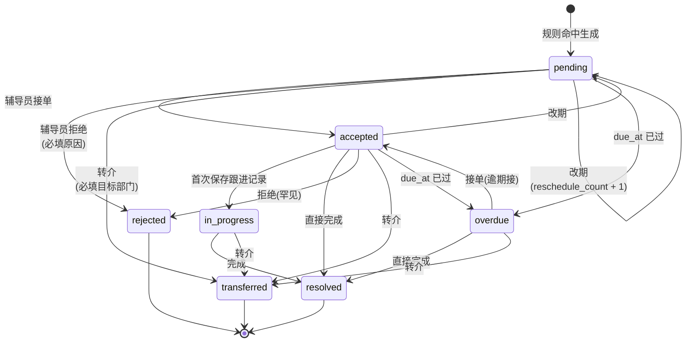

# W1 设计交付：信息架构与任务卡

**版本** v1.0
**日期** 2026-05-15
**前置** `PRD-主动关怀工作台-重写版.md` v1.3 final
**后续** W2 事件流与规则实现

---

## 0. 本文交付清单与边界

| 章节 | 产物 | W2 是否需要 |
|---|---|---|
| §1 信息架构 | 顶层导航变化、sitemap、角色入口矩阵 | 是，决定前端路由结构 |
| §2 工作台首页 | 辅导员首屏 wireframe + 区块字段映射 | 是，决定列表 API 形态 |
| §3 任务详情页 | 详情 wireframe + 默认折叠规则 | 是，决定详情 API 形态 |
| §4 任务卡组件 | 字段表 + 严重度视觉 + 状态徽章 + 操作按钮 + 文案规范 | 是，W2 第一个落地组件 |
| §5 状态机 | Mermaid 图 + 转移规则表 + 后端校验约束 | 是，决定 service 层守门 |
| §6 院系视图 | 骨架占位（W5 详化） | 否 |
| §7 规则运维视图 | 骨架占位（W6 详化） | 否 |
| §8 学生小程序入口 | 路径与文案约束（W6 详化） | 否 |
| §9 W2 研发输入清单 | 路由、API 最小契约、组件清单、验收 | 是 |

**W1 不交付**：完整 API 字段细节（W2 跟随后端表实现同步收口）、CSS token 体系（W4 收口）、通知文案（W4 落 `notification_template` seed）、学生端完整 UX（W6）。

---

## 1. 信息架构

### 1.1 顶层导航变化

| 角色 | 新增顶层入口 | 图标建议 | 位置 |
|---|---|---|---|
| counselor（辅导员） | 关怀工作台 | HeartOutlined | 主导航第 2 位（"学生管理"之后） |
| dean / school_admin | 关怀概览 | DashboardOutlined | 主导航 |
| 学生（小程序） | 我的关怀记录 | — | "我的" → "个人信息保护" 二级（不主推、不弹窗、不在首屏） |

**旧 `/alerts` 路由保留 1 个月**：作为"切回旧视图" toggle 入口，UAT 阶段降级用，参见 PRD §18 W4 / §18.1 第 5 项。

### 1.2 Sitemap

```text
关怀工作台（counselor）
├── 首页 /care
│   ├── 今日待处理（任务卡列表）
│   ├── 已接进行中
│   ├── 本周已完成
│   └── 超期任务
├── 任务详情 /care/task/:taskId
│   ├── 触发摘要
│   ├── 严重度 + SLA
│   ├── 小夕 AI 助手区
│   ├── 触发证据（默认折叠）
│   ├── 历史关怀（默认折叠）
│   └── 操作区
└── 我的反馈 /care/feedback（W4 落，本周仅占位）

关怀概览（dean / school_admin）
├── 概览 /care/dashboard
│   ├── 本周汇总
│   ├── 高发规则 top 3
│   ├── 严重度分布
│   └── 趋势图
├── 需要介入 /care/escalation（超期 + reschedule_count ≥ 2）
├── 下钻 /care/drill?reason=...（必填理由，限流，写审计）
└── 规则运维 /care/rules（W6 落）

学生（小程序，不主推）
└── 我的 → 个人信息保护 → 我的关怀记录
    ├── 类型摘要（不显示分数 / 排名 / 标签）
    └── 反馈入口
```

### 1.3 角色 × 入口矩阵

| 入口 | counselor | dean | school_admin | 学生 |
|---|---|---|---|---|
| `/care`（工作台首页） | ✓ | — | — | — |
| `/care/task/:id` | 仅自己负责的任务 | 仅下钻路径进入 | — | — |
| `/care/dashboard` | — | ✓ | ✓ | — |
| `/care/escalation` | — | ✓ | ✓ | — |
| `/care/drill` | — | ✓（限流 + 审计） | ✓（限流 + 审计） | — |
| `/care/rules` | — | — | ✓（W6 落） | — |
| 小程序"我的关怀记录" | — | — | — | ✓（仅自己） |

**严禁**：任何角色访问"辅导员效能排行""学生风险排行榜""单个辅导员任务积压点名"页面 —— 此类页面 P1 不实现，路由不挂载，避免后续被产品请求加上。

---

## 2. 工作台首页（辅导员视角）

### 2.1 首屏 wireframe

```text
┌─────────────────────────────────────────────────────────────────────┐
│  关怀工作台                                        小夕 ▾   设置 ⚙   │
├─────────────────────────────────────────────────────────────────────┤
│                                                                     │
│  早上好，李老师。今天有 3 件需要关注的事。                          │
│                                                                     │
│  ┌─ 今日待处理（3）─────────────────────────────────────────────┐  │
│  │ [紧急] 王某某 · 计科 22-3 · 近 5 天缺课 3 次                  │  │
│  │        小夕：可以从近期课程内容切入聊聊学习节奏。  ⌄         │  │
│  │        SLA 还剩 18h   [接单] [改期] [详情]                    │  │
│  ├──────────────────────────────────────────────────────────────┤  │
│  │ [高]   张某某 · 软工 21-1 · 请假已过期 50h                    │  │
│  │        小夕：先确认是否需要延长假期或销假。  ⌄                │  │
│  │        SLA 还剩 4h    [接单] [改期] [详情]                    │  │
│  ├──────────────────────────────────────────────────────────────┤  │
│  │ [关注] 李某某 · 自动化 22-2 · 本学期挂科 3 门                 │  │
│  │        小夕：可以围绕课程难度和学习方法展开。  ⌄              │  │
│  │        SLA 还剩 5d    [接单] [改期] [详情]                    │  │
│  └──────────────────────────────────────────────────────────────┘  │
│                                                                     │
│  ┌─ 已接进行中（2）── 本周已完成（5）── 超期（0）─────────────┐  │
│  │  ... 折叠列表，点击展开 ...                                  │  │
│  └──────────────────────────────────────────────────────────────┘  │
│                                                                     │
│  切回旧视图 →（UAT 阶段保留，上线后 1 个月隐藏）                    │
└─────────────────────────────────────────────────────────────────────┘
```

### 2.2 区块约束

| 区块 | 上限 | 排序 | 默认展开 |
|---|---|---|---|
| 今日待处理 | 5 条 | 严重度降序 → SLA 升序 | 是 |
| 已接进行中 | 不限，分页 | accepted_at 降序 | 否 |
| 本周已完成 | 不限，分页 | closed_at 降序 | 否 |
| 超期任务 | 不限，分页 | due_at 升序 | 当 count > 0 时高亮但不自动展开 |

"超期"区块标题数字 > 0 时显示红色徽章，但不自动展开，避免一进首屏看到红色焦虑感。

### 2.3 字段映射（给 W2 列表 API 参考）

| UI 显示 | 字段路径 | 备注 |
|---|---|---|
| 学生姓名 | `student.name` | 通过 student_id join 查 |
| 班级 | `student.class_name` | 同上 |
| 一句话触发摘要 | `rule.summary_template` 模板渲染 | 不暴露 `rule_id` |
| 严重度标签 | `severity` → i18n 映射 | critical→紧急 / high→高 / medium→关注 / low→提醒 |
| SLA 还剩 | `due_at - now()` | 前端实时计算，单位自动（h / d） |
| 小夕摘要 | `current_brief.why` 截 60 字 | 缺失时显示"小夕正在准备" |

---

## 3. 任务详情页

### 3.1 整体布局

```text
┌─────────────────────────────────────────────────────────────────────┐
│  ← 返回    王某某 · 计科 22-3                          [紧急] 24h   │
├─────────────────────────────────────────────────────────────────────┤
│                                                                     │
│  触发摘要                                                            │
│  ─────────────────────────────────────────────────                  │
│  近 5 天该同学有 3 次课堂缺勤。                                      │
│                                                                     │
│  小夕怎么看（可设默认折叠）              [重新分析] [折叠]           │
│  ─────────────────────────────────────────────────                  │
│  ▸ 为什么触发                                                        │
│  ▸ 可以聊的话题（3 条）                                              │
│  ▸ 本次不宜触碰（2 条）                                              │
│  ▸ 可对接资源                                                        │
│  ▸ 建议跟进 7 天后再看                                               │
│                                                                     │
│  触发证据（折叠）                                          ⌄        │
│  ─────────────────────────────────────────────────                  │
│                                                                     │
│  历史关怀（折叠 · 共 2 次）                                ⌄        │
│  ─────────────────────────────────────────────────                  │
│                                                                     │
│  ┌─ 操作区 ──────────────────────────────────────────────────┐    │
│  │  [接单]   [完成]   [改期 ▾]   [转介 ▾]   [拒绝]              │    │
│  │  ← 接单后此区按钮根据状态切换                                │    │
│  └──────────────────────────────────────────────────────────────┘  │
└─────────────────────────────────────────────────────────────────────┘
```

### 3.2 区块顺序（严格）

1. 学生姓名 + 班级 + 严重度徽章 + SLA 倒计时
2. 一句话触发摘要
3. **小夕 AI 助手区**（默认展开，用户可在设置中改为默认折叠）
4. 触发证据（默认折叠）
5. 历史关怀（默认折叠，标题处显示次数）
6. 操作区（粘性底部）

### 3.3 默认折叠的两条约束

- AI 区域允许用户**全局**设置默认折叠（写入用户偏好），但单次详情打开时的展开/折叠状态**不**记忆。
- 触发证据**始终默认折叠**，不允许用户设默认展开 —— 避免一进详情就被原始数据轰炸。

### 3.4 AI 降级显示（参见 PRD §11.5）

| 后端状态 | 详情页显示 |
|---|---|
| `current_brief_id` 为 null | "小夕正在准备…"，触发懒加载 |
| 懒加载也失败 | "建议生成失败，请稍后重试 [重试]" |
| `sanitize_result = blocked` | "建议生成失败"（不显示违规内容） |
| sidecar 整体不可用 | 整个区块隐藏，其他区块照常 |

**关键**：AI 区域失败 ≠ 任务卡失败，任务的接单/改期/完成按钮始终可用。

---

## 4. 任务卡组件

任务卡是 W1 → W2 第一个落地的 React 组件，路径建议 `xg-frontend/apps/web/src/components/care/CareTaskCard.tsx`。

### 4.1 字段表（组件 Props）

| Prop | 类型 | 必填 | 来源 |
|---|---|---|---|
| `taskId` | bigint | ✓ | care_task.id |
| `studentName` | string | ✓ | student.name |
| `className` | string | ✓ | student.class_name |
| `triggerSummary` | string | ✓ | rule.summary_template 模板渲染 |
| `severity` | `'critical' \| 'high' \| 'medium' \| 'low'` | ✓ | care_task.severity |
| `dueAt` | ISO timestamp | ✓ | care_task.due_at |
| `status` | `'pending' \| 'accepted' \| 'in_progress' \| 'resolved' \| 'rejected' \| 'transferred' \| 'overdue'` | ✓ | care_task.status |
| `briefSummary` | string \| null | ✗ | current_brief.why（截 60 字） |
| `briefStatus` | `'ready' \| 'pending' \| 'failed'` | ✓ | 派生 |
| `onAccept` / `onReschedule` / `onDetail` | callback | ✓ | — |

### 4.2 严重度视觉（沿用 Antd 5 token，不引入新色板）

| 严重度 | 文案 | Antd token | 用途 |
|---|---|---|---|
| critical | 紧急 | `colorError` (#ff4d4f) | 徽章背景 + SLA 文字 |
| high | 高 | `colorWarning` (#faad14) | 徽章背景 |
| medium | 关注 | `colorPrimary` (#1677ff) | 徽章背景 |
| low | 提醒 | `colorTextSecondary` | 徽章背景 |

**严禁**自定义新色：避免和现有"违纪""请假"等模块的色板打架，也降低 UAT 阶段视觉走查成本。

### 4.3 状态徽章（仅在非 pending 时显示）

| status | 文案 | 颜色 |
|---|---|---|
| pending | （不显示徽章，靠严重度颜色） | — |
| accepted | 已接 | `colorPrimaryBg` |
| in_progress | 跟进中 | `colorPrimaryBg` |
| resolved | 已完成 | `colorSuccess` |
| rejected | 已拒绝 | `colorTextTertiary` |
| transferred | 已转介 | `colorTextTertiary` |
| overdue | 已超期 | `colorError`（强调） |

### 4.4 操作按钮（按状态切换）

| 当前 status | 主操作 | 次操作 | 详情 |
|---|---|---|---|
| pending | 接单 | 改期、拒绝 | ✓ |
| accepted | 完成 | 改期、转介 | ✓ |
| in_progress | 完成 | 转介 | ✓ |
| resolved / rejected / transferred | — | — | ✓（只读） |
| overdue（未关闭） | 接单 / 完成（按是否已接单） | 改期、转介 | ✓ |

按钮**最多显示 3 个**：主操作（实心按钮） + 次操作（"更多"下拉） + 详情（文字链）。

### 4.5 文案规范（沿用 PRD §16.1）

- 全中文，不出现 `rule_id`、英文 severity、`assigned_to` 等内部字段。
- 严禁词："风险学生""高危学生""疑似心理""问题学生""请立即处理"。
- 触发摘要使用"近 X 天 / 本学期 / 本周"等时间窗口语，**不**使用"该生""此生"等指代。
- 模板示例：
  - R001：`近 5 天该同学有 3 次课堂缺勤。`
  - R007：`请假已过期 50 小时，尚未销假。`
  - R012：`30 天内勤工申请被拒 3 次，未成功上岗。`

### 4.6 两种形态

| 形态 | 用于 | 区别 |
|---|---|---|
| 紧凑卡片（compact） | 工作台首页"今日待处理"列表 | AI 摘要默认 1 行截断、操作按钮固定可见 |
| 普通卡片（normal） | "已接进行中""本周已完成"等折叠区展开后 | AI 摘要不显示、显示状态徽章 |

详情页**不**复用任务卡，使用独立详情布局（§3）。

---

## 5. 状态机

### 5.1 Mermaid 图



### 5.2 转移规则表（后端校验依据）

| from | event | to | actor | 必填副作用 |
|---|---|---|---|---|
| pending | accept | accepted | counselor | `accepted_at`, `accepted_by` |
| pending | reject | rejected | counselor | `closed_at`, `closed_by`, `closed_reason`, 写 `care_task_feedback` |
| pending | transfer | transferred | counselor | `transferred_to`, `closed_at`, `closed_by` |
| pending | reschedule | pending | counselor | `due_at += N天`, `reschedule_count += 1` |
| pending | overdue_tick | overdue | system | 定时任务自动迁移 |
| accepted | save_followup | in_progress | counselor | 不必显式调状态接口，service 内部推进 |
| accepted | resolve | resolved | counselor | `closed_at`, `closed_by`, `closed_reason='resolved'` |
| accepted | transfer | transferred | counselor | 同上 |
| accepted | reschedule | pending | counselor | 同上 |
| accepted | overdue_tick | overdue | system | 同上 |
| in_progress | resolve | resolved | counselor | 同上 |
| in_progress | transfer | transferred | counselor | 同上 |
| overdue | accept | accepted | counselor | 接逾期 |
| overdue | resolve | resolved | counselor | 直接完成 |
| overdue | transfer | transferred | counselor | 转介 |

### 5.3 终态与守则

- **终态**：`resolved` / `rejected` / `transferred`，不可逆。
- `overdue` **不是**终态，仍要求处理。
- `reschedule_count >= 2` 自动进入院系"需要介入"视图（PRD §10.2 / §6.2），但**不**改 status。
- 所有迁移**必须**写 `care_task_audit`（`action`, `from_status`, `to_status`, `actor_id`, `actor_role`, `payload`, `created_at`）。

### 5.4 后端校验约束（给 W2 service 层）

```text
service CareTaskService.transition(taskId, event, payload):
  1. 加载 task 当前 status
  2. 查表 ALLOWED_TRANSITIONS[from][event] = to
     - 不在表中 → 抛 BizException("非法状态变更")
  3. 校验 actor 权限：
     - counselor 操作必须 assigned_to == 当前用户
     - dean / school_admin 不允许操作（只读）
  4. 校验必填副作用：
     - reject 必须带 reason_code
     - transfer 必须带 transferred_to + reason_detail
     - reschedule 必须带天数 ∈ {1, 3, 7} 且当前 reschedule_count < 上限（建议 5）
  5. 事务内：UPDATE care_task + INSERT care_task_audit + 可选 INSERT care_task_feedback
  6. 终态转移：清空 due_at 不必要，保留作为 SLA 命中证据
```

校验表建议**用代码常量**（一个 `EnumMap<Status, EnumMap<Event, Status>>`），不进数据库，避免规则被运行时改坏。

---

## 6. 院系 / 学校管理视图（占位）

W5 详化。本周仅交付骨架，不做交互。

### 6.1 首屏元素清单（与 PRD §6.2 / §16.3 对齐）

- 本周汇总（任务总数 / 完成数 / 进行中数 / 超期数）
- 触发最多规则 top 3（仅规则名 + 命中数，不点名学生 / 辅导员）
- 严重度分布饼图
- 周 / 月趋势折线
- 需要介入入口（`reschedule_count ≥ 2` 或 `overdue`）

### 6.2 禁止项（路由不挂、组件不实现）

- 辅导员效能排行榜
- 学生风险排行榜
- 单个辅导员任务积压点名
- 单个学生 / 班级的系统建议

---

## 7. 规则运维视图（占位）

W6 详化。本周仅记录硬约束。

| 元素 | P1 是否提供 |
|---|---|
| 规则列表（13 条） | ✓ |
| 单条规则启停 | ✓ |
| 全局严重度偏移 -1 / 0 / +1 | ✓ |
| 30 天效果报表 | ✓ |
| 当前规则集版本 + 下次更新日期 | ✓ |
| 学校侧规则创建 / DSL 编辑 / 阈值调整 / 版本回滚 | **✗（P2）** |

AI 助手如需辅助改配置：必须走 `propose → 前端确认 → 原生 admin API`，sidecar 不直接写库（PRD §9.4）。

---

## 8. 学生小程序入口（占位）

W6 详化。本周仅锁定路径与文案约束。

- **路径**："我的" → "个人信息保护" → "我的关怀记录"
- **不主推**：不在小程序首屏、不弹窗、不在消息中心提示、不主动通知
- **显示内容**：仅展示类型摘要（如"近期收到 2 次学业类关怀"），**不**显示分数、不显示排名、不显示任何永久标签
- **反馈入口**：学生可标记"已处理完毕"或"觉得这条不准确"，写入 `care_task_feedback`

---

## 9. 给 W2 的研发输入清单

### 9.1 前端路由（xg-frontend/apps/web）

```text
/care                           → CareWorkbenchPage
/care/task/:taskId              → CareTaskDetailPage
/alerts                         → 保留 1 个月，挂"切回旧视图"toggle
/care/dashboard                 → 占位（W5）
/care/escalation                → 占位（W5）
/care/drill                     → 占位（W5）
/care/rules                     → 占位（W6）
```

### 9.2 API 最小契约（W2 落地）

URL 前缀沿用项目 `/api/v1/*` 约定（与 alert / auth / notification 等所有现有 controller 一致）。

```text
GET    /api/v1/care/tasks?statuses=pending&size=5&sort=severity_desc,due_asc
       → 工作台首页"今日待处理"

GET    /api/v1/care/tasks?statuses=accepted,in_progress
GET    /api/v1/care/tasks?statuses=resolved&since=monday
GET    /api/v1/care/tasks?statuses=overdue

GET    /api/v1/care/tasks/:taskId   → 详情
POST   /api/v1/care/tasks/:taskId/accept
POST   /api/v1/care/tasks/:taskId/resolve         body: {note?}
POST   /api/v1/care/tasks/:taskId/reject          body: {reasonCode, reasonDetail?}
POST   /api/v1/care/tasks/:taskId/reschedule      body: {days: 1|3|7}
POST   /api/v1/care/tasks/:taskId/transfer        body: {targetDept, reasonDetail}

GET    /api/v1/care/tasks/:taskId/brief           → 当前 AI brief（不存在则前端触发懒加载）
POST   /api/v1/care/tasks/:taskId/brief/refresh   → 重新分析（W2.3 接 AI sidecar，目前仅打点）
```

字段细节 W2 跟随后端表实现同步收口，本文件**不**锁字段名 / 字段类型。

### 9.3 组件清单（W2 落地）

| 组件 | 路径 | 用途 |
|---|---|---|
| `CareTaskCard` | `components/care/CareTaskCard.tsx` | 任务卡（紧凑 / 普通两形态） |
| `SeverityBadge` | `components/care/SeverityBadge.tsx` | 严重度徽章 |
| `SlaCountdown` | `components/care/SlaCountdown.tsx` | SLA 实时倒计时 |
| `XiaoxiBrief` | `components/care/XiaoxiBrief.tsx` | 小夕 AI 区，含三种状态（ready / pending / failed） |
| `RescheduleModal` | `components/care/RescheduleModal.tsx` | 改期弹窗（1/3/7 天） |
| `RejectModal` | `components/care/RejectModal.tsx` | 拒绝弹窗（必选 reason_code） |
| `TransferModal` | `components/care/TransferModal.tsx` | 转介弹窗（必选 target_dept） |
| `CareWorkbenchPage` | `pages/care/index.tsx` | 工作台首页 |
| `CareTaskDetailPage` | `pages/care/task/[taskId].tsx` | 任务详情页 |

### 9.4 数据库与后端守门

- 建表：`care_task` / `care_task_audit` / `care_task_feedback` / `task_ai_brief_history`（W2 落 migration，本文件不展开 DDL）
- 状态机校验：建 `EnumMap<Status, EnumMap<Event, Status>>` 常量，service 层强制走 `transition()` 入口，不允许直接 update status
- 审计：每次 transition 必写 `care_task_audit`
- 接单权限：counselor 仅能操作 `assigned_to = 自己` 的任务

### 9.5 W2 验收标准

完成 W2 时应满足：

- [ ] 工作台首页可以展示 5 张任务卡（首屏不超过 5 个）
- [ ] 任务卡的 6 个按钮（接单 / 完成 / 改期 / 转介 / 拒绝 / 详情）全部可用并写审计
- [ ] 详情页 5 个区块顺序正确，触发证据和历史关怀默认折叠
- [ ] 状态机非法迁移被后端拒绝并返回中文错误（通过 `BizException.message`，前端用 `describeApiError` 透传）
- [ ] AI 区域三种状态（ready / pending / failed）UI 均正确显示，AI 不可用时其他按钮仍可点
- [ ] 旧 `/alerts` 路由仍能访问，工作台首页底部有"切回旧视图"链接

---

## 10. 与 PRD 的勘误 / 待办（W1 期间发现的）

| 项 | 描述 | 处置 |
|---|---|---|
| 任务卡组件路径 | PRD 未指定，本文给出 `components/care/` | W2 落地时按此约定 |
| 状态徽章颜色 token | PRD 仅给文字，本文锁 Antd 5 token | 沿用，不引入自定义色板 |
| reschedule_count 上限 | PRD §10.2 未明示具体上限，本文给建议值 5 | 本文是建议值，W2 时由产品最终拍 |
| `in_progress` 推进路径 | PRD 仅给状态名，本文给出"首次保存跟进记录" service 内部推进 | 本文是建议路径，W2 时和后端最终拍 |

---

**W1 设计交付完毕。下一步进入 W2：事件流 + 13 条规则 + 任务生成。**
