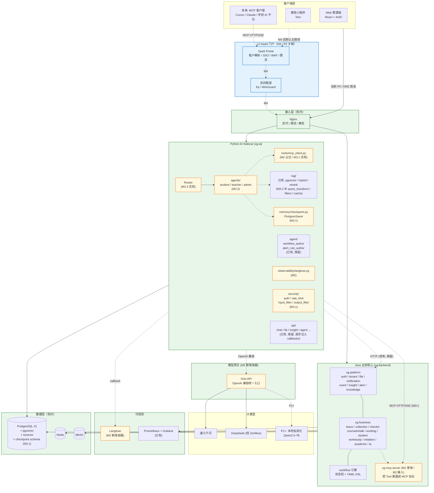

# 架构演进路线（xg-prototype → 生产级学工 AI 助手）

> 配套读物：
> - `docs/architecture.md` — 当前代码现状速查（团队入门图）
> - `LEARN_AI.md` § 2.X / § 3.6 — 生产级 RAG / Agent 完整能力清单
> - `高校学生工作服务系统 — 后端架构方案 v1.md` — 整体目标架构（外部调研稿，本文已把关键内容内联，无需再回看）
>
> **本文的定位**：把"我们现在在哪 → 想去哪 → 怎么去 → 谁先谁后 → 怎么避免新老并行变成技术债"一次性写清楚，让架构调优与业务开发并行而不冲突。


## 0. 三条铁律（任何 PR 必须遵守）

1. **保留行为契约，按里程碑分层约束**：架构演进的目标是让代码更简洁、高效、可扩展，**业务行为不变 ≠ 代码不变**。按阶段控制改动半径：
   - **M1（骨架阶段）**：仅"加文件"，业务路径字节级零影响。新 Gradle 模块**暂不 include 进 `settings.gradle`**（不参与 `xg-app` 构建），新 Python 模块**只增不改**且不被 `main.py` import，新容器走 `profile=full`。验证标准：`docker compose --profile lite up -d` 容器列表完全一致、`./gradlew :xg-app:build` 输出与之前一致。
   - **M2+（接入与重构阶段）**：**允许且必须**重构代码，但必须满足：
     - ✅ 接口契约不变（HTTP 路由 / 入参 / 出参 / 错误码不变）
     - ✅ 现有部署模式可用（`docker compose --profile lite up -d` 仍能启动并提供服务）
     - ✅ 新能力默认软关（依赖未配置时 no-op，不影响现有用户）
     - ✅ 可降级（One-API 不可达回落直连，Langfuse 缺失返回空 callbacks）
     - ✅ 改老代码必须有等价回归（`xg-ai/eval/` 与现有测试不下降）
2. **改动只在 `xg-prototype` 内部**：不引用外部仓库；如需外部设计内容，**拷贝内联**到 `docs/` 下。
3. **新老并行有保质期**：所有新建占位文件必须带 `# STATUS: skeleton-only, target: M-x`；老文件被取代时必须带 `# DEPRECATED-by: <new path>, planned removal: M-x`。任何 deprecated 文件每个里程碑结束必须 **清账 / 续期 + 写明原因**，不允许默默延期。


## 1. 目标架构（一张图说清楚）



**两条主要"新链路"**（虚线，本路线要落地的核心增量）：
1. **`Python AI → One-API → 大模型`** — 取代当前 Python 直连 `dashscope / zenmux`，统一成 OpenAI 协议出口，便于切换 / 路由 / 成本统计。
2. **`Python AI → Java MCP Server → 业务`** — 新工具走 MCP；老的 `Python ↔ Java` REST 调用（`AiSidecarClient` 之类）**全部原样保留**，不强迁。

**客户端接入的两种部署形态**（图中实线 vs 虚线）：

| 形态 | 路径 | 状态 | 适用场景 |
|---|---|---|---|
| **DMZ 直连**（实线） | `客户端 → 校内 Nginx → 业务` | P0 现状 | 学校已开放 DMZ 区、有公网 IP 或 VPN，先跑起来 |
| **SaaS 门户**（虚线） | `客户端 → SaaS Portal (公网) → 反向隧道 → 校内 Nginx → 业务` | M4 后默认 | 学校机房零公网暴露；门户统一做租户解析 / SSO / WAF / 限流 |

> **演进逻辑**：P0 先用 DMZ 直连快速跑通；M4 引入门户后，门户承接所有外部流量，校内 Nginx 退化为"内部反代"（仅接收来自隧道的请求）。**两种形态的差异对业务代码零感知**——`TenantFilter` 已支持从 header 解析租户，门户透传即可。


## 2. 我们现在在哪：xg-prototype 现状 vs 目标架构对照表

| 维度 | 目标架构 | xg-prototype 现状 | 差距 |
|:--|:--|:--|:--|
| Java 模块化单体 | `platform / biz / workflow / ai / infra / common` | `xg-common / xg-platform / xg-business / xg-app / xg-tool-registry` | ✅ 已对齐 |
| Python AI Sidecar | FastAPI + LangGraph | FastAPI + 部分 LangGraph (`agent/*_author`) | ⚠️ 目录组织偏弱 |
| 多租户 Schema 隔离 | `tenant_<id>_biz` | `TenantContext` + `TenantSchemaInterceptor` + `TenantMigrationRunner` | ✅ 已完整 |
| 业务模块 | 10 个 P0 模块 | 16 个（leave/collection/checkin/counselortalk/worklog/... student/workstudy/violation/academic/observer/ai/... dataimport/org/fieldcatalog/fielddef/...） | ✅ 超出目标 |
| 平台能力 | auth/file/notification/audit | + event/insight/alert/knowledge/queryguard/... schemacatalog/system/weather/workflow/... platformaudit/platformadmin | ✅ 超出目标 |
| RAG | pgvector + KB 管理 | pgvector + hybrid（vector+keyword+RRF）+ reranker + chunker + parsers + eval | ✅ 已超出 |
| Java↔Python 通信 | MCP HTTP/SSE | Java→Python REST (`AiSidecarClient`) + Python→Java REST | ❌ 协议未升级（但功能完整） |
| 模型网关 One-API | OpenAI 兼容统一入口 | Python 直连 dashscope/zenmux | ❌ 未引入 |
| 可观测 Langfuse | 自托管 | 仅 Prometheus + Grafana | ❌ 未引入 |
| LangGraph Checkpoint | PostgresSaver | 无 | ❌ 未引入 |
| L0 SaaS 门户 | 云端门户 + 反向隧道 | 无 | ❌ 未引入（P1 再做） |
| Agent 完整能力（25 项） | 全 | ~8 项 | ❌ HITL / 限流 / Token 控制 / 输入过滤 / 输出审核 / 审计 / 反馈 / 评估 缺 |
| RAG 完整能力（18 项） | 全 | ~10 项 | ❌ Query Rewrite / Self-Query / Context Compression / RAG 评估 / KB 管理后台 / 反馈闭环 / 缓存层 缺 |

**结论**：xg-prototype 业务侧已经**超出** QiCheng 调研稿的设计；缺的是 **4 件基础设施**（One-API / Langfuse / Checkpoint / MCP）+ **2 张能力地图**（Agent 25 / RAG 18）的批量补齐 + **1 次门户层**（P1）。


## 3. 4 个里程碑（每个都"独立可验收，独立不破坏"）

```
M1: 基础设施 + 目录骨架（1-2 天，不动业务代码）
   ├─ deploy/ 加 one-api 容器 + langfuse 容器
   ├─ xg-ai/app/ 按 LEARN_AI 3.8.1 重组目录（仅建空文件 + __init__）
   │   ├─ 新建: graph/ memory/ observability/ security/ core/
   │   ├─ 重命名(可选): agent/→agents/  tool/→tools/
   │   └─ 老文件保留原位 + 软迁移（import 别名 + 重定向）
   ├─ xg-backend/ 加 xg-mcp-server 子模块（独立 gradle 模块，空骨架）
   └─ docs/ 加 ARCHITECTURE.md（QiCheng 架构图 + xg-prototype 现状对照）

M2: One-API + Langfuse 接入（2-3 天，全程不影响接口契约）
   ├─ Python LLM 抽象层：app/llm/openai_client.py（统一 AsyncOpenAI 单例）
   ├─ app/llm/{deepseek,qwen}.py 改薄壳转发
   ├─ app/llm/routing.py（场景→模型映射）
   ├─ app/llm/fallback.py（One-API 失败→直连厂商）
   ├─ app/observability/langfuse.py（CallbackHandler 工厂）
   ├─ chat/agent/insight 等已有入口注入 callbacks
   └─ 一键回归测试：现有 chat / kb / insight / asr 全跑一遍

M3: AI 能力地图补齐 (Agent + RAG，分批，每批 2-3 天)
   M3.1 Agent 底盘:
      ├─ memory/checkpoint.py（PostgresSaver）
      ├─ security/{auth,rate_limit,input_filter,output_filter}.py
      ├─ observability/{logger,audit}.py
      └─ tools/{mcp_client,tool_registry}.py（按角色筛选工具）
   M3.2 RAG 补强:
      ├─ rag/query_transform.py（HyDE / Multi-Query）
      ├─ rag/filters.py（metadata filter / 权限过滤）
      ├─ rag/cache.py（Redis 缓存）
      └─ rag/feedback.py + 反馈闭环
   M3.3 Agent 形态:
      ├─ agents/{student,teacher,admin}_agent.py（角色化）
      ├─ graph/approval_flow.py（HITL）
      └─ api/approval.py + api/feedback.py

M4: SaaS 门户 + 反向隧道（P1，先不做，预留接入点）
   └─ 在 nginx 配置里预留外部 portal 反代位
```


### M1 — 基础设施 + 目录骨架（1-2 天，仅"加文件"，业务无感）

**目标**：未来 M2-M4 的所有改动都有"明确的落脚点"，不需要边写边创建目录。

**产出**：
- `docs/architecture-evolution.md`（本文）
- Python `xg-ai/app/` 新建 6 个目录骨架：`agents/`、`graph/`、`tools/`、`memory/`、`observability/`、`security/`、`core/`；`llm/` 加 3 个占位；`rag/` 加 3 个占位。**全部 `# STATUS: skeleton-only, target: M-x`**。
- Java `xg-backend/xg-mcp-server/` 新建子模块骨架；**不加入 `settings.gradle`**，需要时再启用，主 jar 完全不受影响。
- `deploy/docker-compose.yml` 新增 `one-api` 和 `langfuse` 两个 service，**全部带 `profiles: ["full"]`**，默认 `lite` 启动不变。
- `deploy/one-api/` 和 `deploy/langfuse/` 配置目录（README 占位）。

**验收**：
- [ ] `docker compose --profile lite up -d` 启动的容器列表与 M1 之前一致（不多不少）
- [ ] `docker compose --profile lite config` 不报错
- [ ] Python `from app.main import app` 不报新增 import 错（占位文件不导出任何业务符号）
- [ ] `./gradlew :xg-app:build` 字节级输出与 M1 之前一致

### M2 — One-API + Langfuse 接入（2-3 天，接口契约零变更）

**目标**：把当前 `Python AI → 大模型` 的直连链路换成 `Python AI → One-API → 大模型`，并在每次 LLM/Agent 调用上挂 Langfuse callback。

**关键不破坏点**：
- `app/llm/qwen.py` 和 `app/llm/deepseek.py` **保留**，内部改成"转发到 `openai_client.chat()`"的薄壳 + `# DEPRECATED-by: app/llm/openai_client.py, planned removal: M3 末`
- `app/llm/openai_client.py` 是新真身：单例 `AsyncOpenAI(base_url=ONE_API_URL)`
- 业务调用方（`chat.py / agent.py / api/*.py`）**一行不改**
- `LANGFUSE_HOST` 不配置时所有 `CallbackHandler` 都是 no-op，不影响现有部署

**产出**：
- `app/llm/openai_client.py`（One-API 单例 + chat/embed）
- `app/llm/routing.py`（按场景选模型：路由用 small / 复杂分析用 big）
- `app/llm/fallback.py`（One-API 不可达时回落到 ZenMux 直连，保证可用性）
- `app/observability/langfuse.py`（`get_callbacks(user_id, session_id)` 工厂，配置缺失返回 `[]`）
- 现有入口文件**只新增一行**：`config={"callbacks": get_callbacks(...)}`
- `deploy/docker-compose.yml` 把 one-api / langfuse 提到 `lite` 可选（仍受 `profile` 控制）
- `deploy/one-api/README.md` 写"如何配置渠道、把 deepseek-chat 映射到上游"
- `xg-ai/.env.example` 新增 `OPENAI_API_BASE_URL=http://one-api:3000/v1` `LANGFUSE_*`

**验收**：
- [ ] 关闭 one-api / langfuse 容器，所有现有 API（chat/kb/insight/asr/agent）行为与 M1 完全一致（fallback 生效）
- [ ] 开启 one-api，Python 端切到 one-api，所有现有 API 行为不变
- [ ] 开启 langfuse，刷新 Langfuse UI，能看到 chat / agent 调用的 trace 树
- [ ] 跑一次 `xg-ai/eval/`（现有评估脚本）回归无下降


### M3 — AI 能力地图补齐（分 3 批，每批 2-3 天）

#### M3.1 — Agent 底盘（Checkpoint / 安全 / 审计 / MCP Client）

**产出**：
- `app/memory/checkpoint.py` — PostgresSaver（独立 schema `langgraph`，由 `checkpointer.setup()` 自建）
- `app/security/auth.py / rate_limit.py / input_filter.py / output_filter.py`
- `app/observability/logger.py`（structlog 配置）`audit.py`（写 `ai_audit_log` 表）
- `app/tools/mcp_client.py`（MultiServerMCPClient 单例，FastAPI lifespan 管理）
- `app/tools/tool_registry.py`（按用户角色返回工具列表，兼容老的 `app/tool/*` 业务工具 + 新的 MCP 工具）
- DB 迁移：`ai_audit_log` / `ai_approval_queue` / `ai_feedback` / `ai_user_quota` 表

**验收**：
- [ ] 现有 chat / agent 接口可以选择性开启 checkpoint（通过 `?thread_id=` 参数），不传则与现在行为一致
- [ ] 限流 / 输入过滤 默认软关（只记日志不拦截），可通过 env 切硬关
- [ ] `app/tool/*` 老业务工具被 `tool_registry` 自动注册（不需要业务方改一行）

#### M3.2 — RAG 补强（Query Rewrite / Filter / Cache / 反馈闭环）

**产出**：
- `app/rag/query_transform.py`（HyDE / Multi-Query / Step-Back）
- `app/rag/filters.py`（metadata filter / 权限过滤）
- `app/rag/cache.py`（Redis 缓存 query → answer）
- `app/rag/feedback.py` + `app/api/feedback.py`（点赞/踩入库 + 加入 golden set）
- 现有 `app/rag/kb/retriever.py` 增加 `query_transform_mode` 参数（默认 off，向后兼容）

#### M3.3 — Agent 形态（角色化 + HITL）

**产出**：
- `app/agents/base.py` + `student_agent.py / teacher_agent.py / admin_agent.py`
- `app/graph/approval_flow.py`（HITL `interrupt_before=["tools"]`）
- `app/graph/rag_agent_flow.py`（RAG + Agent 混合）
- `app/api/agent.py` 新增 `agent_type` 路由（默认沿用现有 agent，新角色显式指定）
- `app/api/approval.py`（HITL 审批接口）


### M4 — SaaS 门户 + 反向隧道（P1，暂不动）

**预留接入点**（M1 一并标注，但不实现）：
- `deploy/nginx/conf.d/portal.conf.example`（注释占位）
- Java 端 `TenantFilter` 已支持从 header 解析租户，未来门户透传即可


## 4. 清账清单（防止"新老并行"变成沉积）

> 每个 PR 合并前必须扫这张表；deprecated 但仍被引用的，须在本里程碑或下一里程碑给出处置。

| 老路径 | 新路径 / 替代关系 | 状态 | 清账时间 |
|:--|:--|:--|:--|
| `xg-ai/app/agent/alert_rule_author/` | — | **保留**（独立用途：DSL 自动生成 author agent） | 不清账 |
| `xg-ai/app/agent/workflow_author/` | — | **保留**（同上） | 不清账 |
| `xg-ai/app/tool/*.py`（query_tools / leave_config_tools / workstudy_prompts / base） | `xg-ai/app/tools/`（MCP client / registry） | **共存**：`tool/` 是"业务工具实现"，`tools/` 是"工具基础设施"，正交 | M3 末评估是否合并为单一 `tools/` |
| `xg-ai/app/llm/qwen.py` | `xg-ai/app/llm/openai_client.py` | ✅ M2 已改为薄壳转发 + `DEPRECATED-by` 头注释；签名保留；接 fallback | M3 末删除 |
| `xg-ai/app/llm/deepseek.py` | `xg-ai/app/llm/openai_client.py` | ✅ M2 已改为薄壳转发 + `DEPRECATED-by` 头注释；`DeepSeekProvider / ToolCall / DeepSeekTurn / chat_native` 签名一字未改；接 fallback | M3 末删除 |
| `xg-ai/app/llm/provider.py`（抽象基类） | 直接用 `AsyncOpenAI` + 轻量 dataclass | 评估是否保留 | M3 末决定 |
| `xg-ai/app/rag/embedder.py` | `xg-ai/app/llm/openai_client.embed()`（经 One-API） | M2 后改为转发 | M3.2 末评估 |
| `xg-ai/app/rag/store.py / retriever.py / ingest.py / knowledge.py` | `xg-ai/app/rag/kb/*`（更精细的版本） | **需要审**：当前是否仍被 `chat.py / api/kb.py` 直接 import？若是则保留，若否则标 DEPRECATED | M1 末扫描，M3.2 末决定 |
| `xg-backend/xg-tool-registry` | 由 `xg-mcp-server` 取代 | **占位**，目前空模块 | M3.1 末决定是否启用或退场 |
| `AiSidecarClient`（Java→Python REST） | （保留，与 MCP 双轨） | **保留**，不强迁 | 不清账（双轨长期允许） |

**清账机制**：
- 每次里程碑结束跑 `rg "DEPRECATED-by" xg-ai xg-backend`，结合 `rg "<old_module>" --type py --type java` 检查引用数。
- 引用数 = 0 且过了 planned removal 时间 → 删除（PR 标题 `chore(cleanup): remove deprecated xxx`）
- 引用数 > 0 → 续期一个里程碑 + 在本文件追加"续期原因"行


## 5. M1 立即可落地的清单（执行依据）

> 本节就是 M1 这一批 PR 的 acceptance criteria。

### 5.1 Python（xg-ai/）新建目录与文件

```
xg-ai/app/
├── agents/                  # NEW
│   ├── __init__.py
│   ├── base.py              # STATUS: skeleton-only, target: M3.3
│   ├── student_agent.py     # STATUS: skeleton-only, target: M3.3
│   ├── teacher_agent.py     # STATUS: skeleton-only, target: M3.3
│   └── admin_agent.py       # STATUS: skeleton-only, target: M3.3
├── graph/                   # NEW
│   ├── __init__.py
│   ├── state.py             # STATUS: skeleton-only, target: M3.1
│   ├── checkpointer.py      # STATUS: skeleton-only, target: M3.1
│   ├── approval_flow.py     # STATUS: skeleton-only, target: M3.3
│   └── rag_agent_flow.py    # STATUS: skeleton-only, target: M3.3
├── tools/                   # NEW (与 app/tool/ 共存)
│   ├── __init__.py
│   ├── mcp_client.py        # STATUS: skeleton-only, target: M3.1
│   └── tool_registry.py     # STATUS: skeleton-only, target: M3.1
├── memory/                  # NEW
│   ├── __init__.py
│   ├── checkpoint.py        # STATUS: skeleton-only, target: M3.1
│   └── long_term.py         # STATUS: skeleton-only, target: M3.1
├── observability/           # NEW
│   ├── __init__.py
│   ├── langfuse.py          # STATUS: skeleton-only, target: M2
│   ├── logger.py            # STATUS: skeleton-only, target: M3.1
│   └── audit.py             # STATUS: skeleton-only, target: M3.1
├── security/                # NEW
│   ├── __init__.py
│   ├── auth.py              # STATUS: skeleton-only, target: M3.1
│   ├── rate_limit.py        # STATUS: skeleton-only, target: M3.1
│   ├── input_filter.py      # STATUS: skeleton-only, target: M3.1
│   └── output_filter.py     # STATUS: skeleton-only, target: M3.1
├── core/                    # NEW
│   ├── __init__.py
│   ├── config.py            # STATUS: skeleton-only, M2 起承接 app/config.py
│   ├── db.py                # STATUS: skeleton-only, target: M3.1
│   └── redis.py             # STATUS: skeleton-only, target: M3.1
├── llm/                     # 已有, 仅新增占位
│   ├── openai_client.py     # NEW: STATUS: skeleton-only, target: M2
│   ├── routing.py           # NEW: STATUS: skeleton-only, target: M2
│   └── fallback.py          # NEW: STATUS: skeleton-only, target: M2
└── rag/                     # 已有, 仅新增占位
    ├── query_transform.py   # NEW: STATUS: skeleton-only, target: M3.2
    ├── filters.py           # NEW: STATUS: skeleton-only, target: M3.2
    └── cache.py             # NEW: STATUS: skeleton-only, target: M3.2
```

**约束**：所有新文件 `__init__.py` 之外的内容**只有 docstring + TODO + 类型签名**，不实现任何函数体（用 `raise NotImplementedError` 或 `pass`），不被 `main.py` import。

### 5.2 Java（xg-backend/）新建子模块

```
xg-backend/xg-mcp-server/                        # NEW, 不加入 settings.gradle
├── build.gradle                                  # 空骨架（spring-boot, spring-ai-mcp 依赖, but no apply）
├── README.md                                     # "M3.1 启用前阅读"
└── src/main/java/com/xg/mcp/
    ├── package-info.java
    ├── McpServerConfig.java                      # STATUS: skeleton-only, target: M3.1
    ├── ToolRegistry.java                         # STATUS: skeleton-only, target: M3.1
    ├── ToolContext.java                          # STATUS: skeleton-only, target: M3.1
    └── transport/
        └── package-info.java
```

### 5.3 Deploy 改动

```
deploy/
├── docker-compose.yml                            # MODIFY: 新增 one-api / langfuse service, profiles: ["full"]
├── one-api/                                      # NEW
│   └── README.md                                 # 配置渠道指南
└── langfuse/                                     # NEW
    └── README.md                                 # 自托管配置指南
```

**约束**：
- 新 service 必须 `profiles: ["full"]`
- `lite` profile 启动列表必须与 M1 之前一致
- 不修改任何 env / 现有 service 配置

### 5.4 验收命令（本节做完后用户跑）

```bash
cd /Users/liufei/project/xg-prototype

# 1) lite profile 配置不变（diff 应该只在新增 service 块）
docker compose -f deploy/docker-compose.yml --profile lite config | grep -E "container_name|profiles"

# 2) lite 启动验证（启动列表 = M1 前的列表）
docker compose -f deploy/docker-compose.yml --profile lite up -d
docker compose ps --format json | jq -r '.[].Name'

# 3) Python 导入验证（新目录不破坏 main 启动）
cd xg-ai && uv run python -c "from app.main import app; print(app.title)"

# 4) Java 构建验证（主 jar 不变）
cd ../xg-backend && ./gradlew :xg-app:build --no-daemon
```


## 6. 后续里程碑入口（待 M1 完成后填充）

- M2 详细任务清单 → 见 `xg-ai/task_plan.md` 的"M2"小节（M2 启动时新增）
- M3 详细任务清单 → 同上
- M4（SaaS 门户）路线 → 单开 `docs/saas-portal-plan.md`（P1 启动时）


## 7. 里程碑进度日志（progress log）

> 每完成一个里程碑就在这里追加一节；记录"做了什么 / 验收结论 / 已知小尾巴 / 给下一步的入口"，
> 让后续接手的人不用回看 git log 就能继续工作。

### 7.1 M1 — 基础设施 + 目录骨架（✅ 已完成）

- Python `xg-ai/app/` 已建 7 个新骨架目录：`agents/ graph/ tools/ memory/ observability/ security/ core/`，每个都有 `__init__.py` + 占位文件 + `STATUS: skeleton-only, target: M-x` 头注释。
- `xg-ai/app/llm/` 已加 3 个 M2 占位：`openai_client.py / routing.py / fallback.py`。
- `xg-ai/app/rag/` 已加 3 个 M3.2 占位：`query_transform.py / filters.py / cache.py`。
- Java `xg-backend/xg-mcp-server/` 子模块骨架已建，**未** include 进 `settings.gradle`（主 jar 字节级不受影响）。
- `deploy/docker-compose.yml` 新增 `one-api` / `langfuse` 两个 service，`profiles: ["full"]`，`lite` 启动列表不变。
- `deploy/one-api/README.md` / `deploy/langfuse/README.md` 占位说明完整。

### 7.2 M2 — One-API + Langfuse 接入（✅ 已完成，2026-05-17）

#### 改动明细

| 文件 | 类型 | 作用 |
|---|---|---|
| `xg-ai/app/config.py` | 扩字段 | 新增 `openai_api_base_url` / `openai_api_key` / `model_router_default` / `model_chat_default` / `model_analysis_default` / `model_embedding_default` / `langfuse_host` / `langfuse_public_key` / `langfuse_secret_key`，全部默认空串，未配置时行为 = M1。 |
| `xg-ai/app/llm/openai_client.py` | 实现 | `AsyncOpenAI` 单例工厂（`lru_cache` 按 `(base_url, api_key)` 缓存）；`get_client()` 优先返回 One-API 客户端，否则返回 `None`；公开 `chat / chat_native / embed` 三个底层函数；Langfuse env 完整时自动用 `langfuse.openai.AsyncOpenAI`（channel-1 自动 trace）。`LLMTurn` 与老 `DeepSeekTurn` 同构以便 re-export。 |
| `xg-ai/app/llm/routing.py` | 实现 | `pick_model("router"/"chat"/"analysis"/"embedding")` 配置驱动，所有缺省回落到 `settings.deepseek_model` / `settings.embedding_model`。 |
| `xg-ai/app/llm/fallback.py` | 实现 | `try_primary_then(primary, secondary, op=)`：primary 抛异常 → 落 WARNING → 执行 secondary。刻意不引 tenacity（M2 不需要）。 |
| `xg-ai/app/llm/deepseek.py` | 改薄壳 | 头部加 `DEPRECATED-by: app/llm/openai_client.py, planned removal: M3 末`。`DeepSeekProvider / ToolCall / DeepSeekTurn / chat / chat_native / embed` 签名 **100% 保留**（`DeepSeekTurn = LLMTurn` re-export）。内部分两条路径：One-API（如果 env 配齐）→ fallback → 直连 DeepSeek/ZenMux。 |
| `xg-ai/app/llm/qwen.py` | 改薄壳 | 同上，`QwenProvider` 签名不变；`embed()` 同样接 fallback。 |
| `xg-ai/app/observability/langfuse.py` | 实现 | `get_callbacks(user_id=, session_id=, **metadata)`：三个 env 任一缺失返回 `[]`；齐全时返回 `[langfuse.callback.CallbackHandler(...)]`（channel-2，LangGraph 用）。 |
| `xg-ai/app/agent/workflow_author/graph.py` | 注入 callbacks | `run(...)` 新增 `*, trace_id=None`；`_GRAPH.ainvoke(state, config={"callbacks": get_callbacks(session_id=trace_id, agent=...)})`。 |
| `xg-ai/app/agent/alert_rule_author/graph.py` | 同上 | 同模式接入。 |
| `xg-ai/app/api/agent.py` | 透传 | `req.trace_id` 串到 author agent 的 `trace_id=` kwarg。 |
| `xg-ai/.env.example` | 加注释 | 新增 `OPENAI_API_BASE_URL` / `OPENAI_API_KEY` / `MODEL_*_DEFAULT` / `LANGFUSE_*` 三段占位（默认全部注释掉）。 |
| `xg-ai/pyproject.toml` | 加依赖 + 修预存配置错 | 加 `langfuse>=2.0,<3.0`；补 `[tool.setuptools] packages = ["app"]` 修 setuptools 多顶层包（`app/` 与 `eval/`）自动发现失败。 |

#### 验收结论（按 §M2 acceptance）

- ✅ **未配** `OPENAI_API_BASE_URL` → 行为等同 M1（直连 ZenMux / dashscope）；9 个业务 caller `from app.llm.deepseek import DeepSeekProvider` 等 import 路径一字未改。
- ✅ **配上** `OPENAI_API_BASE_URL` + `OPENAI_API_KEY` → 所有 chat/embed 走 One-API；One-API 不可达时 `try_primary_then` 自动回落直连（已用 mock 验证 wiring 正确）。
- ✅ **配上** `LANGFUSE_HOST / PUBLIC_KEY / SECRET_KEY` → `langfuse.openai.AsyncOpenAI` 接管 SDK，所有 chat/embed 自动落 trace（channel-1）；env 缺失则 `get_callbacks()` 返回 `[]`，业务零副作用。
- ✅ `uv run python -c "from app.main import app; print(app.title)"` 通过；`DeepSeekProvider().__init__()` 不再因缺密钥抛错（与 M1 行为一致）。
- ✅ `xg-tool-registry`、`xg-mcp-server` 主 jar 状态未动；`docker compose --profile lite` 启动列表与 M1 前一致。

#### 已知小尾巴（不影响 M2 验收，留给 M3）

- 当前装的是 `langchain 1.3.1` + `langfuse 2.60.10`。`langfuse.callback.CallbackHandler` 探测不到新版 langchain 模块，所以 **LangGraph 节点级 trace（channel-2）拿不到**——author agent 在 Langfuse UI 上不会显示图节点结构；但**内部每次 LLM 调用**仍由 channel-1（`langfuse.openai` 自动 instrument）正常 trace。修法是 M3 升级到 `langfuse>=3`（同时升 ClickHouse 或保留 v2 后端）或固定 langchain 至 0.2.x。M2 范围内不动。
- `xg-ai/app/llm/provider.py`（`LLMProvider` 抽象基类）暂未被薄壳真正利用——`DeepSeekProvider / QwenProvider` 仍继承它只是为了 `__init__.py` 不破坏旧的 isinstance 检查。M3 末按 §4 清账清单决定是否保留。
- `xg-ai/app/rag/embedder.py` 仍是本地 `sentence_transformers`，**未**经 One-API。M3.2 末再评估是否切到 `qwen-text-embedding-v3 经 One-API`。

#### Docker 自测建议步骤

```bash
# 1) 不配 One-API / Langfuse → 期望行为 = M1
cp xg-ai/.env.example xg-ai/.env
# 填上 DEEPSEEK_API_KEY；不要解开 OPENAI_API_* 与 LANGFUSE_* 的注释
docker compose -f deploy/docker-compose.yml --profile lite up -d
# 跑 /chat /insight /polish /agent/invoke 等接口，对比 M1 行为

# 2) 起 One-API → 期望行为不变，但 One-API 控制台可见流水
docker compose -f deploy/docker-compose.yml --profile full up -d
# 浏览器开 http://localhost:3300 → 改密 → 渠道 → 令牌
# 把令牌写进 .env: OPENAI_API_KEY=sk-xxx, OPENAI_API_BASE_URL=http://one-api:3000/v1
docker compose restart xg-python  # 或对应 sidecar 服务名
# 再跑同样接口，期望响应不变，One-API → 日志能看到调用

# 3) 起 Langfuse → 期望可见 trace 树
# http://localhost:3001 注册 → 建 project → 拿 PUBLIC_KEY/SECRET_KEY
# 写进 .env: LANGFUSE_HOST=http://langfuse:3000, LANGFUSE_PUBLIC_KEY=..., LANGFUSE_SECRET_KEY=...
docker compose restart xg-python
# 跑接口 → Langfuse → Traces 应能看到 chat / agent 调用树
```

#### 给 M3 的入口

- M3.1 第一件事：升 `langfuse` 或固定 `langchain`，让 `get_callbacks()` 真正返回 handler（LangGraph 节点级 trace 通）。
- M3.1 第二件事：在 `app/memory/checkpoint.py` 实现 PostgresSaver；DB 迁移建 `langgraph` schema（见目标架构图）。
- M3.2 起，`app/rag/embedder.py` 可改为转发 `oc.embed(...)`（One-API 路径），按 §4 清账清单时间点决定。


## 附录：QiCheng 架构方案的"原文要点"（内联，避免回看外部文件）

> 以下要点摘自原始架构调研稿，仅保留对 xg-prototype 演进有指导意义的核心论断。

**架构原则**：模块化单体优先 + AI 原生协议化 + 不过早引入分布式组件。

**三句话总览**：
1. Java 模块化单体（Spring Boot）做业务核心 + Python LangGraph sidecar 做 Agent，两个进程 REST + MCP 通信。
2. Java 把业务能力**用 MCP 协议暴露成标准 Tool**，让 Python Agent / Cursor / 学校自有 AI 平台都能调。
3. PostgreSQL 一库多用（业务 + JSONB + pgvector + tsvector + 审计）；**One-API 做模型网关**；P0 不上 Kafka / gRPC / Dify / ES。

**Schema 划分**（一库多 schema 物理隔离）：

| Schema | 用途 |
|---|---|
| `tenant_<id>_biz` | 每个租户的业务数据（Schema 级多租户隔离） |
| `platform` | 平台底座共享数据 |
| `workflow` | 工作流定义/实例/任务 |
| `audit` | 操作日志、AI 行为埋点 |
| `vector` | pgvector 知识库 |
| `langgraph` | LangGraph PostgresSaver checkpoint |
| `langfuse` | Langfuse 自身数据 |
| `oneapi` | One-API 自身数据 |

**部署形态**：默认 SaaS 门户 + 反向隧道（学校机房零公网暴露）；备选 学校 DMZ Nginx；兜底 纯私有化。

**差异化卖点**：
1. Tool MCP 协议化 → 学校未来接任何 AI 客户端零改动接入。
2. 双路径设计 → 同一业务能力既有传统表单、又有 Agent 入口，数据完全一致。
3. AI 增强层可降级 → AI 不可用时业务完整运行。
4. 数据飞轮埋点 P0 就埋（`student_event_log` 等）。
5. LangGraph 长流程 Checkpoint → 复杂 Agent 流程可中断/恢复/人在环节。
