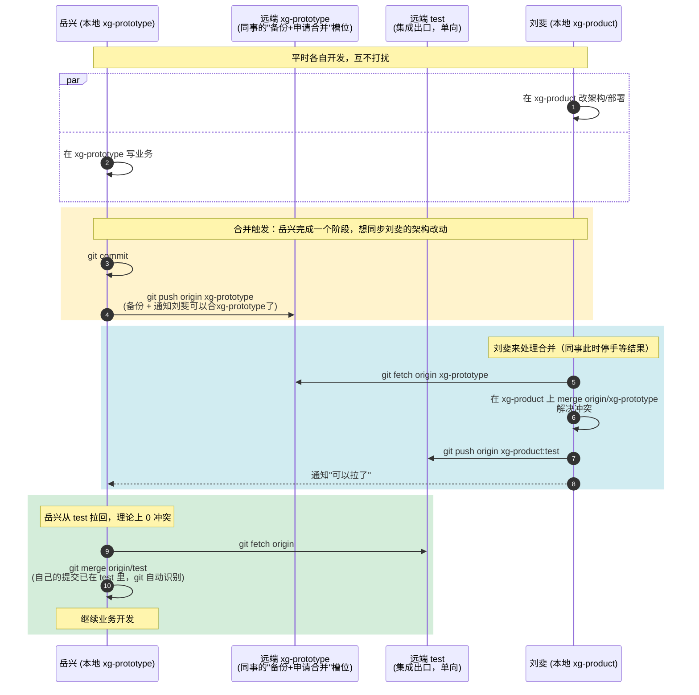

`test` 是协作出口，`xg-prototype` 远端是入口——你只从同事的 `xg-prototype` 远端读，从来不写。

这样有两个好处：

1. 冲突永远在你本地发生——同事侧零冲突解决。
2. 同事 pull `test` 时几乎不会冲突——因为你合并时已经"吸收"了他的提交历史，git 知道这些 commit 双方共有，不会要求他再次解决。

唯一的例外：同事 push 之后、你 push 之前，他又继续修改了你也在改的同一行——这种小概率情况才会让他 pull `test` 时再冒出冲突。所以约定上还是建议他 push 备份后等你合完再继续开发，或者只动业务文件、别动架构/部署相关的东西。

**提醒同事岳兴的两件事**

1. push 完 `xg-prototype` 后，先别继续改你可能也在动的文件（架构、部署、共用配置）。改纯业务代码可以继续。
2. 如果他 `git merge origin/test` 还是冒出冲突（小概率），说明确实是上面那种"重叠修改"撞上了——这时还是按老办法：`merge --abort` → 再 push 一次 `xg-prototype` → 你再合一次。流程是闭环的，多走一遍就行。

