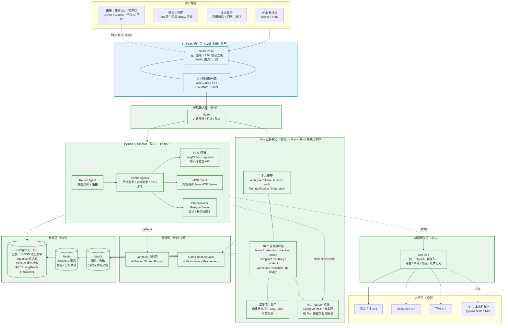
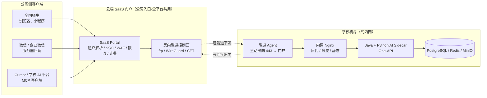
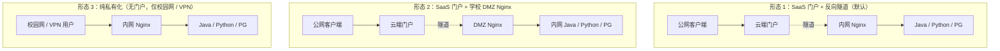
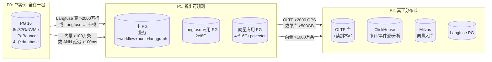

[toc]

# 高校学生工作服务系统 — 后端架构方案 v1


**阶段定义**：p0就是phase0 阶段0，目标就是做出mvp产品，

**架构原则**：模块化单体优先 + AI 原生协议化 + 不过早引入分布式组件；简化架构和后续部署运维成本

**团队的语言/人力构成**：java为主，但是可以学python，核心开发应该就是一个人负责全局；但关键还是要以产品开发为主，如果哪个更适合ai原生就优先考虑。

> (*这直接决定 AI 服务用 Java 跑（Spring AI / LangChain4j）还是 Python 跑（LangChain / LangGraph）*)

**P0 阶段的部署形态和大模型来源**：P0 公有云 SaaS 优先，但要为后续私有化部署预留架构（混合云）；AI 先用公有云 API。

> 这决定 AI 层是否要做模型路由、是否要为本地推理预留架构、是否要 GPU。

**知识问答的 RAG 怎么实现**：不用 Dify，LangChain + pgvector 自建 RAG（文档原方案）。

> *优点：架构更纯，只一个 Python 服务。缺点：需要为“知识库管理”手写一套后台 UI，多 2-3 周工作量，如果部署Dify则代码量大幅减少，但会多出一套 PG schema + Web 管理台运维成本，并且框架受限于dify。*

**Tool 是否 P0 就用 MCP 协议化**：P0 就用 MCP。未来接 Cursor/Claude/Dify/学校自有 AI 平台都是零改动；这也是差异化卖点（对高校说：“你们未来接任何 AI 只要连一下 MCP 就行”）。

> *额外成本：给 Tool 加个 MCP Server 封装层（~3-5 天工作量）。MCP 的价值是“未来任何 AI 客户端都能调你的 Tool”，但 P0 如果只是你自己的 Python Agent 调 Java，REST/JSON 也一样能跑。*


> **与 v2 总体设计文档的关系**：v2 文档定义产品定位、业务模块与功能边界（业务面），本方案专注于后端技术架构与组件选型（技术面），是 设计文档 中第四、五、六、七章的精简、强观点重写。**业务/产品口径以 v2 为准；架构/技术选型以本文为准**。


额外说一句，我觉得：学工-孺子牛，这个名字很贴切。学工-孺子牛，耕耘教育、服务师生的AI学工助手。


## 总体架构

三句话概括：

1. **Java 模块化单体（Spring Boot）做业务核心** + **Python LangGraph sidecar 做 Agent**，两个进程，REST + MCP 通信
2. Java 把业务能力**用 MCP 协议暴露成标准 Tool**，让 Python Agent / Cursor / 学校自有 AI 平台都能调
3. **PostgreSQL 一库多用**（业务 + JSONB + pgvector + tsvector + 审计）；**One-API 做模型网关**；P0 不上 Kafka / gRPC / Dify / ES


**框架总览（分层块图）**：主链路**自上而下**；**L0 SaaS 门户层** 在云端做多租户接入与隧道收敛；**Java、Python AI、业务数据、知识库、对话 checkpoint 全部留在校内**（**AI 知识库 / AI 对话 也属于敏感数据，不出校**）；**云端只承载多租户接入与隧道**。读图顺序建议 **L1→L0→L2（校内）→（Java | Python）双核→数据 / 网关 / 大模型**，对应后文 `SaaS 多租户与部署形态` 的 **默认模式 B**。

> *实线=主数据/主流量路径；虚线=协议面或旁路/可观测/可选；蓝色=云端组件；绿色=学校机房组件。*


**读图补全**（不另画长箭头，避免与主图交叉）：

- **L0 SaaS 门户**：所有客户端先到云端门户（多域 / 子路径区分租户），完成 **SSO、限流、WAF、计费配额**；之后**统一经反向隧道**进学校 Nginx，再分流到 Java 或 Python。学校机房**无需开放公网 IP**，安全/合规面集中在门户上做一次。
- **外部 MCP 客户端**（Cursor / 学校 AI 平台）也先到 L0 门户，再经隧道到 Java MCP Server；图中 `mcpOut → portal` 为虚线，表示协议面（OAuth2/Bearer + SSE）；与「服务链路·链路四」一致。
- **Python AI ↔ Java**：双核**同机房内网直连**调 MCP，毫秒级延迟；**对话、知识库检索、工具执行全过程都在校内**。
- **AI 数据落点**：**业务库 / RAG 向量库（pgvector） / LangGraph checkpoint** 全部在**学校 PG**；附件、知识库原文在**学校 MinIO**；**AI 知识库与对话不出校**。
- **AI → One-API → 大模型**：**One-API 部署在校内**，向公网模型 API 出向调用；**P1+** 可在 One-API 上接学校**本地私有化模型**（Qwen2.5-7B/14B），实现「最敏感场景」**模型也不出校**。
- **Langfuse / Actuator** 均在校内做旁路观测；不参与业务主链。

**服务依赖与数据流（详图，含全部箭头；蓝=云端 / 绿=校内）**：




### 关键技术选型

| 维度 | 选型 | 理由 |
|---|---|---|
| 业务核心语言 | **Java 17 + Spring Boot 3.x** | 团队熟、生态成熟、企业级稳定 |
| 业务 ORM | **MyBatis-Plus**（含多租户插件） | 与 RBAC、租户路由、动态表单 JSONB 配合好 |
| 鉴权 | **Sa-Token**（主） + Spring Security（兜底/SSO 集成） | Sa-Token 比 Spring Security 更轻、对 token 类场景更友好 |
| 工作流 | **自建轻量状态机 + YAML DSL** | 5 类节点完全够用，避免引 Activiti/Camunda 重型组件；DSL 是稳定契约，未来可换实现 |
| 数据库 | **PostgreSQL 15+** 一库多用 | pgvector 向量、JSONB 动态表单、tsvector 全文检索、生成列做索引 |
| 缓存/会话 | **Redis 7** | Session、限流、分布式锁、热点缓存 |
| 对象存储 | **MinIO** | S3 兼容、私有化无门槛 |
| AI 服务语言 | **Python 3.11 + FastAPI** | LangGraph 生态在 Python 领先 6-12 个月 |
| Agent 框架 | **LangGraph 1.0+** | 1.0 GA 已稳定，支持 PostgresSaver checkpoint、interrupt() 人在环节、多 Agent |
| Agent 持久化 | **PostgresSaver**（共用主 PG，独立 schema） | 长流程/会话可恢复，跨实例横扩 |
| RAG | **LangChain + pgvector 自建** | 不引入 Dify，架构纯净；知识库管理后台自己做 |
| 模型网关 | **One-API**（自托管） | 国内模型适配最全（智谱/通义/Moonshot/DeepSeek/豆包），Web 管理面板，OpenAI 兼容 |
| Tool 协议 | **MCP（Model Context Protocol）** | 协议层"AI 原生"；Java 侧用 Spring AI 1.1 的 MCP 模块或 Anthropic 官方 SDK |
| AI 可观测 | **Langfuse 自托管**（依赖现有 PG） | LangChain/LangGraph callback 自动采集，trace/score/token/prompt 版本 |
| 业务可观测 | **Spring Actuator + Micrometer + Prometheus + Grafana** | P0 可只跑 Actuator，Grafana 等 P0.5 |
| 异步 / 延迟队列 | **Spring 线程池 + PG 重试表 + @Scheduled** | P0 不引入 Kafka/RabbitMQ；触发条件：通知量超 1k/s 或需可靠延迟队列时再上 RabbitMQ |
| 服务间通信 | **REST/JSON + MCP（AI→业务）** | 不引入 gRPC；只有两个服务进程，REST 心智成本最低 |
| 多端前端 | **React + AntD（Web）/ Taro（小程序）/ 企微应用消息** | TypeScript types 共享，pnpm workspace P1 再搞 |
| 部署 | **docker-compose 一键拉起** | 8 个容器：nginx / java-app / python-ai / one-api / langfuse / postgres / redis / minio |

**P0 明确不做**：Kafka、RabbitMQ、gRPC、Elasticsearch、Milvus、ClickHouse、Spring Cloud Gateway、Dify、可视化流程设计器（AntV X6）、Formily


### Java 模块化单体

**Java 单体进程是整个架构最关键的部分**，因为所有的业务都在这里，提供ai agent的python AI进程可以挂，挂了就会退到直接使用Java模块提供的功能中；但Java模块不能挂，这个一出问题整个系统就所有都不可用了。

> **核心约束**：包边界 = 未来微服务边界。包之间**不允许直接 import 业务包内部类**，只能通过定义在 `api` 子包里的 SPI 接口调用。

包结构：

```text
qicheng-backend/
├── pom.xml
├── docker-compose.yml
└── src/main/java/com/qicheng/
    ├── QiChengApplication.java
    │
    ├── platform/                       # 平台底座（不依赖任何业务包）
    │   ├── auth/                       # 认证授权 (Sa-Token + RBAC + Closure Table)
    │   │   ├── api/                    # SPI 接口（暴露给业务包）
    │   │   ├── domain/                 # 实体
    │   │   ├── service/                # 内部实现
    │   │   └── web/                    # Controller
    │   ├── tenant/                     # 多租户（TenantContext + MyBatis-Plus 插件）
    │   ├── audit/                      # 操作日志（AOP 自动采集）
    │   ├── file/                       # 文件服务（MinIO）
    │   ├── notification/               # 消息通知中心（统一抽象 + 渠道路由）
    │   │   └── channel/                # in_app / wecom / miniprogram / sms(P1)
    │   ├── integration/                # 统一集成网关（Excel 导入 + REST 适配）
    │   └── common/                     # 公共工具、异常、DTO 基类
    │
    ├── workflow/                       # 工作流引擎（独立内部模块，未来可拆出）
    │   ├── api/                        # DSL 定义、StartFlowCommand、ApproveCommand
    │   ├── engine/                     # StateMachine 核心
    │   ├── executor/                   # 5 类节点 Executor
    │   ├── parser/                     # YAML/JSON DSL 解析
    │   ├── persistence/                # workflow_instance / task_instance JSONB
    │   └── datasource/                 # ref 机制：受控查询接口
    │
    ├── biz/                            # 业务模块包（10 个 P0 模块）
    │   ├── leave/                      # 请销假
    │   │   ├── api/                    # SPI（如其他模块需调用）
    │   │   ├── domain/
    │   │   ├── service/
    │   │   ├── web/
    │   │   └── tool/                   # 该模块的 MCP Tool 定义
    │   ├── collection/                 # 信息收集
    │   ├── checkin/                    # 签到
    │   ├── notice/                     # 通知任务
    │   ├── complaint/                  # 接诉即办
    │   ├── worklog/                    # 辅导员工作日志
    │   ├── student/                    # 学生信息库
    │   ├── workstudy/                  # 勤工助学
    │   ├── violation/                  # 学生违纪
    │   └── qa/                         # 知识问答（仅做 Java 侧的入口/历史/反馈，AI 部分在 Python 侧）
    │
    ├── ai/                             # AI 增强 + MCP Server 暴露层
    │   ├── enhancer/                   # AI 增强层（可降级，AOP 切入业务）
    │   │   ├── LeaveRiskAnalyzer
    │   │   ├── ApproverSuggester
    │   │   └── ...
    │   ├── mcp/                        # MCP Server
    │   │   ├── McpServerConfig.java    # Spring AI MCP 配置
    │   │   ├── ToolRegistry.java       # 扫描 @Tool 注解、注册到 MCP Server
    │   │   ├── ToolContext.java        # 从 ThreadLocal 注入用户/租户上下文
    │   │   └── transport/              # HTTP/SSE Transport
    │   └── eventlog/                   # student_event_log AOP 切面（数据飞轮埋点）
    │
    └── infra/                          # 基础设施配置
        ├── config/                     # 全局配置（Jackson、Async、Cache、Lock）
        ├── mybatis/                    # 多租户插件、生成列处理
        └── observability/              # Actuator、Micrometer、TraceId
```

**强约束**（用 ArchUnit 测试守住）：

- `biz.X` 不能 import `biz.Y` 的内部类，只能 import `biz.Y.api`
- `platform` 不能 import 任何 `biz.*`
- `workflow` 不能 import `biz.*`，业务数据通过 `workflow.datasource` 反向查询
- `ai.mcp` 通过 `biz.X.tool` 注册 Tool，不直接依赖业务 service


###  Python AI Sidecar

Sidecar 就是指和业务主程序（Java）同机或同集群部署的另一个独立进程，专门负责 AI 编排；业务数据、权限、真正改库的动作仍在 Java 里。

内部结构：

```text
qicheng-ai/
├── pyproject.toml                      # uv / poetry
├── Dockerfile
└── app/
    ├── main.py                         # FastAPI 入口
    ├── config.py                       # env 配置
    │
    ├── agents/
    │   ├── router.py                   # 路由 Agent (意图识别 → 派发)
    │   ├── transaction.py              # 事务助手 Agent (调 Tool 办事)
    │   ├── query.py                    # 查询助手 Agent (查待办/进度/统计)
    │   └── qa.py                       # 知识问答 Agent (调 RAG)
    │
    ├── graph/
    │   ├── state.py                    # Pydantic State Schema
    │   ├── checkpointer.py             # PostgresSaver (共用主 PG，独立 schema)
    │   └── graph_builder.py            # LangGraph StateGraph 构建
    │
    ├── tools/
    │   ├── mcp_client.py               # MCP Client 连 Java MCP Server
    │   └── tool_registry.py            # 从 MCP Server 动态拉取 Tool 列表
    │
    ├── rag/
    │   ├── ingest.py                   # 文档解析 + 切分 + Embedding (LangChain)
    │   ├── retriever.py                # pgvector 检索 + 重排
    │   ├── kb_admin_api.py             # 知识库管理 API (CRUD 政策/文档)
    │   └── prompts/                    # 问答 Prompt 模板
    │
    ├── llm/
    │   ├── client.py                   # OpenAI 兼容 Client → 指向 One-API
    │   ├── routing.py                  # 按场景选模型（路由用 7B、复杂分析用 72B）
    │   └── fallback.py                 # 公有云 API 失败时的降级
    │
    ├── observability/
    │   └── langfuse_handler.py         # Langfuse callback handler
    │
    ├── api/
    │   ├── chat.py                     # /chat 入口（流式 SSE）
    │   ├── rag_admin.py                # /kb/* 知识库管理接口
    │   └── health.py                   # 健康检查
    │
    └── tests/
```


### MCP-对接业务和AI agent

> P0 30-40 个 Tool 全部用 MCP 协议暴露。这是系统"AI 原生"在协议层的核心体现。
>
> - Java 业务进程：用 Spring AI 的 MCP Server，把各业务里真实的操作（如请假、查询学生等）暴露成带描述的 Tool。
>
> - Python AI sidecar：用官方 MCP Client，在跑 LangGraph Agent 时 `list_tools()`，把这些 Tool 挂到 Agent 上；模型决定何时调哪个 Tool，由 MCP 发请求到 Java 去执行。

**设计要点**：

1. **Java 侧用 Spring AI 1.1 的 MCP Server 模块**（已 GA），或直接用 Anthropic 官方 Java SDK
2. **Tool 定义贴近业务模块**（每个业务包的 `tool/` 子包定义自己的 Tool），由 `ai.mcp.ToolRegistry` 统一扫描注册
3. **用户/租户上下文不经过 Agent 传参**：Tool 调用时从 MCP 请求 header 里取 JWT token，反解出用户/租户后注入 ThreadLocal，与 Web 请求走同一套上下文
4. **传输用 HTTP + SSE Streamable Transport**（MCP 2026 推荐生产标准）

**Java 侧 Tool 示例**（伪代码示意）：

```java
@Component
@McpTool(name = "start_leave_request",
         description = "为当前学生发起请假申请，支持病假/事假/周末离校等假别")
public class StartLeaveRequestTool {

    @Autowired private LeaveService leaveService;

    @McpInvoke
    public LeaveResult invoke(
        @Param(desc = "假别: sick_on_campus/sick_off_campus/personal/weekend_leave") String type,
        @Param(desc = "开始时间 ISO8601") String startTime,
        @Param(desc = "结束时间 ISO8601") String endTime,
        @Param(desc = "请假原因") String reason
    ) {
        Long studentId = ToolContext.currentUser().getStudentId();
        Long tenantId  = ToolContext.currentTenant().getId();
        return leaveService.create(tenantId, studentId, type, startTime, endTime, reason);
    }
}
```

**Python 侧用官方 mcp SDK 作为 Client**，Agent 启动时拉一次 Tool 列表注册到 LangGraph 的 tools。

```python
from mcp import ClientSession
from langgraph.prebuilt import create_react_agent

async with ClientSession(mcp_url, headers={"Authorization": f"Bearer {jwt}"}) as session:
    tools = await session.list_tools()
    agent = create_react_agent(model, tools=tools, checkpointer=postgres_saver)
    result = await agent.ainvoke({"messages": [user_input]}, config={"configurable": {"thread_id": session_id}})
```


### 数据库存储和PostgreSQL Schema 划分

数据存储是三块：

- PostgreSQL：p0阶段 关系型 + 向量 + 全文检索 数据都存储在 PostgreSQL 上，PostgreSQL 本身支持全文检索和向量存储，所以在数据量不多的阶段就只需要部署一个 PostgreSQL 示例就可以了，然后数据通过PostgreSQL示例中schema来区分。
- Redis：用来做缓存，以及限流也能用到
- MinIO：对象存储，用来存各种文件：*附件 / 头像 / 知识库原始文档*

即PostgreSQL采用一库多 schema来物理隔离避免互相影响：

| Schema | 用途 | 备注 |
|---|---|---|
| `tenant_<id>_biz` | 每个租户的业务数据 | Schema 级多租户隔离（私有化退化为单租户单 schema） |
| `platform` | 平台底座共享数据（user 全局映射、tenant 元数据等） | 跨租户共享 |
| `workflow` | 工作流定义/实例/任务/历史 | 共享，含 tenant_id 列 |
| `audit` | 操作日志、AI 行为埋点 (`student_event_log`) | tsvector 全文检索 |
| `vector` | pgvector 知识库（每租户分表或分 schema） | `CREATE EXTENSION vector` |
| `langgraph` | LangGraph PostgresSaver checkpoint | 由 `checkpointer.setup()` 自建 |
| `langfuse` | Langfuse 自身数据 | 由 Langfuse 镜像初始化 |
| `oneapi` | One-API 自身数据（用户/渠道/日志） | 由 One-API 初始化 |


### 门户层和SaaS 多租户

如果是全saas模式，只能适用于对数据敏感低的高校，而多数高校肯定有本地部署的要求；所以为同时满足 **公网可达 / 多校隔离 / 学校网络异构 / 学生数据合规** 这四件事，在 `Java 业务核心 + Python AI Sidecar` 双核之上，再补一层 L0 SaaS 门户（云端·全平台共用）。门户承担**多租户解析、统一登录、限流计费、公网备案、反向隧道接入学校**；业务数据 + AI 知识库 + AI 对话 / Checkpoint 全部仍在校内——AI 知识库与对话同样属于敏感数据，默认不出校。

> *我之所以额外增加了一个单独的门户层，还有一点架构上的考虑就是，不管全saas还是数据全部本地化，都能做到不更改架构也能适配。*
>
> *不能因为不同学校的要求不同而让我们开发多个不同版本，尽量不要这样干，要让架构灵活适配，而不是让人去手动调整。*


#### 门户层职责

| 职责                    | 做什么                                                       | 解决什么问题                                        |
| ----------------------- | ------------------------------------------------------------ | --------------------------------------------------- |
| **多租户解析**          | 域名 / 子路径 / `X-Tenant` 头 → 学校 ID                      | 一套门户支持 N 所学校，路由到正确的隧道             |
| **统一登录 / SSO 联合** | 对接学校 **CAS / OIDC / 企微**，签发**平台 token**，再换学校 **JWT** | 用户体验统一；校内 `Sa-Token / RBAC` 仍是权限事实源 |
| **公网合规**            | 域名备案、HTTPS、ICP、WAF、等保                              | 学校机房**不必再申请公网与备案**                    |
| **限流 / 计费 / 配额**  | 按校限速、token / 调用量计费                                 | SaaS 商业化基础                                     |
| **反向隧道**            | **WireGuard / frp / Cloudflare Tunnel**，学校**只出向**握手  | 解决「学校无公网 IP / 不开 22/443 入向」难题        |
| **健康监控**            | 探活、版本灰度、故障切换                                     | 跨校问题统一定位                                    |


设计原则：**业务数据、AI 知识库、AI 对话状态 都是学校的敏感资产**，全部沉淀在 **学校 PG / MinIO**；云端**不持久化任何业务/AI 数据**。

| 数据                       | 落点                                      | 说明                                                |
| -------------------------- | ----------------------------------------- | --------------------------------------------------- |
| **业务表 + 多租户 + 审计** | 学校 PostgreSQL                           | 与 Java 强一致                                      |
| **RAG 向量（pgvector）**   | 学校 PostgreSQL                           | 知识库内容（embedding）等价于原文片段，**视为敏感** |
| **LangGraph Checkpoint**   | 学校 PostgreSQL（独立 schema）            | 对话与 Agent 中间状态，含学生上下文                 |
| **附件 / 知识库原文**      | 学校 MinIO                                | 大文件                                              |
| **会话 / 限流 / 锁**       | 学校 Redis                                | 对应 Sa-Token / 业务幂等                            |
| **门户侧**                 | 仅元数据（学校 ID、订阅、配额、隧道凭据） | **不存学生数据 / 不存对话内容 / 不存知识库**        |

有这一层就能实现解耦，如果是全saas其实就是将服务都部署在云上，购买云主机我们自己负责，其实这样更简单，而如果是要求本地部署，则就将架构图中的蓝色的服务都部署在学校，然后在这层中注册一下，并将公网数据转发到学校的nginx，进而就能打通网络。


#### 反向隧道

##### 是什么、为什么要加这一层

「反向隧道」是 SaaS 门户与学校机房之间的关键纽带；图里 `tunnel["反向隧道控制面 · WireGuard / frp / Cloudflare Tunnel"]` 就是它。

**一句话定义**：**学校机房 主动出向** 与云端门户建立一条**长连接通道**，门户把外部请求**沿这条通道塞回**学校 Nginx；学校**完全不需要开放任何入向端口**到公网。

>**反向隧道不是什么**
>
>- **不是 VPN**：VPN 通常是「双方对等可达」的整段网段打通，运维与安全审计都重；反向隧道只暴露**门户主动转发的几个 HTTP 端口**，颗粒度细。
>- **不是 Nginx 反代**：Nginx 反代要求自己**能直接连上后端 IP**；学校机房如果在 NAT 后面、没有公网 IP，Nginx 根本连不进去 —— 反向隧道的方向**反了过来**。
>- **不是单纯的内网穿透玩具**：生产用的实现（**WireGuard / frp / Cloudflare Tunnel / ngrok 企业版** 等）都带 mTLS、ACL、限流、审计，是企业级方案。


为什么必须加这一层（高校场景特点）

| 现实约束 | 没有隧道时的问题 | 反向隧道怎么解决 |
|----------|------------------|------------------|
| 学校多数**没有可用公网 IP**，或申请流程极长 | 公网用户根本访问不到学校机房 | 学校只需**出向**握手，不依赖公网 IP |
| 学校信息办**不允许在防火墙开入向端口** | 即便有公网 IP 也开不了 80/443 | 隧道走**已开放的出向 443**，不破防火墙策略 |
| 等保 / 合规要求 **业务系统不直接暴露公网** | DMZ + 双 Nginx 配置复杂、责任边界不清 | 公网面只剩 **门户**；学校机房始终在内网 |
| 多校异构网络（有的有 IP、有的纯内网、有的仅 VPN） | 每校都要单独设计接入方案，运维爆炸 | 所有学校用**同一个出向隧道协议**接入门户，**接入方式统一** |
| 安全事件时需要**立刻断开某一校**接入 | 改 DNS / 改防火墙都不及时 | 在门户上**踢掉该校的隧道凭据**即可，秒级生效 |


##### 请求流转示例

简而言之就是把请求链路从 `公网 → Nginx` 替换为 `公网 → SaaS 门户 →（隧道）→ 学校 Nginx`，**校内段不变**

```text
学生小程序 (公网)
    │  https://qicheng.example.com/api/leave
    ▼
[ 云端 SaaS 门户 ]   ← 解析出"这个请求属于 学校A"
    │  通过预先建立的隧道，发到 学校A 的 tunnel agent
    ▼
[ 学校A 机房 · tunnel agent ]
    │  本地 HTTP 转发
    ▼
[ 学校A · 内网 Nginx ]
    │  /api/* → java-app:8080
    ▼
[ Java 业务核心 ]  ← 业务、数据库、审计都在校内完成
```

学校机房**没有任何端口对公网**，但全国师生都能访问。


##### 选型对比和运维

| 方案 | 形态 | 适合场景 | 备注 |
|------|------|----------|------|
| **WireGuard** | L3 内核态 VPN，可做"只放某些端口"的 ACL | 完全自建、对吞吐敏感 | 需要在云端门户 + 学校 agent 都装内核模块；最稳但要会运维 |
| **frp（自建）** | 应用层 TCP/HTTP 反向代理 | 中小规模、快速落地 | 配置最简单；门户侧跑 `frps`，学校跑 `frpc` |
| **Cloudflare Tunnel** | SaaS 化的反向隧道 | 想省运维、能接受境外节点 | 学校只装 `cloudflared`；境内合规需评估 |
| **ngrok / 自研** | 同 frp 思路 | 临时演示、单校试点 | 不建议生产 |

> **我们方案的默认选择**：**P0 用 frp**（一晚上能跑通、调试友好）；**P1 视客户量切到 WireGuard**（性能更好、可做更细 ACL）；**Cloudflare Tunnel** 作为"学校信息办点名要"的备选。


**隧道层的运维要点**

- **凭据一校一份**：隧道 agent 的 token 与门户上学校 ID 绑定，**轮换 / 吊销**走门户控制台。
- **健康探活**：门户每 N 秒探一次每条隧道；断开自动 **降级页**（"该校接入异常，正在恢复"），并报警到群。
- **多隧道冗余**：单校可起 2 个 agent（学校机房同/异机），门户做 **轮询 / 主备**，避免单点。
- **流量审计**：门户对 **每条隧道** 的入向流量、目标路径、QPS 全量打日志，便于事后追溯。
- **校内备用入口**：即使隧道断了，**校园网内** 仍可走校内 Nginx 的**校内域名** 直接访问 Java；**前端在公网链路失败时引导到这条备用域名**，实现"门户挂了校内不挂"。


> #### 本地部署的关键工程
>
> - **反向隧道**：见上节。门户即便被攻陷也**没有任何学校数据**，**最多影响接入**。
> - **同机房双核直连**：Python AI ↔ Java 全程在校内 LAN，**MCP 调用毫秒级**，无跨广域代价；可保留「服务链路·链路五」的单跳直连写法。
> - **大模型出向**：**One-API 部署在校内**，向公网模型 API（通义/DeepSeek/豆包）出向；**P1+** 可在 One-API 上接学校**本地私有化模型**（vLLM/Ollama 跑 Qwen2.5-7B/14B），让最敏感场景**模型也不出校**。
> - **失联降级**：门户与学校隧道断开 → 学校机房**仍可校园网内自访问** Web/小程序（备用域名走校内 Nginx）；前端按既定方式**降级到传统表单**。
> - **运营红利**：门户层把 **多租户域名、SSO 联合、备案、计费** 一次做完；**Prompt / 模型版本** 仍按校自治升级，避免"一改全校受影响"的风险面（如需统一版本，再增设 Prompt 中心化推送）。


### 部署方式

部署采用 docker，**`docker-compose` 一键拉起所有容器**。引入 L0 SaaS 门户后，部署被天然拆成 **学校侧** 与 **云端门户侧** 两套 compose（**之间靠反向隧道相连**），可独立升级，不互相阻塞。

#### 学校侧

本地部署则每所学校一套，saas就将这些也部署在我们自己的云主机上

| 容器 | 镜像 | 端口 | 资源 | 说明 |
|---|---|---|---|---|
| `nginx` | `nginx:alpine` | 80/443 | 256MB | 校内反代；不再持公网证书 |
| `java-app` | 自建（jdk17-jre） | 8080 | 2-4GB | Java 业务核心 |
| `python-ai` | 自建（python3.11-slim） | 8001 | 1-2GB | Python AI Sidecar |
| `one-api` | `justsong/one-api` | 3000 | 256MB | 模型网关 |
| `langfuse` | `langfuse/langfuse:2` | 3001 | 512MB | AI 可观测 |
| `postgres` | `pgvector/pgvector:pg16` | 5432 | 2-4GB | 业务库 + 向量 + checkpoint |
| `redis` | `redis:7-alpine` | 6379 | 256MB | 会话 / 缓存 / 锁 |
| `minio` | `minio/minio` | 9000/9001 | 512MB | 附件 / 知识库原文 |
| `tunnel-agent` | `fatedier/frpc` 或 `cloudflare/cloudflared` | – | 64-128MB | **新增**：与门户握手的反向隧道客户端，**纯出向** |

**P0 基础版**：1 台 8 核 16G 服务器即可全部跑下，AI 走公有云 API。

> **`tunnel-agent` 提示**：单实例占用极低（CPU 几乎为零，内存 <128MB），但它是**学校到外部世界的唯一通道**，建议同机房起 **2 个副本**做主备，凭据由门户控制台下发与轮换。


#### 云端门户侧

多校共用，全平台一套

门户是 **SaaS 全局单点**，给所有签约学校共用，因此和学校机房分开部署，资源按 **同时在线学校数** 估算。

| 容器 | 镜像 | 端口 | 资源 | 说明 |
|---|---|---|---|---|
| `portal-nginx` | `nginx:alpine` | 80/443 | 256MB | 门户公网入口 + WAF + 证书 |
| `portal-app` | 自建（jdk17-jre 或 nodejs20） | 8080 | 1-2GB | 门户业务：租户解析 / SSO / 限流 / 计费 |
| `tunnel-server` | `fatedier/frps` 或自建 WireGuard | 7000 / UDP 51820 | 256-512MB | 反向隧道服务端，承接所有学校 agent |
| `portal-pg` | `postgres:16` | 5432 | 1-2GB | 门户元数据：租户 / 订阅 / 配额 / 审计 |
| `portal-redis` | `redis:7-alpine` | 6379 | 256MB | 门户限流 / 短期会话 / OAuth 状态 |

**P0 门户**：1 台 4 核 8G 云主机即可承接 ~10 所试点学校（隧道吞吐与连接数双向均有富余）。**P1+ 多校规模化** 后按"租户解析 + 隧道吞吐"两条线分别水平扩展（参考 `服务扩容` 一节）。

> **门户不持久化任何业务/AI 数据**：`portal-pg` 只放租户元数据 / 订阅配额 / 接入审计；学生数据、对话内容、知识库原文都在学校 PG，与门户**物理隔离**。


#### 测试简化运行基础框架的资源估计

我购买了一个 **4c8g 80g 磁盘** 的七牛云主机作为测试环境，以便开发完成之后能直接公网访问验证基础框架。

按 9 个容器最低档位加总（学校侧 8 个 + 1 个隧道 agent；门户暂时跳过见下文）：

| 容器          | 文档标注 | 压缩到最低 |
| :------------ | :------- | :--------- |
| nginx         | 256MB    | 128MB      |
| java-app      | 2-4GB    | 2GB        |
| python-ai     | 1-2GB    | 1GB        |
| one-api       | 256MB    | 256MB      |
| langfuse      | 512MB    | 512MB      |
| postgres      | 2-4GB    | 2GB        |
| redis         | 256MB    | 128MB      |
| minio         | 512MB    | 256MB      |
| tunnel-agent  | 128MB    | 64MB       |
| **合计**      |          | **~6.4GB** |

| 可选砍掉       | 影响                                                     | 省多少   |
| :------------- | :------------------------------------------------------- | :------- |
| langfuse       | 暂时没有 AI 可观测看板，不影响主流程                     | 省 512MB |
| one-api        | 测试阶段 Python 直连公有云 API 即可，不经网关            | 省 256MB |
| tunnel-agent   | 测试阶段直接用云主机的公网 IP + Nginx，不经隧道          | 省 64MB  |
| portal（门户） | **测试阶段不部署门户**，所有客户端直连云主机 Nginx       | -        |

> **测试阶段策略**：把 4c8g 测试主机当作"**学校机房 + 公网 IP**"，不起门户与隧道，先把 **Java + Python AI + 数据栈** 跑通；门户与 `tunnel-agent` 在 M2 末期单独起一台 2c4g 小云主机做联调即可。


### 服务扩容

这个架构设计中，Java Core与 Python AI Sidecar 两个进程在设计上均支持**水平扩展**，即当访问流量上来后，可通过**增加实例(docker 容器)**来增加吞吐量。核心原因就是进程本身无业务态的**“单点内存状态”**，会话、缓存、Agent 图状态、对象存储等均外置到共享中间件。


####  Java Core 横向扩展

- **会话与 token**：按本方案走 **Redis**（如 Sa-Token 与 Redis 配合），请求可落到任意实例，不依赖 JVM 内 `HttpSession`。
- **缓存 / 限流 / 锁**：用 **Redis**，避免各实例本地 Map 导致分裂脑。
- **业务与多租户一致性**：以 **PostgreSQL** 为事实源，多实例并发写由库与事务保证。
- **附件**：**MinIO**（S3 兼容）集中存储，避免“文件落在某台机器磁盘”无法被其他实例读取。
- **异步与重试**：若采用 PG 重试表 + `@Scheduled`，需保证**多实例下任务不重复执行**（**ShedLock** 或单独 **Job 实例**），否则横扩后会出现重复消费。

**额外注意**：若使用 WebSocket/SSE 长连接，要么 **Nginx 粘性会话（sticky）**，要么用 **Redis Pub/Sub** 等做跨实例推送；**本地二级缓存**（如 Caffeine）需接受最终一致或限制使用场景。


####  Python AI 横向扩展

- **Agent/对话状态外置**：LangGraph **Checkpointer + PostgresSaver** 在步骤间持久化 **StateGraph 状态**，下一次请求携带 `thread_id`，**任意 Python 副本**均可从 PG 续跑，满足**多副本 + 会话不绑死单机**。
- **长流程与人机协同**：状态在 PG，便于 `interrupt` 人在环节后**跨时间、跨实例**恢复（与后续「AI 辅助审批」等场景一致）。
- **工具与知识**：MCP Tool 列表从 Java 侧拉取；**RAG/pgvector** 在 **PG** 上共享；**One-API** 为无状态模型出口；各副本行为一致。

**额外注意**：**SSE 流式**若从首包到结束希望同一连接，可配合 **同 thread 的粘性路由**；断连后因已有 checkpoint，新副本仍可续。**PG 连接数**随实例数线性上升，生产建议前置 **PgBouncer**；checkpoint 写入多时可单独关注该 schema 的**清理与监控**。


#### 瓶颈

系统瓶颈，往往不在应用进程本身，而在外置依赖上，最大的应该就是数据库 PostgreSQL 的吞吐量；但我理解单个学习的量应该走不到要去扩容数据库的地步。只是在如果统一用saas方案按租户隔离，那就会遇到，但那也大概率是购买的云服务厂商的数据库，这个可以在线花钱升级容量。

外置依赖的瓶颈：

| 位置 | 典型现象 | 演进方向（与本方案一致） |
|------|----------|---------------------------|
| **PostgreSQL** | 业务 + JSONB + pgvector + LangGraph checkpoint 同库，连接/写入成为瓶颈 | **PgBouncer**；只读副本分流；checkpoint 与业务表**监控/分区/归档**；必要时分库或分实例 |
| **Redis** | 会话与热点键集中 | **Redis Cluster**；会话与缓存**逻辑或实例隔离** |
| **One-API** | 单实例或限流成瓶颈 | 网关自身**多实例** + 上游模型**配额**规划 |
| **MinIO** | 带宽与存储 | 分布式 MinIO 或对象存储**横向扩展** |
| **MCP / SSE 入口** | 长连接占满连接与超时 | 独立子域、**Nginx 超时与缓冲**已在本方案中强调；负荷高时可**独立部署 MCP 或 JVM 调优**（如更偏 reactive） |


### 架构迭代

现在的架构是快速做出mvp产品，即使后面功能增多和业务越来越复杂在整体结构上也并不需要修改，但是使用的中间件可能需要升级。那什么时候打破当前架构：

| 触发信号 | 演进动作 | 阶段 |
|---|---|---|
| 通知量 > 1k/s 或需可靠延迟队列 | 引入 RabbitMQ；通知中心切换为发到 MQ | P1 |
| 需要接学校教务/CAS 数据流（事件驱动） | 引入 Kafka 做数据接入；新增 `data-ingest` 服务 | P1 后期 |
| 工作流引擎独立演进、流程量大 | 把 `workflow` 包提取成独立 Java 服务，DSL 不变 | P1-P2 |
| 知识库 > 100 万向量 | pgvector 切换到 Milvus / Qdrant | P2 |
| 日志/审计量超 PG 处理能力 | 引入 ES / OpenSearch | P2 |
| 多租户量级超 50 校 | 评估 schema 隔离 → DB 隔离 / 分库 | P2 |
| 学校私有化模型 | One-API 接 vLLM/Ollama 部署的 Qwen2.5-14B/72B | P1 |
| 需要可视化流程设计器 | 引入 AntV X6 + Formily | P1 |


### 差异化卖点

产品是AI 原生的，具体在架构层的体现为竞品（辅导猫等）大多是"传统系统 + 套壳问答"，本方案差异化具体落在：

1. **Tool MCP 协议化** → 学校未来接任何 AI 客户端（自有平台 / Cursor / Claude Desktop / 钉钉智能助手）零改动接入
2. **双路径设计** → 同一业务能力既有传统表单、又有 Agent 入口，数据完全一致
3. **AI 增强层可降级** → AI 不可用时业务完整运行，前端有明确降级提示
4. **数据飞轮埋点 P0 就埋** → `student_event_log` + `ai_draft` + `decision_duration_ms`，为 P0.5 的"学生异常关注预警"和 P1 的"审批智能建议"积累数据
5. **LangGraph 长流程 Checkpoint** → 复杂 Agent 流程可中断/恢复/人在环节，支撑后续"AI 辅助审批""AI 起草通知"等场景


附：与 v2 总体设计文档的对比说明

| 关键差异 | v2 文档原方案 | 本方案 v1 | 说明 |
|---|---|---|---|
| Tool 协议 | 私有 Java 接口 + REST | **MCP 协议化** | 协议层 AI 原生，未来零成本接任何 AI 客户端 |
| 模型调用 | 直接调 LLM API | **One-API 模型网关** | 路由/降级/限流/成本追踪，运维基础能力 |
| Python AI 与 Java 通信 | REST API | **MCP HTTP/SSE** | 标准化、未来可替换 |
| 知识问答 RAG 实现 | pgvector 自建 | pgvector 自建（一致） | 选择了纯净路线，不引 Dify |
| 包边界守护 | 文字约定 | **ArchUnit 测试守护** | 真正保住未来可拆性 |
| LangGraph Checkpointer | 未提 | **PostgresSaver 共用主 PG** | 长流程可恢复 |
| 鉴权 | Spring Security + Sa-Token | **Sa-Token 主 + Spring Security 兜底** | 减少混用 |
| 数据库 | PostgreSQL | **pgvector/pgvector:pg16 镜像** | 一个镜像同时具备业务库 + 向量库 |
| 部署组件数 | 5 个（含 Langfuse） | 8 个（增加 One-API、nginx、Langfuse 持久化） | 多了模型网关与反代 |


## 核心模块


### Java Core

所有的业务都在 `Java Core` 这个模块中，如果后续模块太大，也可以拆分出来；即使后续拆分也不影响整个架构，只是将服务地址需要调整。


### Python AI

#### 调用流程

- 用户从 Nginx 到 Python FastAPI（如 `/chat` 流式）。
- Router 判意图 → 交给某个 Scene Agent（办事 / 查询 / 问答等）。
- 办事类 Agent 通过 MCP Client 调 Java 的 MCP Server，执行请假、查单等；上下文用 Header 里的 JWT 在 Java 侧解析，避免把敏感身份塞进模型胡传。
- 知识类走 RAG（pgvector），不走业务写库。
- 长对话、可恢复流程用 Checkpointer 把 Graph 状态 落 PG；模型调用经 One-API 统一出口，Langfuse 旁路做 trace。


#### 核心组件

**Router Agent（路由 Agent）**

根据当前用户一句话/多轮对话，做 意图识别 和 派发：该走「办事（调 MCP Tool）」、还是「只查数」、还是「知识库问答」、或者拆成子任务等。避免所有事都堆在一个大提示词里，既难调又难算成本；也避免「错场景」（例如用问答模型去下订单）。

和 `llm/routing.py` 的关系：路由往往用小一点、快一点的模型；复杂分析再走大模型，这是按场景分模型/成本的常见做法（文档里也有「路由用 7B、复杂用 72B」这类设计）。


**Scene Agents（场景 Agent）**

一类场景一个子图/策略，比「一个巨 Agent」好维护，并且场景隔离（提示词、工具集、安全策略可不同）+ 可控：办事必须走 Java 已暴露的 Tool，而不是模型「假装」有权限改库。

能力划分：

- transaction（事务助手）：例如发起请假、提交收集表等，重度依赖 MCP Tool，动的是业务接口。
- query（查询助手）：查待办、进度、统计，多数也是 MCP 读类 Tool。
- qa（知识问答）：走 RAG，从政策/制度库检索再生成，不替代业务写库。


**RAG 模块（`rag/`：ingest、retriever、kb_admin 等）**

文档入库、切分、Embedding、pgvector 检索（可加 rerank）、给 qa Agent 提供「带出处的上下文」；知识库管理 API 给运营 CRUD 文档、配置。以处理，大模型不知道本校最新红头文件/细则时，检索增强能显著减少瞎编；选择 不自建 Dify、自建 RAG，是为了 架构更干净、和 PG 统一。


**MCP Client + Tool Registry**

启动或会话开始时 `list_tools()` 从 Java 拉工具元数据，注册到 LangGraph；Agent 在推理中 选择 Tool 调用 → 由 MCP HTTP/SSE 发到你 Java 的 MCP Server。

- 业务动作 仍是 Java 里已审计、有租户、有权限的代码；
- 协议统一，以后换 Agent 实现、接外部 AI 客户端，Tool 面不变（这也是你们强推 MCP 的原因）。


**Checkpointer + PostgresSaver**

在 LangGraph 里，Checkpointer 是「把 Graph 的 state 在每一步之后持久化」的机制，通过用主库 PostgreSQL 里独立 schema 存 checkpoint。

- 解决什么问题：
  - 长对话/长流程 不丢现场（多轮、复杂分支）；
  - 可恢复、可多副本：Python 多实例时，不绑死单机内存；
  - 为 人在环节（`interrupt`）、审批流里插一脚 等打基础（文档里提到 LangGraph 这些能力和后续「AI 辅助审批」等场景）。


### MCP


### 数据库和存储


### 网络和服务链路

网络和服务链路必须单独提出来，因为产品本身我们能比较好控制，但是实际环境中网络可能会是个不小的挑战，同时必须清楚服务链路是怎么样的、请求和数据的流转细节才能在遇到问题时能解决。

本节一句话结论：**一套 Nginx 够用，但必须用多 server block 做分治；部署拓扑按学校安全等级分档选择；四类客户端的连通性差异要单独对待；所有典型请求的服务链路要画清楚，出问题时才有抓手。**


#### 网络部署

加上 **L0 SaaS 门户 + 反向隧道** 之后，**网络拓扑被极大简化**：学校机房从「需要 DMZ + 双 Nginx + 公网域名 + 备案」的传统形态，回到「**纯内网部署、唯一一条出向到门户**」。原方案里 A/B/C/D 那一套主要是为了在不同学校网络条件下拼出公网入口，**现在统一被门户兜底**，只在学校强烈拒绝 SaaS 接入时才作为兜底备选（见后文「无 SaaS 门户时的传统部署形态」）。



要点：

- **公网入口收敛到门户**：所有公网客户端只看见 `*.qicheng.example.com`，**学校机房无公网域名/IP**。
- **学校只出向**：`agent` 长连接握手到门户，从此门户能"反向"把请求塞回；**学校防火墙不开任何入向端口**。
- **校内仍是 Nginx**：进了学校机房之后，由**内网 Nginx** 做反代、限流、SSE 调参；和原方案 A 的 Nginx 配置几乎一样，**只是不再绑公网域名**。
- **数据/事务始终在学校**：进入校内后，所有 DB / Redis / MinIO 访问全是局域网，**毫秒级**且**不出校**。


##### 四类客户端的流量差异（更新到门户视角）

接入第一站是 **SaaS 门户**，但四类客户端在协议、长连接、鉴权上的差异并没有消失，只是**这些差异在门户与校内 Nginx 上各分担一部分**：

| 客户端 | 协议 | 在门户层处理 | 在校内 Nginx 处理 | 备注 |
|---|---|---|---|---|
| Web 管理端 | HTTPS（短连+少量 WS） | 路由 / SSO / WAF | WS Upgrade、`/admin` 限制来源 | **可选**：管理端走"只走校园网"的备用域名（不进门户），见下文 |
| 微信小程序 | HTTPS 短连 | 域名备案 / 限流 / 租户解析 | 业务接口反代 | **小程序合法域名指向门户域名**；学校机房不必再为它备案 |
| 企业微信 | HTTPS 回调 + 主动调用 | 企微 IP 白名单、签名校验前置 | 把回调透传到 Java | **门户**承担"必须 5s 内回 200"的就近响应；耗时业务走校内 |
| MCP 客户端 | HTTP/SSE 或 Streamable HTTP | OAuth2 / Bearer 校验、SSE 调优 | SSE 透传到 Java MCP Server | **长连接全程 = 公网→门户→隧道→校内 Nginx→Java**；超时/缓冲两端都要调 |

**关键差异处理**：

- **SSE / WebSocket** 需要关 `proxy_buffering`、拉长 `proxy_read_timeout` —— **门户层 + 校内 Nginx 都要配**，缺一个就会断流。
- **微信 / 企微域名备案** —— 由 **门户** 一次性完成，**学校无需再走备案流程**，这是门户最直接的省事点。
- **Web 管理端**通常仍建议**收紧到校园网 / VPN**，做法变成：**给 Web 管理端额外提供一个"只走校园网"的内网域名**（绕过门户、直连校内 Nginx），公网门户上只保留小程序 / 企微 / MCP 三个入口。


##### 校内 Nginx 配置示例（隧道接入版）

学校机房的 Nginx 仍然是"按子域分治"，但**这些 server block 现在不绑公网域名**，而是绑「**门户在隧道侧约定的 upstream 名 / Host 头**」与「**校园网内的备用域名**」。

```nginx
# 0) upstream
upstream java_core   { server java-app:8080; }
upstream python_ai   { server python-ai:8001; }

# 1) 经门户隧道进入：所有公网入口共用
server {
    listen 80;            # 隧道 agent 把请求转到这里
    server_name _;        # 由 Host 头 / X-Tenant-Id 区分

    # 普通 API
    location /api/        { proxy_pass http://java_core; }
    location /wecom/      { proxy_pass http://java_core; }

    # AI 对话 / SSE
    location /ai/ {
        proxy_pass http://python_ai;
        proxy_http_version 1.1;
        proxy_set_header Connection "";
        proxy_buffering off;
        proxy_read_timeout 3600s;
    }

    # MCP / SSE
    location /mcp/ {
        proxy_pass http://java_core;
        proxy_http_version 1.1;
        proxy_set_header Connection "";
        proxy_buffering off;
        proxy_read_timeout 3600s;
        chunked_transfer_encoding on;
    }
}

# 2) 校园网内专用：Web 管理端备用入口（不经门户）
server {
    listen 443 ssl;
    server_name admin.qicheng.intra.xxxedu.cn;     # 仅校园网可解析
    allow 10.0.0.0/8; deny all;
    location /api/ { proxy_pass http://java_core; }
    location /     { root /var/www/admin; }
}
```

好处：

- **公网那一套 server_name / 备案域名 / SSL 全部转移给门户**，校内 Nginx 不再持有任何公网证书。
- 校园网用户仍能通过 `admin.qicheng.intra.xxxedu.cn` 直接访问，**门户挂了也能用** —— 这就是失联降级的依托。
- 后续要把 **MCP / AI** 的长连接独立扩容，只需在 Nginx 层把 `location /mcp/`、`location /ai/` 拆到独立 server block 或独立后端实例。


##### 三种部署形态（重排）

把"加不加门户、学校在不在公网"两个维度交叉，形态从原来的 A/B/C/D 简化为三种：

| 形态 | 学校机房网络 | 公网入口 | 适用 | 关键说明 |
|------|--------------|----------|------|----------|
| **形态 1：SaaS 门户 + 反向隧道（默认）** | **纯内网，无公网 IP / 不开入向端口** | 云端 SaaS 门户 | **绝大多数高校** | 学校机房零公网暴露；多校用同一门户；备案 / WAF / 限流在门户 |
| **形态 2：SaaS 门户 + 学校自有 DMZ Nginx** | 已有 DMZ + 公网 IP | 云端门户 → 隧道 → DMZ Nginx → 内网 | 学校已有公网入口，且不愿放弃自家 WAF | 隧道终点是 **学校 DMZ Nginx** 而非内网 Nginx；策略多一层冗余 |
| **形态 3：纯私有化（无 SaaS 门户）** | 内网 + VPN / 校园网 | **无公网入口**，只校园网/VPN 可达 | 涉密学院 / 拒绝任何 SaaS 接入 | 退化到原方案 D；裁掉小程序 / 企微的公网回调 |

> **默认推荐：形态 1**。**形态 2** 给已有完善 DMZ 的高校留缓冲；**形态 3** 仅给"任何形式的 SaaS 接入都不接受"的极少数客户。




##### 分客户端连通性要点（更新版）

- **Web 管理端**
  - 默认走门户：和小程序 / 企微同一个公网域名，由门户做 SSO 与限流。
  - 同时给一条**校内备用域名**（`admin.qicheng.intra.xxxedu.cn`），仅校园网解析；门户故障时仍可用。
  - WebSocket：门户与校内 Nginx **两端都要开 Upgrade / Connection 头**。

- **微信小程序**
  - 合法域名 = **门户域名**；门户负责备案 / HTTPS。学校无需再为小程序做任何域名工作。
  - 小程序 `wx.request` 仍受 60s 超时；长任务走 `/api/...` 异步 + 轮询或 SSE。

- **企业微信**
  - 回调 URL = **门户域名**；门户加入企微 IP 白名单。
  - 5 秒内必返 200 这件事由 **门户先回 200**、再异步把事件推到学校 Java 是常见做法（视实现选）。
  - 主动调用企微 API（发消息）仍是**校内 → 公网**出向，由学校防火墙放行 `qyapi.weixin.qq.com`。

- **MCP 客户端**（Cursor / 学校 AI 平台）
  - 来源 IP 不可预测 —— 由门户做 OAuth2 / Bearer 鉴权。
  - **SSE 全程长连接**：`公网 客户端 → 门户 → 隧道 → 校内 Nginx → Java MCP Server`，**任何一段** `proxy_buffering` 没关或超时太短都会断流；门户层与校内 Nginx 都要配。
  - 学校防火墙若对"长连接"敏感，可让 MCP 客户端走 **Streamable HTTP** 而不是纯 SSE。


##### 无 SaaS 门户时的传统部署形态（兜底，不推荐）

仅在 **形态 3（纯私有化）** 或学校明确不接受 SaaS 时使用。等价于原方案 A/B/C/D，列出供参考：

| 旧方案 | 描述 | 何时考虑 |
|--------|------|----------|
| **A · DMZ 单反代** | 学校自建 DMZ Nginx，公网入向 | 学校有公网 IP，又拒绝接 SaaS 门户 |
| **B · 内外双 Nginx** | 公网入口与内网管理端物理隔离 | 同 A，且要求 Web 管理端绝不走公网 |
| **C · 反向隧道（自建中继）** | 学校 frp 接到自己买的中继机 | 等同自建一个简化版"门户"；不如直接用产品门户 |
| **D · 全私有化** | 仅校园网 / VPN，关闭所有公网入口 | 涉密 / 实验环境 |

> 这些形态本质上都是「自建一套门户的子集」。**有了 L0 SaaS 门户，A/B/C 都被吸收了**，只有 **D（纯校园网）** 仍有独立价值。


#### 服务链路

网络拓扑讲清楚了，还需要把 一次请求在系统里怎么流转 画清楚，否则排障时无从下手。以下是五条最典型的链路。

- 链路一：Web 端发起请假审批

  ```mermaid
  sequenceDiagram
      participant U as 学生浏览器
      participant N as Nginx (DMZ)
      participant J as Java Core
      participant WF as 工作流引擎
      participant PG as PostgreSQL
      participant R as Redis
      participant NO as 通知中心
      participant WE as 企业微信 API
  
      U->>N: POST /api/leave (JWT)
      N->>J: 反代 + X-Real-IP
      J->>R: 校验 Session / 限流
      J->>PG: INSERT leave_apply (事务)
      J->>WF: 触发 leave 流程
      WF->>PG: INSERT workflow_instance / task
      WF->>NO: 通知辅导员审批
      NO->>WE: 调用 qyapi.weixin.qq.com 发消息
      NO->>PG: INSERT notification_record
      J-->>U: 200 {applyId}
  ```

  关键点：

  - Nginx 必须透传 `X-Real-IP / X-Forwarded-For`，否则审计日志里全是 Nginx 内网 IP
  - `WF → NO → WE` 这条链路里，**出向到企微** 的流量要经过内网防火墙出口，P0 建议同步调用 + 失败重试 3 次，P1 再上 RabbitMQ 异步

```mermaid

```


- 链路二：小程序签到

  ```mermaid
  sequenceDiagram
      participant MP as 小程序
      participant N as Nginx
      participant J as Java Core
      participant PG as PostgreSQL
      participant R as Redis
  
      MP->>N: POST /api/checkin (wx.code)
      N->>J: 反代
      J->>R: 幂等锁 (taskId+openId, TTL 10s)
      J->>PG: INSERT checkin_record + 地理围栏校验
      J->>R: 释放锁
      J-->>MP: 200 {status:"success"}
  ```

  关键点：

  - 小程序高并发签到场景，**幂等锁必须走 Redis**，不能依赖数据库唯一索引（会拖慢）
  - `wx.code` 换 `openId` 的过程发生在首次登录，签到时用的是已换好的 JWT


- 链路三：企业微信回调

  ```mermaid
  sequenceDiagram
      participant WE as 企微服务器
      participant N as Nginx
      participant J as Java Core
      participant PG as PostgreSQL
  
      WE->>N: POST /wecom/callback (签名)
      N->>J: 反代
      J->>J: 校验签名 + 解密
      J->>PG: UPSERT wecom_event_log
      J-->>WE: 200 OK (必须 5s 内)
      Note over J: 耗时操作走异步<br/>（P0 用 @Async，P1 上 MQ）
  ```

  关键点：

  - 企微回调 **5 秒必须返回**，否则会重试；耗时逻辑绝对不能在回调里同步做
  - 防火墙必须允许企微公布的 IP 段 入向到 Nginx

  

- 链路四：MCP 客户端直连 Java（跳过 Python）

  ```mermaid
  sequenceDiagram
      participant C as Cursor / AI 平台
      participant N as Nginx (mcp 子域)
      participant J as Java MCP Server
      participant PG as PostgreSQL
  
      C->>N: GET /sse (Authorization: Bearer)
      N->>J: 建立 SSE 长连接 (proxy_buffering off)
      C->>N: POST /message {tool:"leave.create"}
      N->>J: 反代
      J->>J: OAuth2 校验 + 权限检查
      J->>PG: 执行业务 Tool
      J-->>N: SSE event (result)
      N-->>C: 流式返回
  ```

  关键点：

  - MCP 子域单独一个 server block，**`proxy_buffering off` + `proxy_read_timeout 3600s`** 一定要有
  - Tool 调用要做 **权限上下文切换**：MCP 客户端本身是 AI，但执行时必须用"调用人"的权限，不能越权

  

- 链路五：AI 对话（Python Agent → Java MCP → LLM）

  ```mermaid
  sequenceDiagram
      participant U as 用户（小程序/Web）
      participant N as Nginx
      participant P as Python AI Sidecar
      participant J as Java MCP Server
      participant ONE as One-API
      participant LLM as 通义/DeepSeek
      participant PG as PostgreSQL
      participant LF as Langfuse
  
      U->>N: POST /ai/chat
      N->>P: 反代
      P->>PG: LangGraph Checkpoint 读取会话
      P->>ONE: 意图识别 LLM 调用
      ONE->>LLM: 转发
      LLM-->>ONE: 结果
      ONE-->>P: 结果
      P->>J: MCP Tool 调用（如查请假单）
      J->>PG: 查询
      J-->>P: Tool 结果
      P->>ONE: 生成最终回答
      ONE-->>P: 结果
      P->>LF: Trace 埋点
      P->>PG: 更新 Checkpoint
      P-->>U: 流式返回
  ```

  关键点：

  - `P → J` 走 **内网直连**（不经过 Nginx），否则白白增加一跳
  - `P → ONE → LLM` 是 **出向公网** 流量，防火墙要放行到大模型服务商域名
  - Langfuse 埋点必须异步，失败不能影响主链路


> #### 网络部署落地建议
>
> 按 P0 → P1 推进，不要一次到位。
>
> **P0（先跑通）**
>
> 1. 申请 1 个公网域名（或用学校子域）+ 1 个公网 IP（DMZ）
> 2. DMZ 部署 Nginx，采用 **方案 A：单 Nginx 多 server block** 区分四类入口
> 3. 内网防火墙只放 Nginx → Java / Python 两条规则
> 4. 企微白名单 IP 段、微信合法域名、MCP OAuth2 先配上
> 5. 上面五条服务链路各跑通一次端到端，打好 `X-Real-IP / TraceId` 全链路日志
>
> **P1（安全加固）**
>
> 1. Web 管理端拆出独立子域，绑定校园网 / VPN 访问（演进到方案 B）
> 2. 外层加 WAF（学校已有的或开源 Coraza / ModSecurity）
> 3. MCP 入口加独立限流策略（防 AI 客户端打爆后端）
> 4. 审计日志全量落 PG（平台底座 audit 模块已支持）
> 5. 企微回调、通知下发、LLM 调用切换为 MQ 异步，提升主链路稳定性


#### 网络和服务链路FAQ

| 症状 | 可能原因 | 排查方向 |
|---|---|---|
| 小程序提示"域名不合法" | 未在小程序后台配置 request 合法域名 / 域名未备案 | 微信公众平台 → 开发 → 服务器域名 |
| 企微回调失败 | 5 秒超时 / 防火墙未放行企微 IP / 签名校验错 | `wecom_event_log` + Nginx access log |
| MCP SSE 几分钟就断 | Nginx `proxy_read_timeout` 默认 60s / 防火墙空闲超时 | 调大超时 + 加 keepalive ping |
| 审计日志全是内网 IP | Nginx 未透传 `X-Real-IP` | `proxy_set_header X-Real-IP $remote_addr` |
| 大模型调用偶发超时 | 出向公网不稳 / One-API 未配降级 | Langfuse 看 latency + One-API 多路复用 |
| 小程序签到重复扣次 | 高并发下数据库唯一索引生效前已多次 INSERT | 改用 Redis 幂等锁 |


### 服务监控

服务监控是很重要的，一方面服务运维需要保证服务可靠和解决bug，另一方面，埋点和监控数据


##  P0 工作量和里程碑

引入 L0 SaaS 门户后，**门户是一条独立服务**，需要单独评估工作量并占一条独立轨道；好处是它可以**与学校侧业务并行开发**，因此**主关键路径仍然由"平台底座 → 业务 → MCP → AI"决定**，门户在 M2 末期就要可用，以便 M3 的试点学校通过门户接入。

###  工作路线总览

```mermaid
gantt
    title P0 落地里程碑（按月划分，假设 1 个核心后端 + 1 个前端 + 兼职 PM/UI/测试）
    dateFormat YYYY-MM-DD
    axisFormat %m月

    section M0 基建
    项目脚手架/CI/CD/Docker     :a1, 2026-05-01, 2w
    PG/Redis/MinIO/One-API/Langfuse 部署 :a2, after a1, 1w
    平台底座(auth/tenant/audit/file)     :a3, after a1, 4w

    section M1 核心业务
    工作流引擎(状态机+YAML+5节点)        :b1, after a3, 4w
    通知中心(三级+强确认+企微+小程序)    :b2, after a3, 3w
    请销假模块(4假别+销假+审批)          :b3, after b1, 3w
    通知任务/签到/学生信息库              :b4, after b2, 4w

    section M2 业务齐全
    信息收集/接诉即办/工作日志            :c1, after b3, 4w
    勤工助学/学生违纪                     :c2, after c1, 3w
    AI MCP Server + 30 个 Tool 暴露       :c3, after b3, 4w

    section M3 AI 与上线
    Python AI sidecar + LangGraph Agent  :d1, after c3, 4w
    知识问答 RAG + 知识库管理后台        :d2, after c3, 4w
    数据飞轮埋点(student_event_log)       :d3, after d1, 1w
    试点学校 1-2 所验证                   :d4, after d2, 4w

    section P0 SaaS 门户（并行轨道）
    门户骨架/CI/CD/域名备案              :p1, 2026-05-15, 3w
    租户元数据库 + 控制台                :p2, after p1, 3w
    SSO 联合(CAS/OIDC/企微)              :p3, after p2, 3w
    反向隧道(frps + agent 镜像)          :p4, after p1, 4w
    限流/配额/计费骨架                    :p5, after p3, 3w
    门户↔试点学校联调                     :p6, after p4, 3w
```


###  四个里程碑

| 里程碑 | 周期 | 交付物 | 验收标准 |
|---|---|---|---|
| **M0 基建就绪** | 第 1-4 周 | 项目骨架 + 9 个容器一键起（含 `tunnel-agent` 占位） + 平台底座代码 | `docker-compose up` 全绿；用户登录、租户切换、文件上传跑通 |
| **M1 核心业务跑通** | 第 5-12 周 | 工作流引擎 + 通知中心 + 请销假 + 通知任务 + 签到 + 学生信息库 | 学生能发起请假，辅导员能审批；通知能触达小程序与企微 |
| **M2 业务齐全 + AI 接口 + 门户可用** | 第 13-20 周 | 剩余 4 个业务模块 + Java MCP Server + 30 个 Tool；**门户骨架 + SSO + 反向隧道** | 用任意 MCP 客户端能调起 Tool；**通过门户域名可路由到一所学校的内网服务** |
| **M3 AI 闭环 + 门户接入试点** | 第 21-26 周 | Python LangGraph Agent + RAG + 数据埋点 + **试点学校通过门户上线** | 全局 AI 入口可用；知识问答有答案与溯源；**1-2 所学校通过门户域名 + 隧道真实使用** |


**不能并行的依赖链（关键路径）：**

```text
平台底座(M0) → 工作流引擎(M1) → 请销假模块(M1) → MCP Server(M2) → LangGraph Agent(M3) → 试点上线(M3)
```

**门户的依赖链（独立、与主链并行）：**

```text
门户骨架(M0+) → 租户元数据 + 控制台(M1) → SSO + 隧道控制面(M1-M2) → 门户↔学校联调(M2 末) → 试点上线(M3)
```

> **依赖耦合点**：门户的 SSO 联合需要 Java 侧 `auth/tenant` 暴露 OIDC 端点，这一接口约定要在 **M0 末期冻结**；门户↔学校的隧道协议（域名 / Host 头 / 鉴权）要在 **M2 中期冻结**，否则 M3 试点会被卡。

**可并行的工作流**：

| 并行轨道 | 内容 | 启动时机 |
|---|---|---|
| A. 业务模块开发 | 10 个业务模块（除请销假外，其余 9 个并行度高） | M1 中后期 → M2 |
| B. 前端开发 | Web 后台 + Taro 小程序 + 企微接入 | M0 末期可启动（API 联调用 mock） |
| C. AI 服务开发 | Python sidecar + LangGraph + RAG | M2 中期可启动（依赖 MCP Server 接口） |
| D. 知识库管理后台 | RAG 知识库的 CRUD + 文档上传 + 切分配置 | M3 |
| **E. SaaS 门户开发** | **门户骨架 + 租户控制台 + SSO + 隧道服务端 + 计费骨架** | **M0 中期启动，M2 末期可联调** |


#### 门户工作量评估（独立细项）

门户作为独立服务，需要单独评估人月，避免和业务团队抢资源：

| 模块 | 主要内容 | 估时（人周） | 备注 |
|---|---|---|---|
| 门户骨架 | 工程脚手架、域名备案、HTTPS、CI/CD、`docker-compose` | 2-3 | 含备案等待时间，建议 **M0 一开始就并行启动** |
| 租户元数据 + 控制台 | 学校 / 订阅 / 配额表设计；运营后台 CRUD；接入审计 | 3 | 控制台 UI 可复用 admin 后台样式 |
| 多租户路由 | 域名 / `X-Tenant` → 学校 ID → 隧道；Host 改写、错误降级页 | 2 | 与隧道服务端绑定 |
| **反向隧道服务端** | `frps` 容器、凭据签发、ACL、健康探活、断线重连 | 3-4 | **整段 P0 内最难的一块**，建议先 Spike 1 周打通最小链路 |
| **学校 `tunnel-agent` 镜像** | `frpc` 镜像化、配置注入、systemd / compose 自启 | 1 | 后续每所学校只需替换凭据 |
| SSO 联合 | 对接 CAS / OIDC / 企微；签发平台 token 换学校 JWT | 3 | 与 Java `auth` 强相关，需提前对齐接口 |
| 限流 / 配额 / 计费骨架 | 按校 QPS / token 计数；超额降级；月度账单 stub | 2-3 | P0 只做骨架与计数，账单出账放 P1 |
| WAF / 安全基线 | 通用 WAF 规则、入向限流、敏感日志脱敏 | 1-2 | 可直接用 Nginx Plus / OpenResty 规则集 |
| 联调 + 灰度 | 门户↔1 所试点学校全链路联调；多校切换演练 | 2-3 | 与 M3 试点重叠 |
| **合计** | | **约 19-25 人周（≈ 5-6 人月）** | 单人专职 5-6 个月，或 1.5 人并行 4 个月 |

> **资源建议**：门户**至少需要 0.5-1 个独立后端**（不能让业务团队顺手做），因为它的失败模式（隧道断、备案卡、SSO 协议错配）和业务模块完全不同；如果团队只有 1 个核心后端，**至少要外协 1 名熟悉 frp / WireGuard / Nginx 的运维工程师**承担「反向隧道服务端」与「学校 agent 镜像化」两项。


> ### 单人核心开发（您本人）的精力分配建议
>
> > 假设您是核心后端 + 架构师，配 1 个前端、兼职 PM/UI/测试，**门户由 0.5 个外协后端 + 1 名运维**承担
>
> | 阶段 | 您的核心精力（70%）                 | 您的次要精力（30%）              | 门户轨道（外协）                   |
> | ---- | ----------------------------------- | -------------------------------- | ---------------------------------- |
> | M0   | 平台底座（auth / tenant / file）    | docker-compose、CI/CD 脚手架     | 门户骨架 + 域名备案启动            |
> | M1   | 工作流引擎、请销假                  | 通知中心、code review 前端       | 租户元数据 + SSO + 隧道服务端 Spike |
> | M2   | MCP Server、Tool 注册机制           | 业务模块 code review、表设计把关 | 隧道完整链路 + 限流 / 配额骨架     |
> | M3   | Python AI sidecar、LangGraph 主流程 | RAG 后台、试点学校支持           | **门户↔试点学校联调上线**          |
>
> **核心提醒**：M0 的"平台底座"、M2 的"MCP Server"、以及**贯穿 M0-M2 的"反向隧道服务端"** 是 P0 阶段三个**风险密集区**，前两块您**亲自下场**，第三块**外协 + 您 review 接口与安全模型**；任何一块偷工，后面都会反复返工或在试点上栽跟头。


### p0阶段的风险和后续迭代

p0阶段可能遇到的风险：

| 风险 | 概率 | 影响 | 应对 |
|---|---|---|---|
| MCP Java 生态尚新，可能踩坑 | 中 | 中 | M2 启动前先做 1 周 Spike，跑通最小 MCP Server + 1 个 Tool；如果 Spring AI 的 MCP 模块不稳，回退到 Anthropic 官方 Java SDK |
| 工作流 YAML DSL 设计不当，10 个业务模块都得返工 | 中 | 高 | M0 末期先用请销假流程把 DSL 跑通，再开 9 个并行模块；DSL 一旦冻结只通过版本迁移修改 |
| 多租户 Schema 隔离与 MyBatis-Plus 插件冲突 | 中 | 中 | M0 阶段先用 1 个租户跑通；M1 中期再开 2 个租户做隔离测试 |
| 大模型 API 突发限流/涨价 | 中 | 中 | One-API 配置 3 家以上服务商，出现降级时自动 fallback；通过 Langfuse 监控 token 用量，超阈值告警 |
| 学校私有化网络/防火墙策略卡住部署 | 高 | 中 | 试点前先做 docker-compose 全离线安装测试（含镜像导出导入） |
| 单人开发 + 业务模块多，进度容易塌 | 高 | 高 | 业务模块开发交给协作者；自己专注于平台底座 + 工作流 + MCP + AI；用 ArchUnit 守住边界，新人即便搞乱内部也不会污染架构 |
| **门户域名 ICP 备案周期长（10-20 个工作日）** | **高** | **中** | **M0 第 1 周即提交备案**；测试期先用 `*.example.com` / 海外节点 stub 联调，备案完成再切线上域名 |
| **反向隧道服务端 Spike 失败 / 选型反复** | 中 | 高 | M0 末期单独 1 周 Spike `frps + frpc` 跑通最小链路；备选 Cloudflare Tunnel；不要等到 M2 末期才打通 |
| **门户 SSO 联合（CAS / OIDC / 企微）协议踩坑** | 中 | 中 | M1 中期与 Java `auth` 模块联合做 1 次 PoC；接口契约**冻结**后双方再分头做 |
| **试点学校防火墙不允许出向 443 长连接** | 中 | 高 | 试点前一周与学校信息办**书面确认**；备选方案：用学校已有的反向代理或 API 网关作为隧道终点（形态 2） |


P0 完成后**不要立即上 P1 的所有功能**，按以下信号触发：

| 触发信号 | 该上的能力 | 来自哪一阶段 |
|---|---|---|
| 试点学校提"我们要按角色看不同学生" | ABAC 权限 | P1 |
| 辅导员开始抱怨"通知发出去没人确认" | 通知超时催促 + RabbitMQ 延迟队列 | P1 |
| 出现 3 个以上学校自定义流程需求 | 可视化流程设计器（AntV X6 + Formily） | P1 |
| 知识库累计政策文档 > 500 篇 | 升级 RAG 检索策略（hybrid + rerank） | P0.5 |
| 辅导员问"哪些学生需要重点关注" | "学生异常关注预警"（P0.5 尖刀功能） | P0.5 |
| 学校 IT 处提"不允许数据出校园" | 私有化模型部署（One-API 接 vLLM/Ollama） | P1 |


## 数据库系统压力评估

当前设计pg数据库是整个系统的重中之重。当向量、全文检索、事务数据库都在一个pg实例上时，当量上来之后pg是否能抗得住，因为应用层，都是可以并行且是多个不同应用的；所有的请求和写入压力最终都会落到pg上面；是否抗得住

### 到什么量级开始扛不住

一个对照表说明（按高校场景的真实负载估算，不是合成 benchmark）：

| 场景规模    | 学生数   | 同时在线 | 业务 OLTP QPS | AI 对话/h | 单 PG 状态                                                |
| :---------- | :------- | :------- | :------------ | :-------- | :-------------------------------------------------------- |
| P0 单校试点 | 5k–20k   | <2k      | 50–200        | 100–1000  | 完全充裕（8c/32G PG 上还有 80% 余量）                     |
| P0 双校     | 20k–50k  | <5k      | 100–500       | 1k–5k     | 充裕（已经要做 PgBouncer 与 TTL）                         |
| P1 5–10 校  | 50k–200k | <20k     | 500–2k        | 10k–50k   | 够用但开始要拆（向量、Langfuse 该独立）                   |
| P2 30 校+   | 200k–1M  | 50k+     | 2k–10k        | 50k+      | 必须拆（OLTP / Vector / Trace 至少 3 个 PG 或换专用组件） |

关键洞察：在 P0/P1 阶段，PG 的瓶颈几乎不来自"业务并发"，而来自下面这几个隐性问题。 高校用户基数大但人均事务量很低——一个学生一天发的请求大多是个位数。所以"应用层并行" ≠ "PG 高 QPS"，真正会先把 PG 打趴下的是另外几样东西。


### 真正会先出问题的 6 个点（按出现时间排序）

**风险 1：连接数耗尽 — 最先出问题，1-3 个月内就会遇到**

PG 默认 `max_connections=100`，一个连接占用约 5-10MB 内存。你的应用栈：

```
java-app   × 2 实例 × HikariCP 默认 20  = 40
python-ai  × 2 实例 × asyncpg pool 20  = 40
langfuse                                = 10
one-api                                 = 5
管理工具/迁移                            = 5
                                       ─────
                                        100  ← 已撞顶
```

只要扩到 3 个 java-app 实例就直接挂。这个问题和数据量无关，扩容当天就会爆。

唯一正确解法：从第一天起部署 PgBouncer，应用全部连 PgBouncer 而不是直连 PG。PgBouncer 在 transaction pooling 模式下能用 20 个真实连接 扛 2000 个客户端连接。


**风险 2：写多删少的表无限膨胀 — 3-12 个月内出问题**

具体是这几张表：

| 表                                 | 增长规律                    | 1 年规模估算（10 校 P1）                | 不处理的后果               |
| :--------------------------------- | :-------------------------- | :-------------------------------------- | :------------------------- |
| `langgraph.checkpoints`            | 每个 Agent 节点写 1 行      | 10k 对话/天 × 20 节点 × 365 ≈ 7300 万行 | resume 查询变慢、表 200GB+ |
| `langfuse.traces` + `observations` | 每次 LLM 调用 5-10 行       | 30k 调用/天 × 8 × 365 ≈ 8700 万行       | Langfuse UI 几乎打不开     |
| `audit.student_event_log`          | AOP 拦截，每次关键操作 1 行 | 50k 事件/天 × 365 ≈ 1800 万行           | 还能扛，但要建分区         |
| `audit.operation_log`              | 操作日志                    | 1000 万 +/年                            | 同上                       |

解法：必须有 TTL/归档机制。三个推荐做法：

- `langgraph.checkpoints`：定时任务删除 30 天前已 `completed/error` 状态的 thread
- Langfuse：用其内置的 `data retention` 配置，30-90 天自动清理
- 审计/事件流：用 PG 原生分区表 按月分区，老分区直接 `DETACH + 归档到 MinIO`，单文件 JSON


**风险 3：pgvector 索引吃光内存 — 知识库累计到 50 万条左右出问题**

pgvector 的 HNSW 索引必须驻留内存才有低延迟。一条 1024 维向量索引项约 4KB：

| 知识库规模 | HNSW 索引内存 | 单 PG 状态                             |
| :--------- | :------------ | :------------------------------------- |
| 10 万条    | ~400 MB       | 无感                                   |
| 100 万条   | ~4 GB         | 开始挤占 OLTP 的 buffer cache          |
| 500 万条   | ~20 GB        | OLTP 性能明显下降，向量查询延迟 200ms+ |
| 1000 万条+ | ~40 GB        | 必须独立实例（或换 Milvus/Qdrant）     |

对应你们场景：单校政策文档 + FAQ 切片大约 1-5 万条；50 校 = 100 万-250 万条，正好踩到拐点。


**风险 4：autovacuum 跟不上写热点 — 强通知/批量审批场景**

> [Autovacuum](https://support.huaweicloud.com/usermanual-rds-pg/rds_pg_08_00015.html)是一个能够自动执行vacuum和analyze命令的守护进程，其能够检查数据库中臃肿的表，并回收空间用以重用。autovacuum守护进程被设计成两个进程，autovacuum launcher和autovacuum worker

具体场景举例：

- 校级紧急通知发给 5 万学生 → `notification_target` 表瞬间 5 万行 INSERT + 后续大量 UPDATE（已读、确认）
- 批量审批 → `task_instance` 大量 UPDATE
- LangGraph 的 `current_state` JSONB 字段反复 UPDATE → PG 的 MVCC 会产生大量 dead tuple

如果 autovacuum 来不及，表膨胀（bloat）能让一个 1GB 表的实际占用涨到 5GB+，查询变慢 5-10 倍。

解法：对热点表单独配置 autovacuum 阈值（`autovacuum_vacuum_scale_factor=0.05`，比默认 0.2 激进）；JSONB 字段不要频繁全量覆写，只追加 changelog。


**风险 5：不同负载相互争夺资源**

PG 没办法做"租户级 QoS"。同一个实例上：

- 向量 ANN 查询喜欢吃满 buffer cache（warm 上 10GB）
- OLTP 喜欢稳定的低延迟连接
- Langfuse 是大量 INSERT，会污染 buffer cache
- 一个慢查询的全表 scan 能把热数据从 cache 挤掉

P0 体量看不出来，P1 的 5-10 校开始体感劣化。


**风险 6：单点故障 / 备份恢复**

一个 PG 倒下，业务 + AI + 日志 + Tool 全停。这个问题在公有云托管阶段相对小（云厂商有 HA），私有化部署才是真痛点。


### P0 阶段就该做的零成本预防（不增加组件，守住 70% 问题）

下面这些都不用引入新中间件，只是配置和约定，但直接决定你 P1 阶段是平滑过渡还是停机重构：

| 措施                                   | 做法                                                         | 收益                                                         |
| :------------------------------------- | :----------------------------------------------------------- | :----------------------------------------------------------- |
| PgBouncer 从第一天部署                 | docker-compose 加一个容器，应用配置改成连 PgBouncer:6432     | 连接数从瓶颈变成完全无感；从 P0 到 P1 不用改一行代码         |
| 第三方组件用独立 database 而非 schema  | `langfuse_db`、`oneapi_db`、`langgraph_db` 各自一个 database；业务用 `app_db`（内含 platform/workflow/audit/vector/tenant_xxx schema） | 未来要拆走 Langfuse，一句 `pg_dump langfuse_db` 就走，不动业务库 |
| PG 参数 day-1 调好                     | shared_buffers=8GB、work_mem=32MB、maintenance_work_mem=2GB、effective_cache_size=24GB（基于 32GB 机器） | 默认配置只用 1GB 缓存，性能差 5 倍                           |
| 审计/事件表从第一天就分区              | `student_event_log` / `operation_log` 用 PG 原生 RANGE 分区按月分 | 一年后归档老分区只要 1 行 SQL，零停机                        |
| LangGraph checkpoint 配 TTL job        | Spring `@Scheduled` 每天清理 30 天前的已完成 thread          | 阻止 7300 万行噩梦发生                                       |
| Langfuse 配 retention                  | Langfuse 启动参数加 `LANGFUSE_DATA_RETENTION_DAYS=90`        | 同上                                                         |
| 监控四个核心指标                       | `pg_stat_activity` 连接数、`pg_stat_user_tables` dead_tup 比例、`pg_stat_statements` 慢查询、磁盘使用率 | 拐点信号能提前 1-2 周看到                                    |
| 每张表强制 created_at + tenant_id 索引 | 编码规约 + ArchUnit/SQL 检查                                 | 后期拆分租户/归档老数据时不用全表扫                          |
| JSONB 字段必须建生成列+索引            | 文档里已有这个约定，强制执行                                 | 避免动态表单查询变成全表扫                                   |

光是 PgBouncer + 独立 database + TTL + 分区表这四件事，就能把"扛得住"的边界从 5k MAU 推到 50k+ MAU。


### PG 演进路径（按触发信号决策，不提前拆）

pg数据库是整个系统可以说最关键的组件，因为其他崩了可以快速恢复，而数据库崩了不仅服务不可用，而且还可能导致数据丢失，那就是大问题了。



触发信号清单（不到信号不动）：

| 信号                                      | 该做的演进                                | 工作量                        |
| :---------------------------------------- | :---------------------------------------- | :---------------------------- |
| Langfuse 单库行数 > 2000 万 / UI 加载 >5s | Langfuse 拆到独立 PG 实例                 | 半天（已是独立 db，只是迁移） |
| 向量条数 > 100 万 / ANN p99 > 100ms       | 向量拆到独立 PG（仍 pgvector）或 Qdrant   | 1-2 天                        |
| 主 PG buffer cache 命中率 < 95%           | 加只读副本，分析查询走副本                | 1 天（PG 流复制）             |
| 主 PG 单实例 CPU 持续 >70%                | 升配 + 引入读副本                         | —                             |
| 审计/事件表查询 > 1s                      | 老分区归档到 MinIO，必要时引入 ClickHouse | 1 周                          |
| OLTP QPS > 2000 持续                      | 业务库再拆 schema → 独立 DB               | 重型，提前规划                |


## 参考资料

### 附录 A：关键依赖版本（建议）

| 组件 | 版本 | 说明 |
|---|---|---|
| JDK | 17 LTS | Spring Boot 3.x 最低要求 |
| Spring Boot | 3.3.x 或 3.4.x | 长期支持 |
| Spring AI | 1.1.x | 含 MCP Server/Client 模块 |
| MyBatis-Plus | 3.5.7+ | 含多租户插件 |
| Sa-Token | 1.39.x | 与 Spring Boot 3 兼容 |
| Python | 3.11 | LangGraph 推荐 |
| LangGraph | 1.0+ | 含 PostgresSaver |
| LangChain | 1.0+ | 配合 LangGraph |
| FastAPI | 0.115+ | 异步 + Pydantic v2 |
| PostgreSQL | 15 或 16 | 镜像用 `pgvector/pgvector:pg16` |
| pgvector | 0.7+ | 支持 HNSW 索引 |
| Redis | 7.x | |
| MinIO | 最新稳定 | |
| One-API | 最新稳定 | |
| Langfuse | 2.x | 自托管 |


### 附录 B：参考文档

- LangGraph 1.0 GA: https://changelog.langchain.com/langgraph-v1
- Spring AI 1.1 + MCP: https://docs.spring.io/spring-ai/reference/
- MCP 规范: https://modelcontextprotocol.io/
- One-API: https://github.com/songquanpeng/one-api
- Langfuse 自托管: https://langfuse.com/self-hosting
- pgvector: https://github.com/pgvector/pgvector
- v2 总体设计文档：见同目录 `高校学生工作服务系统 — 总体设计文档.md`
